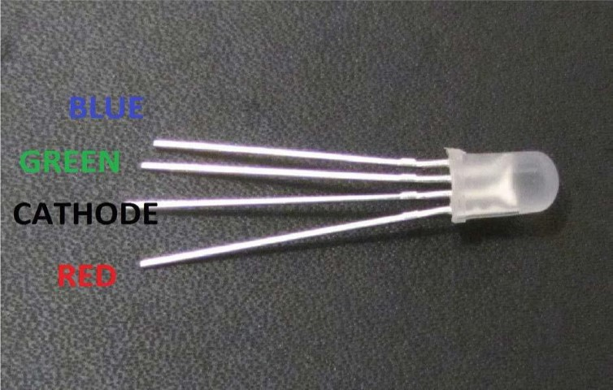
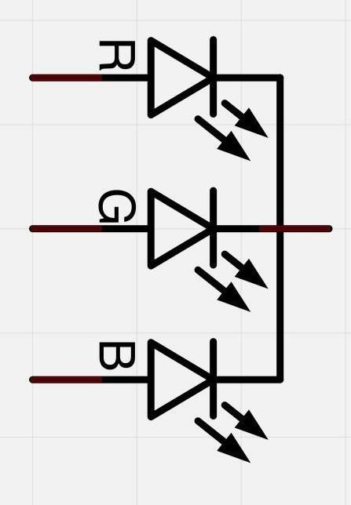
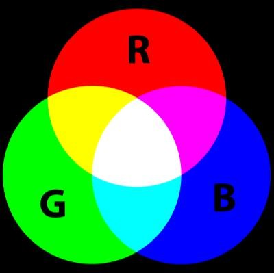
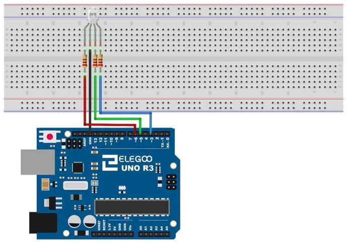
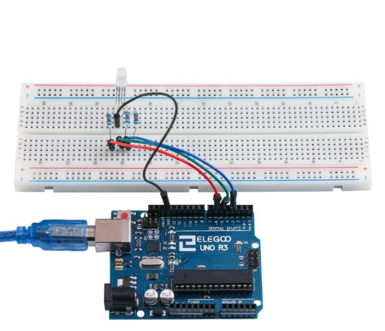

## Lección 4 RGB LED 

### Resumen 

Los LED RGB son una forma divertida y fácil para agregar color a sus proyectos. Puesto  que es como regular 3 LED en uno, el uso y conenxión no es muy diferente.  

Existen 2 versiones: 

- Ánodo común 
- Cátodo común.  

Ánodo común utiliza 5V en el pin común, mientras que el cátodo común se conecta  a tierra.  
Como con cualquier LED, tenemos que conectar algunas resistencias en línea (3 total)  así que podemos limitar la corriente absorbida.  

En nuestro **programa**, se comienzan con el LED en el estado de color rojo, entonces  se descolora a verde, luego se descolora azul y finalmente hacia el color rojo.  Haciendo esto que nos pasará por la mayor parte del color que se puede lograr.  

Componente necesario: 

> * (1) x Placa Arduino UNO
> * (1) protoboard de 830 puntos de amarre x  
> * M M de x (4) cables (cables de puente de macho a macho)  
> * (1) x RGB LED  
> * (3) resistencias de 220 ohmios x 

### RGB

A primera vista, LEDs RGB (rojo, verde y azul) sólo parecen regular LED. Sin embargo, dentro del paquete del LED generalmente, hay realmente tres LEDs, uno rojo, uno verde y sí, uno azul. Controlando el brillo de cada uno de los LEDs individuales, usted puede mezclar prácticamente cualquier color que desee.

Mezclamos colores del mismo modo que sería mezclar pintura en una paleta - ajustando el brillo de cada uno de los tres LEDs. La manera dura para hacer esto sería usar valor diferentes resistencias (o resistencias variables) como hicimos con el en la lección 2, pero eso es un mucho trabajo! 

Afortunadamente para nosotros, Kit UNO R3 tiene una función **analogWrite** que puede utilizar con pines marcados con un ~ a la salida de una cantidad variable de energía los LEDs apropiados.

El LED RGB tiene cuatro conductores. Hay un cable a la conexión positiva de cada uno de los LEDs individuales dentro del paquete y un patilla única que está conectado a los tres lados negativos de los LEDs.




En las fotografías le mostramos 4 electrodo LED. Cada perno separado de color verde o azul o de rojo se llama ánodo. Siempre conectará «+» a él. Cátodo va a "-" (tierra). Si se conecta otra forma diferente el LED no se encenderá.

La común conexión negativa del paquete LED es el segundo pasador de la parte plana. También es el más largo de las cuatro patas y se conectarán a la tierra.

Cada LED dentro del paquete requiere su propio resistor de 220Ω para prevenir demasiada corriente que fluye a través de él. Los tres conductores del positivo de los LEDs (uno rojo, uno verde y uno azul) están conectados a los pines de salida UNO con estas resistencias.

### Color

La razón por la que usted puede mezclar cualquier color usted tiene gusto variando las cantidades de rojo, verde y azul de la luz es que el ojo tiene tres tipos de receptor de luz (rojo, verde y azul). Su ojo y el cerebro procesan las cantidades de rojo, verde y azul y conviertan en un color del espectro.

En cierto modo, mediante el uso de los tres LEDs, estamos jugando un truco en el ojo. Esta misma idea se utiliza en televisores, donde la pantalla LCD tiene puntos de color rojo, verde y azul junto a unos a otros que componen cada píxel.



- Si establece el brillo de todos los tres LEDs al ser el mismo, el color general de la luz  será blanco. 
- Si apagamos el LED azul, para que sólo los LEDs rojo y verdes son el  mismo brillo, la luz aparecerá amarillo.  

Podemos controlar el brillo de cada una de las partes de rojas, verdes y azules del LED por separado, lo que es posible mezclar cualquier color que nos gusta.  

El color **Negro** no es tanto un color como una ausencia de luz. Por lo tanto, lo más cercano  que podemos llegar a negro con el LED es apagar los tres colores. 

### Teoría (PWM) 


Modulación de ancho de pulso (PWM) es una técnica para el control de potencia. También utilizamos aquí para controlar el brillo de cada uno de los LEDs. El siguiente diagrama muestra que la señal de uno de lo PWM pines en la UNO.  


Aproximadamente cada 1/500 de segundo, la salida PWM producirá un pulso. La  duración de este pulso es controlada por la función 'analogWrite'. Así:

- 'analogWrite(0)' no producirá ningún pulso 
- 'analogWrite(255)' producirá un  pulso que dura todo el camino hasta el pulso siguiente vencimiento, para que la  salida es en realidad todo el tiempo.  

Si especificamos un valor en el analogWrite que está en algún lugar entre 0 y 255, se producir un pulso. 

- Si el pulso de salida es alto para el 5% del tiempo, entonces lo  que nosotros estamos manejando sólo recibirá el 5% de potencia. 
- Si la salida es 5V para el 90% del tiempo, la carga recibirá el 90% de la potencia entregada a él. 

Los LED se encenderán y apagarán en esos periodos, pero nosotros percibiremos que el brillo del LED cambia.

### Conexión

### Esquema


### Diagrama de cableado



53 / 165

### Código

```arduino
// Define pines
#define BLUE 3
#define GREEN 5
#define RED 6

void setup()
{
pinMode(RED, OUTPUT);
pinMode(GREEN, OUTPUT);
pinMode(BLUE, OUTPUT);
digitalWrite(RED, HIGH);
digitalWrite(GREEN, LOW);
digitalWrite(BLUE, LOW);
}

// define variables
int redValue;
int greenValue;
int blueValue;

// main loop
void loop()
{
#define delayTime 10 // fading time between colors

redValue = 255; // choose a value between 1 and 255 to change the color.
greenValue = 0;
blueValue = 0;

// this is unnecessary as we've either turned on RED in SETUP
// or in the previous loop ... regardless, this turns RED off
// analogWrite(RED, 0);
// delay(1000);

for(int i = 0; i < 255; i += 1) // fades out red bring green full when i=255
{
redValue -= 1;
greenValue += 1;
// The following was reversed, counting in the wrong directions
// analogWrite(RED, 255 - redValue);
// analogWrite(GREEN, 255 - greenValue);
analogWrite(RED, redValue);
analogWrite(GREEN, greenValue);
delay(delayTime);
}

redValue = 0;
greenValue = 255;
blueValue = 0;

for(int i = 0; i < 255; i += 1) // fades out green bring blue full when i=255
{
greenValue -= 1;
blueValue += 1;
// The following was reversed, counting in the wrong directions
// analogWrite(GREEN, 255 - greenValue);
// analogWrite(BLUE, 255 - blueValue);
analogWrite(GREEN, greenValue);
analogWrite(BLUE, blueValue);
delay(delayTime);
}

redValue = 0;
greenValue = 0;
blueValue = 255;

for(int i = 0; i < 255; i += 1) // fades out blue bring red full when i=255
{
// The following code has been rearranged to match the other two similar sections
blueValue -= 1;
redValue += 1;
// The following was reversed, counting in the wrong directions
// analogWrite(BLUE, 255 - blueValue);
// analogWrite(RED, 255 - redValue);1
analogWrite(BLUE, blueValue);
analogWrite(RED, redValue);
delay(delayTime);
}
}
```


After wiring, please open the Sketch in folder path: Tutorial > English > code > Lesson 4 RGB LED > RGB_LED, and click UPLOAD to upload the program.


See Lesson 2 for details about program uploading if there are any errors.

The programa starts by specifying which pins are going to be used for each of the colors:

```arduino
// Define Pins 
#define BLUE 3 
#define GREEN 5 
#define RED 6 
```

The next step is to write the 'setup' function. As we have learnt in earlier lessons, the setup function runs just once after the Arduino has reset. In this case, all it has to do is define the three pins we are using as beingoutputs.

```arduino
void setup() 
{ 
pinMode(RED, OUTPUT); 
pinMode(GREEN, OUTPUT); 
pinMode(BLUE,OUTPUT); 
digitalWrite(RED, HIGH); 
digitalWrite(GREEN, LOW); 
digitalWrite(BLUE, LOW); 
}
```

Antes de echar un vistazo a la **función loop**, veamos la última función en el proyecto.  
Las variables de definición:

```arduino
redValue = 255; // choose a value between 1 and 255 to change the color.  
greenValue = 0; 
blueValue = 0; 
```

Esta función tiene tres argumentos, uno para el brillo de los LEDs rojos, verdes y azules. En cada caso de que el número será en el rango 0 a 255, donde 0 significa apagado y 255 significa brillo máximo. La función entonces llama 'analogWrite' para ajustar el brillo de cada LED.

Si nos fijamos en la **función loop** se puede ver que ajuste la cantidad de luz roja, verde y azul que queremos mostrar y luego una pausa por un segundo antes de pasar al siguiente color.

```arduino
#define delayTime 10 // fading time between colors  
Delay(delayTime); 
```

Trate de añadir algunos colores de los tuyos el dibujo y ver el efecto en tu LED.  



