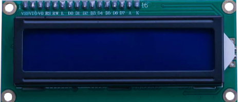
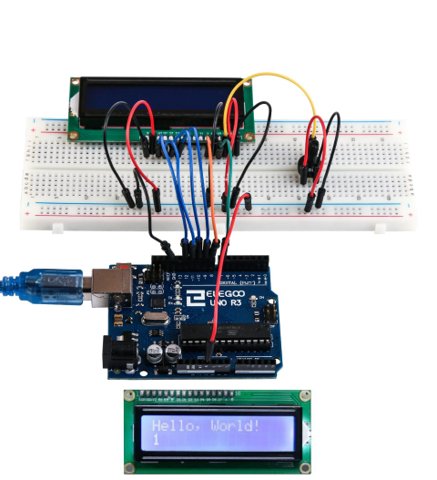

## Pantalla LCD

La pantalla tiene una retroiluminación de LED y puede mostrar ``dos filas con hasta 16 caracteres`` en cada fila.



## Circuito integrado LCD1602

La pantalla está incrustada en un ``circuito integrado ``que la controla, llamado ``LCD1602``.

## Pines

- ``VSS`` Un pin que se conecta a tierra
- ``VDD`` Un pin que se conecta a un + 5V fuente de alimentación
- ``VO``  ajusta el contraste.
- ``RS`` Un registro seleccione pin que controla donde en memoria de la pantalla LCD datos de escritura. Usted puede seleccionar el registro de datos, que es lo que pasa en la pantalla, o un registro de instrucción, que es donde busca controlador de LCD para obtener instrucciones sobre qué hacer.
- ``R/W``: Pin A lectura y escritura que selecciona el modo de lectura o escritura a modo de E:, Permitiendo a un perno con energía de bajo nivel, módulo causas la LDC para ejecutar instrucciones.
- ``D0-D7`` son los pines para escribir y leer datos.
- ``A y K`` controlan de la retroiluminación LED de los pernos

## Esquema de conexión


## Diagrama de cableado


La pantalla LCD necesita:

- 6 pines digitales de datos de``Arduino``
- Coneciones de 5V y GND.

## Potenciómetro

El **potenciómetro** se utiliza para controlar el ``contraste`` de la pantalla. En ocasiones se ajusta con un pequeño destornillador. El potenciómetro utilizado será de ``10 KOhm``


## Librería

Antes de ejecutar esto, asegúrese de que ha instalado la **librería** < LiquidCrystal > o volver a instalarlo, si es necesario. De lo contrario, el código no funcionará.

Lo primero que nota en el dibujo es la línea:

```arduino
#include < LiquidCrystal.h >
```

Esto dice``Arduino`` que queremos utilizar la **librería** de cristal líquido.

A continuación tenemos la línea que teníamos que modificar. Esto define qué pines de``Arduino`` son para conectarse a que pines de la pantalla.

```c
LiquidCrystal lcd (7, 8, 9, 10, 11, 12);
```

Después de subir este código, asegúrese de que se enciende la retroiluminación y ajustar el potenciómetro de toda la manera alrededor hasta que aparezca el mensaje de texto

En la función de **setup**, tenemos dos comandos:

```c
LCD.Begin (16, 2);
LCD.Print ("Hola, mundo!");
```

La primera cuenta la **librería** de cristal líquido cuántas columnas y filas tiene la pantalla. La segunda línea muestra el mensaje que vemos en la primera línea de la pantalla.

En la función de 'loop', aso tienen dos comandos:

```c
lcd.setCursor (0, 1);
LCD.Print(Millis()/1000);
```

El primero establece la posición del cursor (donde aparecerá el siguiente texto) columna 0 y fila 1. Los números de columna y fila comienzan en 0 en lugar de 1.



La segunda línea muestra el número de milisegundos desde que se restableció el``Arduino``.

```c
// include the library code:
#include <LiquidCrystal.h>

// initialize the library with the numbers of the interface pins
LiquidCrystal lcd(7, 8, 9, 10, 11, 12);

void setup() {
  // set up the LCD's number of columns and rows:
  lcd.begin(16, 2);
  // Print a message to the LCD.
  lcd.print("Hello, World!");
}

void loop() {
  // set the cursor to column 0, line 1
  // (note: line 1 is the second row, since counting begins with 0):
  lcd.setCursor(0, 1);
  // print the number of seconds since reset:
  lcd.print(millis() / 1000);
}
```