- [Arduino](#arduino)
  - [Placa Arduino](#placa-arduino)
  - [Componentes de la placa](#componentes-de-la-placa)
  - [Microcontrolador](#microcontrolador)
  - [Pines](#pines)
  - [Pines de Arduino](#pines-de-arduino)
  - [Instalación IDE](#instalación-ide)
  - [Primeras pruebas: LED](#primeras-pruebas-led)
  - [Elementos de un programa](#elementos-de-un-programa)
  - [LED](#led)
- [Protoboard](#protoboard)
  - [Zonas](#zonas)
  - [Canales centrales](#canales-centrales)
  - [Tiras laterales](#tiras-laterales)
  - [Desventajas](#desventajas)
- [Conexión de pines](#conexión-de-pines)
  - [Pinmode](#pinmode)
  - [Escribir en pines](#escribir-en-pines)
- [Motores](#motores)
  - [Motor de corriente contínua](#motor-de-corriente-contínua)
  - [Motor paso a paso mando](#motor-paso-a-paso-mando)
  - [Motor paso a paso](#motor-paso-a-paso)
  - [Control mediante bobinas](#control-mediante-bobinas)
  - [Motor servo](#motor-servo)
- [Luces](#luces)
  - [LED RGB](#led-rgb)
  - [Tira de LEDs](#tira-de-leds)
  - [7 segments (1 dígito)](#7-segments-1-dígito)
  - [7 segments (4 dígitos)](#7-segments-4-dígitos)
  - [Pantalla LCD](#pantalla-lcd)
  - [LED con 74HC595](#led-con-74hc595)
- [Interruptor de bola](#interruptor-de-bola)
  - [Componentes Requeridos](#componentes-requeridos)
  - [Funcionamiento](#funcionamiento)
  - [Conexión](#conexión-4)
  - [Esquema](#esquema-5)
  - [Diagrama de conexiones](#diagrama-de-conexiones)
  - [Código](#código-5)
- [Boton](#boton)
  - [Componentes](#componentes)
  - [Esquema de conexión](#esquema-de-conexión-1)
  - [Diagrama de cableado](#diagrama-de-cableado-7)
  - [Las conexiones que vamos a tener que realizar son las siguientes:](#las-conexiones-que-vamos-a-tener-que-realizar-son-las-siguientes)
  - [Explicación del código](#explicación-del-código)
- [Conexión a tierra](#conexión-a-tierra)
- [Función Loop](#función-loop-1)
  - [Código completo](#código-completo)
- [Joystick analógico](#joystick-analógico)
  - [Pines del Joystick](#pines-del-joystick)
  - [Esquema](#esquema-6)
  - [Diagrama de cableado](#diagrama-de-cableado-8)
  - [Código](#código-6)
  - [Comprobar funcionamiento](#comprobar-funcionamiento-1)
- [Módulo de receptor IR](#módulo-de-receptor-ir)
  - [Resumen](#resumen-1)
  - [¿Qué podemos medir?](#qué-podemos-medir)
  - [Esquema de conexiones](#esquema-de-conexiones)
  - [Diagrama de cableado](#diagrama-de-cableado-9)
  - [Montaje](#montaje-2)
  - [Visualizar datos en el monitor](#visualizar-datos-en-el-monitor)
- [Relé](#relé)
  - [Relé con motor de coche en``Arduino``](#relé-con-motor-de-coche-enarduino)
- [Sensors](#sensors)
  - [Sensor humedad temperatura DHT11](#sensor-humedad-temperatura-dht11)
  - [Sensor luz (fotocelula)](#sensor-luz-fotocelula)
  - [Sensor ultrasonico](#sensor-ultrasonico)
  - [Termistor](#termistor)
- [ESP8266 NodeMCU](#esp8266-nodemcu)
  - [Componentes](#componentes-1)
  - [Aplicaciones principales](#aplicaciones-principales)
  - [Código fuente](#código-fuente-1)
  - [Subida](#subida)
  - [Salida monitor serie](#salida-monitor-serie)
  - [Wifi bridge](#wifi-bridge)
- [Projecte WLED](#projecte-wled)
- [Instal·lació](#installació)
- [Connexió de la tira](#connexió-de-la-tira)
- [Programari mòbil](#programari-mòbil)
- [Control](#control)

# Arduino

``Arduino`` es una plataforma de ``hardware libre``, basada en una placa con un microcontrolador y un entorno de desarrollo.

Hardware libre es aquel cuyas especificaciones y diagramas esquemáticos son de acceso público


Arduino está diseñado para permitir que los usuarios creen proyectos con una programación sencilla, sin necesidad de conocimientos previos de electrónica.


## Placa Arduino

``Arduino Uno`` es una placa de desarrollo que incorpora un microcontrolador.

La placa Arduino contiene un ``microcontrolador``, que es una pequeña computadora que puede leer los datos de los sensores que se conectan, realizar algunas operaciones matemáticas y controlar los dispositivos a través de los pines de salida.

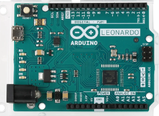

## Componentes de la placa

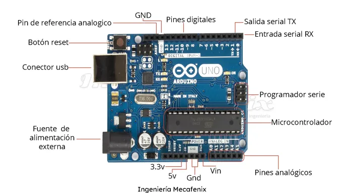

## Microcontrolador

El ``microcontrolador`` puede ser programado para recibir instrucciones. Esto significa que los usuarios pueden ``programar`` la placa para que realice cualquier tarea que deseen, desde controlar motores hasta leer datos de sensores.

El Arduino Uno utiliza un microcontrolador ``ATmega328P``

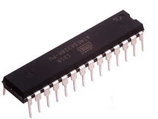

| Características              | Detalles                                  |
| ---------------------------- | ----------------------------------------- |
| Microcontrolador 🕹️           | ATmega328P                                |
| Arquitectura 🏗️               | AVR (8 bits)                              |
| Frecuencia de Reloj ⏰        | 16 MHz                                    |
| Memoria Flash 💾              | 32 kilobytes                              |
| Memoria RAM 🧠                | 2 kilobytes                               |
| Memoria EEPROM 📂             | 1 kilobyte                                |
| Entradas/Salidas Digitales 🧩 | Sí (pines digitales de E/S)               |
| Entradas Analógicas 📏        | Sí (pines analógicos de E/S)              |
| Comunicación Serial 🔄        | Sí (pines TX/RX para comunicación serial) |

## Pines

Un "pin" se refiere a un punto de conexión en un dispositivo electrónico que permite la entrada o salida de una señal eléctrica.

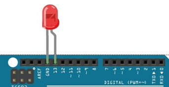

## Pines de Arduino

Los pines con los que vamos a trabajar nosotros son:

Pines de Alimentación:

- Vin (Voltage In): Este pin se utiliza para alimentar la placa con un voltaje externo cuando no se está utilizando el puerto USB. La tensión recomendada es de 7 a 12V.
- 5V: Este pin proporciona una salida de 5 voltios cuando la placa está alimentada a través del puerto USB o del conector de alimentación externa.
- 3.3V: Proporciona una salida de 3.3 voltios.
- Pines de Tierra (GND): Hay varios pines GND en la placa, que se utilizan como conexiones a tierra.
- Pines de Entrada/Salida Digital (D2 a D13): Pueden usarse como entradas o salidas digitales. D2 a D13 también pueden utilizarse como salidas PWM (modulación de ancho de pulso) para controlar la intensidad de la señal.
- Pines Analógicos (A0 a A5): Son pines de entrada analógica que permiten leer señales analógicas, como las provenientes de sensores de luz, temperatura, etc.

## Simulación

``Tinkercad Circuits`` es una plataforma en línea que te permite simular y diseñar circuitos electrónicos. Es parte de la suite de herramientas de Autodesk llamada Tinkercad, y es especialmente útil para aprender y experimentar con electrónica sin la necesidad de componentes físicos

https://www.youtube.com/watch?v=VU3fiibAnNY


## Instalación IDE

El **Entorno de desarrollo integrado (IDE) de``Arduino``** es el software de la plataforma``Arduino``. En esta lección, usted aprenderá cómo configurar tu ordenador para usar``Arduino`` y cómo establecer sobre las lecciones que siguen.

Paso 1: Ir a https://www.arduino.cc/en/Main/Software y a continuación de la página.

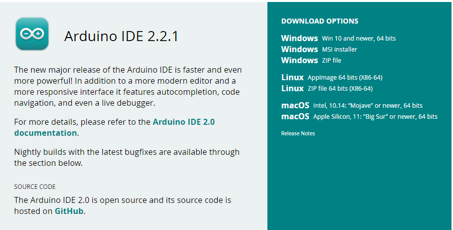

La versión disponible en este sitio web es generalmente la última versión y la versión actual puede ser más reciente que la versión en el cuadro.

Paso 2 : Descargar el desarrollo software que es compatible con el sistema operativo del ordenador. Windows tomar como un ejemplo aquí

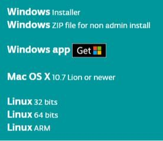

Haga click en Windows Installer.


Haga click en DESCARGAR (JUST DOWNLOAD).

También está disponible en el material que nos proporciona la versión 1.8.0, y las versiones de nuestros materiales son las últimas versiones cuando se hizo este manual.

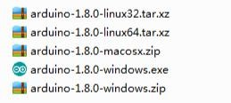

Instalación de``Arduino`` (Windows)

Instalar``Arduino`` con el exe. Paquete de instalación.


Haga click en I Agree to see de esta ventana


Click Next


Puede pulsar examinar... elegir una ruta de instalación o directamente en el directorio que desee.

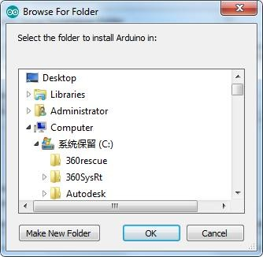

Haga Click en Install para comenzar la instalación


Por último, aparece la siguiente ventana, haga clic en Install para finalizar la instalación.


A continuación, aparece el siguiente icono en el escritorio


Haga doble clic para entrar en el entorno de desarrollo deseado

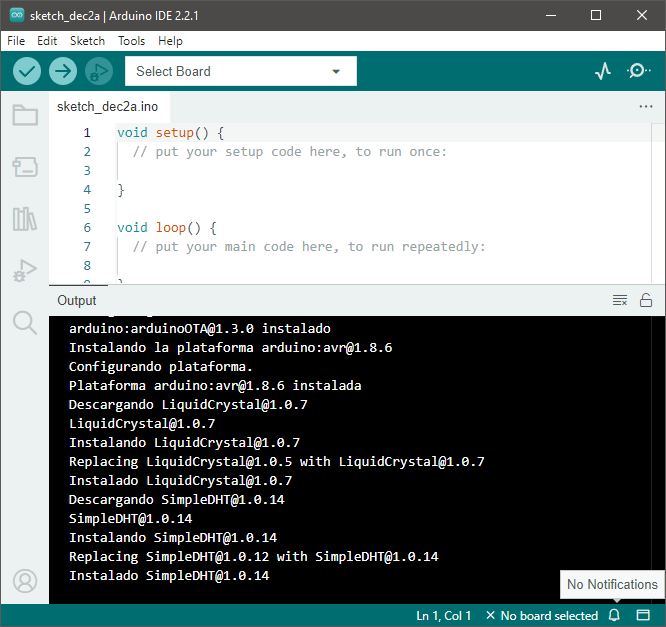

## Primeras pruebas: LED

Vamos a aprender a crear un programa y volcarlo en la placa Arduino.

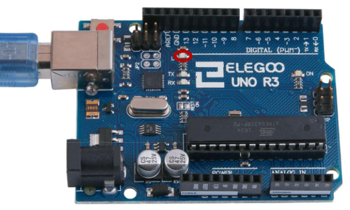

La placa Arduino cuenta con un LED luminoso que puede ser controlado. Este LED está integrado en la propia placa.

Cuando la placa se conecta a un enchufe USB, el LED parpadea. Este parpadeo se debe a que las placas suelen ser enviadas con un programa preinstalado llamado "Blink".

### Programas de ejemplo

El IDE de ``Arduino`` incluye una gran colección de programas de ejemplo para utilizar directamente.  Esto incluye un ejemplo para hacer el parpadeo del ``LED``.

### Ejemplo programa Blink

Cargar el programa de 'Blink' que encontrarás en el sistema de menús del IDE bajo ``archivo >  ejemplos > 01 conceptos básicos``

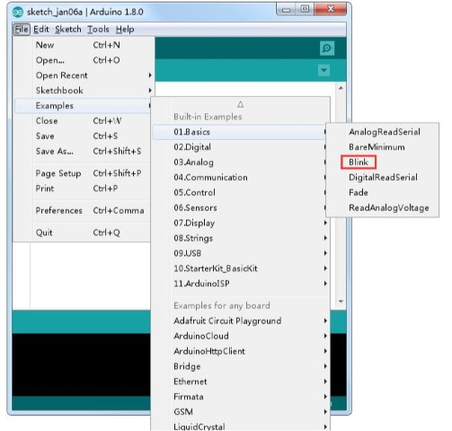

### Blink

Cuando se abre la ventana de dibujo, agrandarla para que puedan ver el dibujo completo en la ventana.

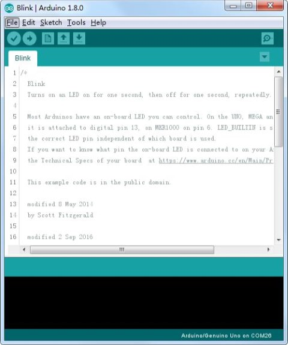

Los ``programas de ejemplo`` incluidos con el IDE de``Arduino`` son de 'sólo lectura'. Es decir, puedes subirlo a Arduino, pedo no se pueden guardar una vez modificados.

### Guardar código en otro archivo

En el menú archivo en el IDE de``Arduino``, seleccione `Guardar como.` y guarde el dibujo con  el nombre ``parpadeo``

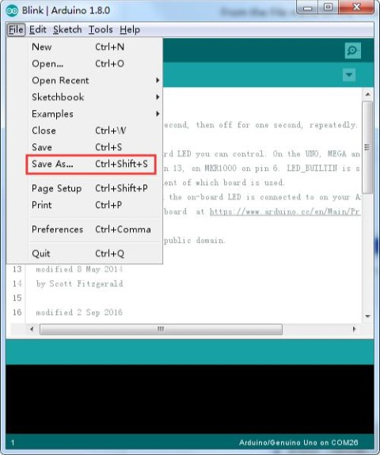

A continuación deberemos elegir una carpeta en la que guardar el programa.

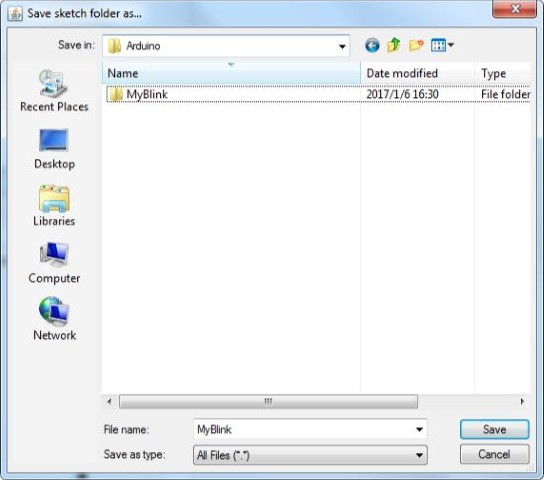

### Abrir un archivo de programa

Para abrir un archivo que hemos guardado con anterioridad, podemos simplemente ir a ``archivo > abrir`` o también a ``archivo > abrir reciente``.

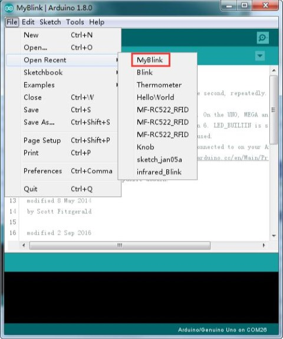

### Conectar placa al PC

Conecte la placa de``Arduino`` al ordenador con el cable USB y compruebe que la **Board Type** y **Puerto serie** están ajustados correctamente.

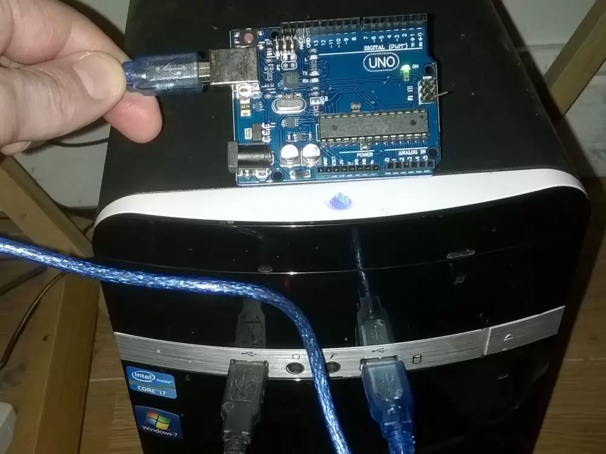

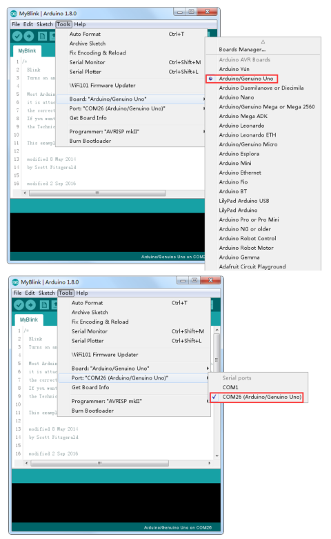

### Nota

- El tipo de tarjeta y puerto Serial aquí no son necesariamente la misma que se muestra en la imagen.
- El puerto serie (``COM``) puede ser diferente, del tipo COM3 o COM4 en su ordenador.

El IDE de``Arduino`` mostrará la configuración actual en la parte inferior de la  ventana.

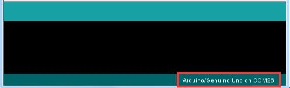

### Subir código a Arduino

Para que Arduino lo ejecute, necesitamos enviarle a través del cable USB el código que queremos que haga.

Para ello, debemos hacer clic en el botón **subir**. El segundo botón de la izquierda en la barra de herramientas.


### Subiendo código

Al cargar el código, al observar el área de estado del IDE, se apreciará una barra de progreso junto con una serie de mensajes. Inicialmente, se mostrará el mensaje 'Compilando bosquejo...'. Este proceso convierte el esbozo en un formato adecuado para cargar en la placa.

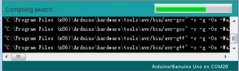

Luego, el estado cambiará a 'Subiendo'. En este momento, los LEDs de la Arduino deberían empezar a parpadear, indicando la transferencia del esbozo.

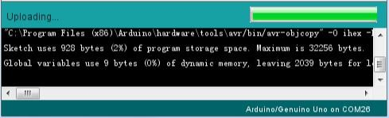

Finalmente, el estado cambiará a 'Listo' ('Done').

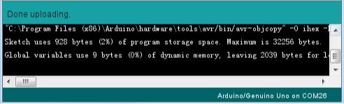

### Errores

El otro mensaje nos dice que el **programa** está utilizando 928 bytes de 32.256 bytes  disponibles. Después de la etapa de compilación Sketch... podría obtener el siguiente mensaje de error:

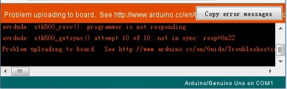

Puede significar que su Junta no está conectado a todos, o no se ha instalado los drivers (si es necesario) o que se ha seleccionado el puerto serial incorrecto.

### Comprobar funcionamiento

Una vez completada la carga, la placa se debe reiniciar y el led comenzar a parpadear.

## Elementos de un programa

### Comentarios

- Todo entre /* y */ en la parte superior del **programa** es un Comentario de bloque; explica lo que el **programa** es para.
- Los comentarios de una sola línea comienzan con // y hasta el final de esa línea se considera un comentario.

### Crear variables

La primera línea de código es:

```c
int led = 13;
```

Creamos una variable con un nombre y guardamos el número de pin al que el LED está  conectado.

### Función Setup

A continuación, se presenta la función de 'configuración' en el código. Esta función se ejecuta al presionar el botón de ``reset`` y cada vez que la placa Arduino se reinicia, ya sea por aplicación de energía inicial o después de cargar un nuevo **programa**.

En cada programa de Arduino, es esencial incluir una función **setup** (configuración), y las instrucciones específicas se colocan entre las llaves { y }. En este caso, el comando dentro de la función setup indica a la placa Arduino que el pin LED se usará como salida, según lo señala el comentario.

> Void indica que la función setup no devuelve ningún valor

```c
void setup() {
// Inicializa el pin digital como salida.
pinMode(led, OUTPUT);
}
```

Cada programa``Arduino`` debe tener una función de **setup** (configuración), y las instrucciones que contendrá se insertan entre las llaves { y }.

En este caso, es un comando, que, como dice el comentario dice la placa``Arduino`` que vamos  a utilizar el pin LED como salida.

### Función loop

También es obligatorio para un boceto tener una función de **loop**. A diferencia de la función  de **setup** que se ejecuta sólo una vez, después de un reset, la función **loop**, después que haya terminado de ejecutar sus comandos, empezar inmediatamente otra vez.

### Explicación loop

```c
void loop() {
  digitalWrite(led, HIGH); // Encienda el LED (alto es el nivel de voltaje)
  delay(1000); // Espere un segundo
  digitalWrite(led, LOW); // Apagar el LED por lo que la tensión baja
  delay(1000); // Espere un segundo
}
```

Dentro de la función **loop**, los comandos en primer lugar activar el pin del LED (alto), girar a 'retraso' de 1000 milisegundos (1 segundo), entonces el pin LED apagado y pausa para  otro segundo.

### Cambiar la frecuencia de parpadeo

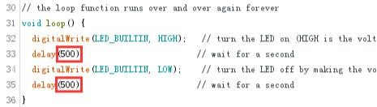

Ahora vas a que el LED parpadee más rápido. Como puede haber adivinado, la clave de esto radica en cambiar el parámetro () para el comando ``delay``.

### Variar retardo

Este período de retardo en milisegundos, así que si desea que el LED parpadee dos veces tan rápidamente, cambiar el valor de 1000 a 500. Esto entonces pausa durante medio segundo cada retraso en lugar de un segundo entero.

Sube otra vez el **programa** y verás que el LED comienza a parpadear más rápidamente.

## LED

Aprenderemos a cambiar el ``brillo`` de un LED usando diferentes valores  de resistencia.

### Conexión de la Placa Arduino al Ordenador

Para programar la Placa Arduino mediante el IDE de Arduino, es necesario establecer una conexión física entre la placa y el ordenador. Siga estos pasos para lograr la conexión adecuada:

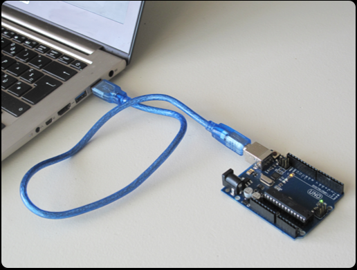

1. Utilice un ``cable USB`` para conectar la Placa Arduino al puerto USB de su ordenador.
2. Abra el ``IDE de Arduino`` en su ordenador
3. Escriba o cargue el ``programa`` que desea transferir a la placa.
4. Verifique que la Placa Arduino seleccionada en el IDE coincida con el modelo físico que está utilizando. Puede seleccionar la placa desde la pestaña ``"Herramientas" > "Placa"`` en el IDE.
5. Seleccione el puerto COM al que está conectada la Placa Arduino. Esto también se encuentra en la pestaña ``"Herramientas" > "Puerto"`` en el IDE.
6. Haga clic en el botón de carga ("Upload") en el IDE para transferir el programa a la Placa Arduino.


# Protoboard

Un **protoboard** permite crear prototipos de circuitos de forma rápida, sin necesidad de soldar las  conexiones. A continuación un ejemplo.

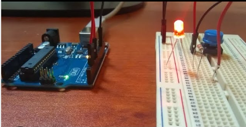

Las protoboard están compuestas por un número determinado de pines, dispuestos en filas y columnas, a los que podemos conectar diferentes cables y componentes.

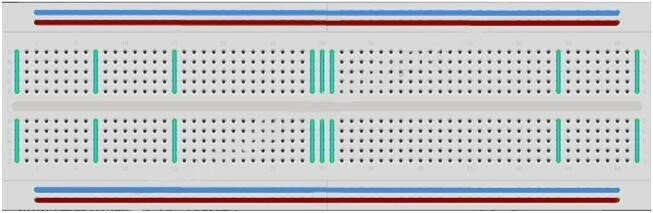

Las **protoboard** vienen en varios tamaños y configuraciones. La clase más simple es sólo una rejilla de agujeros en un bloque de plástico. En el interior son tiras de metal que proporcionan una conexión eléctrica entre los agujeros en las filas más cortas.

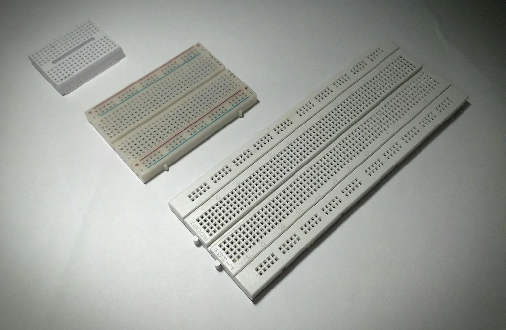

Conectando las patillas de dos componentes diferentes de la **misma fila** quedan unidos eléctricamente.

## Zonas

Existen dos zonas principales. La zona de alimentación, y la zona central. Todo lo que pase por la misma línea, está interconectado eléctricamente.

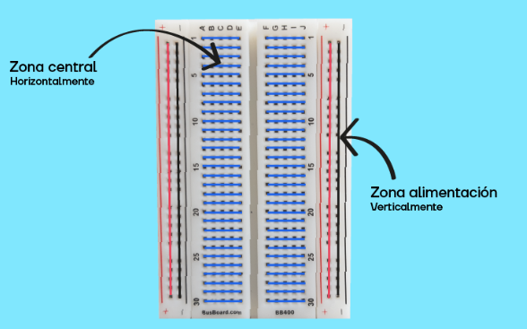

## Canales centrales

Los canales centrales indican que no están conectados ambos lados. Lo que significa, puede insertar un chip con las patillas a ambos lados del canal sin conectarlos juntos.

## Tiras laterales

- Algunos ``protoboards`` tienen dos tiras de agujeros que corre a lo largo de los bordes laterales del tablero.
- Estas tiras se denominan ``carriles`` y le permiten alimentar a muchos componentes o puntos en el tablero.
- Proporcionan una manera para conectar una tensión común. Son generalmente en pares para + 5 voltios y tierra.

## Desventajas

Si bien son protoboards para prototipos, tienen algunas limitaciones. Porque las conexiones son temporales y de acople, no son tan fiables como conexiones soldadas. Si tienes problemas intermitentes con un circuito, puede ser debido a una mala conexión en una protoboard.

# Conexión de pines

## Pinmode

Configuración de Pines (pinMode)
La función pinMode se utiliza para configurar un pin como entrada o salida. La sintaxis es la siguiente:

```c
pinMode(pin, mode);
```

- ``pin``: El número del pin que se va a configurar.
- ``mode``: Puede ser INPUT para configurar el pin como entrada o OUTPUT para configurarlo como salida.

## Escribir en pines

En Arduino, digitalWrite, analogWrite, y la configuración de pines son funciones clave para controlar la entrada y salida digital y analógica. Aquí tienes una explicación de cada uno:

### digitalWrite(pin, value)

La función digitalWrite se utiliza para establecer el estado de un pin digital en Arduino. Puede ser usado para configurar un pin como alto (HIGH o 1) o bajo (LOW o 0). La sintaxis es la siguiente:

```c
digitalWrite(pin, value);
```

- pin: El número del pin al que se le quiere cambiar el estado.
value: El estado que se desea asignar al pin, que puede ser HIGH (1) o LOW (0).

Ejemplo:

```c
int ledPin = 13;

void setup() {
  pinMode(ledPin, OUTPUT); // Configura el pin como salida
}

void loop() {
  digitalWrite(ledPin, HIGH); // Enciende el LED conectado al pin 13
  delay(1000);                // Espera 1 segundo
  digitalWrite(ledPin, LOW);  // Apaga el LED
  delay(1000);                // Espera 1 segundo
}
```

### analogWrite(pin, value)

La función analogWrite se utiliza para generar una señal PWM (Modulación de Ancho de Pulso) en un pin específico. Aunque se le denomina "analogWrite", en realidad está generando una señal digital con una frecuencia determinada. La sintaxis es similar a digitalWrite:

```c
analogWrite(pin, value);
```

- pin: El número del pin al que se le quiere aplicar la señal PWM.
- value: El valor de la amplitud de la señal PWM, que va de 0 (sin señal) a 255 (señal máxima).

Ejemplo:

```c
int ledPin = 9;

void setup() {
  pinMode(ledPin, OUTPUT); // Configura el pin como salida
}

void loop() {
  analogWrite(ledPin, 128); // Establece la señal PWM al 50%
  delay(1000);              // Espera 1 segundo
}
```

# Motores

Els motors d'Arduino són dispositius que permeten a una placa Arduino controlar el moviment mecànic d'un sistema. Els motors poden ser de diferents tipus i formes, i poden ser controlats per la placa Arduino a través de diferents circuits i protocols.

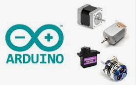

Els motors més comuns utilitzats amb Arduino són els **motors de corrent continu **(DC) i els **servomotors**.

- Els [motors de corrent continu](motor_CC.md) són motors que giren en una direcció o altra depenent del sentit de la corrent que passa per ells, i poden ser controlats a través d'un circuit que permet variar la tensió aplicada al motor.
- Els [servomotors](motor-servo.md), d'altra banda, són motors que poden ser controlats amb precisió per a posicionar-se en un determinat angle, i són utilitzats en molts projectes de robòtica i control de moviment.
- Els [motors pas a pas](motor_paso_a_paso.md) són un tipus de motor que es caracteritza per moure's en increments precisos de posició en lloc de girar continuament

## Motor de corriente contínua

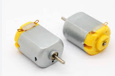

La fuerza máxima que puede generar un motor pequeño de corriente continua para proyectos de electrónica depende de varios factores, como el diseño y las especificaciones del motor. Sin embargo, en general, los motores pequeños de corriente continua para proyectos de electrónica suelen tener una fuerza máxima relativamente baja.

La fuerza generada por un motor de corriente continua está relacionada con su **torque**. El torque es una medida de la capacidad del motor para generar una fuerza de rotación. Los motores pequeños para proyectos de electrónica generalmente tienen un torque bajo y están diseñados para aplicaciones de baja carga, como mover pequeños mecanismos o generar movimiento en juguetes pequeños.

El **torque máximo** de un motor se especifica en su datasheet o hoja de datos proporcionada por el fabricante. Puede estar en unidades como gramos-centímetro (g·cm) o milinewton-metro (mN·m). Es importante tener en cuenta que el torque máximo disminuye a medida que aumenta la velocidad de rotación del motor.

### Placa de fuente de alimentación

El pequeño motor de corriente continua es probable que use más energía que la que ``Arduino`` puede suministrar. Si tratamos de conectar el motor directamente a un pin, podríamos dañarlo. Para ello usar un **módulo de alimentación** que proporciona electricidad al motor.

### Especificaciones

| Característica             | Valor       |
| -------------------------- | ----------- |
| Voltaje de entrada         | 6.5-9v (CC) |
| Voltaje de salida          | 3.3V / 5v   |
| Máxima corriente de salida | 700 mA      |

### Configuración de voltaje

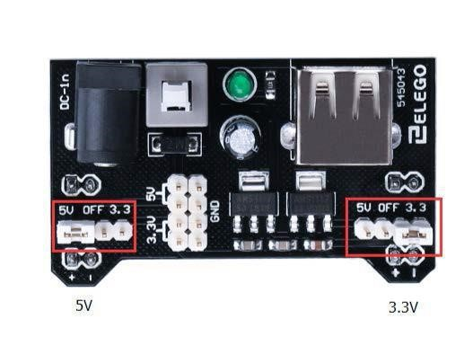

La izquierda y derecha de la tensión de salida puede configurarse independientemente. Para seleccionar la tensión de salida, mover el puente a los pines correspondientes. Nota: indicador de energía LED y los carriles de la energía de protoboard no se enciende si ambos puentes están en la posición "OFF".

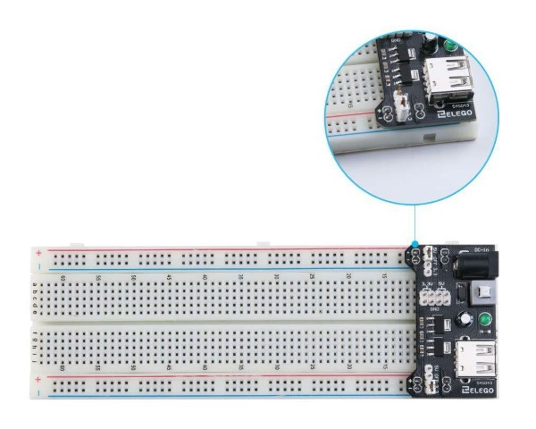

### L293D

El L293D és un circuit integrat que s'utilitza com a controlador de motor i permet controlar la direcció i la velocitat d'un motor DC.

El dispositiu inclou quatre drivers de pont H, que permeten controlar fins a dos motors DC de manera independent.

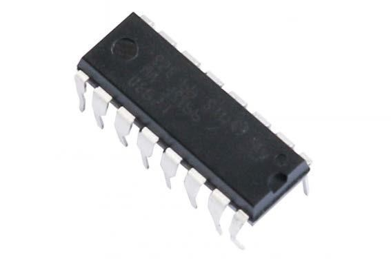

**Especificaciones**

| Característica             | Valor                                |
| -------------------------- | ------------------------------------ |
| Tensión de alimentación    | 4,5 V a 36 V                         |
| Salida de corriente        | 1 A por canal (600 mA para el L293D) |
| Máxima salida de corriente | 2 A por canal (1.2 A para L293D)     |

Diagrama de pines

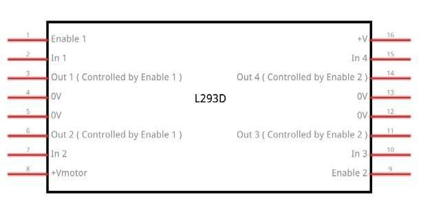

L293 y L293D

- El ``L293`` está diseñado para proporcionar corrientes de transmisión bidireccional de hasta 1 A con tensiones de 4,5 V a 36 V.
- El ``L293D`` está diseñado para proporcionar bidireccional corrientes de impulsión de hasta 600 mA en tensiones de 4,5 V a 36 V.

Pines

- 4 pines per controlar la direcció dels motors
- 1 pin s'utilitza per controlar la  velocitat.


### Control de la velocidad

**M1 PWM** lo conectaremos a un pin PWM de``Arduino``. Está marcados en la ONU, el pin 5 es un ejemplo. Cualquier número entero entre 0 y 255, donde:

- ``0`` significa velocidad 0 (no hay movimiento)
- ``128`` es la mitad de velocidad
- ``255`` es la velocidad máxima de salida.

Según el valor que escribamos, se generará una señal PWM diferente.

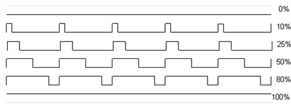

Dirección de giro

La dirección se controla a través de las entradas de dirección:

- **M1 0/1** y **M1 1/0** determinan el sentido de giro del motor 1
- **M2 0/1** y **M2 1/0** determinan el sentido de giro del motor 2

Dirección de giro


Dirección de giro

En la siguiente tabla veréis las 4 combinaciones posibles para el motor 1:


Esquema

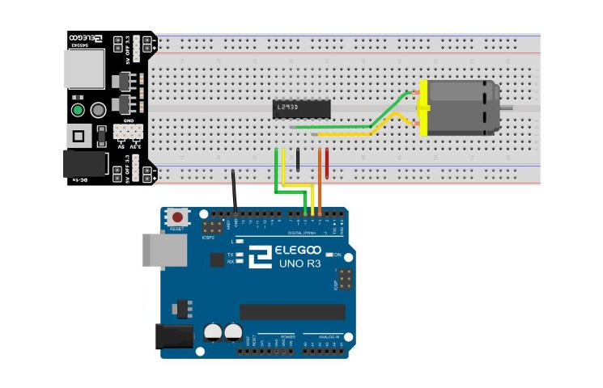

Montaje físico

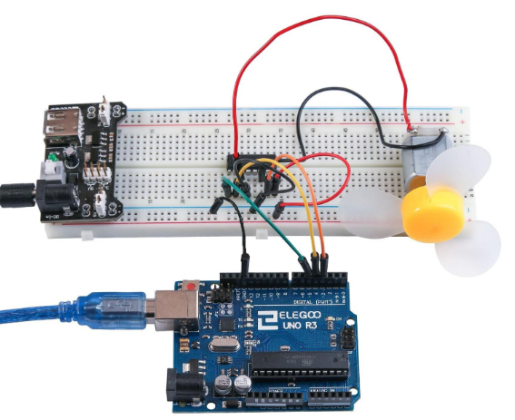

Código

```c

#define ENABLE 5
#define DIRA 3
#define DIRB 4

int i;

void setup() {
  //set pin direction
  pinMode(ENABLE,OUTPUT);
  pinMode(DIRA,OUTPUT);
  pinMode(DIRB,OUTPUT);
  Serial.begin(9600);
}

void loop() {
  //back and forth example
    Serial.println("One way, then reverse");
    digitalWrite(ENABLE,HIGH); // enable on
    for (i=0;i<5;i++) {
        digitalWrite(DIRA,HIGH); //one way
        digitalWrite(DIRB,LOW);
        delay(500);
        digitalWrite(DIRA,LOW);  //reverse
        digitalWrite(DIRB,HIGH);
        delay(500);
    }
    digitalWrite(ENABLE,LOW); // disable
    delay(2000);

    Serial.println("fast Slow example");
    //fast/slow stop example
    digitalWrite(ENABLE,HIGH); //enable on
    digitalWrite(DIRA,HIGH); //one way
    digitalWrite(DIRB,LOW);
    delay(3000);
    digitalWrite(ENABLE,LOW); //slow stop
    delay(1000);
    digitalWrite(ENABLE,HIGH); //enable on
    digitalWrite(DIRA,LOW); //one way
    digitalWrite(DIRB,HIGH);
    delay(3000);
    digitalWrite(DIRA,LOW); //fast stop
    delay(2000);

    Serial.println("PWM full then slow");
    //PWM example, full speed then slow
    analogWrite(ENABLE,255); //enable on
    digitalWrite(DIRA,HIGH); //one way
    digitalWrite(DIRB,LOW);
    delay(2000);
    analogWrite(ENABLE,180); //half speed
    delay(2000);
    analogWrite(ENABLE,128); //half speed
    delay(2000);
    analogWrite(ENABLE,50); //half speed
    delay(2000);
    analogWrite(ENABLE,128); //half speed
    delay(2000);
    analogWrite(ENABLE,180); //half speed
    delay(2000);
    analogWrite(ENABLE,255); //half speed
    delay(2000);
    digitalWrite(ENABLE,LOW); //all done
    delay(10000);
}

```

## Motor paso a paso mando

Veremos cómo funciona el motor de pasos de 4 fases **ULN2003 28BYJ-48** y el controlador de motor de 5V.

### El motor

El motor de pasos de 4 fases ULN2003 28BYJ-48 es un motor de pasos pequeño y económico que se puede controlar con un microcontrolador. El motor tiene 4 fases, cada una con 2 polos. Cada fase requiere energía para que el imán se atraiga o se repulse. Los 4 imanes del motor de pasos están dispuestos de forma que se atraigan y se repulsen en secuencia, lo que hace que el eje del motor gire.

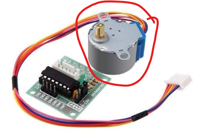

### Controlador

Para controlar el motor de pasos de 4 fases, se necesita un controlador de motor. El controlador de motor de 5V es un circuito integrado que se usa para controlar el motor de pasos.

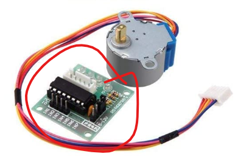

El controlador de motor tiene 8 salidas, cada una conectada a una fase del motor. Para hacer que el motor gire, se activan las salidas en secuencia.

### Componentes necesarios

| Cantidad | Característica                                  |
| -------- | ----------------------------------------------- |
| 1        | Elegoo Uno R3                                   |
| x        | Placa de conexiones con 830 puntos              |
| x        | Módulo receptor infrarrojo (IR)                 |
| x        | Control remoto infrarrojo (IR)                  |
| x        | Módulo controlador de motor paso a paso ULN2003 |
| x        | Motor paso a paso                               |
| x        | Módulo de fuente de alimentación                |
| x        | Adaptador de corriente 9V1A                     |
| x        | Cables hembra-macho (DuPont)                    |
| x        | Cable macho-macho (hilo de puente)              |

### Esquema

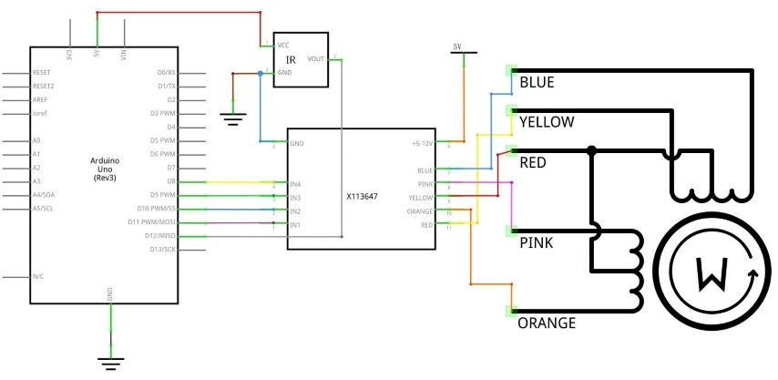

#### Diagrama de cableado

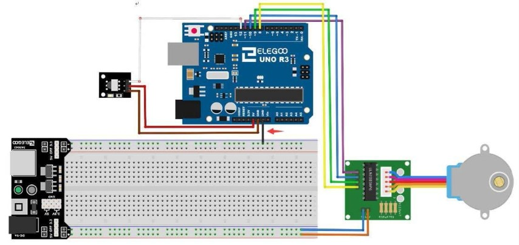

Estamos utilizando 4 pines para controlar el paso a paso y el 1 pin del sensor IR.

- Los ``pines 8-11`` controlan el motor paso a paso
- El ``pin 12`` recibe la información de IR.

Conectamos los 5V y la tierra al sensor. Como medida de precaución, usar un protoboard alimentación potencia el motor paso a paso ya que puede utilizar más energía y no queremos dañar la fuente de alimentación del Arduino.

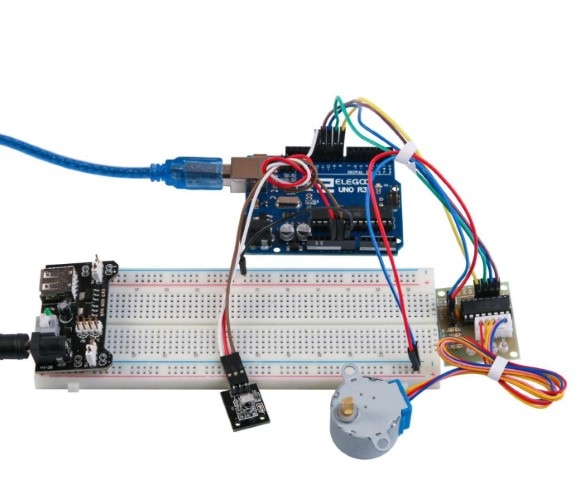

**Mando**

El código reconoce sólo 2 valores desde el control remoto IR: VOL + y VOL-.

- Presionando VOL + del control remoto el motor hará un giro completo hacia la derecha.
- VOL- para hacer una rotación completa en sentido antihorario.

#Ejemplo 1

```c

 Este código hace que el motor gire en sentido horario y antihorario.

void setup()
{
  pinMode(8, OUTPUT);
  pinMode(9, OUTPUT);
  pinMode(10, OUTPUT);
  pinMode(11, OUTPUT);
}

void loop()
{
  //Gira el motor en sentido horario
  digitalWrite(8, HIGH);
  digitalWrite(9, LOW);
  digitalWrite(10, LOW);
  digitalWrite(11, LOW);
  delay(1000);

  digitalWrite(8, LOW);
  digitalWrite(9, HIGH);
  digitalWrite(10, LOW);
  digitalWrite(11, LOW);
  delay(1000);

  digitalWrite(8, LOW);
  digitalWrite(9, LOW);
  digitalWrite(10, HIGH);
  digitalWrite(11, LOW);
  delay(1000);

  digitalWrite(8, LOW);
  digitalWrite(9, LOW);
  digitalWrite(10, LOW);
  digitalWrite(11, HIGH);
  delay(1000);

  //Gira el motor en sentido antihorario
  digitalWrite(8, LOW);
  digitalWrite(9, LOW);
  digitalWrite(10, LOW);
  digitalWrite(11, HIGH);
  delay(1000);

  digitalWrite(8, LOW);
  digitalWrite(9, LOW);
  digitalWrite(10, HIGH);
  digitalWrite(11, LOW);
  delay(1000);

  digitalWrite(8, LOW);
  digitalWrite(9, HIGH);
  digitalWrite(10, LOW);
  digitalWrite(11, LOW);
  delay(1000);

  digitalWrite(8, HIGH);
  digitalWrite(9, LOW);
  digitalWrite(10, LOW);
  digitalWrite(11, LOW);
  delay(1000);
}
```

## Motor paso a paso

Un motor paso a paso es un dispositivo electromecánico que convierte pulsos eléctricos en movimientos mecánicos discretos.

### Componentes necesarios

| Cantidad | Característica                                  |
| -------- | ----------------------------------------------- |
| [x]      | Elegoo Uno R3                                   |
| [x]      | Placa de conexiones con 830 puntos              |
| [x]      | Módulo controlador de motor paso a paso ULN2003 |
| [x]      | Motor paso a paso                               |
| [x]      | Adaptador de corriente 9V1A                     |
| [x]      | Módulo de fuente de alimentación                |
| [x]      | Cables hembra-macho (DuPont)                    |
|          | Hilo macho-macho (hilo de puente)               |


### ¿Cómo funciona un motor paso a paso?

El eje o eje de un motor paso a paso gira en incrementos discretos cuando impulsos de mando eléctrico se aplican a él en la secuencia correcta. La rotación de los motores tiene varias relaciones directas a estos pulsos de entrada aplicadas. La secuencia de los pulsos aplicados se relaciona directamente con la dirección de rotación de ejes motor. La velocidad de la rotación de los ejes motor está directamente relacionada con la frecuencia de los pulsos de entrada y la duración de la rotación está directamente relacionada con el número de pulsos de entrada aplicada. Una de las ventajas más importantes de un motor paso a paso es su capacidad para ser controlado con precisión en un sistema de lazo abierto. Control de lazo abierto significa que ninguna información de retroalimentación de posición es necesario. Este tipo de control elimina la necesidad de costosos dispositivos de detección y regeneración como codificadores ópticos. Su posición es conocida simplemente por hacer el seguimiento de los pulsos de entrada de paso

### 28BYJ-48

 El motor paso a paso "``28BYJ-48``" es un motor bastante común en proyectos de electrónica y robótica debido a su costo asequible y su versatilidad.

| Característica                            | Valor                                      |
| ----------------------------------------- | ------------------------------------------ |
| Tensión nominal                           | 5 VDC                                      |
| Número de fase                            | 4                                          |
| Cociente de la variación de velocidad     | 1/64                                       |
| Ángulo de paso                            | 5,625 ° 64                                 |
| Frecuencia                                | 100Hz                                      |
| Resistencia de la C.C.                    | 50Ω±7% (25 ° C)                            |
| Inactivo en tracción frecuencia           | > 600Hz                                    |
| Frecuencia ociosa de hacia fuera-tracción | > 1000Hz En tracción par > 34.3mN.m(120Hz) |
| Posicionamiento automático par            | > 34.3mN.m                                 |
| Par de fricción                           | 600-1200 gf.cm                             |
| Tire un par                               | 300 gf.cm                                  |
| Resistencia de aislamiento                | > 10MΩ(500V)                               |
| Aislantes de electricidad                 | 600VAC/1mA/1s                              |
| Grado de aislamiento                      | A                                          |
| Subida de temperatura                     | < 40K(120Hz)                               |
| Ruido                                     | < 35dB (120Hz, No carga, 10cm)             |

### Esquema de circuitos

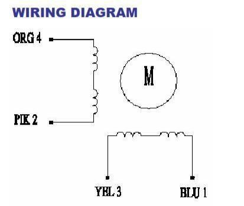

El motor paso a paso bipolar generalmente cuenta con cuatro cables que se extienden de él. A diferencia de los motores PAP unipolares, los motores paso a paso bipolares no poseen una conexión común en el centro.

En lugar de eso, tienen dos conjuntos independientes de bobinas. Pueden diferenciarse de los motores paso a paso unipolares midiendo la resistencia entre los cables.

Deberías identificar dos pares de cables con resistencias iguales. Si conectas las puntas de tu medidor a dos cables que no están vinculados (es decir, que no están conectados a la misma bobina), deberías observar resistencia infinita (o falta de continuidad).

### ULN2003

La ULN2003 es un popular ``chip de amplificación de corriente`` que se utiliza comúnmente como placa conductora para motores paso a paso. Este chip se utiliza para controlar motores, especialmente los motores paso a paso, y proporciona la capacidad de manejar corrientes más altas de las que un microcontrolador puede manejar directamente.

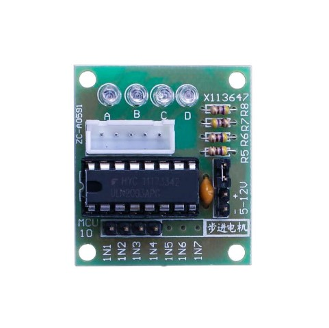

### Descripción del producto

| Característica                                             | Valor                                                                          |
| ---------------------------------------------------------- | ------------------------------------------------------------------------------ |
| Tamaño                                                     | 42mmx30mm                                                                      |
| Chip de controlador de uso                                 | ULN2003, 500mA                                                                 |
| A. B. C. D                                                 | LED que indica las cuatro fases las condiciones  de trabajo motor paso a paso. |
| Blanco jack                                                | es el conector estándar motor cuatro fase      paso a paso.                    |
| Pines de alimentación son separados                        |                                                                                |
| Mantuvimos las clavijas del resto de la viruta del ULN2003 | para sus prototipos más.                                                       |

La forma más sencilla de conexión un paso a paso unipolar a``Arduino`` es utilizar un desglose para chip de ULN2003A transistor array. El ULN2003A contiene siete controladores de transistor Darlington y es algo asícomo tener siete transistores TIP120 todo en un paquete. El ULN2003A puede pasar hasta 500 mA por canal y tiene una caída de tensión interna de 1V cuando en. También contiene diodos de abrazadera interna para disipar las puntas de tensión al manejar cargas inductivas.

## Control mediante bobinas

Para controlar el paso a paso, aplicamos tensión a cada una de las bobinas en una secuencia específica.

La secuencia iría así:

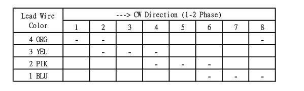

Estos son esquemas que muestran cómo un paso a paso unipolar de interfaz motor a cuatro pines controlador utilizando un ULN2003A y mostrando cómo la interfaz usando cuatro com


#Conexión

#Esquema

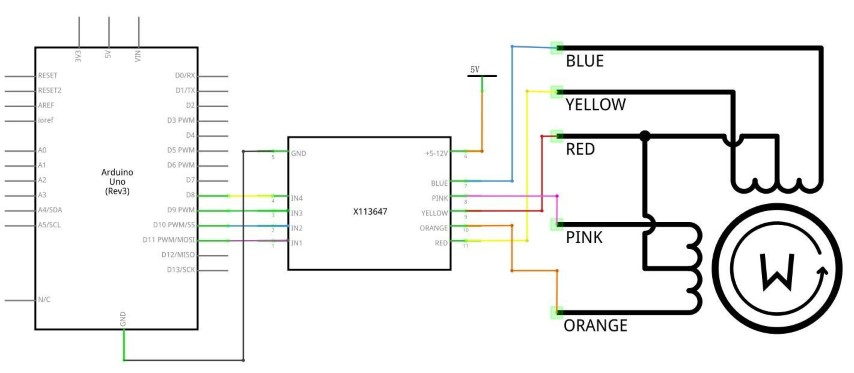

### Diagrama de cableado

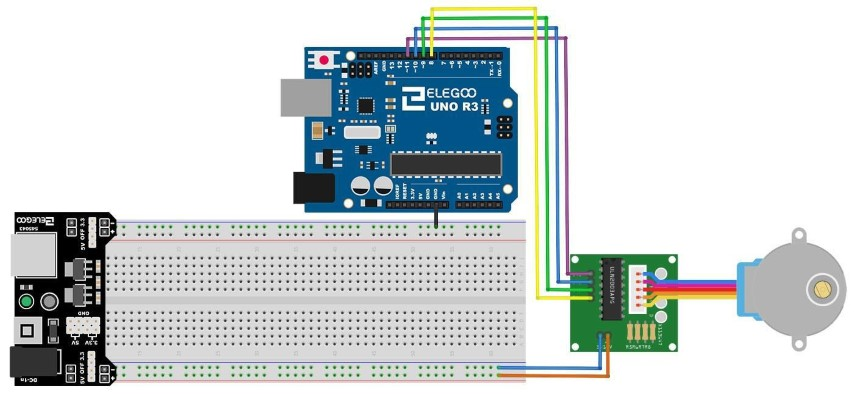

Estamos utilizando 4 pines para controlar el paso a paso.

- Los pines 8-11 controlan el motor paso a paso.
- Conectamos la tierra de a UNO para el motor paso a paso.

### Código

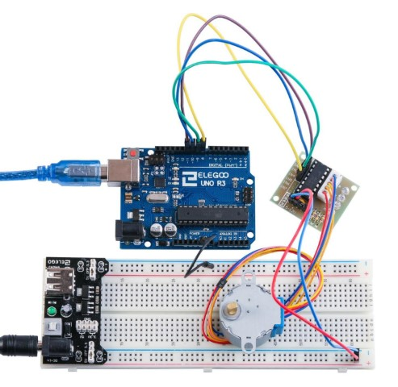

## Motor servo

Los ``servos`` son un tipo especial de motor de c.c. que se caracterizan por su capacidad para posicionarse de forma inmediata en cualquier posición dentro de su intervalo de operación. Se mueven en una precisión de 180º como máximo.

El servo tiene un ``eje`` que puede girar y que es accionado por un motor. La posición del eje puede ser controlada con una señal analógica.

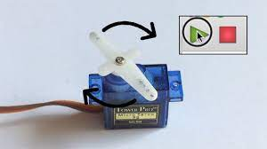

Para ello, el servomotor espera un tren de pulsos que se corresponde con el movimiento a realizar.

### Cables

El Servo tiene tres cables:

- **Marrón** es el cable a tierra y deben conectarse a GND puerto UNO, el r
- **Rojo** es el cable de corriente y debe conectarse al puerto de 5v
- **Naranja** es el cable de señal y debe conectarse al puerto 9.

### Servo MG995

El servomotor **MG995** es un servomotor digital de alta velocidad y alta precisión. El servomotor está construido con una carcasa de plástico reforzado y un eje de metal.

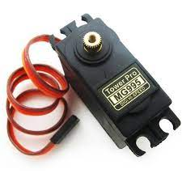

Tiene una salida de 5 V y una corriente máxima de 2 A. Puede alcanzar una velocidad de giro de 0,12 segundos por vuelta.

### Servomotor SG90

- El **SG90** es un microservo más pequeño y ligero que el MG995.
- También es más económico.
- El **SG90** tiene un rango de movimiento de aproximadamente 180 grados, mientras que el MG995 tiene un rango de movimiento de aproximadamente 360 grados.

| Parámetro                  | Valor                                                           |
| -------------------------- | --------------------------------------------------------------- |
| Longitud del cable:        | 25cm                                                            |
| Sin carga;                 | Velocidad: 0,12 seg/60 degree (4.8V), 0.10 sec/60 grados (6.0V) |
| Puesto de par (4.8V):      | 1,6 kg/cm                                                       |
| Temperatura:               | -30 ~ 60' C                                                     |
| Ancho de banda muerta:     | 5 us                                                            |
| Voltaje de funcionamiento: | 3.5 ~ 6V                                                        |
| Dimensión:                 | 1.26 en x 1,18 en x 0,47 en (3,2 x 3 cm x 1.2 cm)               |
| Peso:                      | 4,73 onzas (134)                                                |

### Accesorios

El servo viene con diferentes accesorios que se pueden utilizar para sujetarlo a otras piezas.

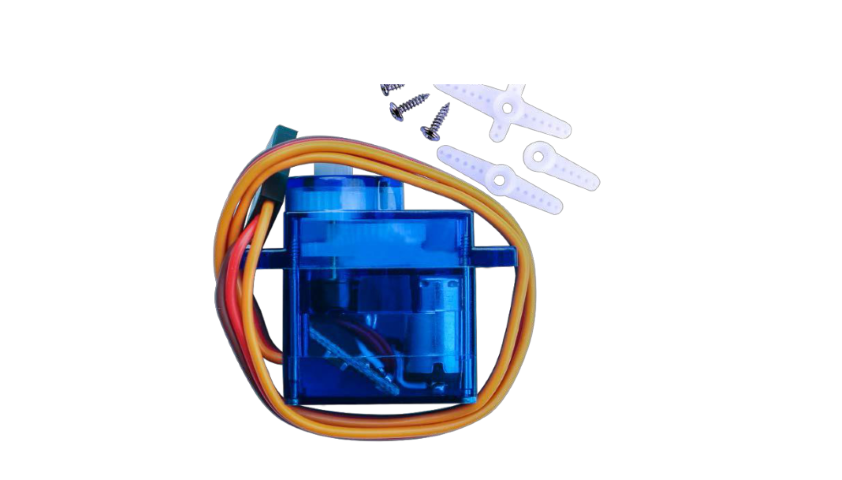

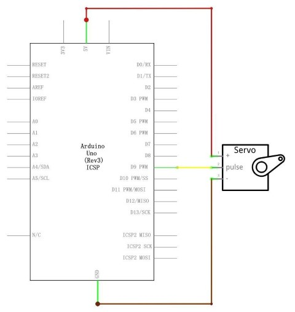

### Diagrama de cableado

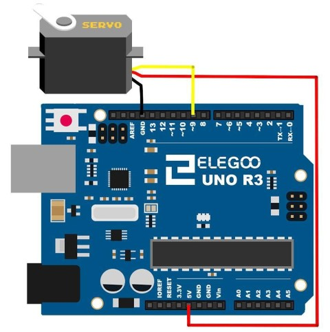

### Montaje

Necesitaremos 3 **jumpers** para conectar el servo a la placa.

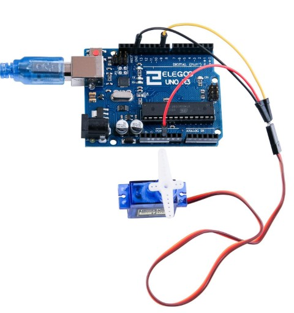

### Código

Antes de ejecutar esto, debemos incluir la **biblioteca servo**. Esta librería incorpora funciones que nos permitirán manejar de forma más sencilla el comportamiento del motor.


Ejemplo 1

```c
#include <Servo.h> // Incluimos la librería Servo

Servo miServo; // Creamos un objeto Servo

void setup() {
  miServo.attach(9); // Conectamos el servo al pin 9
}

void loop() {
  miServo.write(90); // Movemos el servo a 90 grados
  delay(1000); // Esperamos 1 segundo
  miServo.write(0); // Movemos el servo a 0 grados
  delay(1000); // Esperamos 1 segundo
}
```

Ejemplo 2
Este código mueve el eje del motor ``180 grados`` en una dirección y luego en la contraria, indefinidamente.

```c title="pruebasServo.ino"
#include <Servo.h>

Servo myservo;  // create servo object to control a servo
// twelve servo objects can be created on most boards

int pos = 0;    // variable to store the servo position

void setup() {
  myservo.attach(9);  // Le asignamos el PIN 9.
}

void loop() {
  for (pos = 0; pos <= 180; pos += 1) { // goes from 0 degrees to 180 degrees
    // in steps of 1 degree
    myservo.write(pos);              // tell servo to go to position in variable 'pos'
    delay(15);                       // waits 15ms for the servo to reach the position
  }
  for (pos = 180; pos >= 0; pos -= 1) { // goes from 180 degrees to 0 degrees
    myservo.write(pos);              // tell servo to go to position in variable 'pos'
    delay(15);                       // waits 15ms for the servo to reach the position
  }
}
```

# Luces

Els LEDs, els LCD i els displays de set segments són components electrònics que es poden controlar amb una placa Arduino per a mostrar informació o per a indicar l'estat d'un sistema. Cada un d'aquests dispositius té diferents característiques i funcions, i es poden utilitzar en diferents aplicacions.

- Els [LEDs](LED.md) són diodes emissors de llum que es poden utilitzar per a indicar l'estat d'un sistema, per a il·luminar objectes o per a crear efectes de llum.

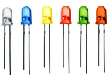

- Els [displays LCD](LCD.md) són pantalles de cristall líquid que es poden utilitzar per a mostrar text o gràfics. Aquests displays són útils en moltes aplicacions, com ara en sistemes de control de temperatura, temporitzadors, termostats, etc.

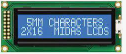

- Els [displays de set segments](7_segments_(1_dígito).md) són displays que mostren dígits o lletres utilitzant set segments de LEDs per a crear la forma desitjada. Aquests displays són utilitzats en moltes aplicacions, com ara rellotges digitals, termòmetres, indicadors de nivell, etc.

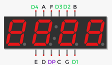

### Componentes necesarios

| Cantidad | Característica                                   |
| -------- | ------------------------------------------------ |
| (1)      | x Placa Arduino UNO                              |
| (1)      | 1 LED rojo de 5 mm                               |
| (1)      | x resistencia de 220 ohmios                      |
| (1)      | x resistencia de 1 k ohm                         |
| (1)      | x resistencia de ohmio 10 k                      |
| (2)      | x M M cables (cables de puente de macho a macho) |

**¿Qué es un LED?**

En esta lección, usarás tal vez el más común de todos los LEDs: un LED de 5mm de color rojo. 5mm se refiere al diámetro del LED. Otros tamaños comunes son 3mm y 10mm.

¿Cómo se conecta?**

Directamente no se puede conectar un LED a una batería o fuente de tensión porque:

1) El  LED tiene un polo positivo y un negativo y no se encenderá si se conectan mal.
2) Un LED con una resistencia para limitar la corriente que circula a través de él.

### Ejemplo de LED

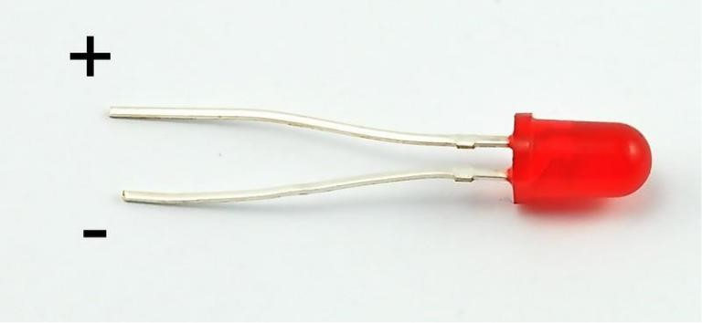

### Advertencia

Si no utilizas un resistencia con un LED, entonces se puede quemar casi de inmediato, como demasiada corriente fluirá a través, calienta y destruye al 'cruce' donde se produce la luz. Hay dos maneras de saber cual es el positivo del LED y que la negativa. En primer lugar, el positivo es más largo.

En segundo lugar, donde la pata del negativo entra en el cuerpo del LED, hay un borde plano para el caso del LED.

La patilla más larga es el ``positivo``.

### Resistencias

Como su nombre lo indica, resistencias de resisten el flujo de electricidad. Cuanto mayor sea el valor de la resistencia, resiste más y la menos corriente fluirá a través de él. Vamos a usar esto para controlar Cuánta electricidad fluye a través del LED y por lo tanto, como claramente brilla.

### Resistencias: ejemplo

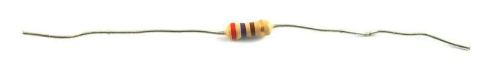

### Resistencias: unidades

- La **unidad** de resistencia se denomina Ohm, que se abrevia generalmente a Ω la letra griega Omega.
- 1 Ohm es un valor bajo
- Valores de resistencias en kΩ (1.000 Ω) y MΩ (1.000.000 Ω). (kiloohmios y megaohmios).

Resistencias: valores

En esta lección, vamos a utilizar tres valores diferentes de resistencia:

- [x] 220 Ω
- [x] 1 kΩ
- [x] 10 kΩ

### Resistencias: diferencias

Estas resistencias todas se ven iguales, excepto que tienen **rayas de colores** diferentes en ellos. Estas rayas decirte el valor de la resistencia.

El **código** de color resistor tiene tres franjas de colores y luego una banda de oro en un extremo.

### Ejemplo identificación resistencia

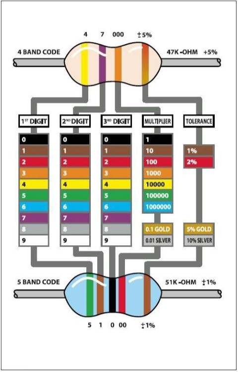

### Resistencias: orientación

A diferencia de los **LED**, resistencias no tienen un cable positivo y negativo. Se puede conectar de cualquier manera alrededor.

### Resistencias: medición

Si desconocemos el valor de una resistencia, también podemos medir su valor utilizando un ``multímetro``.

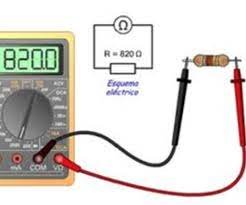

### Esquema

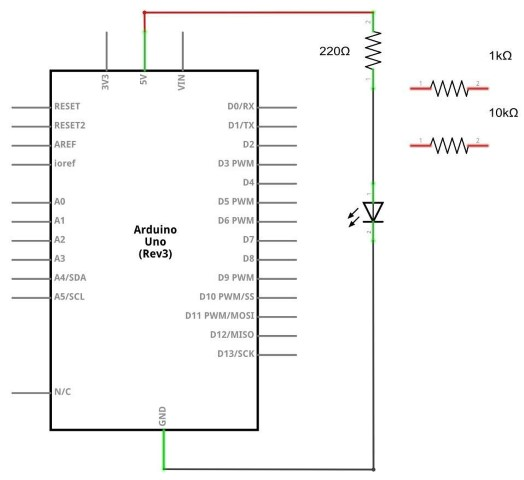

### Simulación

La **placa de desarrollo``Arduino`` UNO** es una conveniente fuente de 5 voltios, que vamos a utilizar para alimentar el LED y la resistencia. No necesita hacer nada con su UNO, salvo que lo conecte un cable USB.

### Simulación: ejemplo

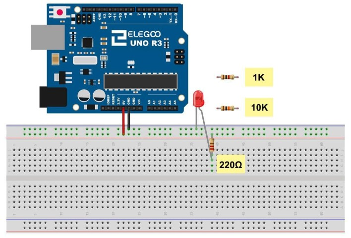

### Resistencias para LED

- Con la resistencia de ``220 Ω``,  el LED debe ser bastante brillante.
- Si cambia  la resistencia ``220 Ω`` para la resistencia de ``1 kΩ``, brillará menos.
- Por último, con el resistor de ``10 kΩ`` en su lugar, el LED será casi invisible.

### Montaje

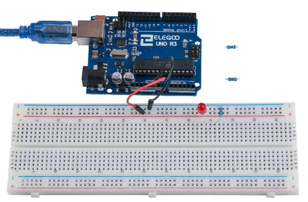

## [LED RGB](https://danimrprofe.github.io/apuntes/arduino/LED_RGB/)

En este proyecto aprendremos a controlar la iluminación de un [LED RGB](https://danimrprofe.github.io/apuntes/arduino/LED_RGB/) con [Arduino](https://danimrprofe.github.io/apuntes/arduino/)

Los [LED RGB](https://danimrprofe.github.io/apuntes/arduino/LED_RGB/) permiten iluminar con cualquier color, a través de 3 leds que contiene en su interior: uno rojo, otro verde y otro azul.

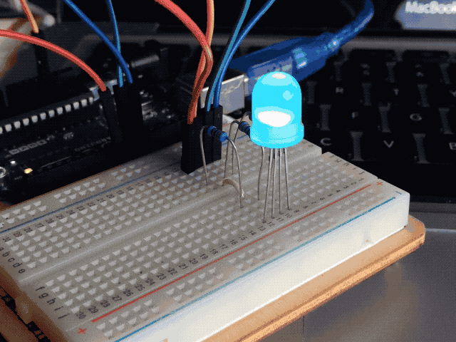

Tipos de [LED RGB](https://danimrprofe.github.io/apuntes/arduino/LED_RGB/)

- Existen 2 versiones: Ánodo común y cátodo común.
- Ánodo común utiliza 5V en el pin común, mientras que el cátodo común se conecta  a tierra.
- Como con cualquier LED, tenemos que conectar algunas resistencias en línea (3 total)  para limitar la corriente.

### Componentes necesarios

| cantidad | componente                                                        |
| -------- | ----------------------------------------------------------------- |
| 1        | placa [Arduino](https://danimrprofe.github.io/apuntes/arduino/)   |
| 1        | protoboard                                                        |
| 4        | cables jumper                                                     |
| 1        | [LED RGB](https://danimrprofe.github.io/apuntes/arduino/LED_RGB/) |
| 3        | resistencias de 220 ohmios                                        |

### RGB

A primera vista, LEDs RGB (rojo, verde y azul) sólo parecen un LED. Sin embargo, dentro del paquete del LED generalmente, hay realmente tres LEDs, uno rojo, uno verde y sí, uno azul. Controlando el **brillo** de cada uno de los LEDs individuales, podemos mezclar prácticamente cualquier color.


### Pines

El [LED RGB](https://danimrprofe.github.io/apuntes/arduino/LED_RGB/) tiene **cuatro pines**. Hay un cable a la conexión positiva de cada uno de los LEDs individuales dentro del paquete y un patilla única que está conectado a los tres lados negativos de los LEDs.


Cada pin separado de color verde o azul o de rojo se llama ánodo.

### Color

Los colores los conseguiremos mezclando diferentes cantidades de cada color primario.


La mezcla creará la ``sensación`` del color elegido. Podemos controlar el brillo de cada una de las partes de rojas, verdes y azules del LED por separado, lo que es posible mezclar cualquier color.

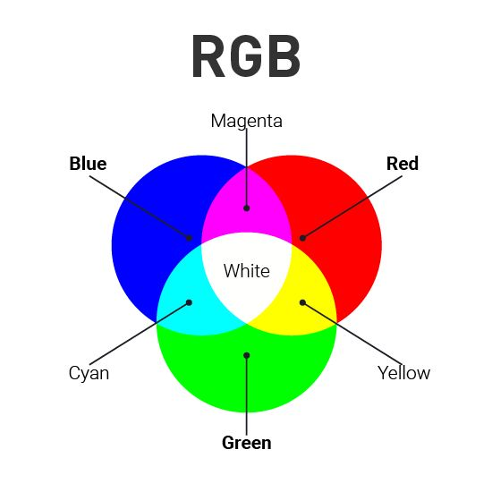

### Ejemplos

- Si establece el brillo de todos los tres LEDs al ser el mismo, el color general de la luz  será blanco.
- Si apagamos el LED azul, para que sólo los LEDs rojo y verdes son el  mismo brillo, la luz aparecerá amarillo.

### ¿Cómo consigo el color negro?

El color **Negro** no es tanto un color como una ausencia de luz. Por lo tanto, lo más cercano  que podemos llegar a negro con el LED es apagar los tres colores, poniendo sus valores a 0.

### Teoría (PWM)

- [Arduino](https://danimrprofe.github.io/apuntes/arduino/) tiene una función **analogWrite** que se puede utilizar con pines marcados con un **~** a la salida de una cantidad variable de energía los LEDs apropiados.
- La forma de dar más o menos potencia a cada color es utilizando una señal del tipo ``PWM``.
- La **modulación de ancho de pulso (PWM)** es una técnica para el control de potencia. La utilizamos aquí para controlar el brillo de cada uno de los LEDs.

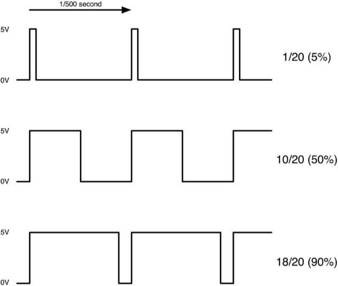

Ciclo de trabajo

Aproximadamente cada 1/500 de segundo, la salida PWM producirá un pulso. La  duración de este pulso es controlada por la función 'analogWrite'. Así:

- ``analogWrite(0)`` no producirá ningún pulso.
-  ``analogWrite(255)`` producirá un  pulso que dura todo el camino hasta el pulso siguiente vencimiento, para que la  salida es en realidad todo el tiempo.

Si especificamos un valor en el **analogWrite** que está en algún lugar entre 0 y 255, se producir un pulso.

- Si el pulso de salida es alto para el 5% del tiempo, entonces lo  que nosotros estamos manejando sólo recibirá el 5% de potencia.
- Si la salida es 5V para el 90% del tiempo, la carga recibirá el 90% .

Los LED se encenderán y apagarán en esos periodos, pero nosotros percibiremos que el brillo del LED cambia.

### Esquema

El esquema eléctrico que seguiremos es el siguente:

- Cada patilla de un color debe conectarse a una salida digital etiquetada como ``PWM``
- La patilla común, irá conectada a un pin de tierra, etiquetado como ``GND``

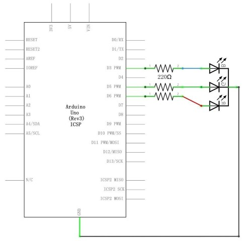

### Conexión

1. El cátodo o conexión común es el segundo pin, que también es el **más largo** de las cuatro patas y se conectarán a la **tierra** (GND).
2. Cada LED requiere su propia **resistencia de 220 Ω** para prevenir demasiada corriente que fluye a través de él.
3. Los 3 pines de color (uno rojo, uno verde y uno azul) están conectados a los pines de salida UNO con estas resistencias.

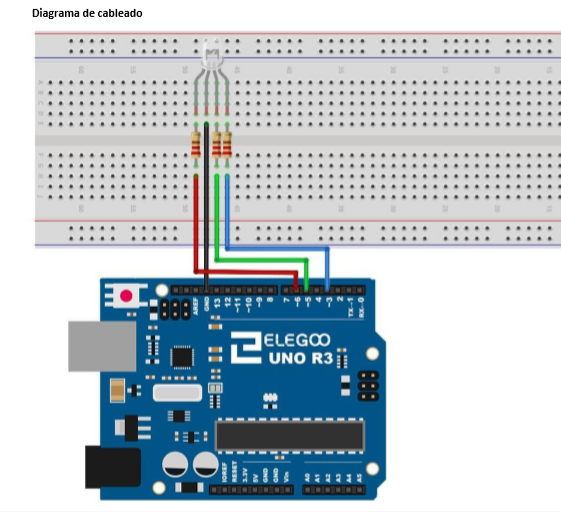

Una vez conectado, debería quedar de la siguiente forma:


### Código programa 1

```c linenums="1" title="pruebaLEDRGB.ino"
// Define pines
#define BLUE 3
#define GREEN 5
#define RED 6

void setup()
{
  pinMode(RED, OUTPUT);
  pinMode(GREEN, OUTPUT);
  pinMode(BLUE, OUTPUT);
}

void loop()
{
  analogWrite(RED, 0);
  analogWrite(GREEN, 255);
  analogWrite(BLUE, 0);
}
```

Una vez probado, puedes intentar estos ejercicios:

1. Combinar varios valores para conseguir colores diferentes
2. Crear un semáforo utilizando delays y cambiando los valores para producir las luces roja, verde y amarilla.

### Código programa 2

```c linenums="1" title="pruebaLEDRGB.ino"
// Define pines
#define BLUE 3
#define GREEN 5
#define RED 6

void setup()
{
  pinMode(RED, OUTPUT);
  pinMode(GREEN, OUTPUT);
  pinMode(BLUE, OUTPUT);
  digitalWrite(RED, HIGH);
  digitalWrite(GREEN, LOW);
  digitalWrite(BLUE, LOW);
}

// define variables
int redValue;
int greenValue;
int blueValue;

// main loop
void loop()
{
  #define delayTime 10 // fading time between colors

  redValue = 255; // choose a value between 1 and 255 to change the color.
  greenValue = 0;
  blueValue = 0;

  // this is unnecessary as we've either turned on RED in SETUP
  // or in the previous loop ... regardless, this turns RED off
  // analogWrite(RED, 0);
  // delay(1000);

  for(int i = 0; i < 255; i += 1) // fades out red bring green full when i=255
  {
  redValue -= 1;
  greenValue += 1;
  // The following was reversed, counting in the wrong directions
  // analogWrite(RED, 255 - redValue);
  // analogWrite(GREEN, 255 - greenValue);
  analogWrite(RED, redValue);
  analogWrite(GREEN, greenValue);
  delay(delayTime);
}

redValue = 0;
greenValue = 255;
blueValue = 0;

for(int i = 0; i < 255; i += 1) // fades out green bring blue full when i=255
{
greenValue -= 1;
blueValue += 1;
// The following was reversed, counting in the wrong directions
// analogWrite(GREEN, 255 - greenValue);
// analogWrite(BLUE, 255 - blueValue);
analogWrite(GREEN, greenValue);
analogWrite(BLUE, blueValue);
delay(delayTime);
}

redValue = 0;
greenValue = 0;
blueValue = 255;

for(int i = 0; i < 255; i += 1) // fades out blue bring red full when i=255
{
// The following code has been rearranged to match the other two similar sections
blueValue -= 1;
redValue += 1;
// The following was reversed, counting in the wrong directions
// analogWrite(BLUE, 255 - blueValue);
// analogWrite(RED, 255 - redValue);1
analogWrite(BLUE, blueValue);
analogWrite(RED, redValue);
delay(delayTime);
}
}
```

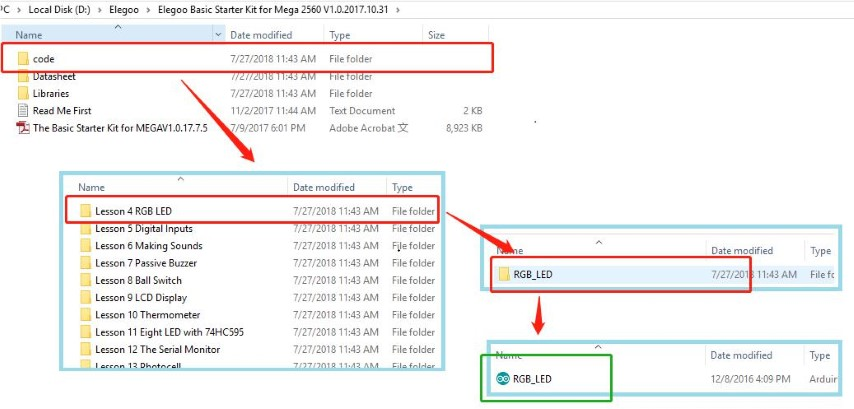

Primero especificamos a que pines de ``Arduino`` he conectado cada LED.

```c
// Define Pins
// Se definen los pines
#define BLUE 3    // Se asigna el nombre 'BLUE' al pin 3
#define GREEN 5   // Se asigna el nombre 'GREEN' al pin 5
#define RED 6     // Se asigna el nombre 'RED' al pin 6
```

En el setup, declaramos estos pines como salidas (OUTPUT) para poder enviar corriente hacia los LED.

```c
void setup()
{
  pinMode(RED, OUTPUT);
  pinMode(GREEN, OUTPUT);
  pinMode(BLUE,OUTPUT);
  digitalWrite(RED, HIGH);
  digitalWrite(GREEN, LOW);
  digitalWrite(BLUE, LOW);
}
```

Antes de echar un vistazo a la **función loop**, veamos la última función en el proyecto.

Las variables de definición:

```arduino
redValue = 255; // choose a value between 1 and 255 to change the color.
greenValue = 0;
blueValue = 0;
```

Esta función tiene tres argumentos, uno para el brillo de los LEDs rojos, verdes y azules. En cada caso de que el número será en el rango 0 a 255, donde 0 significa apagado y 255 significa brillo máximo. La función entonces llama 'analogWrite' para ajustar el brillo de cada LED.

Si nos fijamos en la **función loop** se puede ver que ajuste la cantidad de luz roja, verde y azul que queremos mostrar y luego una pausa por un segundo antes de pasar al siguiente color.

```arduino
#define delayTime 10 // fading time between colors
Delay(delayTime);
```

## Tira de LEDs

Los LEDs se están volviendo cada vez más populares como un medio para iluminar un espacio. Uno de los tipos de LEDs más nuevos y populares es el ``WS2812B``. Estos LEDs ofrecen una serie de ventajas sobre los LEDs tradicionales, como la capacidad de cambiar de color y la capacidad de crear una gran variedad de efectos de iluminación.


### WS2812B

El **WS2812B** es un tipo de LED direccionable. Esto significa que cada LED individual se puede controlar de forma **independiente**. Esto le da la capacidad de crear algunos efectos de iluminación realmente geniales.

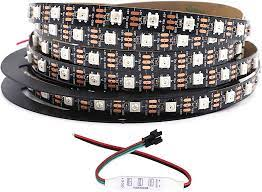

### Alimentación

Las tiras **WS2812B** pueden alimentarse a través de una batería o de una fuente de alimentación externa.

- El voltaje necesario para que funcione correctamente la tira de led WS2812B es de 5V.
- Un led WS2812B necesita un mínimo de 60mA para funcionar.

### La librería FASTLED

**FastLED** es una librería de código abierto para programar tira de LEDs RGB direccionables y controladores. Está diseñada para simplificar el proceso de crear efectos de iluminación complejos y se puede usar con una amplia variedad de hardware.

###  Conexión


###  Cabecera

```c  linenums="1" title="pruebaLED.ino"
#include<FastLED.h> // header file

#define NUM_LEDS 60 // number of led present in your strip
#define DATA_PIN 6 // digital pin of your``Arduino``

CRGB leds[NUM_LEDS];

void setup() {
  FastLED.addLeds<WS2812B, LED_PIN, GRB>(leds, NUM_LEDS);
  FastLED.setBrightness(50);
}

void loop() {
  leds[0] = CRGB::Green; //glow 1st led as green
  leds[1] = CRGB::Blue; //glow 2nd led as blue
  FastLED.show(); // apply the function on led strip
  delay(30);
}
```

###  Parpadeo (blink)

```c  linenums="1" title="parpadeoLED.ino"
void loop() {
  leds[0] = CRGB::Blue;
  FastLED.show();
  delay(200);
  leds[0] = CRGB::Black;
  FastLED.show();
  delay(200);
}
```

Para apagar la luz:

```c
leds[0] = CRGB::Black;
```

Iluminar todos los LED de golpe

Para ello podemos utilizar la función `fill_solid`.

```c
fill_solid(leds, NUM_LEDS, CRGB:Red);
```

### Arcoiris

```c
fill_rainbow(leds, NUM_LEDS, 0,255 / NUM_LEDS);
```

###  LED Chaser

```c
// chase forward
void loop()
{
  for(int dot = 0;dot < NUM_LEDS; dot++) {
    leds[dot] = CRGB::Red;
    FastLED.show();
    leds[dot] = CRGB::Black;
    delay(300);
  }
}

// chase backward

void loop()
{
  for(int dot=NUM_LEDS ; dot >=0 ; dot--) {
    leds[dot] = CRGB::Red;
    FastLED.show();
    leds[dot] = CRGB::Black;
    delay(300);
  }
}

// chase both

void loop() {
  for(int dot=(NUM_LEDS-1) ; dot >=0 ; dot--) {
    leds[dot] = CRGB::Green;
    FastLED.show();
    leds[dot] = CRGB::Black;
    delay(300);
  }

  for(int dot = 0;dot < NUM_LEDS; dot++) {
    leds[dot] = CRGB::Red;
    FastLED.show();
    leds[dot] = CRGB::Black;
    delay(300);
  }
}
```

###  Serial glow

```c
void loop()
{
  for(int dot=(NUM_LEDS-1) ; dot >=0 ; dot--) {
    leds[dot] = CRGB::HotPink;
    FastLED.show();
    delay(300);
  }

  for(int dot = 0;dot < NUM_LEDS; dot++) {
    leds[dot] = CRGB::Blue;
    FastLED.show();
    delay(300);
  }
}

```

## 7 segments (1 dígito)

Un **seven segments** es un dispositivo de visualización formado por siete diodos LED dispuestos en forma de número 8.

Estas lámparas se utilizan para mostrar números, letras y caracteres especiales. Se usan en una variedad de dispositivos electrónicos, como relojes digitales, calculadoras, contadores, temporizadores, etc.

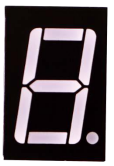

-

Estas son las combinaciones que podemos hacer para mostrar los distintos números:


### Componentes necesarios

| cantidad | componente                                     |
| -------- | ---------------------------------------------- |
| 1        | placa``Arduino``                               |
| 1        | protoboard                                     |
| 1        | circuito integrado 74HC595                     |
| 1        | Pantalla 7 segments                            |
| 8        | resistencias de 220 ohm                        |
| 1        | M-M cables (cables de puente de macho a macho) |

### Display de siete segmentos

Abajo está el diagrama de pines de siete segmentos

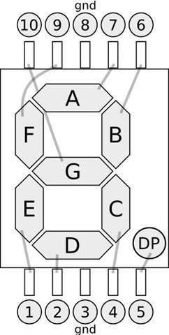

0-9 diez dígitos se corresponden con cada segmento es los siguientes (en la tabla siguiente se aplica común cátodo dispositivo de exhibición de segmento siete, si se utiliza un ánodo común, de la mesa debe ser reemplazado cada 1 0 0 si todos sustituidos por 1):

| dp  | a	b	c	d	e	f	g   |
| --- | --------------- |
| 0   | 0	1	1	1	1	1	1	0 |
| 1   | 0	0	1	1	0	0	0	0 |
| 2   | 0	1	1	0	1	1	0	1 |
| 3   | 0	1	1	1	1	0	0	1 |
| 4   | 0	0	1	1	0	0	1	1 |
| 5   | 0	1	0	1	1	0	1	1 |
| 6   | 0	1	0	1	1	1	1	1 |
| 7   | 0	1	1	1	0	0	0	0 |
| 8   | 0	1	1	1	1	1	1	1 |
| 9   | 0	1	1	1	1	0	1	1 |

vamos a utilizar el registro de desplazamiento **74HC595** para controlar la visualización de un seven segments.

### Conexión

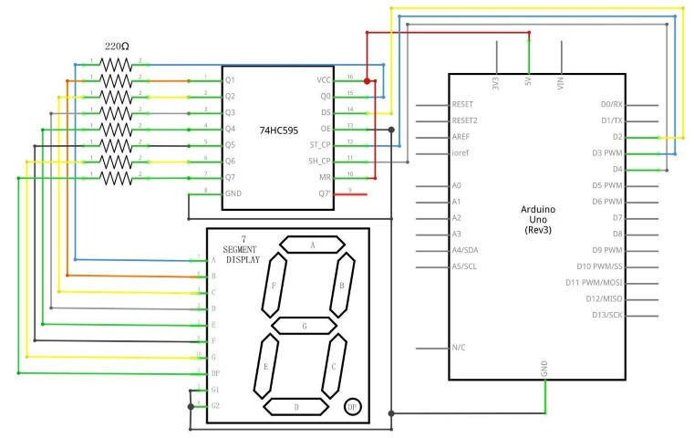

### Esquema

### Diagrama de cableado

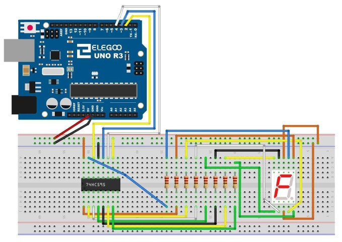

La siguiente tabla muestra la tabla de correspondencias pantalla de siete segmentos 74HC595 pin

### Paso uno: conexión 74HC595

En primer lugar, el cableado está conectado a la alimentación y tierra:

- VCC (pin 16) y Señor (pin 10) conectado a 5V
- GND (pin 8) y OE (pin 13) a tierra

Pin conexión DS, ST_CP y SH_CP:

- DS (pin 14) conectado al pin de tablero UNO R3 2 (la cifra por debajo de la línea amarilla)
- ST_CP (pin 12, perno de pestillo) conectado al pin de tablero UNO R3 3 (línea azul de la figura abajo)
- SH_CP (pin 11, pin de reloj) conectado al pin de tablero UNO R3 4 (figura debajo de la línea blanca)

### Paso 2: conectar el display de siete segmentos

El display de siete segmentos 3, 8 pin a UNO R3 Junta GND (este ejemplo utiliza el cátodo común, si se utiliza el ánodo común, por favor conecte el 3, 8 pines para tablero UNO R3 + 5V)

Según la tabla anterior, conecte el 74HC595 Q0 ~ Q7 a siete segmentos pantalla pin correspondiente (A ~ G y DP) y luego cada pie en una resistencia de 220 ohmios en serie.

### Código

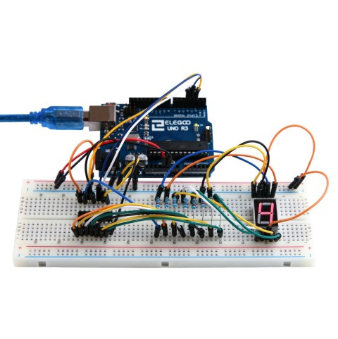

```c

int tDelay = 100;
int latchPin = 11;      // (11) ST_CP [RCK] on 74HC595
int clockPin = 9;      // (9) SH_CP [SCK] on 74HC595
int dataPin = 12;     // (12) DS [S1] on 74HC595

byte leds = 0;

void updateShiftRegister()
{
   digitalWrite(latchPin, LOW);
   shiftOut(dataPin, clockPin, LSBFIRST, leds);
   digitalWrite(latchPin, HIGH);
}

void setup()
{
  pinMode(latchPin, OUTPUT);
  pinMode(dataPin, OUTPUT);
  pinMode(clockPin, OUTPUT);
}

void loop()
{
  leds = 0;
  updateShiftRegister();
  delay(tDelay);
  for (int i = 0; i < 8; i++)
  {
    bitSet(leds, i);
    updateShiftRegister();
    delay(tDelay);
  }
}
```

## 7 segments (4 dígitos)

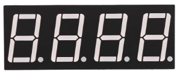

### Resumen

En esta lección, aprendremos a utilizar una pantalla de 7 segmentos de 4 dígitos. Tenemos que tener en cuenta que:

- Si la pantalla es **ánodo común**, el pin común del ánodo se conecta a la fuente de energía
- Si es de **cátodo común**, el pin común del cátodo se conecta a la tierra.

Cuando se utilizan 4 dígitos de 7 segmentos, el ánodo común o pin de cátodo común se utiliza para controlar qué dígito aparece. A pesar de que hay sólo un dígito de trabajo, el principio de persistencia de la visión le permite ver todos los números de muestra ya que cada uno es tan rápida que apenas notará los intervalos de la velocidad de exploración.

### Componentes necesarios

| Cantidad | Componente                                     |
| -------- | ---------------------------------------------- |
| 1        | Elegoo Uno R3                                  |
| 1        | protoboard                                     |
| 1        | 74HC595 IC                                     |
| 1        | display de 4 dígitos de 7 segmentos            |
| 4        | Resistencias de 220 ohm                        |
| 1        | M-M cables (cables de puente de macho a macho) |

### Muestra de 4 dígitos de 7 segmentos

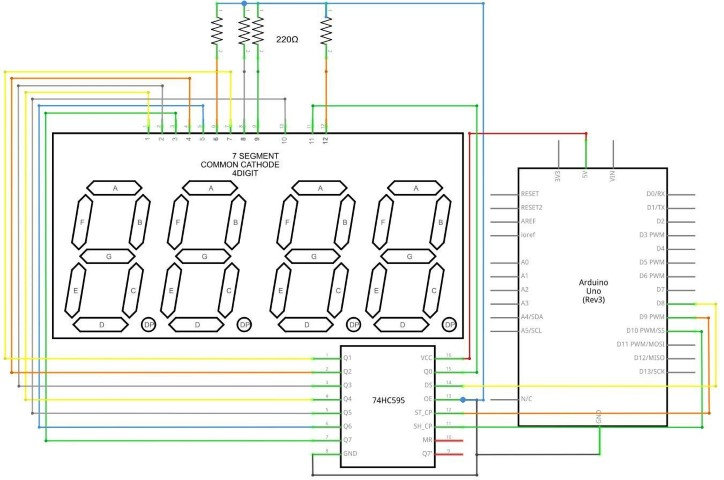

### Diagrama de cableado

Cada dígito tiene 7 segmentos (A a G) y un punto decimal (D1 a D4).

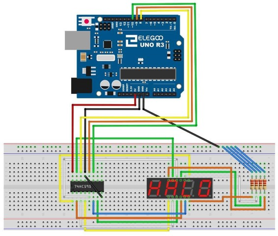

### Código

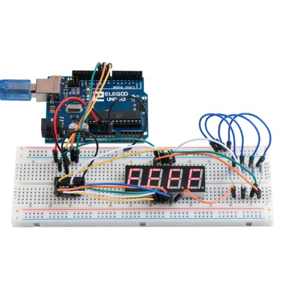

## Pantalla LCD

La pantalla tiene una retroiluminación de LED y puede mostrar ``dos filas con hasta 16 caracteres`` en cada fila.


### Circuito integrado LCD1602

La pantalla está incrustada en un ``circuito integrado ``que la controla, llamado ``LCD1602``.

### Pines

- ``VSS`` Un pin que se conecta a tierra
- ``VDD`` Un pin que se conecta a un + 5V fuente de alimentación
- ``VO``  ajusta el contraste.
- ``RS`` Un registro seleccione pin que controla donde en memoria de la pantalla LCD datos de escritura. Usted puede seleccionar el registro de datos, que es lo que pasa en la pantalla, o un registro de instrucción, que es donde busca controlador de LCD para obtener instrucciones sobre qué hacer.
- ``R/W``: Pin A lectura y escritura que selecciona el modo de lectura o escritura a modo de E:, Permitiendo a un perno con energía de bajo nivel, módulo causas la LDC para ejecutar instrucciones.
- ``D0-D7`` son los pines para escribir y leer datos.
- ``A y K`` controlan de la retroiluminación LED de los pernos

### Esquema de conexión

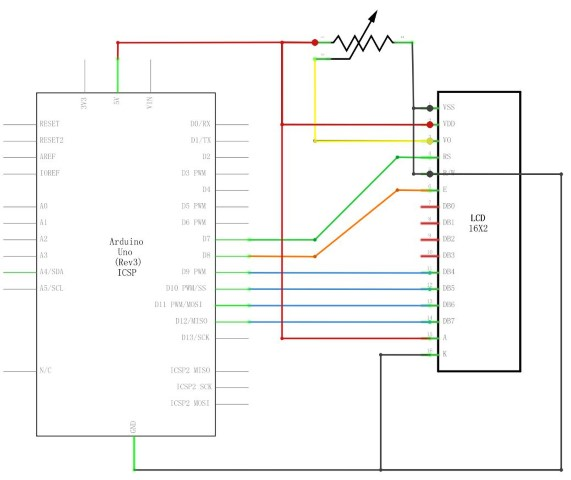

### Diagrama de cableado

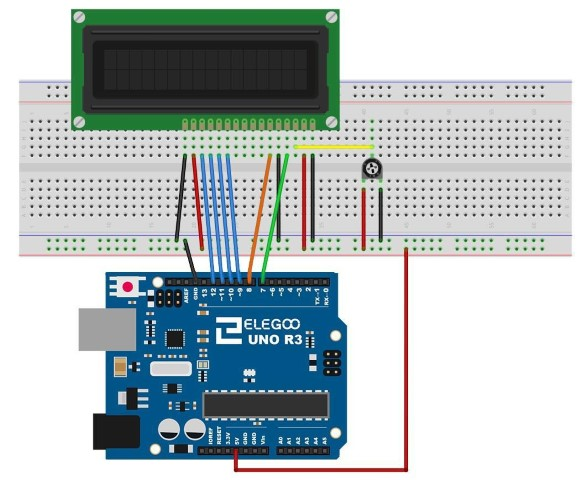

La pantalla LCD necesita:

- 6 pines digitales de datos de``Arduino``
- Coneciones de 5V y GND.

### Potenciómetro

El **potenciómetro** se utiliza para controlar el ``contraste`` de la pantalla. En ocasiones se ajusta con un pequeño destornillador. El potenciómetro utilizado será de ``10 KOhm``

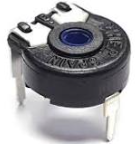

### Librería

Antes de ejecutar esto, asegúrese de que ha instalado la **librería** < LiquidCrystal > o volver a instalarlo, si es necesario. De lo contrario, el código no funcionará.

Lo primero que nota en el dibujo es la línea:

```arduino
#include < LiquidCrystal.h >
```

Esto dice``Arduino`` que queremos utilizar la **librería** de cristal líquido.

A continuación tenemos la línea que teníamos que modificar. Esto define qué pines de``Arduino`` son para conectarse a que pines de la pantalla.

```c
LiquidCrystal lcd (7, 8, 9, 10, 11, 12);
```

Después de subir este código, asegúrese de que se enciende la retroiluminación y ajustar el potenciómetro de toda la manera alrededor hasta que aparezca el mensaje de texto

En la función de **setup**, tenemos dos comandos:

```c
LCD.Begin (16, 2);
LCD.Print ("Hola, mundo!");
```

La primera cuenta la **librería** de cristal líquido cuántas columnas y filas tiene la pantalla. La segunda línea muestra el mensaje que vemos en la primera línea de la pantalla.

En la función de 'loop', aso tienen dos comandos:

```c
lcd.setCursor (0, 1);
LCD.Print(Millis()/1000);
```

El primero establece la posición del cursor (donde aparecerá el siguiente texto) columna 0 y fila 1. Los números de columna y fila comienzan en 0 en lugar de 1.

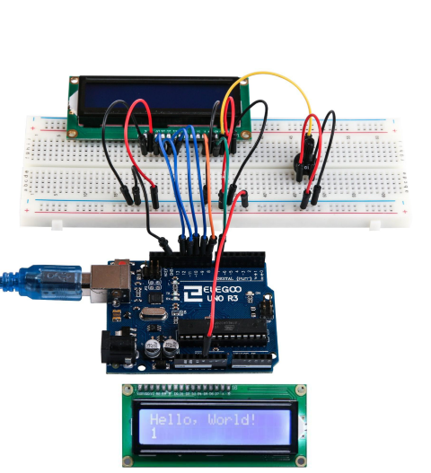

La segunda línea muestra el número de milisegundos desde que se restableció el``Arduino``.

```c
// include the library code:
#include <LiquidCrystal.h>

// initialize the library with the numbers of the interface pins
LiquidCrystal lcd(7, 8, 9, 10, 11, 12);

void setup() {
  // set up the LCD's number of columns and rows:
  lcd.begin(16, 2);
  // Print a message to the LCD.
  lcd.print("Hello, World!");
}

void loop() {
  // set the cursor to column 0, line 1
  // (note: line 1 is the second row, since counting begins with 0):
  lcd.setCursor(0, 1);
  // print the number of seconds since reset:
  lcd.print(millis() / 1000);
}
```

## LED con 74HC595

Veremos cómo utilizar ocho LEDs rojos grandes con un Arduino UNO sin necesidad de sacrificar las 8 salidas disponibles.

Aunque podrías conectar ocho LEDs con una resistencia a pines del Arduino UNO, rápidamente te quedarías sin pines en tu placa si ya tienes varios dispositivos conectados. Si no tienes muchas cosas conectadas al UNO, está bien hacerlo, pero a menudo queremos incorporar botones, sensores, servos, etc. y antes de darte cuenta, te quedas sin pines disponibles.

Por lo tanto, en lugar de hacer eso, usarás un chip llamado ``74HC595``, que es un convertidor serial a paralelo. Este chip cuenta con ocho salidas (perfecto) y tres entradas que se utilizan para cargar datos poco a poco.

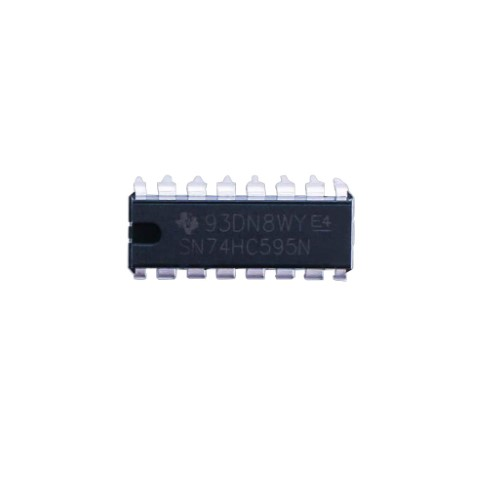

Este chip hace un poco más lento para los LEDs (sólo se puede cambiar el LED unos 500.000 veces por segundo en lugar de 8.000.000 por segundo) pero todavía es muy rápido, forma más rápido que los seres humanos puede detectar, asíque vale!

Componente necesario:

> * (1) x Elegoo Uno R3
> * Protoboard
> * leds
> * resistencias de 220 ohmios
> * IC x 74hc595
> * M M cables (cables de puente de macho a macho)

### 74HC595 Registro de desplazamiento

El registro de desplazamiento es un tipo de chip que tiene lo que puede considerarse como posiciones de memoria ocho, cada uno de ellos puede ser un 1 o un 0. Para definir cada uno de estos valores encendido o apagado, alimentamos en los datos mediante los pines del chip 'Datos' y 'El reloj'.

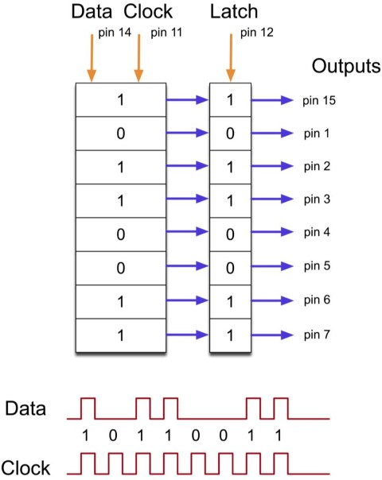

El pin de reloj debe recibir ocho pulsos. En cada pulso, si el pin de datos es alto, entonces un 1 obtiene empujado en el registro de desplazamiento; de lo contrario, un 0. Cuando se han recibido los ocho impulsos, permitiendo el pin 'Pestillo' copia esos ocho valores en el registro de cierre. Esto es necesario; de lo contrario, parpadean mal los LEDs como se carga los datos en el registro de desplazamiento.

El chip también tiene un pin de salida activado (OE), que se utiliza para activar o desactivar las salidas a la vez. Podría conectar esto a un pin PWM capaz UNO y usar 'analogWrite' para controlar el brillo de los LEDs. Este pin es baja activa, por lo que nos ate a la tierra GND.

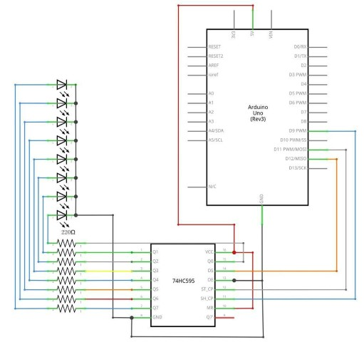

### Conexión

### Esquema

### Diagrama de cableado

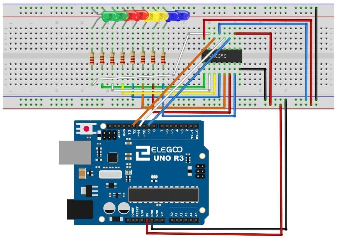

Ya que tenemos ocho LEDs y ocho resistencias para conectar, hay realmente muy pocas conexiones a realizar.

Es probablemente más fácil poner el **chip 74HC595** en primer lugar, como casi todo lo demás se conecta a él. Ponerlo de modo que la muesca en forma de U poco hacia la parte superior de la placa.

Pin 1 del chip es a la izquierda de esta muesca.
Digital 12 del UNO va al pin #14 del registro de desplazamiento
Digital 11 del UNO va al pin #12 del registro de desplazamiento

9 digital a partir de la UNO va al pin #11 del registro de desplazamiento

Todos sino una de las salidas de la IC está en el lado izquierdo del chip. Por lo tanto, para facilitar la conexión, es donde están los LEDs, también.

Después de la viruta, poner las resistencias en su lugar. Usted necesita tener cuidado de que ninguno de los cables de las resistencias tocan. Usted debe comprobar esto otra vez antes de conectar la energía a la ONU. Si le resulta difícil organizar las resistencias sin sus conductores tocando, entonces ayuda a acortar los cables que están mintiendo más cercanos a la superficie de la placa.

A continuación, coloque los LEDs en la protoboard. Cuanto más positivo lleva LED debe ser hacia el chip, de cualquier lado de la placa están en.

Conecte los conductores del puente como se muestra arriba. No olvide que va desde el pin 8 del IC a la columna GND de la placa.

Carga el bosquejo aparece un poco más adelante y probar. Cada LED debe encenderse alternadamente hasta que todos los LEDs están encendidos y luego se apagara y el ciclo se repite.

### Código

Después de cableado, por favor, abra el programa en el código de carpeta lección 24 8 LED con 74HC595 y haga clic en UPLOAD para cargar el programa. Ver Lección 2 para más detalles sobre el programa cargar si hay algún error.

Lo primero que hacemos es definir los tres pernos que vamos a utilizar. Estos son los UNO salidas digitales que se conectarán a los pines de datos, reloj y cierre de los 74HC595.

```c
int latchPin = 11;
clockPin int = 9;
int dataPin = 12;
```

A continuación, se define una variable llamada 'leds'. Esto se utiliza para sostener el patrón de que LED actualmente es activado o desactivados. Datos de tipo 'byte' representan números de ocho bits. Cada bit puede estar encendido o apagado, esto es perfecto para realizar un seguimiento de cuáles de nuestros ocho LEDs son on u off.

leds de byte = 0;

La función de **setup** sólo establece los tres pernos que estamos utilizando para ser de salidas digitales.

```c
void setup()
{
  pinMode (latchPin, salida);
  pinMode (dataPin, salida);
  pinMode (clockPin, salida);
}
```

La **función loop** inicialmente apaga todos los LEDs, al darle a los variable 'leds' el valor 0. A continuación, llama 'updateShiftRegister' que enviará el patrón de 'leds' para el registro de desplazamiento para que el LED se apague. Se tratará con 'updateShiftRegister' funcionamiento más adelante.

La función loop hace una pausa de medio segundo y entonces empieza a contar de 0 a 7 usando el bucle 'for' y la variable 'i'. Cada vez utiliza la función de``Arduino`` 'verdadera' para establecer el bit que controla ese LED en la variable 'leds'. A continuación también llama 'updateShiftRegister' para que los leds actualizar para reflejar lo que está en la variable 'leds'.

Hay entonces medio segundo de retraso antes de 'i' se incrementa y se ilumina el LED próximo.

```c
void loop()
{
  LED = 0;
  updateShiftRegister();
  Delay(500);
  for (int i = 0; i < 8; i ++)
    {
      bitSet(leds, i);
      updateShiftRegister();
      Delay(500);
    }
}
```

La función 'updateShiftRegister', en primer lugar se establece la latchPin baja, entonces llama al UNO función 'shiftOut' antes de poner el 'latchPin' alta otra vez. Esto toma cuatro parámetros, los dos primeros son los pines para datos y el reloj respectivamente.

El tercer parámetro especifica que final de los datos que desea iniciar en el. Vamos a empezar con la derecha más poco, que se conoce como el 'Bit menos significativo' (LSB).

El último parámetro es los datos reales para ser cambiado de puesto en el registro de desplazamiento, que en este caso es 'leds'.

```c
void updateShiftRegister()
{
digitalWrite (latchPin, bajo);
shiftOut (dataPin, clockPin, LSBFIRST, leds);
digitalWrite (latchPin, HIGH);
}
```

Si usted deseó dar vuelta a uno de los LED apagado en lugar, llamaría una función similar de``Arduino`` (bitClear) con la variable de 'leds'. Esto ajustará ese poco de 'leds' para ser 0 y entonces sólo necesitará seguir con una llamada a 'updateShiftRegister' para actualizar la actual LED.

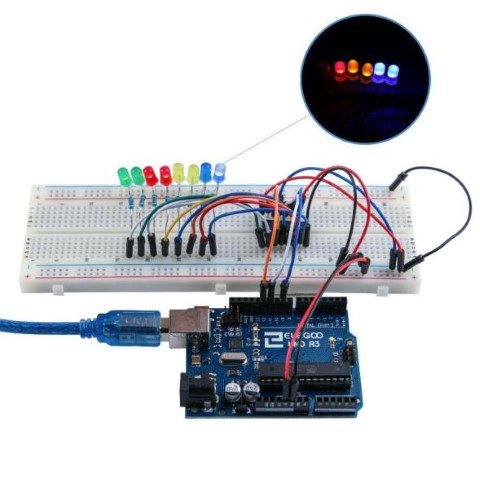

# Interruptor de bola

Los sensores de inclinación (interruptor de bola de inclinación) permiten detectar orientación o inclinación. Son pequeños, económicos, de bajo consumo y fáciles de usar. Si se usan correctamente, no se desgastarán. Su simplicidad los hace populares para los juguetes, los adminículos y los aparatos. A veces, se conocen como "interruptores de mercurio", "interruptores de inclinación" o "sensores de bola rodante" por razones obvias.

## Componentes Requeridos

```
(1) x Placa``Arduino`` UNO
(1) x interruptor de inclinación bola
(2) x F-M wires (cables de hembra a macho DuPont)
```

## Funcionamiento

Se componen generalmente de una cavidad de una cierta clase (cilíndrica es popular, aunque no siempre) con una masa libre conductora adentro, tal como una gota del mercurio o bola rodante. Un extremo de la cavidad tiene dos elementos conductores (polos). Cuando el sensor está orientado de tal manera que dicho extremo está hacia abajo, la masa rueda sobre los polos y los cortocircuitos, actuando como un interruptor de tiro.

Aunque no es tan preciso ni flexible como un acelerómetro completo, los interruptores de inclinación pueden detectar movimiento u orientación. Otro beneficio es que los grandes pueden cambiar de energía por su cuenta. Los acelerómetros, por otro lado, producen voltaje digital o analógico que luego deben analizarse utilizando circuitos extra.

## Conexión

## Esquema

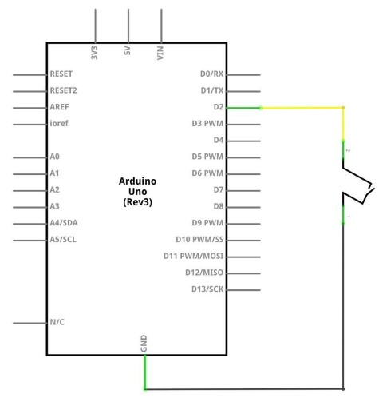

## Diagrama de conexiones

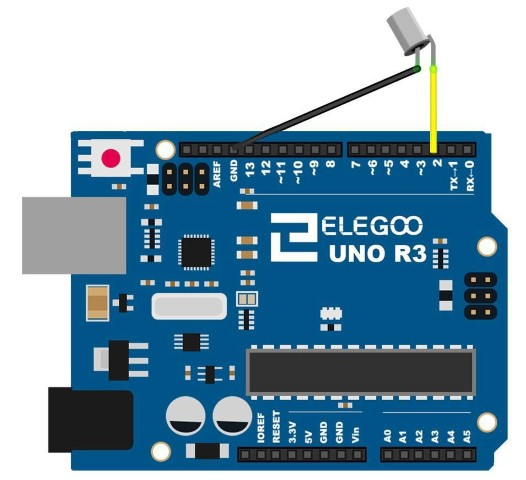

## Código

Después de efectuar el cableado, por favor, abra el programa en el código de carpeta lección 8 interruptor de la bola y haga clic en UPLOAD para cargar el programa. Ver Lección 2 para obtener más información sobre programa cargar si hay algún error.

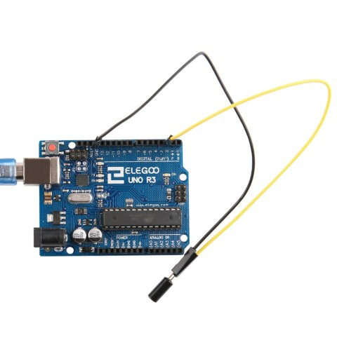

# Boton

En esta lección, aprenderemos a utilizar los botones con entradas digitales para  encender y apagar un LED.

- Al presionar el primer botón se encenderá el LED
- Al pulsar el otro botón se apagará el LED.

## Componentes

Antes de comenzar necesitaremos los siguientes componentes:

| cantidad | componente                |
| -------- | ------------------------- |
| 1        | Placa``Arduino`` UNO      |
| 1        | protoboard                |
| 1        | LED rojo                  |
| 1        | resistencia de 220 ohmios |
| 2        | interruptores             |
| 7        | cables jumper             |

### Pulsadores

Los interruptores son componentes muy simples. Cuando pulse un botón, conectan dos contactos para que la electricidad fluya a través de ellos. Los interruptores de esta lección tienen **cuatro conexiones**, que pueden ser un poco confusas.

En realidad, hay realmente dos conexiones eléctricas.

- Los pines B y C están siempre conectados entre sí, al igual que A y D.
- Al pulsar el botón, se conectan los 4.
- En realidad dos de los pines no los necesitamos

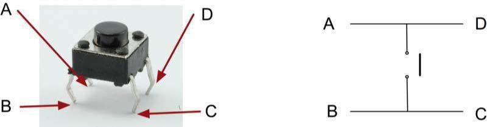

## Esquema de conexión

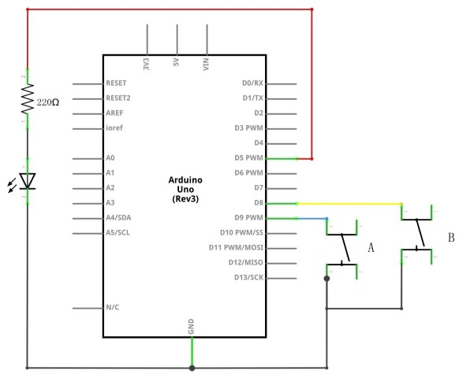

## Diagrama de cableado

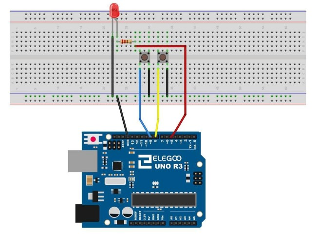

## Las conexiones que vamos a tener que realizar son las siguientes:

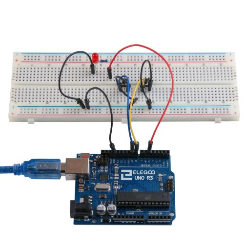

Aunque los cuerpos de los interruptores son cuadrados, los pasadores sobresalen de los lados opuestos del interruptor.

Esto significa que los pines sólo estarán lo suficientemente separados cuando se colocan correctamente en la placa de pruebas.
Recuerde que el LED tiene que tener el cable negativo más corto a la izquierda.

## Explicación del código

- Pulsando el botón izquierdo se encenderá el **LED**.
- Pulsando el botón derecho apagará.

La primera parte del proyecto define tres variables para las tres patas que se van a utilizar. El 'ledPin' es el pin de salida y 'pinBotonA' se refiere al interruptor más cerca de la parte superior de la placa y 'buttonBpin' para el otro interruptor.

La función de **setup** define el ledPin como una salida normal, pero ahora tenemos las dos entradas para ocuparse.

En este caso, utilizamos el conjunto el pinMode ser **INPUT_PULLUP** como este:

- El modo pin de **INPUT_PULLUP** significa que el pin debe ser utilizado como una entrada, pero que si nada mas se conecta a la entrada, la entrada tendra el valor **HIGH**.
- En otras palabras, el valor predeterminado de la entrada es **HIGH**, a menos que se ponga a **LOW** al pulsar el botón.

# Conexión a tierra

Por esta razón los interruptores están conectados a tierra. Cuando un interruptor se presiona, se conecta la clavija de entrada a la tierra, para que ya no es alta.

Puesto que la entrada es normalmente alta y va sólo baja cuando se pulsa el botón, la lógica es un poco boca abajo. Nosotros nos encargaremos de esto en la **función loop**

# Función Loop

En la **función loop** hay dos declaraciones de 'si'. Uno para cada botón. Cada uno hace un 'digitalRead' en la entrada adecuada.

Recuerde que si se presiona el botón, la entrada correspondiente será baja, si el botón A es bajo, entonces  **digitalWrite** pone el valor HIGH el PIN al que tenemos conectado el LED, y este se enciende.

## Código completo

```c linenums="1" title="pruebaBoton.ino"
int ledPin = 5; //pin a que hemos conectado el LED
int pinBotonA = 9; //pin al que hemos conectado el boton A
int pinBotonB = 8; //pin al que hemos conectado el boton B

void setup()
{
  pinMode(ledPin, OUTPUT);
  pinMode(pinBotonA, INPUT_PULLUP);
  pinMode(pinBotonB, INPUT_PULLUP);
}

void loop()
{
  if (digitalRead(pinBotonA) == LOW)
  {
    digitalWrite(ledPin, HIGH);
  }
  if (digitalRead(pinBotonB) == LOW)
  {
    digitalWrite(ledPin, LOW);
  }
}
```
# Joystick analógico

Los joysticks analógicos pueden detectar movimientos en múltiples direcciones y con diferentes niveles de intensidad. Esto se logra mediante sensores que registran la posición y la fuerza aplicada al joystick.


## Pines del Joystick

Necesitamos 5 conexiones entre el joystick y la placa``Arduino``.

Los pines a conectar son:

- ``Sel`` (Selección): Este pin es el botón de selección o pulsador del joystick.
Conéctalo a un pin digital en tu Arduino (por ejemplo, pin 2).
- ``Y`` (Eje Y): Este pin proporciona una salida analógica que varía según el movimiento del joystick en el eje Y (arriba y abajo). Conéctalo a uno de los pines analógicos en tu Arduino (por ejemplo, A0).
- ``X`` (Eje X): Este pin proporciona una salida analógica que varía según el movimiento del joystick en el eje X (izquierda y derecha). Conéctalo a otro pin analógico en tu Arduino (por ejemplo, A1).
- ``Voltaje``: Este pin suministra el voltaje de alimentación para el joystick.
Conéctalo a la fuente de alimentación de 5V en tu Arduino.
- ``Tierra``: Este pin se conecta a tierra (GND) para completar el circuito.
Conéctalo al pin de tierra (GND) en tu Arduino.

Tenemos que usar pines``Arduino`` **analógicos** para leer los datos de los pines que reconocen el movimiento X / Y (vertical y horizontal), puesto que puedo tener diferentes valores (por ejemplo, moverse más rápido o lento).


En cambio, para detectar si pulsamos o no el botón, es suficiente un pin **digital**, puesto que solo tendremos dos valores (pulsado o no pulsado).

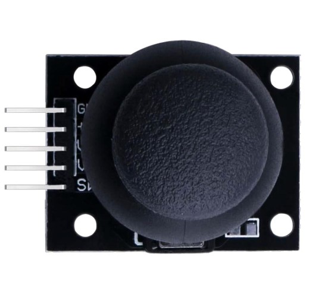

## Esquema

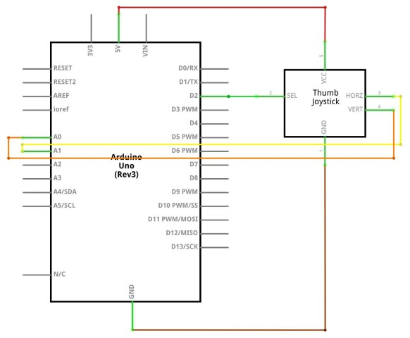

## Diagrama de cableado

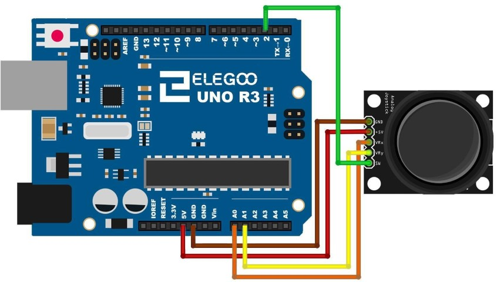

## Código

```c
//``Arduino`` pin numbers
const int SW_pin = 2; // digital pin connected to switch output
const int X_pin = 0; // analog pin connected to X output
const int Y_pin = 1; // analog pin connected to Y output

void setup() {
  pinMode(SW_pin, INPUT);
  digitalWrite(SW_pin, HIGH);
  Serial.begin(9600);
}

void loop() {
  Serial.print("Switch:  ");
  Serial.print(digitalRead(SW_pin));
  Serial.print("\n");
  Serial.print("X-axis: ");
  Serial.print(analogRead(X_pin));
  Serial.print("\n");
  Serial.print("Y-axis: ");
  Serial.println(analogRead(Y_pin));
  Serial.print("\n\n");
  delay(500);
}
```

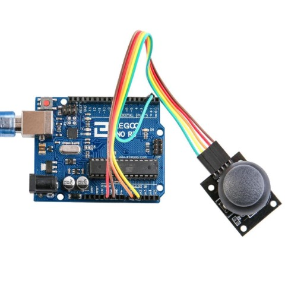

## Comprobar funcionamiento

Haga clic en el Serial Monitor botón para encender el monitor serie. Se introducen los conceptos básicos sobre el monitor serial en detalles en la lección 1.


El rango de valores va de 0 a 1024.

# Módulo de receptor IR

## Resumen

Los **mandos a distancia** infrarrojos son simples y fáciles de usar. En este tutorial nos conectando el receptor IR para el UNO y luego usaremos una **librería** que fue diseñada para este sensor en particular.

En nuestro dibujo tenemos todos los códigos de IR Hexadecimal que están disponibles en este control remoto, también detectará si el código fue reconocido y también si estamos manteniendo pulsada una tecla

### Componentes necesarios

```
(1) x Elegoo Uno R3
x IR modulo receptor
x IR control remoto
x F-M cables (cables de hembra a macho DuPont)ç
```

### Detectores IR vs fotocélulas

Los detectores infrarrojos y las fotocélulas tienen diferentes características y usos específicos.

Los ``detectores infrarrojos`` están diseñados para detectar la luz infrarroja y están configurados para recibir señales moduladas en 38 KHz, como las señales de control remoto. Los detectores infrarrojos tienen una ``salida digital`` que indica si se detecta o no una señal de IR

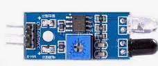

Por otro lado, las ``fotocélulas`` pueden detectar luz visible en el espectro amarillo/verde y no están diseñadas específicamente para detectar luz infrarroja. Las fotocélulas actúan como resistencias y ``cambian su resistencia`` en función de la cantidad de luz a la que están expuestas.

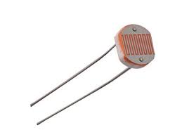

## ¿Qué podemos medir?

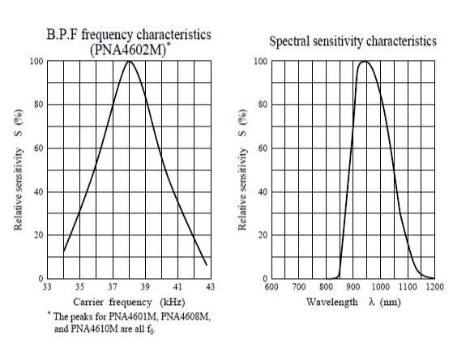

Como se puede ver en estos gráficos de hoja de datos, la detección de frecuencia de peak es a 38 KHz y el pico color del LED es de 940 nm. Se puede usar desde unos 35 KHz kHz 41 pero la sensibilidad se desprenderá para que no detecte asídesde lejos. Asimismo, puede utilizar LEDs de 850 a 1100 nm pero no funcionan tan bien como 900 a 1000nm asíque asegúrese de obtener coincidencia de LEDs! Compruebe la ficha técnica para su IR LED verificar la longitud de onda.

## Esquema de conexiones

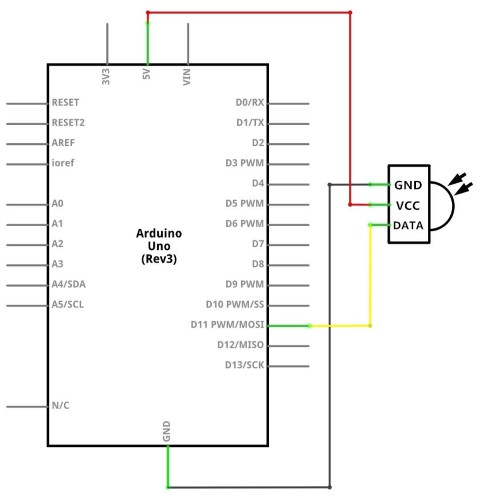

## Diagrama de cableado

Hay 3 conexiones para el receptor de infrarrojos.

Las conexiones son: señal, voltaje y tierra.

- El "-" es la tierra
- "S" es señal
- El del medio corresponde a 5V.

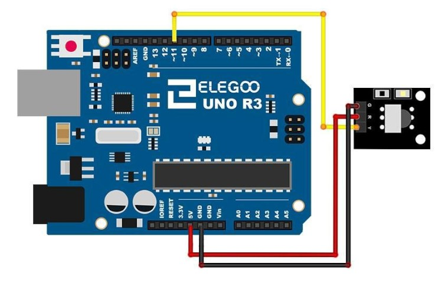

## Montaje

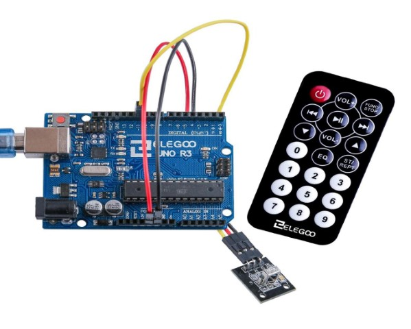

### Código

```c
#include "IRremote.h"

int receiver = 11; // Signal Pin of IR receiver

/*--( Declare objects )--*/
IRrecv irrecv(receiver);     // create instance of 'irrecv'
decode_results results;      // create instance of 'decode_results'

void translateIR()
{

  switch(results.value)

  {
  case 0xFFA25D: Serial.println("POWER"); break;
  case 0xFFE21D: Serial.println("FUNC/STOP"); break;
  case 0xFF629D: Serial.println("VOL+"); break;
  case 0xFF22DD: Serial.println("FAST BACK");    break;
  case 0xFF02FD: Serial.println("PAUSE");    break;
  case 0xFFC23D: Serial.println("FAST FORWARD");   break;
  case 0xFFE01F: Serial.println("DOWN");    break;
  case 0xFFA857: Serial.println("VOL-");    break;
  case 0xFF906F: Serial.println("UP");    break;
  case 0xFF9867: Serial.println("EQ");    break;
  case 0xFFB04F: Serial.println("ST/REPT");    break;
  case 0xFF6897: Serial.println("0");    break;
  case 0xFF30CF: Serial.println("1");    break;
  case 0xFF18E7: Serial.println("2");    break;
  case 0xFF7A85: Serial.println("3");    break;
  case 0xFF10EF: Serial.println("4");    break;
  case 0xFF38C7: Serial.println("5");    break;
  case 0xFF5AA5: Serial.println("6");    break;
  case 0xFF42BD: Serial.println("7");    break;
  case 0xFF4AB5: Serial.println("8");    break;
  case 0xFF52AD: Serial.println("9");    break;
  case 0xFFFFFFFF: Serial.println(" REPEAT");break;

  default:
    Serial.println(" other button   ");

  }// End Case

  delay(500); // Do not get immediate repeat

} //END translateIR
void setup()   /*-( SETUP: RUNS ONCE )-*/
{
  Serial.begin(9600);
  Serial.println("IR Receiver Button Decode");
  irrecv.enableIRIn(); // Start the receiver

}/*--(end setup )*/

void loop()   /*-( LOOP: RUNS CONSTANTLY )-*/
{
  if (irrecv.decode(&results)) // have we received an IR signal?

  {
    translateIR();
    irrecv.resume(); // receive the next value
  }
}/* --(end main loop )-- */
```
## Visualizar datos en el monitor

Haga clic en el botón **Serial Monitor** para encender el monitor serie. De este modo podremos ir viendo los valores recibidos.

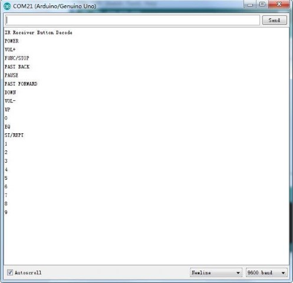

# Relé

Un relé es un **interruptor** operado **eléctricamente**. Muchos relés utilizan un electroimán para operar mecánicamente un interruptor, pero otros principios de funcionamiento también se utilizan como relés de estado sólidos.

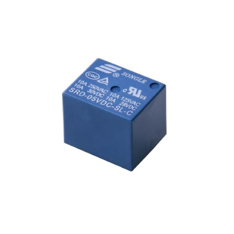

### Relé

### Usos

Los relés se utilizan donde es necesario un circuito de control por una señal de baja potencia (con aislamiento eléctrico total entre el control y los circuitos controlados), o donde varios circuitos deben ser controlados por una señal.

En los sistemas modernos de energía eléctrica, estas funciones son realizadas por instrumentos digitales llamados "relés de protección".

## Relé con motor de coche en``Arduino``

A continuación es el esquema de cómo relé de coche con``Arduino``.

Puede ser complicado insertar el relé en la protoboard. Tienes que doblar una de las patillas del relé un poco para poder insertarlo

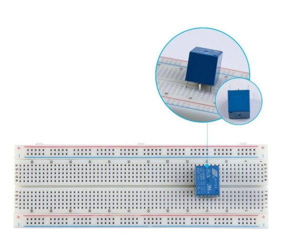

### Conexión

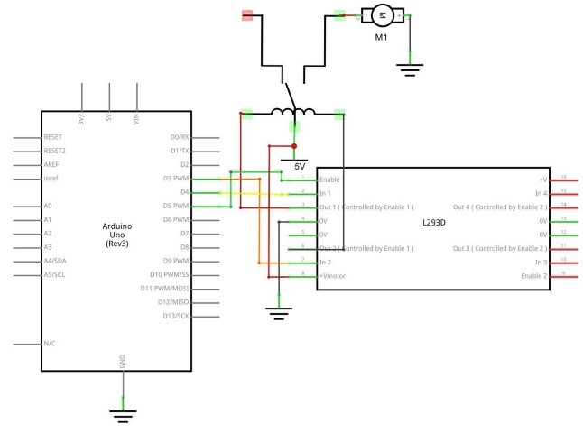

### Esquema


### Diagrama de cableado

### Código

### Montaje real

Programa de carga, después de encender todos los interruptores de potencia. El relé a recoger con un sonido de timbre. Entonces, el motor girará. Después de un período de tiempo, se liberará el relé y el motor se detiene.

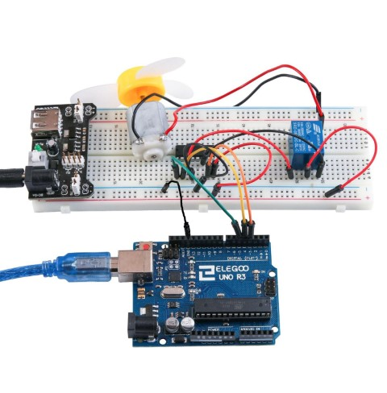

### Código fuente

```c
#define ENABLE 5
#define DIRA 3
#define DIRB 4

int i;

void setup() {
  //set pin direction
  pinMode(ENABLE,OUTPUT);
  pinMode(DIRA,OUTPUT);
  pinMode(DIRB,OUTPUT);
  Serial.begin(9600);
}

void loop() {

//back and forth example
    Serial.println("One way, then reverse");
    digitalWrite(ENABLE,HIGH); // enable on
    for (i=0;i<5;i++) {
    digitalWrite(DIRA,HIGH); //one way
    digitalWrite(DIRB,LOW);
    delay(750);
    digitalWrite(DIRA,LOW);  //reverse
    digitalWrite(DIRB,HIGH);
    delay(750);
  }
  digitalWrite(ENABLE,LOW); // disable
    delay(3000);
      for (i=0;i<5;i++) {
    digitalWrite(DIRA,HIGH); //one way
    digitalWrite(DIRB,LOW);
    delay(750);
    digitalWrite(DIRA,LOW);  //reverse
    digitalWrite(DIRB,HIGH);
    delay(750);
  }
    digitalWrite(ENABLE,LOW); // disable
    delay(3000);
}

```

# Sensors

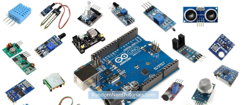

Els sensors d'Arduino són dispositius que permeten a una placa Arduino detectar i mesurar diferents **variables** del seu entorn. Aquests sensors poden mesurar coses com la temperatura, la humitat, la llum, la pressió, el moviment, el so, la proximitat, entre d'altres.

Els sensors són un component clau en molts projectes d'Arduino i són utilitzats per recollir dades del món físic per a ser processats per la placa Arduino.

- Ultrasons
- Llum (fotocèlula)
- Humitat i temperatura

## Sensor humedad temperatura DHT11

En este tutorial vamos a aprender cómo usar un sensor de humedad y temperatura **DHT11**. El sensor digital de temperatura y humedad **DHT11** es un sensor que nos proporciona información de  de la temperatura y la humedad.

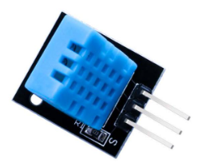

### Parámetros del sensor

Cualquier magnitud que queramos leer tendrá unas ``características`` de precisión, según el sensor o instrumento que lo mide.

### Humedad relativa

- Resolución: 16 bits
- Repetibilidad: ±1% H.R.
- Precisión: 25 ° C ±5% hr
- Intercambiabilidad: intercambiables
- Tiempo de respuesta: 1 / e (63%) de 25º c 6s
- 1m / s de aire 6s
- Histéresis: < ± 0.3% RH
- Estabilidad a largo plazo: < ± 0.5% hr / año en

### Temperatura

| Magnitud             | Valor           |
| -------------------- | --------------- |
| Resolución:          | 16 bits         |
| Repetibilidad:       | ±0. 2 ° C       |
| Rango:               | 25 ° C ±2° c    |
| Tiempo de respuesta: | 1 / e (63%) 10S |

### Características eléctricas

Para funcionar, el sensor necesita corriente eléctrica.

| Magnitud                | Valor                          |
| ----------------------- | ------------------------------ |
| Fuente de alimentación: | DC 3.5 ~ 5.5V                  |
| Corriente:              | medición 0.3mA (60μA en espera |
| Periodo de muestreo:    | más de 2 segundos              |

### Descripción de pines

El sensor dispone de 3 pines para recibir corriente eléctrica y comunicarse con la placa arduino. Estos pines son:

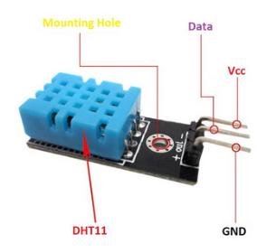

|      |                                                    |
| ---- | -------------------------------------------------- |
| VDD  | Lo conectaremos a 5 V                              |
| DATA | Lo conectaremos a un pin de datos. En este caso D2 |
| GND  | Lo conectaremos a tierra                           |

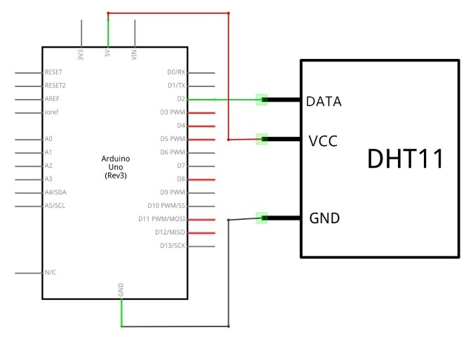

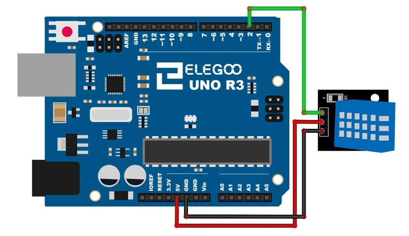

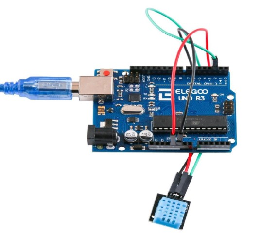

### Código

El siguiente código va a utilizar el sensor que hemos conectado para leer la temperatura y la humedad que está midiendo el sensor.

```c title="sensorHumedadytemperatura.ino"
#include <dht_nonblocking.h>
#define DHT_SENSOR_TYPE DHT_TYPE_11

static const int DHT_SENSOR_PIN = 2;
DHT_nonblocking dht_sensor( DHT_SENSOR_PIN, DHT_SENSOR_TYPE );

void setup( )
{
  Serial.begin( 9600);
}

static bool medir ( float *temperature, float *humidity )
{
  static unsigned long measurement_timestamp = millis( );

  /* Measure once every four seconds. */
  if( millis( ) - measurement_timestamp > 3000ul )
  {
    if( dht_sensor.measure( temperature, humidity ) == true )
    {
      measurement_timestamp = millis( );
      return( true );
    }
  }

  return( false );
}

void loop( )
{
  float temperature;
  float humidity;

  if( medir( &temperature, &humidity ) == true )
  {
    Serial.print( "T = " );
    Serial.print( temperatura, 1 );
    Serial.print( " deg. C, H = " );
    Serial.print( humedad, 1 );
    Serial.println( "%" );
  }
}
```

### Salida en el monitor

Los valores medidos se mostrarán por pantalla en el monitor serie. El monitor serie lo tenemos que abrir desde el IDE de arduino.

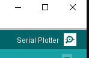

A continuación se nos abrirá una pantalla en la que podremos ver los datos que nuestro programa está escribiendo.

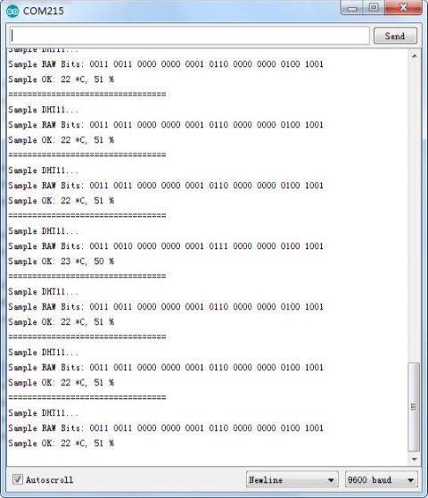

## Sensor luz (fotocelula)

### Resumen

Vamos a aprender como medir la intensidad de la luz utilizando una entrada analógica. Con lo que aprenderemos, podremos posteriormente utilizar el nivel de luz para controlar el apagar un LED o encenderlo cuando no haya luz, por ejemplo.

Los componentes que utilizaremos son los siguientes:

- [x] Elegoo Uno R3
- [x] Protoboard
- [x] LEDs
- [x] Resistencias de 220 ohmios
- [x] Resistencia de 1 kohm (1000 ohms)
- [x] 1 x fotoresistor o LDR (fotocélula)
- [x] 16 x M M cables (cables de puente de macho a macho)

### Fotocélula

Una fotorresistencia o **LDR** (por sus siglas en inglés “light-dependent resistor”) es un componente electrónico cuya resistencia varía en función de la luz. Se trata de un sensor que actúa como una resistencia variable en función de la luz que capta.

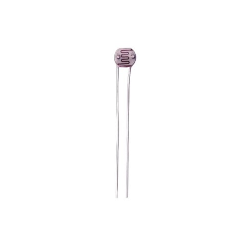

Esta tiene una resistencia de cerca de 50 kΩ en cerca de oscuridad y Ω 500 en luz brillante. Para convertir este valor variable de la resistencia en algo que podemos medir en la entrada analógica de la Junta de un R3 de UNO, debe ser convertida en un voltaje.

La forma más sencilla de hacerlo es combinar con una resistencia fija.

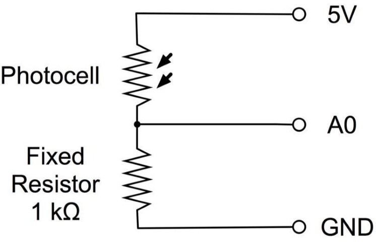

La resistencia y fotocélula junto se comportan como una sola. Cuando la luz es muy brillante, entonces la resistencia de la fotocélula es muy baja en comparación con la resistencia de valor fijo, y asíes como si el bote se dio vuelta a máximo.

Cuando la fotocélula está en una luz apagada, la resistencia es mayor que la resistencia fija de 1 kΩ y es como si el recipiente estuviera girando hacia GND. Cargue el croquis dado en la siguiente sección y trate de cubrir la fotocélula con el dedo y, a continuación, sosténgalo cerca de una fuente de luz.

### Conexión

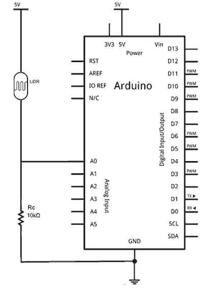

### Diagrama de cableado

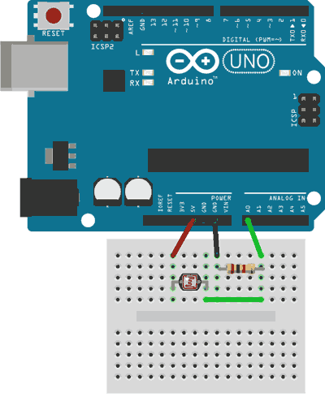

### Código para leer valor de un LDR

```c
int sensorPin = A0; // select the input pin for LDR

int sensorValue = 0; // variable to store the value coming from the sensor
void setup() {
   Serial.begin(9600); //sets serial port for communication
}
void loop() {
   sensorValue = analogRead(sensorPin); // read the value from the sensor
   Serial.println(sensorValue); //prints the values coming from the sensor on the screen
   delay(100);
}
```

### Código encender un LED cuando la luz es baja

Encender LED cuando la luz es baja y viceversa.

- Para ello, deberemos colocar un LED en el pin 13, con su correspondiente resistencia.
- El umbral es el valor a partir del cual vamos a decidir si encender la bombilla o no
- En este caso está fijado a **100 Ω**.

```c
const int LEDPin = 13;
const int LDRPin = A0;
const int umbral = 100;

void setup() {
   pinMode(LEDPin, OUTPUT);
   pinMode(LDRPin, INPUT);
}

void loop() {
   int input = analogRead(LDRPin);
   if (input > umbral) {
      digitalWrite(LEDPin, HIGH);
   }
   else {
      digitalWrite(LEDPin, LOW);
   }
}
```

Lo mismo, pero con un valor de umbral fijado por nosotros.

```c
const long A = 1000;     //Resistencia en oscuridad en KΩ
const int B = 15;        //Resistencia a la luz (10 Lux) en KΩ
const int Rc = 10;       //Resistencia calibracion en KΩ
const int LDRPin = A0;   //Pin del LDR

int V;
int ilum;

void setup()
{
   Serial.begin(115200);
}

void loop()
{
   V = analogRead(LDRPin);

   //ilum = ((long)(1024-V)*A*10)/((long)B*Rc*V);  //usar si LDR entre GND y A0
   ilum = ((long)V*A*10)/((long)B*Rc*(1024-V));    //usar si LDR entre A0 y Vcc (como en el esquema anterior)

   Serial.println(ilum);
   delay(1000);
}
```

## Sensor ultrasonico

El **sensor ultrasónico** es ideal para todo tipo de proyectos que necesitan medidas de distancia, como por ejemplo evitar obstáculos.

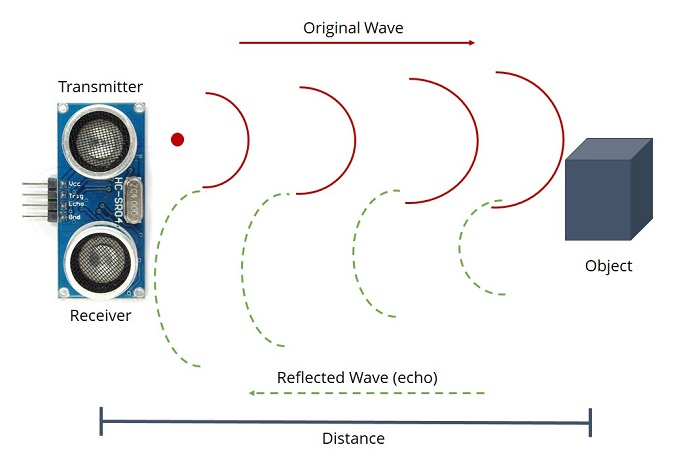

El sensor que utilizaremos se llama ``HC-SR04``  e incorpora una **librería** diseñada  específicamente para estos sensores.

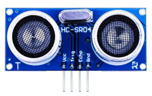

### Componentes necesarios

Para hacer una prueba sencilla de funcionamiento del sensor, necesitaremos:

```
(1) x Placa``Arduino`` UNO
(1) x Módulo de sensor ultrasónico
(4) x F M cables (cables de hembra a macho DuPont)
```

### Características técnicas

El módulo **HC-SR04** del sensor ultrasónico nos permite medir distancias entre 2 cm y 400 cm, con una precisión que varía puede alcanzar los 3 mm.

El principio básico del trabajo es el siguiente:

- Dispara una señal de nivel alto de al menos 10us
- El Módulo envía automáticamente ocho señales de 40 kHz y detecta si hay una señal de retorno, por rebotar en alguna superficie.
- Esta señal de retorno dependerá de la distancia recorrida y, por tanto, de la distancia.

### ¿Cómo calcula la distancia?

La distancia recorrida se podría calcular en función de:

- La **velocidad** del sonido
- El **tiempo** que tardará en ir y volver realmente es el doble de la distancia que hay al objeto.

La formula que nos daría la distancia recorrida podría ser:

```math
distancia = (tiempo  * 340 ) / 2
```

El diagrama de sincronización se muestra a continuación. Sólo tiene que suministrar un pulso de 10us corto a la entrada de activación para iniciar el rango, y luego el módulo enviará una ráfaga de 8 ciclos de ultrasonido a 40 kHz y aumentar su eco. El Echo es un objeto de distancia que es el ancho de pulso y el rango en proporción.

Se puede calcular el rango a través del intervalo de tiempo entre la señal de disparo de envío y la señal de eco de recepción. La fórmula es la siguiente:

```
Fórmula centímetros: us / 58 = centímetros
Pulgadas:  us / 148 = inch; O: el rango = tiempo de alto nivel * velocidad (340M / S) / 2;
```
Sugerimos utilizar más de 60ms de ciclo de medición, con el fin de evitar la señal de disparo a la señal de eco.

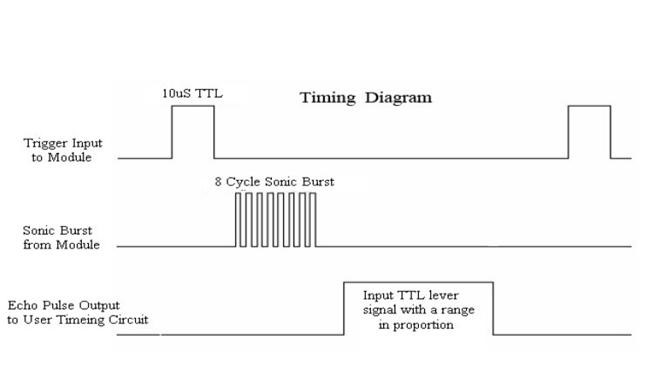

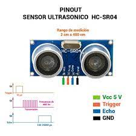

### Conexión

Aquí podemos ver como conectar los cuatro pines del sensor al``Arduino`` Uno.

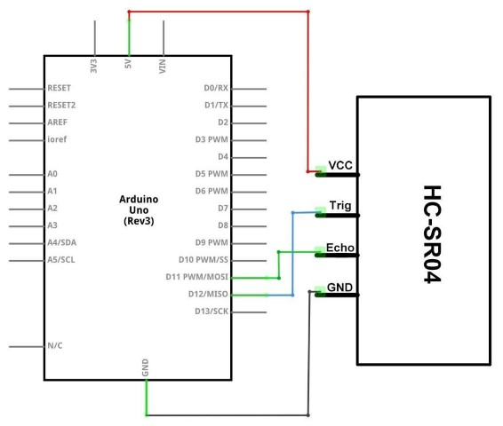

### Diagrama de cableado

El diagrama de cableado es el siguiente. Recordad que utilizamos en general rojo para cables conectados a 5V y negro para 0V o tierra (GND).

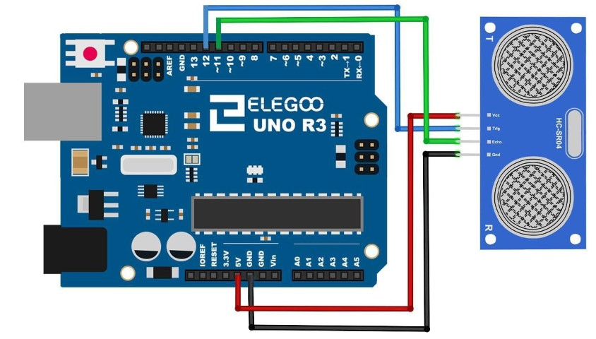

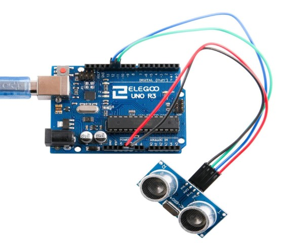

### Código

Necesitaremos una **librería** para poder utilizar algunas funciones y comunicarnos con el sensor. Para ello, deberemos de incluirla en nuestro proyecto, de la siguiente forma:

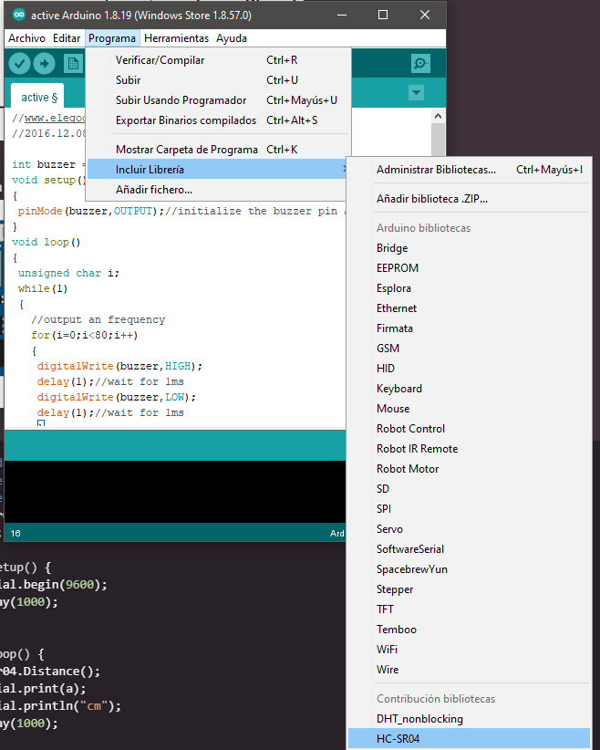

Una vez incluída, ya la podemos utilizar en nuestro programa.

Vamos a utilizar el monitor serie para mostrar los datos por pantalla, por lo menos mientras probamos el programa.

```c

#include "SR04.h" //la librería a utilizar
#define TRIG_PIN 12 //pines donde conectamos
#define ECHO_PIN 11

SR04 sr04 = SR04(ECHO_PIN,TRIG_PIN);
long distancia;

void setup() {
   Serial.begin(9600);
   delay(1000);
}

void loop() {
   distancia=sr04.Distance(); //Devuelve la distancia en Cm.
   Serial.print(distancia);
   Serial.println("cm");
   delay(1000); //Esperaremos 1s entre mediciones
}

```

Abriendo el monitor y podemos ver los datos que vamos imprimiendo desde el programa

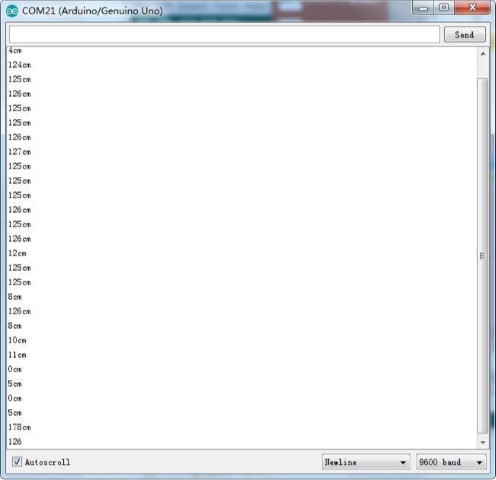

## Termistor

Un **termistor** es un resistor térmico - un resistor que cambia su resistencia con la temperatura. Técnicamente, los resistores son termistores - sus cambios de resistencia con temperatura - pero el cambio es generalmente muy pequeño y difícil de medir.

### Tipos de termistores

Hay dos clases de termistores:

- NTC (coeficiente de temperatura negativo)
- PTC (coeficiente positivo de temperatura).

En general, usaremos sensores **NTC** para medir la temperatura.

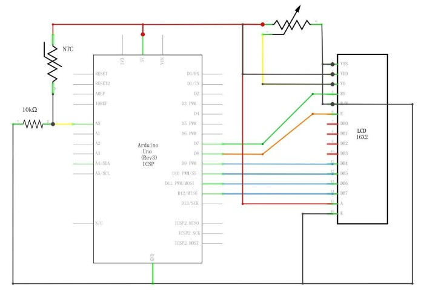

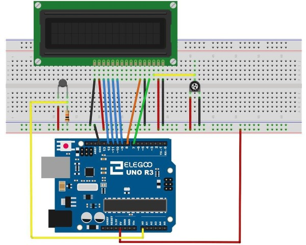

### Código

Antes de ejecutar esto, asegúrese de que ha instalado la **librería** <LiquidCrystal> o volver a instalarlo, si es necesario. De lo contrario, el código no funcionará.

Es útil poner una línea de comentario sobre el comando 'lcd'.

BSED4D5D6D7

LiquidCrystal lcd (7, 8, 9, 10, 11, 12);

Esto facilita las cosas si decides cambiar que utilizas los pernos.

En la **función loop** ahora hay dos cosas interesantes sucediendo. En primer lugar tenemos que convertir la analógica del sensor de temperatura una temperatura real, y en segundo lugar tenemos que encontrar la manera a los mismos.

En primer lugar, echemos un vistazo a cálculo de la temperatura.

```c
int tempReading = analogRead(tempPin);
doble tempK = log (10000.0 * ((1024.0/tempReading - 1)));
tempK = 1 / (0.001129148 + (0.000234125 + (0.0000000876741 * tempK * tempK)) * tempK);
float tempC = tempK - 273.15;
floatfloat tempF = (tempC * 9.0) / 5.0 + 32.0;
```

Cambio lecturas se muestra en una pantalla LCD puede ser complicado. El principal problema es que la lectura puede no ser siempre el mismo número de dígitos. Por lo tanto, si la temperatura cambia de 101,50 a 99.00 entonces el dígito adicional de la lectura antigua es en peligro de quedar en la pantalla.

Para evitar esto, escriba la línea de la pantalla LCD cada vez el bucle.

```c
lcd.setCursor (0, 0);
LCD.Print ("Temp C");
lcd.setCursor (6, 0);
LCD.Print(tempF);
```

El comentario bastante extraño sirve para recordarles de las 16 columnas de la pantalla. Luego puede imprimir una cadena de esa longitud con espacios donde irá la lectura real.

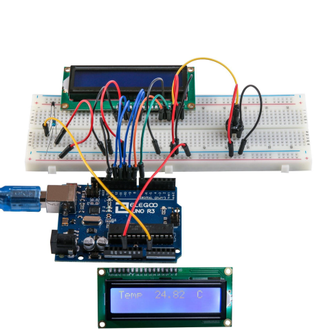

Para rellenar los espacios en blanco, establecer la posición del cursor por donde la lectura debe aparecer y luego imprimirlo.

# ESP8266 NodeMCU

El ``ESP8266 NodeMCU`` es una plataforma de hardware y software open source que permite a los usuarios crear dispositivos conectados a Internet con funciones de red WiFi de forma rápida y fácil.

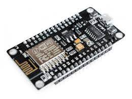

L'``ESP8266`` és un xip ``Wi-Fi`` de baix cost que s'utilitza àmpliament en projectes de bricolatge i aplicacions ``IoT``. El NodeMCU és una placa de desenvolupament popular basada en l'ESP8266, que proporciona una manera senzilla de prototipar i desenvolupar projectes amb aquest xip.

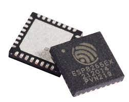

## Componentes


## Aplicaciones principales

- Dispositivos domésticos inteligentes
- Dispositivos IoT
- Wearables
- Juguetes conectados
- Sistemas de seguridad
- Termostatos
- Sistemas de rociadores
- Controles remotos
- Iluminación automatizada

## Código fuente

```c
/*
 * ESP8266 NodeMCU LED Control over WiFi Demo
 *
 * https://circuits4you.com
 */
#include <ESP8266WiFi.h>
#include <WiFiClient.h>

//ESP Web Server Library to host a web page
#include <ESP8266WebServer.h>

//---------------------------------------------------------------
//Our HTML webpage contents in program memory
const char MAIN_page[] PROGMEM = R"=====(
<!DOCTYPE html>
<html>
<body>
<center>
<h1>WiFi LED on off demo: 1</h1><br>
Ciclk to turn <a href="ledOn">LED ON</a><br>
Ciclk to turn <a href="ledOff">LED OFF</a><br>
<hr>
<a href="https://circuits4you.com">circuits4you.com</a>
</center>

</body>
</html>
)=====";
//---------------------------------------------------------------
//On board LED Connected to GPIO2
#define LED 2

//SSID and Password of your WiFi router
const char* ssid = "BONDIATOTLODIA";
const char* password = "UHYD6VRg";

//Declare a global object variable from the ESP8266WebServer class.
ESP8266WebServer server(80); //Server on port 80

//===============================================================
// This routine is executed when you open its IP in browser
//===============================================================
void handleRoot() {
 Serial.println("You called root page");
 String s = MAIN_page; //Read HTML contents
 server.send(200, "text/html", s); //Send web page
}

void handleLEDon() {
 Serial.println("LED on page");
 digitalWrite(LED,LOW); //LED is connected in reverse
 server.send(200, "text/html", "LED is ON"); //Send ADC value only to client ajax request
}

void handleLEDoff() {
 Serial.println("LED off page");
 digitalWrite(LED,HIGH); //LED off
 server.send(200, "text/html", "LED is OFF"); //Send ADC value only to client ajax request
}
//==============================================================
//                  SETUP
//==============================================================
void setup(void){
  Serial.begin(115200);

  Serial.println("");
  Serial.println(ssid);
  Serial.println(password);

  WiFi.begin(ssid, password);     //Connect to your WiFi router

  //Onboard LED port Direction output
  pinMode(LED,OUTPUT);
  //Power on LED state off
  digitalWrite(LED,HIGH);

  // Wait for connection
  while (WiFi.status() != WL_CONNECTED) {
    delay(500);
    Serial.print(".");
  }

  //If connection successful show IP address in serial monitor
  Serial.println("");
  Serial.print("Connected to ");
  Serial.println(ssid);
  Serial.print("IP address: ");
  Serial.println(WiFi.localIP());  //IP address assigned to your ESP

  server.on("/", handleRoot);      //Which routine to handle at root location. This is display page
  server.on("/ledOn", handleLEDon); //as Per  <a href="ledOn">, Subroutine to be called
  server.on("/ledOff", handleLEDoff);

  server.begin();                  //Start server
  Serial.println("HTTP server started");
}
//==============================================================
//                     LOOP
//==============================================================
void loop(void){
  server.handleClient();          //Handle client requests
}
```

## Subida

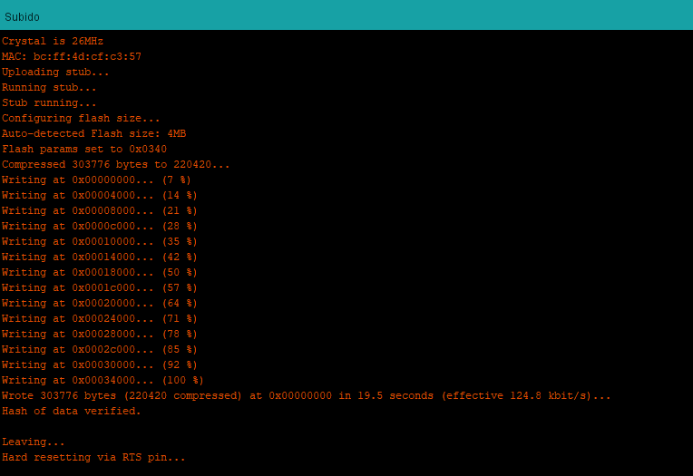

## Salida monitor serie

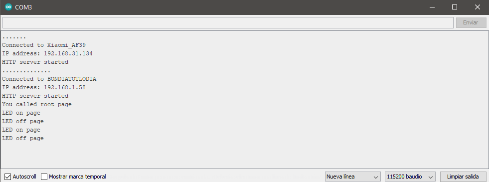

## Wifi bridge

```c
#include <ESP8266WiFi.h>

// Set WiFi credentials
#define WIFI_SSID "YOUR WIFI NETWORK SSID"
#define WIFI_PASS "YOUR WIFI PASSWORD"

// Set AP credentials
#define AP_SSID "ESP8266"
#define AP_PASS "magicword"

void setup()
{
  // Setup serial port
  Serial.begin(115200);
  Serial.println();

  // Begin Access Point
  WiFi.mode(WIFI_AP_STA);
  WiFi.softAP(AP_SSID, AP_PASS);

  // Begin WiFi
  WiFi.begin(WIFI_SSID, WIFI_PASS);

  // Connecting to WiFi...
  Serial.print("Connecting to ");
  Serial.print(WIFI_SSID);
  while (WiFi.status() != WL_CONNECTED)
  {
    delay(100);
    Serial.print(".");
  }

  // Connected to WiFi
  Serial.println();
  Serial.println("Connected!");
  Serial.print("IP address for network ");
  Serial.print(WIFI_SSID);
  Serial.print(" : ");
  Serial.println(WiFi.localIP());
  Serial.print("IP address for network ");
  Serial.print(AP_SSID);
  Serial.print(" : ");
  Serial.print(WiFi.softAPIP());

}

void loop() {
  // put your main code here, to run repeatedly:

}
```

https://siytek.com/esp8266-ap-and-station-mode/

# Projecte WLED

Il·luminació de tira de LED i maneig a travér d'app mòbil mitjançant WiFi

El projecte ``WLED`` és un programari de codi obert que us permet controlar tires LED adreçables mitjançant una interfície web. Es pot instal·lar en diverses plataformes de maquinari, inclosa la placa NodeMCU basada en ESP8266.

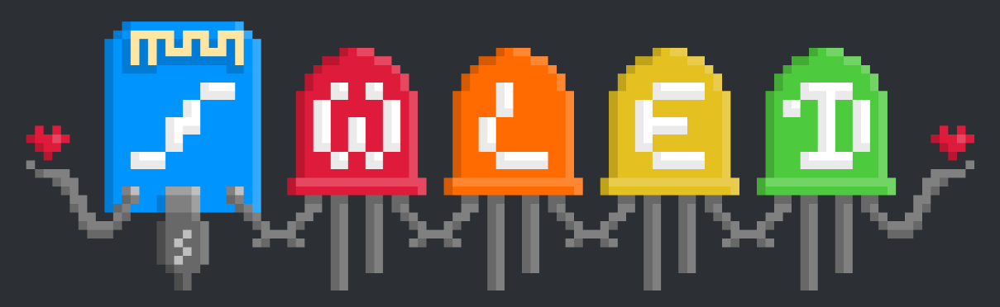

https://kno.wled.ge/

# Instal·lació

Per utilitzar el programari ``WLED`` en una placa NodeMCU, primer heu de flashejar la placa amb el microprogramari WLED. Això es pot fer utilitzant l'IDE d'Arduino o altres eines intermitents.

https://install.wled.me/

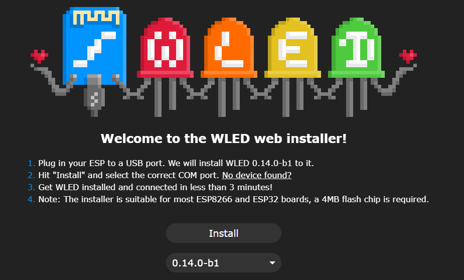

# Connexió de la tira

Un cop instal·lat el microprogramari, podeu connectar la vostra tira de LED a la placa NodeMCU.  Connectarem la tira de led al ``pin D4``.

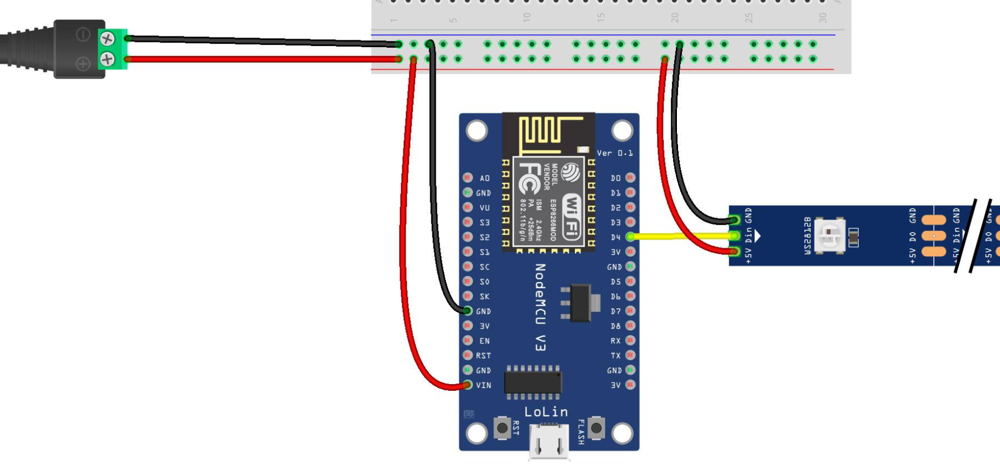

# Programari mòbil

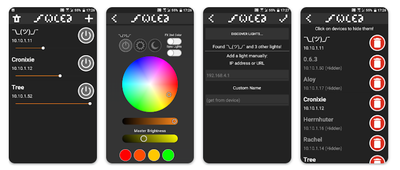

https://play.google.com/store/apps/details?id=com.aircoookie.WLED&hl=es&gl=US&pli=1

# Control

Des del mòbil podrem canviar els colors i els efectes.

