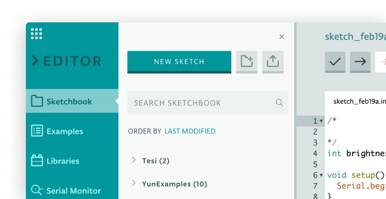
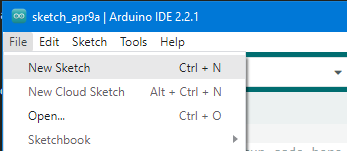
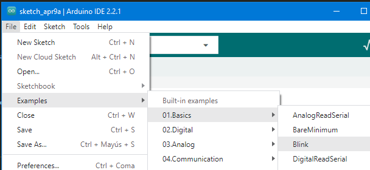

<!--
theme: gaia
_class: lead
-->

# Arduino
Tecnología e Ingeniería I

<!-- _class: invert -->

# Introducción

``Arduino`` es una plataforma de ``hardware libre``, basada en una placa con un microcontrolador y un entorno de desarrollo.

# Hardware libre

- El hardware libre es aquel cuyas especificaciones y diagramas esquemáticos son de acceso público.
- Cualquiera los puede consultar, mejorar y utilizar libremente.


# Placa Arduino

``Arduino Uno`` es una placa de desarrollo que incorpora un ``microcontrolador``. Este microcontrolador puede leer los datos de los sensores que se conectan, realizar algunas operaciones matemáticas y controlar los dispositivos a través de los pines de salida.


# Componentes de la placa

- El conector USB, que nos permite conectar la placa al ordenador.
- Botón de reset, nos permite reiniciar la placa y por tanto el programa que esté grabado en ella.
- Conector de fuente de alimentación, por si quisiéramos alimentar la placa con un adaptador de corriente.
- Pines, que nos servirán para conectarlos a otros componentes electrónicos.

---


---

## Microcontrolador

- Puede ser programado para recibir instrucciones.
- Usuarios pueden ``programar`` la placa para que realice cualquier tarea que deseen
- Controlar motores, iluminar LEDs, leer datos de sensores, etc.

El Arduino Uno utiliza un microcontrolador ``ATmega328P``.


## Características

| Características              | Detalles                                  |
| ---------------------------- | ----------------------------------------- |
| Microcontrolador 🕹️           | ATmega328P                                |
| Arquitectura 🏗️               | AVR (8 bits)                              |
| Frecuencia de Reloj ⏰        | 16 MHz                                    |
| Memoria Flash 💾              | 32 kilobytes                              |
| Memoria RAM 🧠                | 2 kilobytes                               |
| Memoria EEPROM 📂             | 1 kilobyte                                |
| Entradas/Salidas Digitales 🧩 | Sí (pines digitales de E/S)               |
| Entradas Analógicas 📏        | Sí (pines analógicos de E/S)              |
| Comunicación Serial 🔄        | Sí (pines TX/RX para comunicación serial) |

---

Como podemos observar, la capacidad máxima para almacenar programas es de 32 kilobytes, por lo que éste será el tamaño máximo de los programas que podremos volcar sobre la placa.

# Pines

## Concepto

Un "pin" se refiere a un punto de conexión en un dispositivo electrónico que permite la entrada o salida de una señal eléctrica.


## Pines de Arduino

Pines de Alimentación:

- ``Vin`` (Voltage In): Este pin se utiliza para alimentar la placa con un voltaje externo cuando no se está utilizando el puerto USB. La tensión recomendada es de 7 a 12V.
- ``5V``: Este pin proporciona una salida de 5 voltios cuando la placa está alimentada a través del puerto USB o del conector de alimentación externa.
- ``3.3V``: Proporciona una salida de 3.3 voltios.
- ``Pines de Tierra (GND)``: Hay varios pines GND en la placa, que se utilizan como conexiones a tierra.

## Pines de Entrada/Salida Digital (D2 a D13)

- Pueden usarse como entradas o salidas digitales.
- D2 a D13 también pueden utilizarse como salidas PWM (modulación de ancho de pulso) para controlar la intensidad de la señal.

## Pines de entrada/salida analógicos

- Pines Analógicos (A0 a A5)
- Pines de entrada analógica que permiten leer señales analógicas
- Sensores de luz, temperatura, etc.

## Simulación

``Tinkercad Circuits`` es una plataforma en línea que te permite simular y diseñar circuitos electrónicos. Es parte de la suite de herramientas de Autodesk llamada Tinkercad, y es especialmente útil para aprender y experimentar con electrónica sin la necesidad de componentes físicos

https://www.youtube.com/watch?v=VU3fiibAnNY

# IDE

- El **Entorno de desarrollo integrado (IDE) de``Arduino``** es el software de la plataforma``Arduino``.
- https://www.arduino.cc/en/Main/Software



## LED

La placa Arduino cuenta con un LED luminoso que puede ser controlado. Este LED está integrado en la propia placa.


- Cuando la placa se conecta por mediode USB, el LED parpadea.
- Este parpadeo se debe a que las placas suelen ser enviadas con un programa **preinstalado** llamado "Blink".

## Programas de ejemplo

El IDE de ``Arduino`` incluye una gran colección de programas de ejemplo para utilizar directamente.  Esto incluye un ejemplo para hacer el parpadeo del ``LED``.

## Ejemplo programa Blink

Cargar el programa de 'Blink' que encontrarás en el sistema de menús del IDE bajo ``archivo >  ejemplos > 01 conceptos básicos``


## Crear nuevo programa



## Programas de ejemplo



## Blink

Cuando se abre la ventana de dibujo, agrandarla para que puedan ver el dibujo completo en la ventana.


Los ``programas de ejemplo`` incluidos con el IDE de``Arduino`` son de 'sólo lectura'. Es decir, puedes subirlo a Arduino, pedo no se pueden guardar una vez modificados.

## Guardar código en otro archivo

En el menú archivo en el IDE de``Arduino``, seleccione `Guardar como.` y guarde el dibujo con  el nombre ``parpadeo``


A continuación deberemos elegir una carpeta en la que guardar el programa.


## Abrir un archivo de programa

Para abrir un archivo que hemos guardado con anterioridad, podemos simplemente ir a ``archivo > abrir`` o también a ``archivo > abrir reciente``.


## Conectar placa al PC

Conecte la placa de``Arduino`` al ordenador con el cable USB y compruebe que la **Board Type** y **Puerto serie** están ajustados correctamente.


---


## Conexión de la Placa Arduino al Ordenador

Para programar la Placa Arduino mediante el IDE de Arduino, es necesario establecer una conexión física entre la placa y el ordenador.


1. Utilice un ``cable USB`` para conectar la Placa Arduino al puerto USB de su ordenador.
2. Abra el ``IDE de Arduino`` en su ordenador
3. Escriba o cargue el ``programa`` que desea transferir a la placa.
4. Verifique que la Placa Arduino seleccionada en el IDE coincida con el modelo físico que está utilizando. Puede seleccionar la placa desde la pestaña ``"Herramientas" > "Placa"`` en el IDE.
5. Seleccione el puerto COM al que está conectada la Placa Arduino. Esto también se encuentra en la pestaña ``"Herramientas" > "Puerto"`` en el IDE.
6. Haga clic en el botón de carga ("Upload") en el IDE para transferir el programa a la Placa Arduino.


## Puerto

- Seleccionar puerto interno al que está conectada la placa
- Conexión serie (puertos COM)
- Puerto serie (``COM``) puede ser diferente, del tipo COM3 o COM4 en su ordenador.
- IDE de``Arduino`` mostrará la configuración actual


## Subir código a Arduino

Para que Arduino lo ejecute, necesitamos enviarle a través del cable USB el código que queremos que haga.

Para ello, debemos hacer clic en el botón ``subir``. El segundo botón de la izquierda en la barra de herramientas.


## Compilación

- Al cargar el código, al observar el área de estado del IDE, se apreciará una barra de progreso junto con una serie de mensajes.
- Inicialmente, se mostrará el mensaje Compilando


## Subiendo código

Luego, el estado cambiará a 'Subiendo'. LEDs de la Arduino deberían empezar a parpadear, indicando la transferencia.


## Código subido

- Cambio estado a ``done uploading``
- El procesador de Arduino comienza a ejecutar el programa


---

## Errores

El otro mensaje nos dice que el **programa** está utilizando 928 bytes de 32.256 bytes  disponibles. Después de la etapa de compilación Sketch... podría obtener el siguiente mensaje de error:


Puede significar que su Junta no está conectado a todos, o no se ha instalado los drivers (si es necesario) o que se ha seleccionado el puerto serial incorrecto.

# Elementos de un programa

- Lenguaje basado en `C`/`C++`
- Comentarios
- Funciones ``setup`` y ``loop``
- Variables

<!--
_class: invert
-->

# Comentarios

- Explica funcionamiento del programa / notas para desarrolladores.
- Comentario de bloque: entre /* y */ en la parte superior del **programa** es un Comentario de bloque;
- Los comentarios de una sola línea comienzan con // y hasta el final de esa línea se considera un comentario.

## Variables

La primera línea de código es:

```c
int led = 13;
```
Creamos una variable con un nombre y guardamos el número de pin al que el LED está  conectado.

# Funciones principales

- Función ``loop()``
- Función ``setup()``
<!--
_class: invert
-->

## Función ``setup()``

- Función de **configuración inicial**
- Se ejecuta
  - Al presionar el botón de ``reset``
  - Cada vez que la placa Arduino se reinicia
  - Después de cargar un nuevo **programa**.

## Función ``setup()``

- Cada programa``Arduino`` debe tener una función de **setup** (configuración)
- Las ``instrucciones``  se colocan entre las llaves { y }.
- Al final de cada línea o instrucción ``;``

```c
void setup() {
// Inicializa el pin digital como salida.
pinMode(led, OUTPUT);
}
```

## Ejemplo
- En este caso, el comando dentro de la función setup indica a la placa Arduino que el pin LED se usará como salida, según lo señala el comentario.

## Retorno

```c

// Declaración de la función
int suma(int a, int b) {
    int resultado = a + b;
    return resultado;
}
```

## Void

```c
void setup() {
  // Inicializa el pin digital como salida.
  pinMode(led, OUTPUT);
}
```

## Función ``loop()``

- Obligatorio
- Ejecución después de ``setup()``
- Se repite indefinidamente

## Explicación ``loop()``

```c
void loop() {
  digitalWrite(led, HIGH); // Encienda el LED (alto es el nivel de voltaje)
  delay(1000); // Espere un segundo
  digitalWrite(led, LOW); // Apagar el LED por lo que la tensión baja
  delay(1000); // Espere un segundo
}
```

Dentro de la función **loop**, los comandos en primer lugar activar el pin del LED (alto), girar a 'retraso' de 1000 milisegundos (1 segundo), entonces el pin LED apagado y pausa para  otro segundo.

## Cambiar la frecuencia de parpadeo


Ahora vas a que el LED parpadee más rápido. Como puede haber adivinado, la clave de esto radica en cambiar el parámetro () para el comando ``delay``.

## Variar retardo

Este período de retardo en milisegundos, así que si desea que el LED parpadee dos veces tan rápidamente, cambiar el valor de 1000 a 500. Esto entonces pausa durante medio segundo cada retraso en lugar de un segundo entero.

Sube otra vez el **programa** y verás que el LED comienza a parpadear más rápidamente.

## LED

Aprenderemos a cambiar el ``brillo`` de un LED usando diferentes valores  de resistencia.

# Conexión de pines

## Pinmode

Configuración de Pines (pinMode)
La función pinMode se utiliza para configurar un pin como entrada o salida. La sintaxis es la siguiente:

```c
pinMode(pin, mode);
```

- ``pin``: El número del pin que se va a configurar.
- ``mode``: Puede ser INPUT para configurar el pin como entrada o OUTPUT para configurarlo como salida.

## Escribir en pines

En Arduino, digitalWrite, analogWrite, y la configuración de pines son funciones clave para controlar la entrada y salida digital y analógica. Aquí tienes una explicación de cada uno:

## digitalWrite(pin, value)

La función digitalWrite se utiliza para establecer el estado de un pin digital en Arduino. Puede ser usado para configurar un pin como alto (HIGH o 1) o bajo (LOW o 0). La sintaxis es la siguiente:

```c
digitalWrite(pin, value);
```

- ``pin``: El número del pin al que se le quiere cambiar el estado.
- ``value``: El estado que se desea asignar al pin, que puede ser HIGH (1) o LOW (0).

## Ejemplo

```c
int ledPin = 13;

void setup() {
  pinMode(ledPin, OUTPUT); // Configura el pin como salida
}

void loop() {
  digitalWrite(ledPin, HIGH); // Enciende el LED conectado al pin 13
  delay(1000);                // Espera 1 segundo
  digitalWrite(ledPin, LOW);  // Apaga el LED
  delay(1000);                // Espera 1 segundo
}
```

## analogWrite(pin, value)

La función ``analogWrite`` se utiliza para generar una señal PWM (Modulación de Ancho de Pulso) en un pin específico. Aunque se le denomina "analogWrite", en realidad está generando una señal digital con una frecuencia determinada. La sintaxis es similar a digitalWrite:

```c
analogWrite(pin, value);
```

- pin: El número del pin al que se le quiere aplicar la señal PWM.
- value: El valor de la amplitud de la señal PWM, que va de 0 (sin señal) a 255 (señal máxima).

## Ejemplo:

```c
int ledPin = 9;

void setup() {
  pinMode(ledPin, OUTPUT); // Configura el pin como salida
}

void loop() {
  analogWrite(ledPin, 128); // Establece la señal PWM al 50%
  delay(1000);              // Espera 1 segundo
}
```

# Motores

---

Els motors d'Arduino són dispositius que permeten a una placa Arduino controlar el moviment mecànic d'un sistema. Els motors poden ser de diferents tipus i formes, i poden ser controlats per la placa Arduino a través de diferents circuits i protocols.


## Tipos

Els motors més comuns utilitzats amb Arduino són els **motors de corrent continu **(DC) i els **servomotors**.

- Els [motors de corrent continu](motor_CC.md) són motors que giren en una direcció o altra depenent del sentit de la corrent que passa per ells, i poden ser controlats a través d'un circuit que permet variar la tensió aplicada al motor.
- Els [servomotors](motor-servo.md), d'altra banda, són motors que poden ser controlats amb precisió per a posicionar-se en un determinat angle, i són utilitzats en molts projectes de robòtica i control de moviment.
- Els [motors pas a pas](motor_paso_a_paso.md) són un tipus de motor que es caracteritza per moure's en increments precisos de posició en lloc de girar continuament

## Motor de corriente contínua

La fuerza máxima que puede generar un motor pequeño de corriente continua para proyectos de electrónica depende de varios factores, como el diseño y las especificaciones del motor. Sin embargo, en general, los motores pequeños de corriente continua para proyectos de electrónica suelen tener una fuerza máxima relativamente baja.


## Motor de corriente contínua

La fuerza generada por un motor de corriente continua está relacionada con su **torque**. El torque es una medida de la capacidad del motor para generar una fuerza de rotación. Los motores pequeños para proyectos de electrónica generalmente tienen un torque bajo y están diseñados para aplicaciones de baja carga, como mover pequeños mecanismos o generar movimiento en juguetes pequeños.

El **torque máximo** de un motor se especifica en su datasheet o hoja de datos proporcionada por el fabricante. Puede estar en unidades como gramos-centímetro (g·cm) o milinewton-metro (mN·m). Es importante tener en cuenta que el torque máximo disminuye a medida que aumenta la velocidad de rotación del motor.

## Placa de fuente de alimentación

El pequeño motor de corriente continua es probable que use más energía que la que ``Arduino`` puede suministrar. Si tratamos de conectar el motor directamente a un pin, podríamos dañarlo. Para ello usar un **módulo de alimentación** que proporciona electricidad al motor.

## Especificaciones

| Característica             | Valor       |
| -------------------------- | ----------- |
| Voltaje de entrada         | 6.5-9v (CC) |
| Voltaje de salida          | 3.3V / 5v   |
| Máxima corriente de salida | 700 mA      |

## Configuración de voltaje


- La izquierda y derecha de la tensión de salida puede configurarse independientemente.
- Para seleccionar la tensión de salida, mover el puente a los pines correspondientes.
- Nota: indicador de energía LED y los carriles de la energía de protoboard no se enciende si ambos puentes están en la posición "OFF".

## Conexión protoboard


## L293D

El L293D és un circuit integrat que s'utilitza com a controlador de motor i permet controlar la direcció i la velocitat d'un motor DC.

El dispositiu inclou quatre drivers de pont H, que permeten controlar fins a dos motorsDC de manera independent.


## Especificaciones

| Característica             | Valor                                |
| -------------------------- | ------------------------------------ |
| Tensión de alimentación    | 4,5 V a 36 V                         |
| Salida de corriente        | 1 A por canal (600 mA para el L293D) |
| Máxima salida de corriente | 2 A por canal (1.2 A para L293D)     |

## Diagrama de pines


## L293 y L293D

- El ``L293`` está diseñado para proporcionar corrientes de transmisión bidireccional de hasta 1 A con tensiones de 4,5 V a 36 V.
- El ``L293D`` está diseñado para proporcionar bidireccional corrientes de impulsión de hasta 600 mA en tensiones de 4,5 V a 36 V.

## Pines

- 4 pines per controlar la direcció dels motors
- 1 pin s'utilitza per controlar la  velocitat.


## Control de la velocidad

**M1 PWM** lo conectaremos a un pin PWM de``Arduino``. Está marcados en la ONU, el pin 5 es un ejemplo. Cualquier número entero entre 0 y 255, donde:

- ``0`` significa velocidad 0 (no hay movimiento)
- ``128`` es la mitad de velocidad
- ``255`` es la velocidad máxima de salida.

Según el valor que escribamos, se generará una señal PWM diferente.


## Dirección de giro

La dirección se controla a través de las entradas de dirección:

- **M1 0/1** y **M1 1/0** determinan el sentido de giro del motor 1
- **M2 0/1** y **M2 1/0** determinan el sentido de giro del motor 2


## Dirección de giro

En la siguiente tabla veréis las 4 combinaciones posibles para el motor 1:


## Esquema


## Montaje físico


Código

```c

#define ENABLE 5
#define DIRA 3
#define DIRB 4

int i;

void setup() {
  //set pin direction
  pinMode(ENABLE,OUTPUT);
  pinMode(DIRA,OUTPUT);
  pinMode(DIRB,OUTPUT);
  Serial.begin(9600);
}

void loop() {
  //back and forth example
    Serial.println("One way, then reverse");
    digitalWrite(ENABLE,HIGH); // enable on
    for (i=0;i<5;i++) {
        digitalWrite(DIRA,HIGH); //one way
        digitalWrite(DIRB,LOW);
        delay(500);
        digitalWrite(DIRA,LOW);  //reverse
        digitalWrite(DIRB,HIGH);
        delay(500);
    }
    digitalWrite(ENABLE,LOW); // disable
    delay(2000);

    Serial.println("fast Slow example");
    //fast/slow stop example
    digitalWrite(ENABLE,HIGH); //enable on
    digitalWrite(DIRA,HIGH); //one way
    digitalWrite(DIRB,LOW);
    delay(3000);
    digitalWrite(ENABLE,LOW); //slow stop
    delay(1000);
    digitalWrite(ENABLE,HIGH); //enable on
    digitalWrite(DIRA,LOW); //one way
    digitalWrite(DIRB,HIGH);
    delay(3000);
    digitalWrite(DIRA,LOW); //fast stop
    delay(2000);

    Serial.println("PWM full then slow");
    //PWM example, full speed then slow
    analogWrite(ENABLE,255); //enable on
    digitalWrite(DIRA,HIGH); //one way
    digitalWrite(DIRB,LOW);
    delay(2000);
    analogWrite(ENABLE,180); //half speed
    delay(2000);
    analogWrite(ENABLE,128); //half speed
    delay(2000);
    analogWrite(ENABLE,50); //half speed
    delay(2000);
    analogWrite(ENABLE,128); //half speed
    delay(2000);
    analogWrite(ENABLE,180); //half speed
    delay(2000);
    analogWrite(ENABLE,255); //half speed
    delay(2000);
    digitalWrite(ENABLE,LOW); //all done
    delay(10000);
}

```

---

## Motor paso a paso mando

Veremos cómo funciona el motor de pasos de 4 fases **ULN2003 28BYJ-48** y el controlador de motor de 5V.

## El motor

El motor de pasos de 4 fases ULN2003 28BYJ-48 es un motor de pasos pequeño y económico que se puede controlar con un microcontrolador. El motor tiene 4 fases, cada una con 2 polos. Cada fase requiere energía para que el imán se atraiga o se repulse. Los 4 imanes del motor de pasos están dispuestos de forma que se atraigan y se repulsen en secuencia, lo que hace que el eje del motor gire.


## Controlador

Para controlar el motor de pasos de 4 fases, se necesita un controlador de motor. El controlador de motor de 5V es un circuito integrado que se usa para controlar el motor de pasos.


El controlador de motor tiene 8 salidas, cada una conectada a una fase del motor. Para hacer que el motor gire, se activan las salidas en secuencia.

## Componentes necesarios

| Cantidad | Característica                                  |
| -------- | ----------------------------------------------- |
| 1        | Elegoo Uno R3                                   |
| x        | Placa de conexiones con 830 puntos              |
| x        | Módulo receptor infrarrojo (IR)                 |
| x        | Control remoto infrarrojo (IR)                  |
| x        | Módulo controlador de motor paso a paso ULN2003 |
| x        | Motor paso a paso                               |
| x        | Módulo de fuente de alimentación                |
| x        | Adaptador de corriente 9V1A                     |
| x        | Cables hembra-macho (DuPont)                    |
| x        | Cable macho-macho (hilo de puente)              |

## Esquema


## Diagrama de cableado


Estamos utilizando 4 pines para controlar el paso a paso y el 1 pin del sensor IR.

- Los ``pines 8-11`` controlan el motor paso a paso
- El ``pin 12`` recibe la información de IR.

Conectamos los 5V y la tierra al sensor. Como medida de precaución, usar un protoboard alimentación potencia el motor paso a paso ya que puede utilizar más energía y no queremos dañar la fuente de alimentación del Arduino.

---


---

**Mando**

El código reconoce sólo 2 valores desde el control remoto IR: VOL + y VOL-.

- Presionando VOL + del control remoto el motor hará un giro completo hacia la derecha.
- VOL- para hacer una rotación completa en sentido antihorario.

#Ejemplo 1

```c

 Este código hace que el motor gire en sentido horario y antihorario.

void setup()
{
  pinMode(8, OUTPUT);
  pinMode(9, OUTPUT);
  pinMode(10, OUTPUT);
  pinMode(11, OUTPUT);
}

void loop()
{
  //Gira el motor en sentido horario
  digitalWrite(8, HIGH);
  digitalWrite(9, LOW);
  digitalWrite(10, LOW);
  digitalWrite(11, LOW);
  delay(1000);

  digitalWrite(8, LOW);
  digitalWrite(9, HIGH);
  digitalWrite(10, LOW);
  digitalWrite(11, LOW);
  delay(1000);

  digitalWrite(8, LOW);
  digitalWrite(9, LOW);
  digitalWrite(10, HIGH);
  digitalWrite(11, LOW);
  delay(1000);

  digitalWrite(8, LOW);
  digitalWrite(9, LOW);
  digitalWrite(10, LOW);
  digitalWrite(11, HIGH);
  delay(1000);

  //Gira el motor en sentido antihorario
  digitalWrite(8, LOW);
  digitalWrite(9, LOW);
  digitalWrite(10, LOW);
  digitalWrite(11, HIGH);
  delay(1000);

  digitalWrite(8, LOW);
  digitalWrite(9, LOW);
  digitalWrite(10, HIGH);
  digitalWrite(11, LOW);
  delay(1000);

  digitalWrite(8, LOW);
  digitalWrite(9, HIGH);
  digitalWrite(10, LOW);
  digitalWrite(11, LOW);
  delay(1000);

  digitalWrite(8, HIGH);
  digitalWrite(9, LOW);
  digitalWrite(10, LOW);
  digitalWrite(11, LOW);
  delay(1000);
}
```

# Luces

Els LEDs, els LCD i els displays de set segments són components electrònics que es poden controlar amb una placa Arduino per a mostrar informació o per a indicar l'estat d'un sistema. Cada un d'aquests dispositius té diferents característiques i funcions, i es poden utilitzar en diferents aplicacions.

- Els [LEDs](LED.md) són diodes emissors de llum que es poden utilitzar per a indicar l'estat d'un sistema, per a il·luminar objectes o per a crear efectes de llum.


- Els [displays LCD](LCD.md) són pantalles de cristall líquid que es poden utilitzar per a mostrar text o gràfics. Aquests displays són útils en moltes aplicacions, com ara en sistemes de control de temperatura, temporitzadors, termostats, etc.


- Els [displays de set segments](7_segments_(1_dígito).md) són displays que mostren dígits o lletres utilitzant set segments de LEDs per a crear la forma desitjada. Aquests displays són utilitzats en moltes aplicacions, com ara rellotges digitals, termòmetres, indicadors de nivell, etc.


# Módulo de receptor IR

## Resumen

Los **mandos a distancia** infrarrojos son simples y fáciles de usar. En este tutorial nos conectando el receptor IR para el UNO y luego usaremos una **librería** que fue diseñada para este sensor en particular.

En nuestro dibujo tenemos todos los códigos de IR Hexadecimal que están disponibles en este control remoto, también detectará si el código fue reconocido y también si estamos manteniendo pulsada una tecla

## Componentes necesarios

```
(1) x Elegoo Uno R3
x IR modulo receptor
x IR control remoto
x F-M cables (cables de hembra a macho DuPont)ç
```

## Visualizar datos en el monitor

Haga clic en el botón **Serial Monitor** para encender el monitor serie. De este modo podremos ir viendo los valores recibidos.


# Relé

- Un relé es un **interruptor** operado **eléctricamente**.
- Utiliza electroimán para operar mecánicamente un interruptor, pero otros principios de funcionamiento también se utilizan como relés de estado sólidos.


## Usos

Los relés se utilizan donde es necesario un circuito de control por una señal de baja potencia (con aislamiento eléctrico total entre el control y los circuitos controlados), o donde varios circuitos deben ser controlados por una señal.

En los sistemas modernos de energía eléctrica, estas funciones son realizadas por instrumentos digitales llamados "relés de protección".

## Relé con motor de coche en``Arduino``

A continuación es el esquema de cómo relé de coche con``Arduino``.

Puede ser complicado insertar el relé en la protoboard. Tienes que doblar una de las patillas del relé un poco para poder insertarlo


## Conexión


## Esquema


## Montaje real

Programa de carga, después de encender todos los interruptores de potencia. El relé a recoger con un sonido de timbre. Entonces, el motor girará. Después de un período de tiempo, se liberará el relé y el motor se detiene.


## Código fuente

```c
#define ENABLE 5
#define DIRA 3
#define DIRB 4

int i;

void setup() {
  //set pin direction
  pinMode(ENABLE,OUTPUT);
  pinMode(DIRA,OUTPUT);
  pinMode(DIRB,OUTPUT);
  Serial.begin(9600);
}

void loop() {

//back and forth example
    Serial.println("One way, then reverse");
    digitalWrite(ENABLE,HIGH); // enable on
    for (i=0;i<5;i++) {
    digitalWrite(DIRA,HIGH); //one way
    digitalWrite(DIRB,LOW);
    delay(750);
    digitalWrite(DIRA,LOW);  //reverse
    digitalWrite(DIRB,HIGH);
    delay(750);
  }
  digitalWrite(ENABLE,LOW); // disable
    delay(3000);
      for (i=0;i<5;i++) {
    digitalWrite(DIRA,HIGH); //one way
    digitalWrite(DIRB,LOW);
    delay(750);
    digitalWrite(DIRA,LOW);  //reverse
    digitalWrite(DIRB,HIGH);
    delay(750);
  }
    digitalWrite(ENABLE,LOW); // disable
    delay(3000);
}

```

# Sensors


Els sensors d'Arduino són dispositius que permeten a una placa Arduino detectar i mesurar diferents **variables** del seu entorn. Aquests sensors poden mesurar coses com la temperatura, la humitat, la llum, la pressió, el moviment, el so, la proximitat, entre d'altres.

# Sensors

Els sensors són un component clau en molts projectes d'Arduino i són utilitzats per recollir dades del món físic per a ser processats per la placa Arduino.

- Ultrasons
- Llum (fotocèlula)
- Humitat i temperatura

## Termistor

Un **termistor** es un resistor térmico - un resistor que cambia su resistencia con la temperatura. Técnicamente, los resistores son termistores - sus cambios de resistencia con temperatura - pero el cambio es generalmente muy pequeño y difícil de medir.

## Tipos de termistores

Hay dos clases de termistores:

- ``NTC`` (coeficiente de temperatura negativo)
- ``PTC`` (coeficiente positivo de temperatura).

En general, usaremos sensores **NTC** para medir la temperatura.

---


---


## Código

Antes de ejecutar esto, asegúrese de que ha instalado la **librería** <LiquidCrystal> o volver a instalarlo, si es necesario. De lo contrario, el código no funcionará.

Es útil poner una línea de comentario sobre el comando 'lcd'.

BSED4D5D6D7

LiquidCrystal lcd (7, 8, 9, 10, 11, 12);

Esto facilita las cosas si decides cambiar que utilizas los pernos.

En la **función loop** ahora hay dos cosas interesantes sucediendo. En primer lugar tenemos que convertir la analógica del sensor de temperatura una temperatura real, y en segundo lugar tenemos que encontrar la manera a los mismos.

## Código

En primer lugar, echemos un vistazo a cálculo de la temperatura.

```c
int tempReading = analogRead(tempPin);
doble tempK = log (10000.0 * ((1024.0/tempReading - 1)));
tempK = 1 / (0.001129148 + (0.000234125 + (0.0000000876741 * tempK * tempK)) * tempK);
float tempC = tempK - 273.15;
float tempF = (tempC * 9.0) / 5.0 + 32.0;
```

Cambio lecturas se muestra en una pantalla LCD puede ser complicado. El principal problema es que la lectura puede no ser siempre el mismo número de dígitos. Por lo tanto, si la temperatura cambia de 101,50 a 99.00 entonces el dígito adicional de la lectura antigua es en peligro de quedar en la pantalla.

## Código

Para evitar esto, escriba la línea de la pantalla LCD cada vez el bucle.

```c
lcd.setCursor (0, 0);
LCD.Print ("Temp C");
lcd.setCursor (6, 0);
LCD.Print(tempF);
```

El comentario bastante extraño sirve para recordarles de las 16 columnas de la pantalla. Luego puede imprimir una cadena de esa longitud con espacios donde irá la lectura real.

## Montaje


