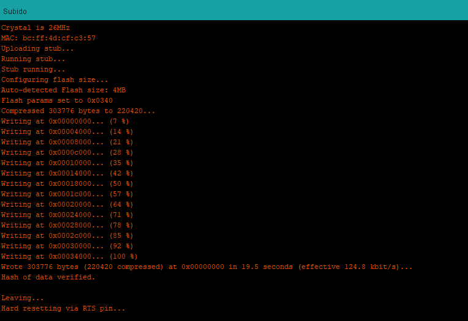

# Introducción 

El ESP8266 NodeMCU es una plataforma de hardware y software open source que permite a los usuarios crear dispositivos conectados a Internet con funciones de red WiFi de forma rápida y fácil. 

 Se basa en el chip ESP8266, que es un microcontrolador Wi-Fi de bajo costo y de altas prestaciones. 

# Código fuente

```c
/*
 * ESP8266 NodeMCU LED Control over WiFi Demo
 *
 * https://circuits4you.com
 */
#include <ESP8266WiFi.h>
#include <WiFiClient.h>

//ESP Web Server Library to host a web page
#include <ESP8266WebServer.h>

//---------------------------------------------------------------
//Our HTML webpage contents in program memory
const char MAIN_page[] PROGMEM = R"=====(
<!DOCTYPE html>
<html>
<body>
<center>
<h1>WiFi LED on off demo: 1</h1><br>
Ciclk to turn <a href="ledOn">LED ON</a><br>
Ciclk to turn <a href="ledOff">LED OFF</a><br>
<hr>
<a href="https://circuits4you.com">circuits4you.com</a>
</center>

</body>
</html>
)=====";
//---------------------------------------------------------------
//On board LED Connected to GPIO2
#define LED 2  

//SSID and Password of your WiFi router
const char* ssid = "BONDIATOTLODIA";
const char* password = "UHYD6VRg";

//Declare a global object variable from the ESP8266WebServer class.
ESP8266WebServer server(80); //Server on port 80

//===============================================================
// This routine is executed when you open its IP in browser
//===============================================================
void handleRoot() {
 Serial.println("You called root page");
 String s = MAIN_page; //Read HTML contents
 server.send(200, "text/html", s); //Send web page
}

void handleLEDon() { 
 Serial.println("LED on page");
 digitalWrite(LED,LOW); //LED is connected in reverse
 server.send(200, "text/html", "LED is ON"); //Send ADC value only to client ajax request
}

void handleLEDoff() { 
 Serial.println("LED off page");
 digitalWrite(LED,HIGH); //LED off
 server.send(200, "text/html", "LED is OFF"); //Send ADC value only to client ajax request
}
//==============================================================
//                  SETUP
//==============================================================
void setup(void){
  Serial.begin(115200);

  Serial.println("");
  Serial.println(ssid);
  Serial.println(password);
  
  WiFi.begin(ssid, password);     //Connect to your WiFi router
  


  //Onboard LED port Direction output
  pinMode(LED,OUTPUT); 
  //Power on LED state off
  digitalWrite(LED,HIGH);
  
  // Wait for connection
  while (WiFi.status() != WL_CONNECTED) {
    delay(500);
    Serial.print(".");
  }

  //If connection successful show IP address in serial monitor
  Serial.println("");
  Serial.print("Connected to ");
  Serial.println(ssid);
  Serial.print("IP address: ");
  Serial.println(WiFi.localIP());  //IP address assigned to your ESP
 
  server.on("/", handleRoot);      //Which routine to handle at root location. This is display page
  server.on("/ledOn", handleLEDon); //as Per  <a href="ledOn">, Subroutine to be called
  server.on("/ledOff", handleLEDoff);

  server.begin();                  //Start server
  Serial.println("HTTP server started");
}
//==============================================================
//                     LOOP
//==============================================================
void loop(void){
  server.handleClient();          //Handle client requests
}
```

# Subida



# Salida monitor serie


# Wifi bridge

```c
#include <ESP8266WiFi.h>


// Set WiFi credentials
#define WIFI_SSID "YOUR WIFI NETWORK SSID"
#define WIFI_PASS "YOUR WIFI PASSWORD"

// Set AP credentials
#define AP_SSID "ESP8266"
#define AP_PASS "magicword"

void setup()
{
  // Setup serial port
  Serial.begin(115200);
  Serial.println();

  // Begin Access Point
  WiFi.mode(WIFI_AP_STA);
  WiFi.softAP(AP_SSID, AP_PASS);

  // Begin WiFi
  WiFi.begin(WIFI_SSID, WIFI_PASS);

  // Connecting to WiFi...
  Serial.print("Connecting to ");
  Serial.print(WIFI_SSID);
  while (WiFi.status() != WL_CONNECTED)
  {
    delay(100);
    Serial.print(".");
  }

  // Connected to WiFi
  Serial.println();
  Serial.println("Connected!");
  Serial.print("IP address for network ");
  Serial.print(WIFI_SSID);
  Serial.print(" : ");
  Serial.println(WiFi.localIP());
  Serial.print("IP address for network ");
  Serial.print(AP_SSID);
  Serial.print(" : ");
  Serial.print(WiFi.softAPIP());

}

void loop() {
  // put your main code here, to run repeatedly:
 
}
```

https://siytek.com/esp8266-ap-and-station-mode/