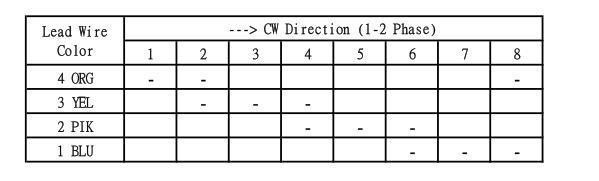
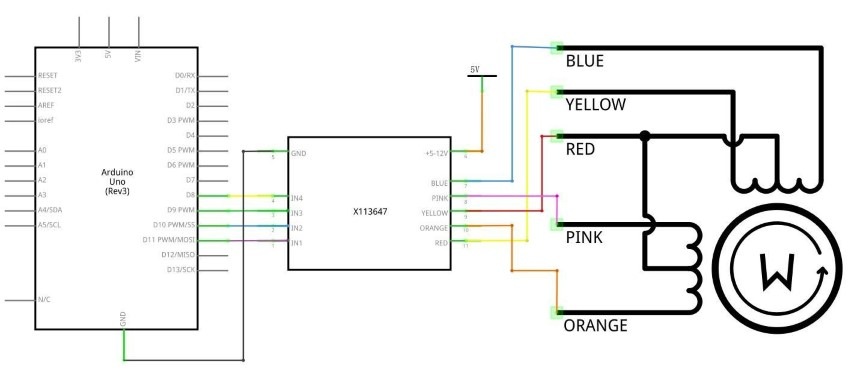
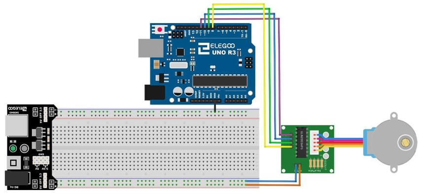

## Motor paso a paso

Un motor paso a paso es un dispositivo electromecánico que convierte pulsos eléctricos en movimientos mecánicos discretos.

## Componentes necesarios

| Cantidad | Característica                                  |
| -------- | ----------------------------------------------- |
| [x]      | Elegoo Uno R3                                   |
| [x]      | Placa de conexiones con 830 puntos              |
| [x]      | Módulo controlador de motor paso a paso ULN2003 |
| [x]      | Motor paso a paso                               |
| [x]      | Adaptador de corriente 9V1A                     |
| [x]      | Módulo de fuente de alimentación                |
| [x]      | Cables hembra-macho (DuPont)                    |
|          | Hilo macho-macho (hilo de puente)               |

## ¿Cómo funciona un motor paso a paso?

El eje o eje de un motor paso a paso gira en incrementos discretos cuando impulsos de mando eléctrico se aplican a él en la secuencia correcta. La rotación de los motores tiene varias relaciones directas a estos pulsos de entrada aplicadas. La secuencia de los pulsos aplicados se relaciona directamente con la dirección de rotación de ejes motor. La velocidad de la rotación de los ejes motor está directamente relacionada con la frecuencia de los pulsos de entrada y la duración de la rotación está directamente relacionada con el número de pulsos de entrada aplicada. Una de las ventajas más importantes de un motor paso a paso es su capacidad para ser controlado con precisión en un sistema de lazo abierto. Control de lazo abierto significa que ninguna información de retroalimentación de posición es necesario. Este tipo de control elimina la necesidad de costosos dispositivos de detección y regeneración como codificadores ópticos. Su posición es conocida simplemente por hacer el seguimiento de los pulsos de entrada de paso

## 28BYJ-48

 El motor paso a paso "``28BYJ-48``" es un motor bastante común en proyectos de electrónica y robótica debido a su costo asequible y su versatilidad.

| Característica                            | Valor                                      |
| ----------------------------------------- | ------------------------------------------ |
| Tensión nominal                           | 5 VDC                                      |
| Número de fase                            | 4                                          |
| Cociente de la variación de velocidad     | 1/64                                       |
| Ángulo de paso                            | 5,625 ° 64                                 |
| Frecuencia                                | 100Hz                                      |
| Resistencia de la C.C.                    | 50Ω±7% (25 ° C)                            |
| Inactivo en tracción frecuencia           | > 600Hz                                    |
| Frecuencia ociosa de hacia fuera-tracción | > 1000Hz En tracción par > 34.3mN.m(120Hz) |
| Posicionamiento automático par            | > 34.3mN.m                                 |
| Par de fricción                           | 600-1200 gf.cm                             |
| Tire un par                               | 300 gf.cm                                  |
| Resistencia de aislamiento                | > 10MΩ(500V)                               |
| Aislantes de electricidad                 | 600VAC/1mA/1s                              |
| Grado de aislamiento                      | A                                          |
| Subida de temperatura                     | < 40K(120Hz)                               |
| Ruido                                     | < 35dB (120Hz, No carga, 10cm)             |

## Esquema de circuitos

El motor paso a paso bipolar generalmente cuenta con cuatro cables que se extienden de él. A diferencia de los motores PAP unipolares, los motores paso a paso bipolares no poseen una conexión común en el centro.

En lugar de eso, tienen dos conjuntos independientes de bobinas. Pueden diferenciarse de los motores paso a paso unipolares midiendo la resistencia entre los cables.

Deberías identificar dos pares de cables con resistencias iguales. Si conectas las puntas de tu medidor a dos cables que no están vinculados (es decir, que no están conectados a la misma bobina), deberías observar resistencia infinita (o falta de continuidad).

## ULN2003

La ULN2003 es un popular ``chip de amplificación de corriente`` que se utiliza comúnmente como placa conductora para motores paso a paso. Este chip se utiliza para controlar motores, especialmente los motores paso a paso, y proporciona la capacidad de manejar corrientes más altas de las que un microcontrolador puede manejar directamente.

## Descripción del producto

| Característica                                             | Valor                                                                          |
| ---------------------------------------------------------- | ------------------------------------------------------------------------------ |
| Tamaño                                                     | 42mmx30mm                                                                      |
| Chip de controlador de uso                                 | ULN2003, 500mA                                                                 |
| A. B. C. D                                                 | LED que indica las cuatro fases las condiciones  de trabajo motor paso a paso. |
| Blanco jack                                                | es el conector estándar motor cuatro fase      paso a paso.                    |
| Pines de alimentación son separados                        |                                                                                |
| Mantuvimos las clavijas del resto de la viruta del ULN2003 | para sus prototipos más.                                                       |

La forma más sencilla de conexión un paso a paso unipolar a``Arduino`` es utilizar un desglose para chip de ULN2003A transistor array. El ULN2003A contiene siete controladores de transistor Darlington y es algo asícomo tener siete transistores TIP120 todo en un paquete. El ULN2003A puede pasar hasta 500 mA por canal y tiene una caída de tensión interna de 1V cuando en. También contiene diodos de abrazadera interna para disipar las puntas de tensión al manejar cargas inductivas.

## Control mediante bobinas

Para controlar el paso a paso, aplicamos tensión a cada una de las bobinas en una secuencia específica.

La secuencia iría así:

Estos son esquemas que muestran cómo un paso a paso unipolar de interfaz motor a cuatro pines controlador utilizando un ULN2003A y mostrando cómo la interfaz usando cuatro com

## Esquema

## Diagrama de cableado

Estamos utilizando 4 pines para controlar el paso a paso.

- Los pines 8-11 controlan el motor paso a paso.
- Conectamos la tierra de a UNO para el motor paso a paso.

## Código

