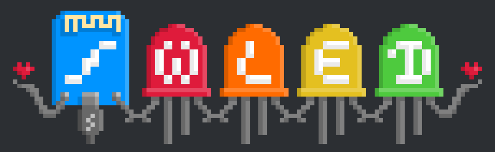
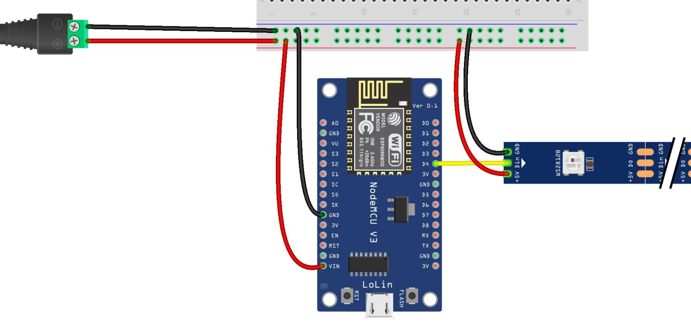

# Projecte WLED

Il·luminació de tira de LED i maneig a travér d'app mòbil mitjançant WiFi

El projecte ``WLED`` és un programari de codi obert que us permet controlar tires LED adreçables mitjançant una interfície web. Es pot instal·lar en diverses plataformes de maquinari, inclosa la placa NodeMCU basada en ESP8266.

https://kno.wled.ge/

# Instal·lació

Per utilitzar el programari ``WLED`` en una placa NodeMCU, primer heu de flashejar la placa amb el microprogramari WLED. Això es pot fer utilitzant l'IDE d'Arduino o altres eines intermitents.

https://install.wled.me/

# Connexió de la tira

Un cop instal·lat el microprogramari, podeu connectar la vostra tira de LED a la placa NodeMCU.  Connectarem la tira de led al ``pin D4``.

# Programari mòbil

https://play.google.com/store/apps/details?id=com.aircoookie.WLED&hl=es&gl=US&pli=1

# Control

Des del mòbil podrem canviar els colors i els efectes.

