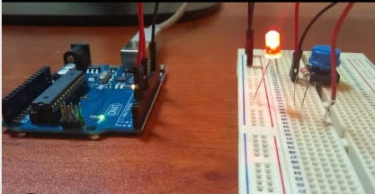

# Protoboard

Un **protoboard** permite crear prototipos de circuitos de forma rápida, sin necesidad de soldar las  conexiones. A continuación un ejemplo.

# Protoboard

Las protoboard están compuestas por un número determinado de **pines**, dispuestos en **filas** y **columnas**, a los que podemos conectar diferentes cables y componentes.

## Tipos de protoboard

- Las **protoboard** vienen en varios tamaños y configuraciones.
- La clase más simple es sólo una rejilla de agujeros en un bloque de plástico.
- En el interior son tiras de metal que proporcionan una conexión eléctrica entre los agujeros en las filas más cortas.
- Conectando las patillas de dos componentes diferentes de la **misma fila** quedan unidos eléctricamente.

## Tipos de protoboard

## Zonas

Existen dos zonas principales. La zona de alimentación, y la zona central. Todo lo que pase por la misma línea, está interconectado eléctricamente.

## Canales centrales

Los canales centrales indican que no están conectados ambos lados. Lo que significa, puede insertar un chip con las patillas a ambos lados del canal sin conectarlos juntos.

## Tiras laterales

- Algunos ``protoboards`` tienen dos tiras de agujeros que corre a lo largo de los bordes laterales del tablero.
- Estas tiras se denominan ``carriles`` y le permiten alimentar a muchos componentes o puntos en el tablero.
- Proporcionan una manera para conectar una tensión común. Son generalmente en pares para + 5 voltios y tierra.

## Desventajas

- Las conexiones son temporales y de acople, no son tan fiables como conexiones soldadas.
- Si tienes problemas intermitentes con un circuito, puede ser debido a una mala conexión en una protoboard.