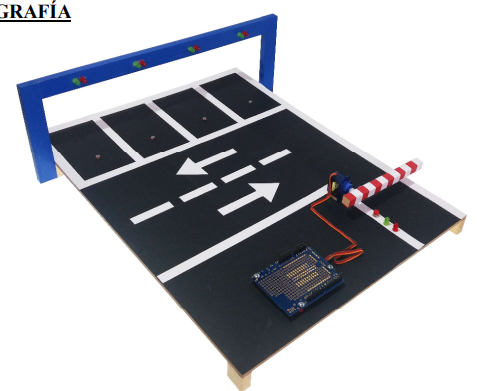

# Objetivo

La idea de este proyecto es crear un sistema automático de control de un aparcamiento utilizando Arduino

# Materiales necesarios 

- 3 LED de color rojo
- 3 LED de color verde
- 1 servo

En lugar de fotoresistencias se pueden incorporar sensores infrarrojos.

# Funcionamiento

- El parking dispondrá de 3 plazas para aparcar. 
- Cada una de ellas tendrá un sensor que iluminará un LED en el caso de que un coche esté aparcado encima suyo, indicando que la plaza 
está ocupada.
- El servomotor moverá una barrera, que estará subida cuando alguna de las plazas esté libre (sin coche encima).
- En el caso de que las 3 plazas estén ocupadas, la barrera estará bajada.

# Posibles mejoras

- Crear un contador de plazas libres. Para ello ayudarse de un seven segments o una pantalla LCD
- Crear un detector a la entrada para abrir la barrera solo cuando haya un coche esperando.
- Se puede incorporar un semáforo a la entrada que indique si se puede pasar.
