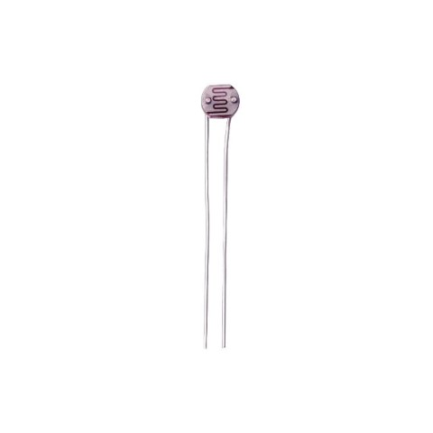
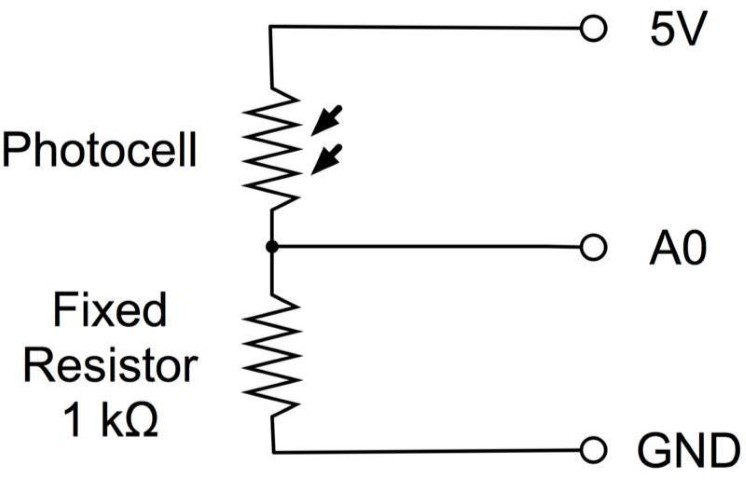
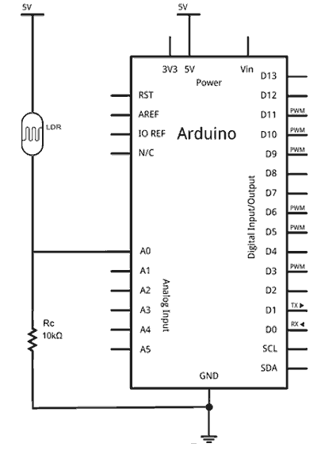

## Sensor luz (fotocelula)

## Resumen

Vamos a aprender como medir la intensidad de la luz utilizando una entrada analógica. Con lo que aprenderemos, podremos posteriormente utilizar el nivel de luz para controlar el apagar un LED o encenderlo cuando no haya luz, por ejemplo.

Los componentes que utilizaremos son los siguientes:

- [x] Elegoo Uno R3
- [x] Protoboard
- [x] LEDs
- [x] Resistencias de 220 ohmios
- [x] Resistencia de 1 kohm (1000 ohms)
- [x] 1 x fotoresistor o LDR (fotocélula)
- [x] 16 x M M cables (cables de puente de macho a macho)

## Fotocélula

- Fotorresistencia o **LDR** (“light-dependent resistor”)
- Componente electrónico cuya resistencia varía en función de la luz.
- Sensor que actúa como una resistencia variable en función de la luz que capta.



Esta tiene una resistencia de cerca de 50 kΩ en cerca de oscuridad y Ω 500 en luz brillante. Para convertir este valor variable de la resistencia en algo que podemos medir en la entrada analógica de la Junta de un R3 de UNO, debe ser convertida en un voltaje.

La forma más sencilla de hacerlo es combinar con una resistencia fija.



## Comportamiento

La resistencia y fotocélula junto se comportan como una sola. Cuando la luz es muy brillante, entonces la resistencia de la fotocélula es muy baja en comparación con la resistencia de valor fijo, y asíes como si el bote se dio vuelta a máximo.

Cuando la fotocélula está en una luz apagada, la resistencia es mayor que la resistencia fija de 1 kΩ y es como si el recipiente estuviera girando hacia GND.

## Conexión



## Diagrama de cableado


## Código para leer valor de un LDR

```c
int sensorPin = A0; // select the input pin for LDR

int sensorValue = 0; // variable to store the value coming from the sensor
void setup() {
   Serial.begin(9600); //sets serial port for communication
}
void loop() {
   sensorValue = analogRead(sensorPin); // read the value from the sensor
   Serial.println(sensorValue); //prints the values coming from the sensor on the screen
   delay(100);
}
```

## Código encender un LED cuando la luz es baja

Encender LED cuando la luz es baja y viceversa.

- Para ello, deberemos colocar un LED en el pin 13, con su correspondiente resistencia.
- El umbral es el valor a partir del cual vamos a decidir si encender la bombilla o no
- En este caso está fijado a **100 Ω**.

## Código

```c
const int LEDPin = 13;
const int LDRPin = A0;
const int umbral = 100;

void setup() {
   pinMode(LEDPin, OUTPUT);
   pinMode(LDRPin, INPUT);
}

void loop() {
   int input = analogRead(LDRPin);
   if (input > umbral) {
      digitalWrite(LEDPin, HIGH);
   }
   else {
      digitalWrite(LEDPin, LOW);
   }
}
```

Lo mismo, pero con un valor de umbral fijado por nosotros.

```c
const long A = 1000;     //Resistencia en oscuridad en KΩ
const int B = 15;        //Resistencia a la luz (10 Lux) en KΩ
const int Rc = 10;       //Resistencia calibracion en KΩ
const int LDRPin = A0;   //Pin del LDR

int V;
int ilum;

void setup()
{
   Serial.begin(115200);
}

void loop()
{
   V = analogRead(LDRPin);

   //ilum = ((long)(1024-V)*A*10)/((long)B*Rc*V);  //usar si LDR entre GND y A0
   ilum = ((long)V*A*10)/((long)B*Rc*(1024-V));    //usar si LDR entre A0 y Vcc (como en el esquema anterior)

   Serial.println(ilum);
   delay(1000);
}
```