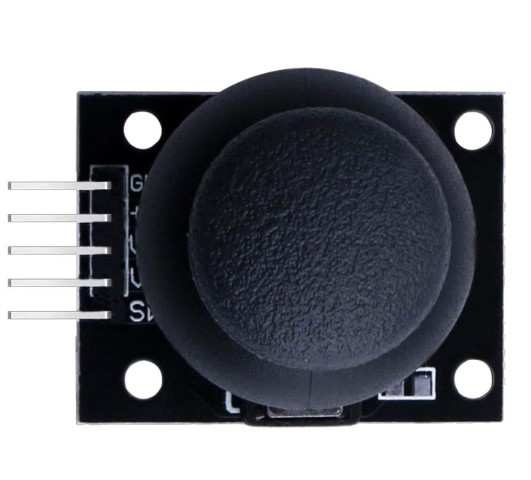
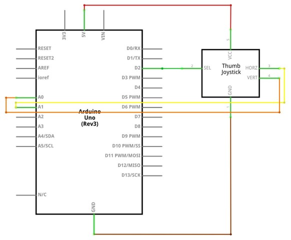

# Joystick analógico

Los joysticks analógicos pueden detectar movimientos en múltiples direcciones y con diferentes niveles de intensidad. Esto se logra mediante sensores que registran la posición y la fuerza aplicada al joystick.


## Pines del Joystick

``Sel`` (Selección):

- Este pin es el botón de selección o pulsador del joystick.
- Conéctalo a un pin digital en tu Arduino (por ejemplo, pin 2).

## Pines del Joystick

``Y`` (Eje Y):
- Salida analógica que varía según el movimiento del joystick en el eje Y (arriba y abajo).
- Conectar a **pin analógico** (por ejemplo, A0).

``X`` (Eje X):
- Salida analógica que varía según el movimiento del joystick en el eje X (izquierda y derecha).
- Conectar a **pin analógico** (por ejemplo, A1).

## Pines del Joystick

- ``Voltaje``: suministra el voltaje de alimentación para el joystick.
Conéctalo a la fuente de alimentación de 5V en tu Arduino.
- ``Tierra``: se conecta a tierra (GND) para completar el circuito.
Conéctalo al pin de tierra (GND) en tu Arduino.

## Datos

Tenemos que usar pines``Arduino`` **analógicos** para leer los datos de los pines que reconocen el movimiento X / Y (vertical y horizontal), puesto que puedo tener diferentes valores (por ejemplo, moverse más rápido o lento).


En cambio, para detectar si pulsamos o no el botón, es suficiente un pin **digital**, puesto que solo tendremos dos valores (pulsado o no pulsado).



## Esquema



## Diagrama de cableado


## Código

```c
//``Arduino`` pin numbers
const int SW_pin = 2; // digital pin connected to switch output
const int X_pin = 0; // analog pin connected to X output
const int Y_pin = 1; // analog pin connected to Y output

void setup() {
  pinMode(SW_pin, INPUT);
  digitalWrite(SW_pin, HIGH);
  Serial.begin(9600);
}

void loop() {
  Serial.print("Switch:  ");
  Serial.print(digitalRead(SW_pin));
  Serial.print("\n");
  Serial.print("X-axis: ");
  Serial.print(analogRead(X_pin));
  Serial.print("\n");
  Serial.print("Y-axis: ");
  Serial.println(analogRead(Y_pin));
  Serial.print("\n\n");
  delay(500);
}
```

