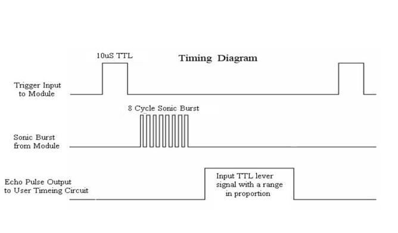
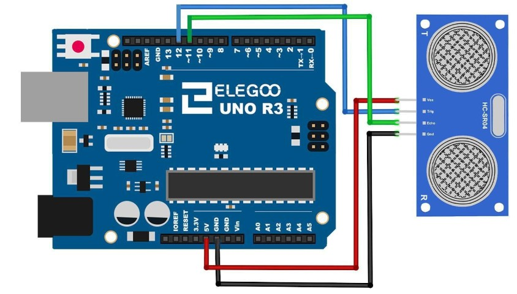

## Sensor ultrasonico

El **sensor ultrasónico** es ideal para todo tipo de proyectos que necesitan medidas de distancia, como por ejemplo evitar obstáculos.


El sensor que utilizaremos se llama ``HC-SR04``  e incorpora una **librería** diseñada  específicamente para estos sensores.


## Componentes necesarios

Para hacer una prueba sencilla de funcionamiento del sensor, necesitaremos:

```
(1) x Placa``Arduino`` UNO
(1) x Módulo de sensor ultrasónico
(4) x F M cables (cables de hembra a macho DuPont)
```

## Características técnicas

- El módulo **HC-SR04** del sensor ultrasónico
- Distancias entre 2 cm y 400 cm
- Precisión que varía puede alcanzar los 3 mm.


## Principio básico del trabajo

- Dispara una señal de nivel alto de al menos 10us
- El Módulo envía automáticamente ocho señales de 40 kHz y detecta si hay una señal de retorno, por rebotar en alguna superficie.
- Esta señal de retorno dependerá de la distancia recorrida y, por tanto, de la distancia.

## ¿Cómo calcula la distancia?

La distancia recorrida se podría calcular en función de:

- La **velocidad** del sonido
- El **tiempo** que tardará en ir y volver realmente es el doble de la distancia que hay al objeto.

La formula que nos daría la distancia recorrida podría ser:

```math
distancia = (tiempo  * 340 ) / 2
```

El diagrama de sincronización se muestra a continuación. Sólo tiene que suministrar un pulso de 10us corto a la entrada de activación para iniciar el rango, y luego el módulo enviará una ráfaga de 8 ciclos de ultrasonido a 40 kHz y aumentar su eco. El Echo es un objeto de distancia que es el ancho de pulso y el rango en proporción.

Se puede calcular el rango a través del intervalo de tiempo entre la señal de disparo de envío y la señal de eco de recepción. La fórmula es la siguiente:

```
Fórmula centímetros: us / 58 = centímetros
Pulgadas:  us / 148 = inch; O: el rango = tiempo de alto nivel * velocidad (340M / S) / 2;
```
Sugerimos utilizar más de 60ms de ciclo de medición, con el fin de evitar la señal de disparo a la señal de eco.



## Sensor


## Conexión

Aquí podemos ver como conectar los cuatro pines del sensor al``Arduino`` Uno.


## Diagrama de cableado



## Montaje


## Código

Necesitaremos una **librería** para poder utilizar algunas funciones y comunicarnos con el sensor. Para ello, deberemos de incluirla en nuestro proyecto, de la siguiente forma:


Una vez incluída, ya la podemos utilizar en nuestro programa.

Vamos a utilizar el monitor serie para mostrar los datos por pantalla, por lo menos mientras probamos el programa.

```c
#include "SR04.h" //la librería a utilizar
#define TRIG_PIN 12 //pines donde conectamos
#define ECHO_PIN 11

SR04 sr04 = SR04(ECHO_PIN,TRIG_PIN);
long distancia;

void setup() {
   Serial.begin(9600);
   delay(1000);
}

void loop() {
   distancia=sr04.Distance(); //Devuelve la distancia en Cm.
   Serial.print(distancia);
   Serial.println("cm");
   delay(1000); //Esperaremos 1s entre mediciones
}

```

Abriendo el monitor y podemos ver los datos que vamos imprimiendo desde el programa


