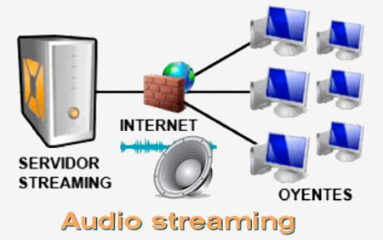
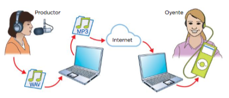
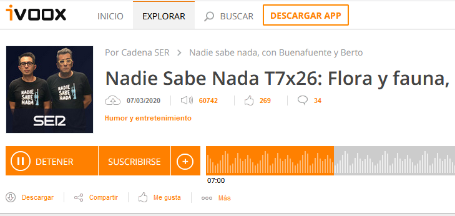

# 6.Streaming

## 6.1. Streaming

El **streaming** consiste en transmitir sonido o vídeo digital a través de internet en tiempo real. Permite escuchar música a la carta sin descargar todo el archivo previamente

Se financian a través de publicidad o mediante suscripción.

## 6.2. Podcast

Se trata de un archivo de sonido digital creado para ser difundido por Internet.
Cualquiera puede escucharlo en el momento que desee desde un ordenador o dispositivo portátil.

Recorrido de un podcast

1) Productor graba el archivo
2) Comprime el archivo en un formato apto para el podcast
3) Lo cuelga en Internet
4) El usuario final lo descarga y reproduce

