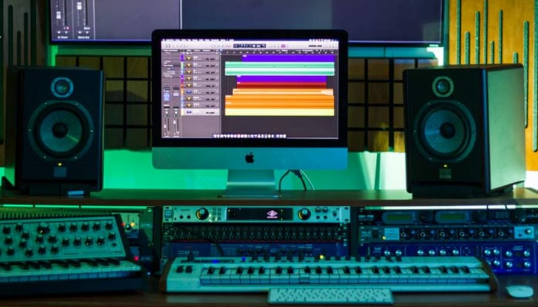
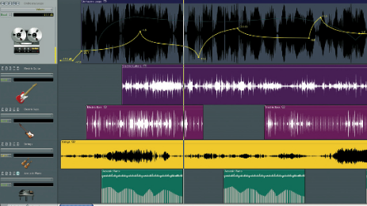
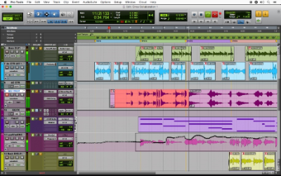

# DAWs

Una estación de trabajo de audio digital o DAW, es un software que permite crear música sobre la base de audio o sonidos MIDI. Los sonidos pueden insertarse desde medios externos micrófono, instrumento musical, teclado, sintetizador.

## Pistas

Las **pistas** son una parte fundamental en la grabación y producción de música. En una estación de trabajo de audio digital (DAW), las pistas permiten a los usuarios grabar y trabajar con diferentes partes de una canción de forma separada. Cada pista puede contener diferentes elementos, como voces, guitarras, baterías, teclados, etc.

Las pistas permiten a los usuarios aplicar diferentes **efectos** y procesamiento a cada elemento de forma individual. Por ejemplo, se puede aplicar un efecto de **reverb** a la pista de la **batería** para darle un sonido más espacioso, o se puede aplicar un efecto de distorsión a la pista de la guitarra para hacerla sonar más crujiente.

Además, las pistas permiten a los usuarios **editar** y **manipular** cada elemento de forma individual. Por ejemplo, se puede ajustar el volumen de una pista específica para destacar un determinado elemento, o se puede recortar y ajustar la duración de una pista para encajarla mejor en la canción.

## DAWs comerciales

Algunos ejemplos son:

- Cubase (Steinberg)
- Pro Tools (Avid)
- Reaper
- Ableton Live
- Otros: Ardour, Cakewalk Sonar, FL Studio, lmms, DSP-Quattro, etc

Los sonidos se pueden trabajar en pistas separadas y aplicar diferentes efectos a una pista o a un trozo concreto. Permite también exportar el resultado en diferentes formatos de audio.

