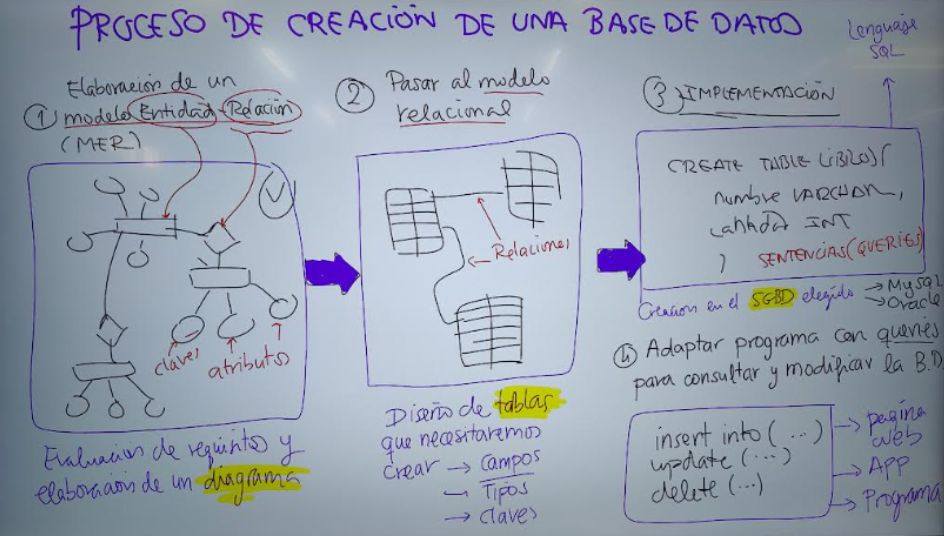
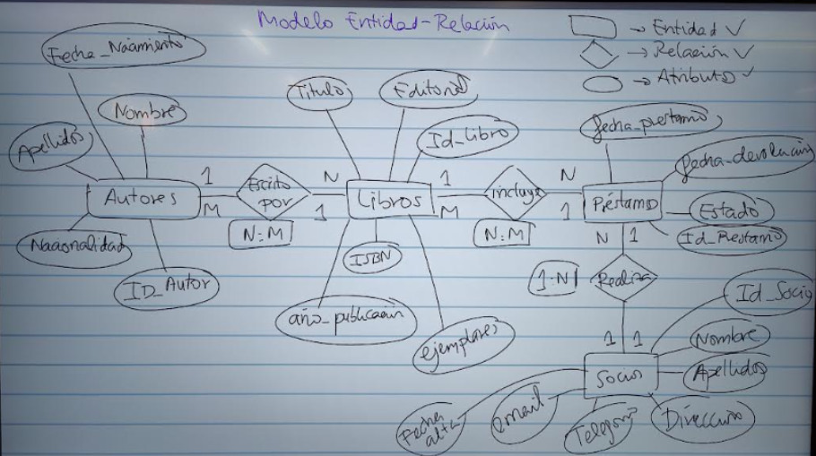
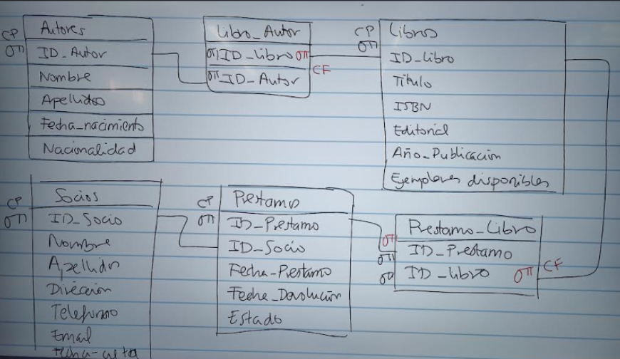
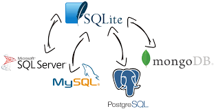
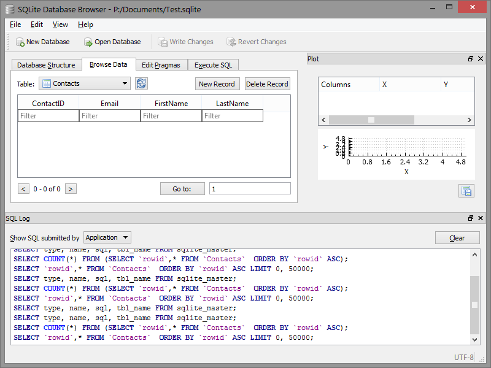
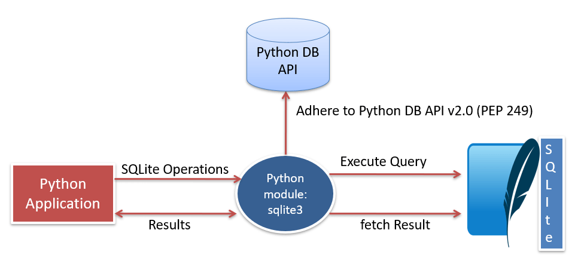
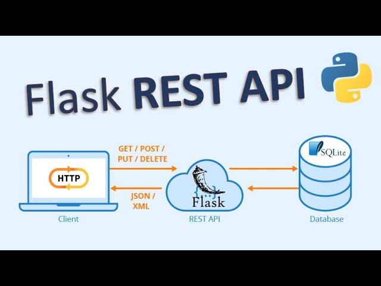
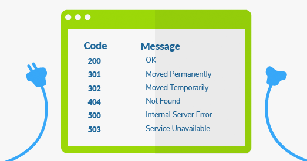

# Bases de dades relacionals

Aquest document proporciona una guia detallada sobre el disseny i la manipulació de bases de dades relacionals, amb un enfocament pràctic en lús de **SQL** i **Python**. Comença explicant el **procés general per dissenyar bases de dades**, incloent-hi la creació d'un **model entitat-relació** i la seva transformació a un **model relacional**, ressaltant la importància de definir clarament els requisits i **les entitats, les relacions i els atributs**.

Després, aprofundeix en el **llenguatge SQL**, mostrant exemples de sentències per crear, inserir, modificar, eliminar i consultar dades a una base de dades. També explica com fer servir **funcions SQL** per realitzar operacions sobre dades i combinar dades de diferents taules utilitzant la **sentència JOIN**.

Finalment, s'introdueix la integració de bases de dades amb Python, utilitzant el **mòdul sqlite3**, i es donen exemples de com connectar, inserir, consultar i actualitzar registres. El document conclou amb una introducció a **l'ús de Flask per crear una API** que permeti accedir a les dades de la base de dades a través del web.

## Programació i tractament de dades II

- [Bases de dades relacionals](#bases-de-dades-relacionals)
  - [Programació i tractament de dades II](#programació-i-tractament-de-dades-ii)
- [1. Proceso general](#1-proceso-general)
- [2. Modelo Entidad-Relación](#2-modelo-entidad-relación)
  - [Paso 1. Define claramente los requisitos](#paso-1-define-claramente-los-requisitos)
  - [Paso 2. Identifica las entidades](#paso-2-identifica-las-entidades)
  - [Paso 3. Determina las relaciones](#paso-3-determina-las-relaciones)
  - [Paso 4. Especifica los atributos](#paso-4-especifica-los-atributos)
- [3. Modelo relacional](#3-modelo-relacional)
- [SQlite i DB Browser](#sqlite-i-db-browser)
- [4. SQL](#4-sql)
  - [4.1 Sentencia CREATE](#41-sentencia-create)
  - [4.2 Sentencia INSERT](#42-sentencia-insert)
  - [4.3 Sentencia ALTER](#43-sentencia-alter)
  - [4.4 Sentencia DELETE](#44-sentencia-delete)
  - [4.5 Sentencia UPDATE](#45-sentencia-update)
  - [4.5 Sentencia SELECT](#45-sentencia-select)
  - [Funciones](#funciones)
  - [4.6 Sentencia SELECT con JOIN](#46-sentencia-select-con-join)
- [5. Python y SQL](#5-python-y-sql)
  - [Python y sqlite3](#python-y-sqlite3)
  - [Proceso de conexión en Python](#proceso-de-conexión-en-python)
  - [Prueba insertar Libros](#prueba-insertar-libros)
  - [Mostrar libros existentes](#mostrar-libros-existentes)
  - [Actualizar un registro](#actualizar-un-registro)
  - [Menú](#menú)
- [6. API con Flask (No hacer)](#6-api-con-flask-no-hacer)
  - [¿Qué es una API?](#qué-es-una-api)
  - [¿Qué es Flask?](#qué-es-flask)

# 1. Proceso general



# 2. Modelo Entidad-Relación

Crear un modelo entidad-relación (ER) es una parte fundamental del diseño de bases de datos, ya que te ayuda a estructurar y organizar la información de manera lógica. Aquí tienes algunos consejos clave para hacerlo bien:

## Paso 1. Define claramente los requisitos

Antes de dibujar nada, comprende el propósito del sistema y recopila todos los **requisitos funcionales**.
Habla con los **usuarios finales** o stakeholders para asegurarte de que entiendes qué **datos** necesitan manejar y cómo se **relacionan**.

## Paso 2. Identifica las entidades

Piensa en las principales "cosas" de tu sistema que necesitas almacenar. Estas suelen ser sustantivos: por ejemplo, Cliente, Producto, Pedido.
Evita incluir atributos o relaciones en esta etapa; concéntrate solo en identificar entidades.

## Paso 3. Determina las relaciones

Identifica cómo interactúan las entidades entre sí. Ejemplo: un Cliente realiza un Pedido.
Define la cardinalidad (uno a uno, uno a muchos, muchos a muchos).

- 1:1: Un empleado tiene un único número de seguridad social.
- 1:N: Un cliente puede hacer muchos pedidos.
- M:N: Muchos estudiantes pueden estar en muchos cursos.

## Paso 4. Especifica los atributos

Asocia cada atributo a la entidad o relación correspondiente.
Ejemplo: para la entidad Cliente, puedes añadir atributos como Nombre, Teléfono, Email.
Selecciona un identificador único o clave primaria para cada entidad.



# 3. Modelo relacional

Un cop tenim el **model entitat-relació (E-R)** definit, hem de transformar-lo en un **model relacional**, que es basa en **taules** amb els seus atributs i tipus de dades.

1. **Entitats → Taules**
   - Cada entitat es converteix en una taula amb els seus atributs com a columnes.
   - L’atribut clau primària (primary key) s’identifica clarament.

2. **Relacions → Claus foranes**
   - Si dues entitats estan relacionades, s’afegeix una clau forana (foreign key) en la taula corresponent.
3. **Cardinalitat**
   - 1:1 → Es pot fusionar en una sola taula o fer una clau forana.
   - 1:N → La clau forana va a la taula del costat N.
   - N:M → Es crea una taula intermèdia amb dues claus foranes.
4. **Tipus de dades adequats**
   - Es defineixen els tipus de dades correctes per cada camp (VARCHAR, INTEGER, DATE, etc.).

Així doncs, les 4 entitats ens donaran 4 taules, i les dues relacions N:M, una taula cadascuna.



Así mismo, quedarán definidas dos tipos de claves:

- Las ``claves primarias`` son campos en una tabla que identifican de forma única cada registro. No pueden ser nulas ni repetidas.
- Las ``claves foráneas`` son columnas en una tabla que establecen una relación con la clave primaria de otra tabla, asegurando la integridad referencial entre ellas.

# SQlite i DB Browser

**SQLite** és un **sistema de gestió de bases de dades** relacional (RDBMS) lleuger, sense servidor i basat en fitxers. A diferència d'altres bases de dades com MySQL o PostgreSQL, SQLite no requereix un procés en segon pla per funcionar, ja que emmagatzema tota la informació en un únic fitxer.



**DB Browser for SQLite** és una eina gràfica de codi obert que permet gestionar bases de dades SQLite d'una manera intuïtiva i sense necessitat d'utilitzar línia de comandes. Amb aquest programa, es poden crear, obrir, modificar i administrar bases de dades SQLite d'una manera visual.



# 4. SQL

Así pues, las 4 entidades nos darán 4 tablas, y las dos relaciones N:M, otra tabla cada una.

Ejemplos de sentencias SQL:

```sql
CREATE TABLE usuarios (id INT PRIMARY KEY, nombre VARCHAR(50)); → Crea una tabla.
INSERT INTO usuarios (id, nombre) VALUES (1, 'Juan'); → Inserta un registro.
SELECT * FROM usuarios; → Consulta todos los datos de la tabla.
UPDATE usuarios SET nombre = 'Carlos' WHERE id = 1; → Modifica un registro.
DELETE FROM usuarios WHERE id = 1; → Elimina un registro.
```

Básicamente, una sentencia SQL es una orden que se le da a la base de datos para que haga algo.

## 4.1 Sentencia CREATE

El comando ``CREATE TABLE`` en SQL se utiliza para crear una nueva tabla en una base de datos. Especifica el nombre de la tabla y define las columnas que tendrá, junto con sus tipos de datos y restricciones.

El elemento básico son las sentencias o queries.

Sintaxis básica:

```SQL
CREATE TABLE nombre_tabla (
    columna1 tipo_dato restricciones,
    columna2 tipo_dato restricciones,
    ...
);
```

### Tipos de datos

 En bases de dades, cada camp o columna d'una taula ha de tenir un **tipus de dada** definit que determina quin tipus de valors pot emmagatzemar. Els més comuns són:

- ``VARCHAR(n)``: Per a cadenes de text de longitud variable, amb un màxim de n caràcters.
- ``INTEGER``: Per a nombres enters.
- ``DECIMAL(p,s) o FLOAT``: Per a nombres decimals.
- ``DATE``: Per a dates (any, mes i dia).
- ``TIMESTAMP``: Per a data i hora.
- ``BOOLEAN``: Per a valors lògics (true/false).

### Tablas Libros

```SQL
CREATE TABLE Libros (
    ID_Libro INTEGER PRIMARY KEY AUTOINCREMENT, -- Identificador único, autoincremental
    Titulo VARCHAR(255), -- Título del libro (máx. 255 caracteres)
    ISBN VARCHAR(13), -- Código ISBN del libro (máx. 13 caracteres)
    Editorial VARCHAR(100), -- Nombre de la editorial (máx. 100 caracteres)
    Año_Publicación INT, -- Año en que se publicó el libro
    Ejemplares_Disponibles INT -- Cantidad de ejemplares disponibles
);
```

### Tabla Autores

```SQL
CREATE TABLE Autores (
    ID_Autor INTEGER PRIMARY KEY AUTOINCREMENT,
    Nombre VARCHAR(100),
    Apellidos VARCHAR(100),
    Fecha_Nacimiento DATE,
    Nacionalidad VARCHAR(100)
);
```

### Tabla Libro_Autor

```SQL
CREATE TABLE Libro_Autor (
    ID_Libro INTEGER,
    ID_Autor INTEGER,
    PRIMARY KEY (ID_Libro, ID_Autor),
    FOREIGN KEY (ID_Libro) REFERENCES Libros(ID_Libro),
    FOREIGN KEY (ID_Autor) REFERENCES Autores(ID_Autor)
);
```

Los campos ID_Libro e ID_Autor conforman la ``clave primaria``.
ID_Libro y ID_Autor son ``claves foráneas`` de los respectivos campos de las tablas Libros y Autores.

```SQL
CREATE TABLE Socios (
    ID_Socio INTEGER PRIMARY KEY AUTOINCREMENT,
    Nombre VARCHAR(100),
    Apellidos VARCHAR(100),
    Dirección VARCHAR(255),
    Teléfono VARCHAR(15),
    Email VARCHAR(100),
    Fecha_Alta DATE
);

CREATE TABLE Prestamos (
    ID_Prestamo INTEGER PRIMARY KEY AUTOINCREMENT,
    ID_Socio INT,
    Fecha_Prestamo DATE,
    Fecha_Devolución DATE,
    Estado VARCHAR(20),
    FOREIGN KEY (ID_Socio) REFERENCES Socios(ID_Socio)
);

CREATE TABLE Prestamo_Libro (
    ID_Prestamo INT,
    ID_Libro INT,
    Cantidad INT,
    PRIMARY KEY (ID_Prestamo, ID_Libro),
    FOREIGN KEY (ID_Prestamo) REFERENCES Prestamos(ID_Prestamo),
    FOREIGN KEY (ID_Libro) REFERENCES Libros(ID_Libro)
);
```

## 4.2 Sentencia INSERT

El comando ``INSERT`` en SQL se utiliza para agregar nuevas filas (registros) a una tabla en una base de datos. Cuando usas ``INSERT``, estás diciendo a la base de datos que agregue nuevos datos a la tabla que has especificado.

Sintaxis básica:

```sql
INSERT INTO nombre_tabla (columna1, columna2, columna3, ...)
VALUES (valor1, valor2, valor3, ...);
```

Puedes insertar varias filas al mismo tiempo en una única consulta utilizando el comando ``INSERT INTO``. Esto mejora el rendimiento al evitar múltiples consultas individuales.

Utilizamos insert para crear nuevos registros en las tablas Libros y Autores.

```SQL
INSERT INTO Libros (Titulo, ISBN, Editorial, Año_Publicación, Ejemplares_Disponibles) VALUES
('Dune', '978-0441013593', 'Chilton Books', 1965, 5),
('El Hobbit', '978-0618968633', 'Allen & Unwin', 1937, 3),

INSERT INTO Autores (Nombre, Apellidos, Fecha_Nacimiento, Fecha_Fallecimiento, Nacionalidad) VALUES
( 'Frank', 'Herbert', '1920-10-08', '1986-02-11', 'Estadounidense'),
( 'J.R.R.', 'Tolkien', '1892-01-03', '1973-09-02', 'Británico')
```

Deberemos introducir el Libro y el Autor antes de rellenar la tabla Libro_Autor.

```SQL
INSERT INTO Libro_Autor (ID_Libro, ID_Autor) VALUES
(1,1),
(2,2)
```

**Tabla Libros**

Aquests són els registres que haurà d contenir la nostra taula ``Libros``. Recordau que ID_Libro es crearà tot sol degut a que l'hem definit amb la restricció ``AUTOINCREMENT``.

| ID_Libro | Título                                           | ISBN          | Editorial            | Año_Publicacion | Ejemplares_Disponibles |
| -------- | ------------------------------------------------ | ------------- | -------------------- | --------------- | ---------------------- |
| 1        | Dune                                             | 9780441013593 | Chilton Books        | 1965            | 5                      |
| 2        | El Hobbit                                        | 9780618968633 | Allen & Unwin        | 1937            | 3                      |
| 3        | Fundación                                        | 9780553293357 | Gnome Press          | 1951            | 7                      |
| 4        | Canción de Hielo y Fuego                         | 9780553103540 | Bantam Books         | 1996            | 4                      |
| 5        | El Juego de Ender                                | 9780812550702 | Tor Books            | 1985            | 6                      |
| 6        | El Señor de los Anillos: La Comunidad del Anillo | 9780261103573 | George Allen & Unwin | 1954            | 5                      |
| 7        | 1984                                             | 9780451524935 | Secker & Warburg     | 1949            | 5                      |
| 8        | Fahrenheit 451                                   | 9781451673319 | Ballantine Books     | 1953            | 5                      |
| 9        | El Mesías de Dune                                | 9780441172719 | Chilton Books        | 1969            | 7                      |
| 10       | Tormenta de Espadas                              | 9780553106633 | Bantam Books         | 2000            | 4                      |

**Tabla Autores**

| ID_Autor | Nombre      | Apellidos  | Fecha_Nacimiento | Fecha_Fallecimiento | Nacionalidad   |
| -------- | ----------- | ---------- | ---------------- | ------------------- | -------------- |
| 1        | Frank       | Herbert    | 1920-10-08       | 1986-02-11          | Estadounidense |
| 2        | J.R.R.      | Tolkien    | 1892-01-03       | 1973-09-02          | Británica      |
| 3        | Isaac       | Asimov     | 1920-01-02       | 1992-04-06          | Estadounidense |
| 4        | George R.R. | Martin     | 1948-09-20       | -                   | Estadounidense |
| 5        | Orson       | Scott Card | 1951-08-24       | -                   | Estadounidense |
| 6        | George      | Orwell     | 1903-06-25       | 1950-01-21          | Británica      |
| 7        | Ray         | Bradbury   | 1920-08-22       | 2012-06-05          | Estadounidense |

**Tabla Libro_Autor**

| ID_Libro | ID_Autor |
| -------- | -------- |
| 1        | 1        |
| 2        | 2        |
| 3        | 3        |
| 4        | 4        |
| 5        | 5        |
| 6        | 2        |
| 7        | 6        |
| 8        | 7        |
| 9        | 1        |
| 10       | 4        |

## 4.3 Sentencia ALTER

El comando ``ALTER`` en SQL se utiliza para modificar la estructura de una tabla existente en una base de datos. Es decir, permite agregar, eliminar o modificar columnas, cambiar el tipo de datos de las columnas, renombrar tablas, entre otros

Agregar un columna

```SQL
ALTER TABLE empleados ADD columna_edad INT;
```
Modificar el tipo de dato de una columna existente:
```SQL
ALTER TABLE empleados MODIFY columna_edad DECIMAL(5, 2);
```
```SQL
Cambiar el nombre de una columna:
ALTER TABLE empleados CHANGE columna_edad edad_empleado INT;
```
Eliminar una columna de una tabla:
```SQL
ALTER TABLE empleados DROP COLUMN edad_empleado;
```
Agregar una restricción de clave primaria:
```SQL
	ALTER TABLE empleados ADD CONSTRAINT pk_empleados PRIMARY KEY (id_empleado);
```

## 4.4 Sentencia DELETE

El DELETE en SQL és una instrucció que s'utilitza per **eliminar files** d'una taula en una base de dades.

> [!CAUTION]
> Aquesta operació és irreversible, és a dir, un cop eliminada la fila, no es pot recuperar, excepte si es té una còpia de seguretat de la base de dades.

```SQL
DELETE FROM Libros
DELETE FROM Libros WHERE ID_Libro = 3
DELETE FROM Libros WHERE Titulo = "Dune"
```

## 4.5 Sentencia UPDATE

UPDATE en SQL és una instrucció que s'utilitza per modificar els valors de les files existents en una taula. Aquesta operació permet actualitzar dades específiques basant-se en una condició

Actualizar un campo de todos los registros.

```SQL
UPDATE Libros SET Ejemplares_Disponibles = 5
```
Permite actualizar datos de ciertos regitros

```SQL
UPDATE Libros SET Ejemplares_Disponibles = 5 WHERE ID_Libro = 1
```

Aumentar salario un 10% a ciertos trabajadores

```SQL
UPDATE empleados SET salario = salario * 1.10 WHERE fecha_ingreso < '2015-01-01';
```

## 4.5 Sentencia SELECT

Permite recuperar registros de 1 o más tablas.

1) Select simple: (Devuelve todos los campos de todos los registros)

```SQL
SELECT * FROM Libros
SELECT * FROM Autores
```

2) Select campos: (Devuelve ciertos campos de todos los registros)

```SQL
SELECT Titulo FROM Libros
SELECT Nombre, Apellidos FROM AUTORES
```

### Cláusula WHERE

La cláusula WHERE nos permitirá seleccionr solo aquellos registros cuyos campos cunmplan con las condiciones especificadas a continuación.

```SQL
SELECT Nombre, Apellidos, Fecha_Nacimiento
FROM Autores
WHERE Fecha_Nacimiento > '1900-01-01';
```

### Cláusula LIKE

1) Select con operador ``LIKE``:

```SQL
SELECT Titulo
FROM Libros
WHERE Titulo LIKE '%Dune%';
```

### Operadores lógicos (``AND``, ``OR``)

Los operadores lógicos en SQL se utilizan para combinar o modificar **condiciones** en una consulta, lo que permite realizar **filtrados** más complejos en las bases de datos. Estos operadores son fundamentales cuando se quiere hacer consultas que dependan de múltiples condiciones.

El operador ``AND`` se usa para combinar dos o más condiciones en una consulta. Devuelve true solo si todas las condiciones son verdaderas. 6 o más ejemplares y publicados a partir de 1951 (incluído)
```SQL
SELECT Titulo, Ejemplares_Disponibles, Año_Publicacion
FROM Libros
WHERE Ejemplares_Disponibles > 5 AND Año_Publicacion > 1950;
```

### Operador OR

El operador ``OR`` se usa para combinar dos o más condiciones. Devuelve true si al menos una de las condiciones es verdadera.
Sintaxis:

```SQL
SELECT * FROM empleados
WHERE edad > 30 OR salario > 2500;
```

### Operador LIKE

El operador ``LIKE`` se utiliza para buscar un patrón dentro de una columna, especialmente con cadenas de texto. Usa los caracteres especiales % (cualquier secuencia de caracteres) y _ (un solo carácter).

Título que comienza por D o con 7 o más ejemplares disponibles.

```SQL
SELECT Titulo, Ejemplares_Disponibles
FROM Libros
WHERE Titulo LIKE 'D%' OR Ejemplares_Disponibles > 6;
```

7) Select con ORDER BY (ASC por defecto, DESC opcional)

```SQL
SELECT Titulo, Ejemplares_Disponibles
FROM Libros
ORDER BY Titulo
```

8) Select con LIMIT

```SQL
SELECT Titulo, Ejemplares_Disponibles
FROM Libros
LIMIT 3;
```

9) Select con COUNT
```SQL
SELECT COUNT(*) AS Total_titulos
FROM Libros
```

## Funciones

Las funciones permiten hacer operaciones sobre ciertos campos

### Función SUM()

```SQL
SELECT SUM(Ejemplares_Disponibles) AS Total_libros FROM Libros
```
La consulta SQL suma tots els valors de la columna **Ejemplares_Disponibles** de la taula **Libros** i mostra el resultat total amb el nom d'Total_libros.

Per exemple, si la taula Libros té tres llibres amb 3, 5 i 2 exemplars disponibles, el resultat de la consulta serà:

```
Total_libros

10
```

### Función COUNT()

Així, la consulta retorna el nombre total de títols disponibles (llibres diferents)

```SQL
SELECT COUNT(*) AS Total_titulos FROM Libros
```

Podemos combinar las funciones en una sola consulta. Així, la consulta retorna el nombre total d'exemplars disponibles de tots els llibres combinats.

```SQL
SELECT COUNT(*) AS Total_titulos, SUM(Ejemplares_Disponibles) AS Total_libros FROM Libros
```

### Resum:

Aquesta consulta retorna dues coses:

- **`Total_titulos`**: El nombre total de títols (llibres) que hi ha a la taula **`Libros`**. S'obté mitjançant la funció `COUNT(*)`.
- **`Total_libros`**: El nombre total d'exemplars disponibles de tots els llibres combinats. Es calcula amb la funció `SUM(Ejemplares_Disponibles)`.

### Exemple:

Imagina que tens la següent taula **`Libros`**:

| Título   | Ejemplares_Disponibles |
| -------- | ---------------------- |
| Llibre A | 3                      |
| Llibre B | 5                      |
| Llibre C | 2                      |

El resultat de la consulta serà:

| Total_titulos | Total_libros |
| ------------- ||
| 3             | 10           |

##  4.6 Sentencia SELECT con JOIN

Un JOIN en SQL és una operació que permet combinar dades de **dues o més taules** en una consulta, basant-se en una columna comuna entre elles. Això és útil quan les dades estan distribuïdes en diverses taules relacionades, i vols obtenir informació combinada.

###  Paso 1. Selección de tablas

Al querer información de libros con sus autores, por fuerza debremos hacer referencia a las tres tablas, incluída Libro_autor, pues es la que relaciona a las otras dos.

```SQL
SELECT *
FROM Libros
JOIN Libro_Autor
JOIN Autores
```

### Paso2. Seleccionar campos

Seleccionamos únicamente los campos que nos interesan.

```SQL
SELECT L.ID_Libro, L.Titulo, LA.ID_Libro, LA.ID_Autor, A.ID_Autor, A.Nombre
FROM Libros L
JOIN Libro_Autor
JOIN Autores A
```

### Paso 2. Filrado (ON)

Ahora impondremos con las clausulas ON las condiciones para filtrar únicamente las filas que cumplan las condiciones.

```SQL
SELECT L.ID_Libro, L.Titulo, LA.ID_Libro, LA.ID_Autor, A.ID_Autor, A.Nombre
FROM Libros L
JOIN Libro_Autor LA ON L.ID_Libro = LA.ID_libro
JOIN Autores A ON LA.ID_Autor = A.ID_Autor
```

### Paso 4. Select con campos y Orden

Finalmente seleccionamos solo los campos que queremos mostrar, y ordenamos por título en orden alfabético ascendente.

```SQL
SELECT L.Titulo, A.Nombre, A.Apellidos
FROM Libros L
JOIN Libro_Autor LA ON L.ID_Libro = LA.ID_Libro
JOIN Autores A ON LA.ID_Autor = A.ID_Autor
ORDER BY L.Titulo;
```

# 5. Python y SQL

A pesar de que es habitual utilizar un SGDB para crear la estructura de la base de datos y solucionar problemas puntuales, los usuarios generalmente no acceden a la base de datos directamente, sino a través de una **página web, programa o app** que internamente se conecta a ella, y hace de intermediaria entre el usuario y la base de datos.

## Python y sqlite3

La forma de acceder dependerá del lenguaje de programación con el que hayamos construido esta web o programa (en nuestro caso ``Python``), y el tipo de base de datos utilizado (en nuestro caso, ``sqlite``).

En el caso de Python, existe un **módulo** o librería llamada ``sqlite3`` que nos proporciona una serie de estructuras y funciones ya creadas para conectar con una base de datos y enviarle consultas.



## Proceso de conexión en Python

De forma simplificada, los pasos son los siguientes

1. Conectar o crear el archivo de base de datos: ``conexion = sqlite3.connect("nombre_del_archivo.db")``
2. Crear un cursor para hacer las consultas: ``cursor = conexion.cursor()``
3. Ejecutar la consulta: ``cursor.execute()``
4. Guardar cambios: ``conexion.commit()``
5: Cerrar la conexión: ``conexion.close()``

## Prueba insertar Libros

En este ejemplo veremos como insertar un registro en la tabla ``Libros``.

```python
import sqlite3

# Abre (o crea si no existe) una base de datos SQLite llamada biblioteca.db.
# Devuelve un objeto de conexión que se usa para interactuar con la base de datos.
# Si la base de datos ya existe, simplemente la abre.
conexion = sqlite3.connect("biblioteca.db")

# Crea un cursor, que es un objeto que permite ejecutar sentencias SQL en la base de datos.
# Permite ejecutar consultas con cursor.execute(sql, parametros).
#Recupera los resultados de consultas SELECT con cursor.fetchall() o cursor.fetchone().
# Facilita la inserción, actualización y eliminación de datos.
cursor = conexion.cursor()

nombre = input("Titulo")
ISBN = input("ISBN")
editorial = input("Editorial")
año = input("año publicacion")
ejemplares_disponibles = int(input("ejemplares"))

sql = "INSERT INTO Libros (Titulo, ISBN, Editorial, Año_publicación, Ejemplares_disponibles) VALUES (?,?,?,?,?)"
cursor.execute(sql, (nombre, ISBN, editorial, año, ejemplares_disponibles))

# COMMIT guarda los cambios realizados en la base de datos de manera permanente.
# Se usa después de operaciones que modifican la base de datos, como INSERT, UPDATE o DELETE.
# SQLite (y otras bases de datos) trabajan con transacciones, lo que significa que los cambios no se aplican hasta que se confirman con commit().

conexion.commit()

# Cierra la conexión con la base de datos.
# Se recomienda usarlo siempre que termines de trabajar con la base de datos.
# Evita que el programa siga consumiendo memoria y recursos innecesariamente.
# Reduce el riesgo de corrupción de datos al asegurarse de que la conexión se cierra correctamente.
# Si intentas ejecutar más consultas después de cerrar la conexión, obtendrás un error.
conexion.close()
print("El libro se ha insertado correctamente")

```

## Mostrar libros existentes

En este caso veremos como ejecutar un select. En este caso, la consulta nos devolverá los resultados de la consulta, que guardaremos en una variable ``libros``. Con ``fetchall()`` recuperaremos todos los registros, y con un for los recorreremos uno a uno para mostrar los diferentes campos.

Los datos devueltos tienen este formato, que deberemos procesar con el for para recorrer los 3 libros uno a uno y mostrar la información

```Python
{'ID': 1, 'Titulo': 'El Quijote', 'ISBN': '978-3-16-148410-0', 'Editorial': 'Editorial X', 'Año_publicación': 1605, 'Ejemplares_disponibles': 5}
{'ID': 2, 'Titulo': '1984', 'ISBN': '978-0-452-28423-4', 'Editorial': 'Editorial Y', 'Año_publicación': 1949, 'Ejemplares_disponibles': 3}
{'ID': 3, 'Titulo': 'Cien años de soledad', 'ISBN': '978-0-06-088328-7', 'Editorial': 'Editorial Z', 'Año_publicación': 1967, 'Ejemplares_disponibles': 7}
```

Para el primer libro:

- libro['Titulo'] me devolverá **'El Quijote'**.
- linto ['Año_publicación] me devolverá **1605**.

```Python
import sqlite3

# Conectamos a la BD
conexion = sqlite3.connect("biblioteca.db")
conexion.row_factory = sqlite3.Row  # Para obtener los resultados como diccionarios (solo en selects)

# Ejecutamos la consulta y recogemos los resultados
libros = conexion.execute('SELECT * FROM Libros').fetchall()

# Cerramos la conexión
conexion.close()

# Pintamos la información por pantalla
print("\nLista de Libros:")
print("--")
for libro in libros:
    print(f"ID: {libro['ID']} | Título: {libro['Titulo']} | ISBN: {libro['ISBN']} | Editorial: {libro['Editorial']} | Año: {libro['Año_Publicación']} | Ejemplares: {libro['Ejemplares_Disponibles']}")
```

## Actualizar un registro

En este ejemplo, actualizaremos un libro para descontar un ejemplar.

```python
import sqlite3

conexion = sqlite3.connect("biblioteca.db")
cursor = conexion.cursor()

# Actualizar la cantidad de ejemplares disponibles
cursor.execute("""
    UPDATE Libros
    SET Ejemplares_disponibles = Ejemplares_disponibles - 1
    WHERE ID_libro = ? AND Ejemplares_disponibles > 0
     """, (id_libro,))

if cursor.rowcount == 0:
    print("No se pudo realizar el préstamo. No hay ejemplares disponibles o el libro no existe.")
else:
    print("Ejemplar descontado correctamente.")

# Guardar cambios y cerrar la conexión
conexion.commit()
conexion.close()
```

## Menú

Una vez terminado, podemos crear un sistema gestor de nuestra biblioteca a través de un menú similar al siguiente:

```Python
def main():
    crear_tabla_libros()  # Asegurarse de que la tabla exista

    while True:
        print("\nOpciones:")
        print("1. Mostrar libros")
        print("2. Agregar nuevo libro")
        print("3. Eliminar un libro")
        print("4. Salir")

        # Leer la opción elegida
        opcion = input("Elige una opción (1/2/3/4): ")

        if opcion == '1':
            mostrar_libros()
        elif opcion == '2':
            agregar_libro()
        elif opcion == '3':
            eliminar_libro()
        elif opcion == '4':
            print("Saliendo del programa...")
            break
        else:
            print("Opción no válida. Por favor, elige 1, 2, 3 o 4.")

if __name__ == '__main__':
    main()
```

A partir d'aquí, haureu d'implementar la resta de la base de dades i de codi per poder fer diferents gestions com ara:

1. Inserir un autor
2. Inserir un llibre nou
3. Mostrar informació de llibres i autors
4. Gestionar prèstecs per a socis

# 6. API con Flask (No hacer)

En aquest exercici, separarem la base de dades i el programa client. La base de dades i el programa ``servidor.py`` els col·locarem en un ordinador que farà de servidor. En un altre ordinador, anomenat client, executarem el programa ``client.py``, que es comunicarà per xarxa amb el servidor i li farà peticions a través del protocol HTTP i rebrà les dades en format JSON.

## ¿Qué es una API?

Una **API** (Interfície de Programació d'Aplicacions) és un conjunt de regles i eines que permeten que diferents aplicacions **es comuniquin entre si**. En el context de les aplicacions web, una API permet que les dades i funcionalitats d'un sistema siguin **accessibles a altres sistemes a través de la web**, generalment utilitzant formats com **JSON** i protocols com **HTTP**.



## ¿Qué es Flask?

``Flask`` és un microframework de Python per crear aplicacions web de manera senzilla i flexible. S’utilitza molt per construir **APIs** pel seu minimalisme i facilitat d’ús. Permet definir rutes, gestionar peticions **HTTP** i retornar dades en formats com **JSON**, ideal per a serveis web lleugers.

Per poder fer-lo servir, l'hem d'instal·lar primer utilitzant ``pip``. ``Pip`` és el gestor de paquets de Python que permet instal·lar, actualitzar i gestionar biblioteques i dependències.

Aquesta línia instal·la el framework ``Flask`` mitjançant ``pip``, el gestor de paquets de Python.

```bash
pip install flask
```

Una vegada instal·lat, ja el podem importar al començament del nostre codi per tal de fer-lo servir.
Aquest sería el programa ``servidor.py``.

```python
from flask import Flask

app = Flask(__name__)

@app.route('/') # Quan rebem una petició http://127.0.0.1:5000
def hello_world(): # Executarem aquesta funció
    return 'Hola món!'

if __name__ == '__main__':
    app.run(debug=True)
```

Quan executes una aplicació Flask, el servidor de desenvolupament s'inicia i mostra a la consola un missatge similar al següent. Mentres aquest programa no s'aturi, escolta peticions dirigides a ell la següent adreça.

```bash
 PS Z:\apuntes> & python.exe servidor_senzill.py
 * Serving Flask app 'servidor_senzill'
 * Debug mode: on
WARNING: This is a development server. Do not use it in a production deployment. Use a production WSGI server instead.
 * Running on http://127.0.0.1:5000
Press CTRL+C to quit
 * Restarting with stat
 * Debugger is active!
 * Debugger PIN: 426-667-423
```

Això indica que el servidor està actiu a l'adreça local (**127.0.0.1**, també coneguda com a localhost) en el port **5000** (que és el predeterminat a Flask).

Les connexions des del client es faràn a través del protocol HTTP, utilitzat en les comunicacions de pàgines web. Com que és el mateix protocol que fan servir els navegadors web, podem comprovar el seu funcionament a través d'un navegador, com ara **Chrome**.

Si obres un navegador i a la barra d'adreces hi poses: http://127.0.0.1:5000/, a la pantalla apareixerà: ``Hola món``. Això passa perque les peticions es fan com si fossin sol·licituds de pàgines web, a través de la URL.


Al terminal del servidor ens apareixerà aquesta informació, mostrant les peticions que ha rebut el servidor.

El navegador, amb aquesta URL, fa una petició de tipus **GET** utilitzant el protocol **HTTP**. El codi **200** és el codi d'estat HTTP per a dir que a dir que el recurs s'ha trobat i es retorna.



```
127.0.0.1 - - [07/Feb/2025 11:57:14] "GET / HTTP/1.1" 200 -
127.0.0.1 - - [07/Feb/2025 11:57:15] "GET /favicon.ico HTTP/1.1" 404 -
```

Ara ampliarem el nostre servidor amb dues funcions:

- Si visitam http://127.0.0.1:5000/adeu, ens retornarà **Adeu món**
- Si visitan http://127.0.0.1:5000/hola, ens retornarà **Hola món**

```python
from flask import Flask

app = Flask(__name__)

# Quan rebem una petició http://127.0.0.1:5000/hola
@app.route('/hola')
def hola():
    return 'Hola món!'

# Quan rebem una petició http://127.0.0.1:5000/adeu
@app.route('/adeu')
def adeu():
    return 'Adeu món!'

if __name__ == '__main__':
    app.run(debug=True)
```

Aquí pots veure les dos sol·licituds des del navegador.


Del costat del servidor veim això. Dues peticions rebudes:

```bash
127.0.0.1 - - [07/Feb/2025 12:01:47] "GET /hola HTTP/1.1" 200 -
127.0.0.1 - - [07/Feb/2025 12:02:21] "GET /adeu HTTP/1.1" 200 -
```

Farem que la consulta SQL retorni els llibres en format **JSON** i els exposi mitjançant una ruta de l'**API**.

```python
from flask import Flask, jsonify
import sqlite3  # O usa la biblioteca que prefieras para conectar con tu base de datos

# Crear la aplicación Flask
app = Flask(__name__)

# Función para conectar a la base de datos (ajústala según tu base de datos)
def get_db_connection():
    conn = sqlite3.connect('tu_base_de_datos.db')  # Cambia el nombre de la base de datos
    conn.row_factory = sqlite3.Row  # Esto permite acceder a las columnas por nombre
    return conn

# Ruta de la API para obtener los libros
@app.route('/api/libros', methods=['GET'])
def get_libros():
    conn = get_db_connection()
    libros = conn.execute('SELECT * FROM Libros').fetchall()
    conn.close()

    # Convertir los resultados a formato JSON
    libros_list = []
    for libro in libros:
        libros_list.append({
            'ID': libro['ID'],
            'Titulo': libro['Titulo'],
            'ISBN': libro['ISBN'],
            'Editorial': libro['Editorial'],
            'Año_Publicación': libro['Año_Publicación'],
            'Ejemplares_Disponibles': libro['Ejemplares_Disponibles']
        })

    return jsonify(libros_list)

# Ruta de la API para insertar un nuevo libro
@app.route('/api/libros', methods=['POST'])
def insertar_libro():
    # Obtener los datos del libro desde la solicitud JSON
    nuevo_libro = request.get_json()

    # Verificar que los campos necesarios estén presentes
    if not all(key in nuevo_libro for key in ('Titulo', 'ISBN', 'Editorial', 'Año_Publicación', 'Ejemplares_Disponibles')):
        return jsonify({'error': 'Faltan campos requeridos'}), 400  # Retorna un error si falta algún campo

    # Insertar el nuevo libro en la base de datos
    conn = get_db_connection()
    conn.execute('''
        INSERT INTO Libros (Titulo, ISBN, Editorial, Año_Publicación, Ejemplares_Disponibles)
        VALUES (?, ?, ?, ?, ?)
    ''', (nuevo_libro['Titulo'], nuevo_libro['ISBN'], nuevo_libro['Editorial'],
          nuevo_libro['Año_Publicación'], nuevo_libro['Ejemplares_Disponibles']))
    conn.commit()
    conn.close()

    return jsonify({'mensaje': 'Libro insertado con éxito'}), 201  # Retorna un mensaje de éxito

# Ejecutar la aplicación Flask
if __name__ == '__main__':
    app.run(debug=True)
```
