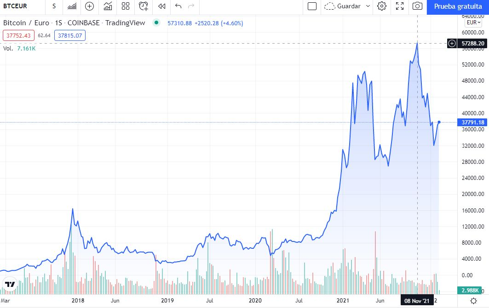
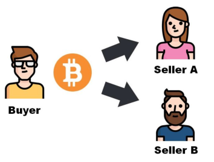
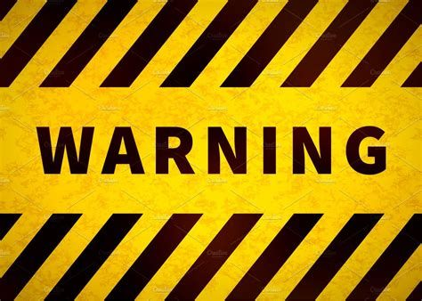
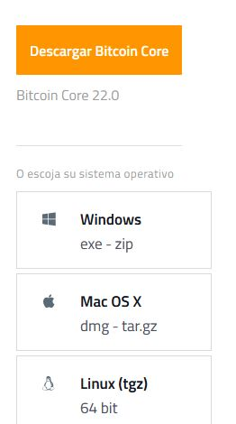
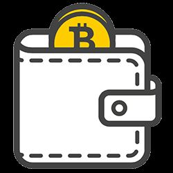
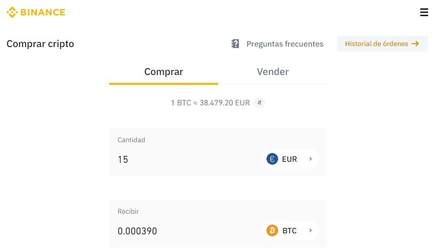
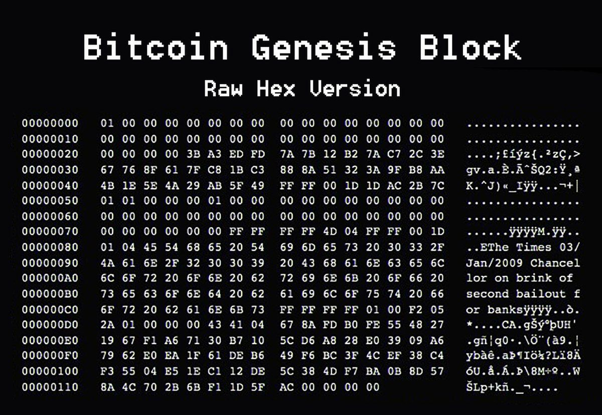

# Criptomonedas

¿Conocéis a alguien que tenga bitcoin u otro tipo de criptomoneda?
¿Qué pensáis que es una criptomoneda?

Bitcoin es a la vez el nombre de una red de ordenadores y el nombre de la moneda digital o criptomoneda

Existen muchísimas criptomonedas, cada una con una forma de funcionar ligeramente diferente
Cualquiera puede crear una criptomoneda

¿Por qué se han vuelto tan populares?

# Sistema financiero actual

- Bancos centrales y Gobiernos controlan cantidad de monedas en el mercado 
- Las transferencias se realizan a través de bancos
- Sistema monetario protegido y respaldado

## ¿Por qué se inventan las criptomonedas?

- Busca ofrecer un sistema de dinero digital entre ordenadores (P2P)
- Eliminar a los intermediarios del comercio online
- El sistema está formado por muchos ordenadores en todo el mundo
- Estos ordenadores se conectan entre ellos a través de internet
- Comparten la información de las transacciones entre ellos

## ¿Qué hacen los ordenadores que están en esta red?

- Los ordenadores crean las monedas periódicamente
- Comparten entre ellos toda la información
- Si un ordenador se apaga, el resto siguen funcionando

## Nodos de bitcoin

## ¿Cómo hacer que sea seguro?

- La red de Bitcoin está "garantizada" por algoritmos criptográficos
- Cada cuenta tiene asociadas unas claves que solo tiene el propietario de la cuenta
- Los ordenadores verifican y protegen la red
- A cambio, estos ordenadores reciben recompensas en forma de criptomoneda
- Si se pierden las claves, se pierde el acceso al dinero

## Criptomonedas

- El control de esta moneda no depende de bancos, entidades o gobiernos
- Las transferencias se realizan entre ordenadores directamente
- Estos ordenadores guardan la información financiera
- Criptomonedas. Han existido desde 1980. Los primeros, Digicash y Ecash
- Fallaron porque no proporcionaron una solución al problema del "doble gasto" 

Bitcoin (2009) resuelve el problema
A partir de entonces, aparecen muchas más criptomonedas.

¿De qué depende el valor de una criptomoneda?
El valor de la moneda depende de la oferta y la demanda

## ¿Qué beneficio aportan las criptomonedas?

- Reduce el coste de transacción
- Reduce tiempo de transacción
- Elimina la necesidad de agentes financieros

## ¿Qué problemas generan las criptomonedas?

- Falta de control y legislación
- Alta especulación
- Sistema en desarrollo
- Dificultad de operar con criptomonedas en el mundo real

## Bitcoin. La criptomoneda más popular

¿Cual es el origen?
- Bitcoin es un conjunto de tecnologías, así como el nombre de la moneda
- El sistema es de código abierto
- Desde 2009. Creado Satoshi Nakamoto (individuo/grupo anónimo)

## Funcionamiento

- Se basan en la tecnología blockchain
- La información económica se guarda en un libro de cuentas
- Este libro se distribuye entre múltiples nodos repartidos por Internet
- El libro se divide en bloques
- Los bloques se une entre ellos formando una cadena (Blockchain)

## ¿Quién controla el sistema?

- Bitcoin lo controlan todos los usuarios de Bitcoin del mundo. 
- Los programadores mejoran el software
- No pueden forzar un cambio en el protocolo de Bitcoin
- Usuarios son libres de elegir el software y la versión que quieran. 
- Para que sigan siendo compatibles entre sí, todos los usuarios necesitan utilizar software que cumpla con las mismas reglas. 

## Bitcoin. Explicación técnica

- Libro de contabilidad (ledger)
- El libro de contabilidad es público 
- Contiene la historia de todas las transacciones de bitcoin desde 2009
- Los nodos comparten información y crean bloques, manteniendo toda la estructura de bitcoin
- La red comienza a funcionar el 3 de Enero de 2009, con el bloque génesis

https://academy.bit2me.com/que-es-bloque-genesis/

## La cadena blockchain

- Este libro está formado por bloques
- Cada bloque contiene un conjunto de transacciones 
- Cada 10 minutos de media se crea un bloque nuevo 
- Este bloque, si se confirma, se añade al libro (cadena)
- Cada bloque contiene una referencia al bloque anterior 
- Se puede rastrear cada transacción desde 2009

## Dónde se guarda todo esto

- Este libro se guarda en muchos ordenadores
- Estos PC que tienen un software ejecutándose 
- Los PC que son nodos completos tienen la cadena de bloques completa (400 GB)
- Si un ordenador está apagado, cuando se reinicie, enviará un mensaje para obtener los bloques creados cuando la computadora estaba inactiva.
- Tamaño actual de blockchain es de 400 GB

# Cómo se lleva la contabilidad
Por lo general, pensamos que una transacción tiene un débito y un crédito (contabilidad de doble entrada)
Con Bitcoin, hay una tercera entrada. Cada transacción va a un depósito de conocimiento común.
Este repositorio o libro mayor público es altamente seguro y lo mantienen todos en la red.
El libro público es la última palabra, por lo que no puede haber desacuerdo sobre los débitos y créditos y no puede haber "gastos dobles".
El libro mayor público se llama "cadena de bloques"

# Seguridad. Clave pública y privada

La creación de una "cuenta bancaria" en la red global de Bitcoin genera una contraseña extremadamente larga, también conocida como "clave privada". Esta es imposible de adivinar para nadie más. 

Cualquiera, en cualquier lugar con acceso a Internet, puede recibir, enviar y mantener Bitcoin utilizando la versión pública de su clave.  Se puede compartir libremente para recibir fondos de forma segura

## Bitcoin

- ¿Dónde están mis bitcoin?
- ¿Cuántos bitcoin hay?
- ¿Cómo se crean?

## ¿Cuántos bitcoin se obtienen por crear un bloque?

- Las monedas se van creando poco a poco. 
- Cada vez que se crea un bloque se generan bitcoin
- Actualmente cada 10 minutos se crean 6.25 bitcoin
- Se ingresan en la cuenta del minero que crea el bloque correcto

## ¿Cuántos bitcoin existen?

- La producción se ralentiza con el tiempo
- La cantidad de nuevas monedas se divide por la mitad cada 4 años
- En **2140** se estima que se habrán creado todos los bitcoin
- El máximo de monedas que habrá serán **21.000.000 de bitcoin**. Ni más ni menos.

## Cuentas bancarias

- No existe una cuenta tradicional, como una cuenta bancaria donde el banco puede consultar su saldo
- En un banco tradicional creamos una cuenta bancaria 
- Con ese número podemos realizar pagos y recibir dinero.
- Esta cuenta a nuestro nombre, vinculada a nuestro DNI.
- El banco guarda la información sobre la cuenta, así como las operaciones que se han realizado

## Cuenta en bitcoin
Cada persona crea al menos una dirección. Una dirección de Bitcoin es un identificador de **33 caracteres** que representa una cuenta de Bitcoin. Las direcciones se generan usando una clave privada, que es un número aleatorio de 32 bytes.

Cada dirección de bitcoin tiene un par de claves pública y privada
Las claves se guardan en una monedero digital (wallet software)

El monedero se guarda en un programa, app o web Se accede a él con una cuenta de usuario.

- Para almacenar bitcoin, necesitamos unas **claves**
- Estas claves, se guardan en un monedero (**wallet**)
- Este monedero puede guardarse en smartphone, PC o USB
- Nosotros no guardamos dinero, sino las claves para acceder a él

https://bitcoin.org/es/elige-tu-monedero?step=1

# Algunos problemas

En ningún momento se asocia esta cuenta con unos datos reales
Si se pierden las claves, se pierde el acceso a la cuenta y, por tanto, el acceso al dinero

# Monederos (wallets)
Del mismo modo que podemos tener varias monedas distintas en una cartera
Podemos tener claves de varias criptomonedas en un misma billetera.

# Transacciones
Cómo se intercambian criptomonedas

## Transacciones

- Cada cuenta tiene una dirección pública 
- La cuenta no se asocia a una persona públicamente.
- Las transacciones son movimientos de dinero entre varias cuentas.
- El dinero se mueve de una cuenta a otra mediante transacciones
- Las transacciones son públicas, y cualquiera puede verlas
- Deben ser confirmadas para que tengan efecto.
- Parte del dinero pagado se descuenta para luego repartirse como recompensa (como una comisión)

## Validación de transacciones

- Cada vez que alguien quiere enviar bitcoin a otra cuenta, la transacción es validada por la red:
- Asegurarse de que la persona tenga los bitcoins para transferir
- Si la persona tiene los bitcoins, se agregan al libro
- Para asegurar el libro mayor, los mineros lo sellan detrás de un código computacional
- No puede haber doble gasto ni falsificación.

## ¿Cómo traspasar dinero?

- Cualquiera puede enviar a una dirección pública
- El método más fácil es crear un QR, que incluye la dirección y la cantidad
- Los pagos son irreversibles
- Los pagos tardan un tiempo en hacerse efectivos
- Se paga una comisión a cambio

## Bitcoin wallet

1. Monederos de escritorio: Los monederos de escritorio se instalan en una computadora portátil o de escritorio y le dan al usuario el control completo del monedero. Solo son accesibles desde la computadora individual en la que se descargan. Los monederos de escritorio ofrecen uno de los niveles de seguridad más altos, pero si su computadora es pirateada o obtiene un virus, es posible que pierda todos sus fondos.

2. Monederos en línea: Los monederos en línea son sitios web o aplicaciones que le permiten usar su servicio para almacenar sus monedas. Si bien son más convenientes de usar, se almacenan de forma remota y, por lo tanto, la seguridad no está completamente en sus manos.

3. Monederos móviles: Los monederos móviles son aplicaciones que puedes descargar en tu teléfono. Los monederos móviles te permiten llevar tus monedas a donde quiera que vayas y también te permiten gastar tus monedas en tiendas y establecimientos reales.

4. Monederos de hardware: Los monederos de hardware son dispositivos físicos que parecen unidades USB. Almacenan tus monedas sin conexión y lejos de amenazas potenciales y también te permiten gastar tus monedas en tiendas y establecimientos reales.

## ¿Podemos comprar bitcoin?

Puedes comprar bitcoin a través de **exchanges** online o a través de plataformas de peer-to-peer. 

- Los **exchanges** en línea funcionan de manera similar a las bolsas de valores tradicionales, donde compras y vendes bitcoin a través de una plataforma. La principal diferencia es que los exchanges en línea operan 24/7, lo que te permite comprar y vender bitcoin en cualquier momento. 
- Las **plataformas de peer-to-peer**, por otro lado, conectan directamente a compradores y vendedores. Esto significa que puedes comprar y vender bitcoin directamente de otras personas. 

- Podemos comprar bitcoin con euros, y venderlo a cambio de euros
- El tipo de cambio varía con el tiempo.
- Las personas que minan un bloque con éxito (mineros), se “autotransfieren” una cantidad fija de la nada

¿Existen unidades más pequeñas que un bitcoin?

## Creación de un bloque

- ¿Qué hacemos con las transacciones?
- Cuando se tiene un conjunto de transacciones, se crea con ellas un bloque con ellas
- Los mineros compiten por crear un bloque válido.
- Cada diez minutos de media se crea un bloque válido
- Una vez se crea un bloque válido, se agrega a la cadena de bloques existente.

## Recompensa al crear un bloque

Si su bloque sale adelante, las transferencias de dentro se confirman, y se lleva la recompensa.
Las recompensas van disminuyendo cada 4 años (50,25, 12.5, 6.25, etc).
A día de hoy (octubre de 2021) existen alrededor de 700.000 bloques creados

## Identificación de bloques

- El 3 de enero de 2009 se crea el primer bloque.
- Los bloques tienen un número que los identifica. 
- El bloque original es el bloque 0.
- En este bloque, la primera transacción es una cantidad de bitcoins creados nuevos a su cuenta.

Cadena de bloques (blockchain)
Los bloques se colocan uno encima del otro, formando una pila.
Cada bloque nuevo está formado a partir de información del anterior
Esta cadena de bloques se llama blockchain
Toda esta información, que ocupa actualmente 400GB, se guarda en múltiples ordenadores
Estos ordenadores se llaman nodos, y se van intercambiando la información
Bitcoin existe mientras todos estos nodos guardan copias de la información

## Minería

- El minado es una validación de las transacciones. 
- Por este esfuerzo, los mineros obtienen dinero como recompensa. 
- Esta recompensa disminuye las tarifas, creando un incentivo complementario para contribuir al poder de procesamiento de la red. 

## Progreso de la minería 

- Creación máquinas especializadas como FPGAs y ASICs. 
- Carrera por construir máquinas más baratas y eficientes
- Incremento en el número de mineros aumenta complejidad de la generación de hashes
- Mineros invierten grandes cantidades de dinero en máquinas especializadas. 

## Recompensas

- El sistema se sostiene gracias a recompensas. Las transacciones y los bloques dan recompensas.
- Los mineros dedican potencia de ordenadores a crear bloques a cambio de la posibilidad de ganar dinero
- Para este minado se necesita cada vez más potencia de computación

## El reto

- El sistema intenta que los bloques se vayan creando regularmente cada 10 minutos de media
- Para ello, pone un reto de dificultad que tarde un tiempo en poder resolverse
- Este reto consiste en crear un código utilizando criptografía llamado hash
- Este hash se genera a partir de información del bloque actual, y del anterior
- Cada hash identifica un bloque, y se calcula con el hash del bloque anterior.
- Crear un código hash requiere muy poco tiempo
- Para complicar la tarea, se pone una condición que el hash debe cumplir
- Se tienen que hacer muchas pruebas hasta hallar un hash válido
- Este cálculo es más rápido a medida que la potencia de los ordenadores aumenta
- Por ello, la dificultad se va ajustando poniendo una condición más estricta
- El nonce es el parámetro que hay que variar hasta conseguir un hash válido.

## Crear el hash

- Este hash se genera a partir de información del bloque actual, y del anterior
- Cada hash identifica un bloque, y se calcula con el hash del bloque anterior.
- Crear un código hash requiere muy poco tiempo
- Para complicar la tarea, se pone una condición que el hash debe cumplir
- Se tienen que hacer muchas pruebas hasta hallar un hash válido
- Este cálculo es más rápido a medida que la potencia de los ordenadores aumenta
- Por ello, la dificultad se va ajustando poniendo una condición más estricta
- El **nonce** es el parámetro que hay que variar hasta conseguir un hash válido.

Videos interesantes

- http://www.youtube.com/watch?v=44D9nVxqGIE
- http://www.youtube.com/watch?v=YBNr69vrscw

