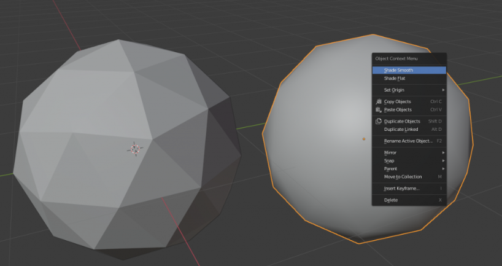

# Suavizar

El suavizado se refiere a la técnica utilizada para hacer que las superficies de los objetos parezcan más suaves y menos angulares. Cuando un objeto tiene aristas afiladas, se pueden aplicar técnicas de suavizado para suavizar esas aristas y hacer que la superficie se vea más continua.

En cualquier momento, puedes seleccionar un objeto.

- **Clic derecho** y podemos seleccionar
  - **Shade Smooth** para suavizar
  - **Shade Flat** para volver a ver sus cara

Esto también afecta a la hora de exportarlo.
