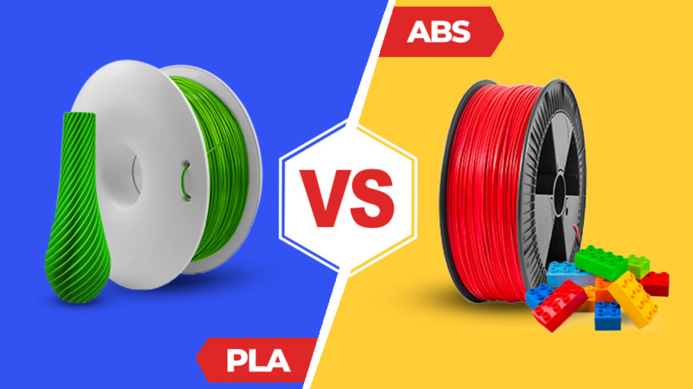
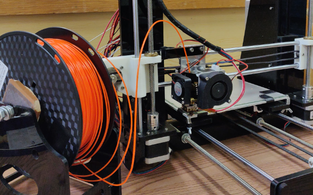

# Tipus de filament

Sembla que suporta filaments PLA i ABS. El **filament PLA** té una resistència mecànica relativament baixa, mentre que l'ABS té una major resistència mecànica. El fil de pla és més barat i més fàcil de treballar que l'ABS, mentre que l'ABS té una major resistència al impacte i a la temperatura. A més, el filament pla té una major elasticitat, mentre que l'ABS és més dur i rígid.

El diàmetre de filament que feim servir actualment és PLA de **1.75 mm** color taronja.

El diàmetre de boca **0.3 mm**.

