[🔙 Enrere](../) | [🏠 Pàgina principal](http://danimrprofe.github.io/apuntes/)

# 1. Impressió 3D

Hi ha diferents tècniques d'impressió 3D. La que treballarem nosaltres és la impressió amb plàstic PLA.

La impressora 3D de plàstic imprimeix models creats amb ordinador fonent progressivament **filament** de plàstic sòlid, fent-lo passar per un **extrussor** que el fon i fa que el fil de sortida sigui més prim.

Els 3 motors mouen l'extrussor en les 3 dimensions conegudes per a dipositar el filament on correspongui. Al poc, el plàstic solidifica i s'addereix a la resta de la figura.

La **base** s'encalenteix per a millorar l'adderència del plàstic fus.

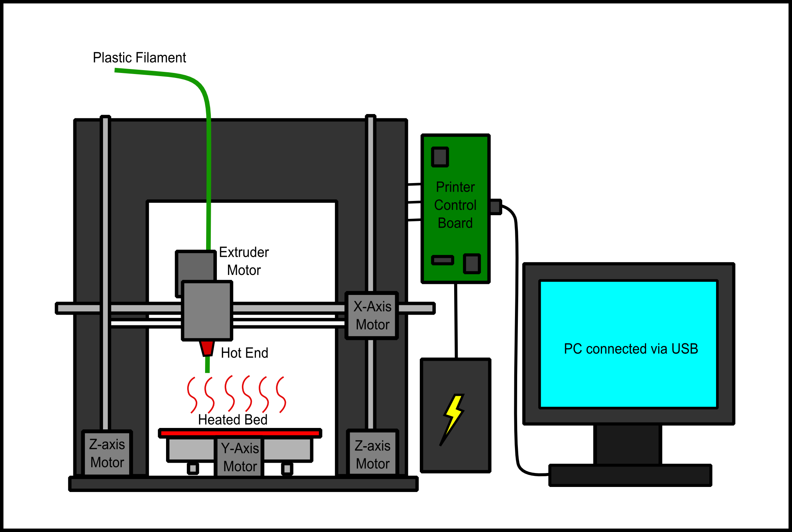

## 2. La impressora 3D


## La Impresora que tenim és una Prusa I3 Pro W.

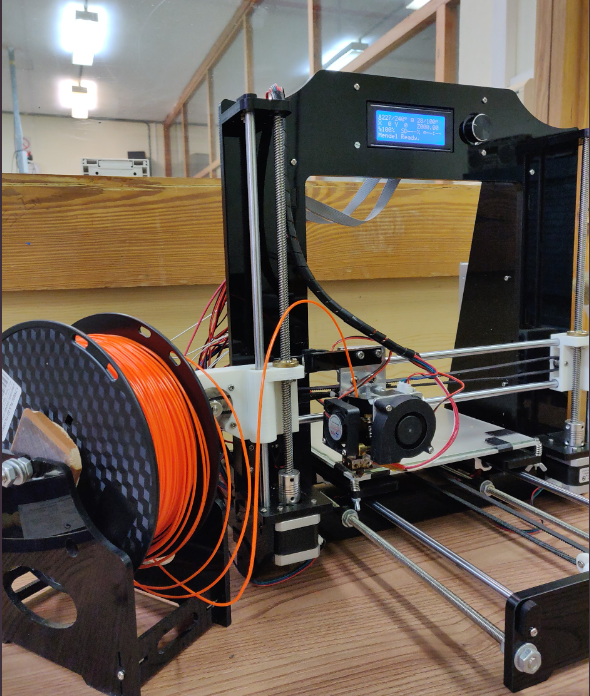

El llit es pot escalfar fins 110ºC . Es pot canviar en la configuració. La temperatura s'haurà d'ajustar a el tipus de plàstic utilitzat, ja que cada un té una temperatura diferent de fusió.


# 2. Què accessoris tenim per treballar amb la impressora

Al departament tenim un lector de targetes USB per a targetes SD

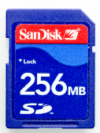

Dues targetes SD, de 256 MB i de 8 GB. La de 8 GB no m'ha funcionat, l'altra si. La de 256 ja venia amb diversos arxius d'altres anys.

Laca per fer a sobre del llit calenta parell que l'objecte adherència millor i no es deixi anar a meitat de la impressió


Una rasqueta per arrencar restes de plàstic del llit calent.

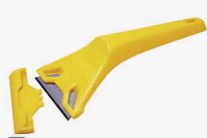

# 3. Tipus de filament

Sembla que suporta filaments PLA i ABS. El **filament PLA** té una resistència mecànica relativament baixa, mentre que l'ABS té una major resistència mecànica. El fil de pla és més barat i més fàcil de treballar que l'ABS, mentre que l'ABS té una major resistència al impacte i a la temperatura. A més, el filament pla té una major elasticitat, mentre que l'ABS és més dur i rígid.


El diàmetre de filament que feim servir actualment és PLA de **1.75 mm** color taronja.

El diàmetre de boca **0.3 mm**.


# 4. Posada en marxa i calibració

A la dreta de la màquina hi ha un  __botó d'encesa__  per posar en marxa la impressora.

Per manejar-la, hi ha un **panell LCD** amb una rodeta per desplaçar-nos per les diferents opcions i prémer-la quan vulguem entrar en una o acceptar.

El primer que he fet és provar que funciona, i per això he anat a prepari> autohome, i el extrusor s'ha col·locat en el punt inicial.

## Calibració

Necessitem calibrar la impresora abans de començar a imprimir per primer cop.

Aturar els  __motors stepper __ al menú LCD

En primer lloc cal  __calibrar l'eix Z__  i mirar que les dues barres estan a la mateixa altura amb un  __peu de rei__

A continuació __ calibrar les quatre cantonades __ del llit amb extrusor posant el foli al mig i girant les claus fins que fregui però passi el paper.


# 5. Crear un model STL

Per a imprimir un objecte amb una impressora 3d necessitem el seu disseny digital en un format d’ arxiu anomenat stl , que és l’estàndard per a la impressió 3d.


La majoria de programes de disseny 3d permeten guardar o exportar els nostres dissenys al format .stl.

Podem fer els dissenys amb programes com ara  _[Tinkercad](https://www.tinkercad.com/)_ .

També podem descarregar models de  _[Thingiverse ](https://www.thingiverse.com/)_ o altres repositoris d’objectes online


## Biblioteques d’objectes

Es poden descarregar models ja fets d’internet de diverses fonts:

- Thingiverse:  _[http://www.thingiverse.com/](http://www.thingiverse.com/)_
- Youmagine: _[ https://www.youmagine.com/](https://www.youmagine.com/)_
- Instructables: http://www.instructables.com/
- Myminifactory: http://www.miminifactory.com/
- Shapeways: https://shapeways.com/
- 3DHubs: https://www.3dhubs.com/
- http://www.123dapp.com/Gallery/content/all
- http://apps.microsoft.com/windows/en-us/app/3d-builder/75f3f766-13b3-45e9-a62f-29590d5781f2
- https://3dwarehouse.sketchup.com/?redirect=1

## Disseny d’objectes

_[``Blender``](https://www.``Blender``.org/)_ , programa professional molt complet. També permet crear animacions amb els objectes dissenyats. Tutorial.

_[Autodesk 123D](https://www.autodesk.com/solutions/123d-apps)_

_[SketchUp ](https://www.sketchup.com/)_ programa pensat per ser utilitzat de forma intuïtiva i flexible, fent que sigui fàcil el seu aprenentatge. Tutorial.

_[Tinkercad](https://www.tinkercad.com/)_  programa gratuït en línia creat per Autodesk. Materials de formació a Ateneu.

## Crear un modelo 3D desde una imagen vectorial e imprimirlo

Podemos crear una imagen .SVG, o directamente importar una a``Tinkercad``.

Dentro de``Tinkercad``,podremos cambiar el tamaño de los modelos importados, recolocarlos, etc.
Tendremos que exportar el archivo a un formato .STL que pasarle al programa Cura
Por último, en cura, generaremos un archivo .Gcode, que será el que pasemos a la impresora utilizando la tarjeta de memoria

# 6. Laminar l’objecte

El laminador dividirà l’objecte en fines capes horitzontals segons uns paràmetres, que defineixen les característiques físiques i d’impressió de cada una.

Jo he utilitzat el programari cura: [Pàgina web de cura](https://ultimaker.com/es/software/ultimaker-cura)

## Procediment

Carreguem l’arxiu de l’objecte (STL) que volem imprimir en un programa anomenat laminador o slicer.

En``Tinkercad``, podem exportar els dissenys com a STL i descarregar-los al nostre ordinador.

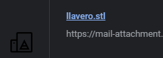

El resultat de tot aquest procés de laminat és un arxiu tipus **g-code** que conté tot un seguit d’ordres que la impressora 3d és capaç d’executar a fi d’imprimir el nostre objecte.

## Arxius GCODE

Els arxius GCODE són arxius de text que guarden la informació del camí que ha de seguir la impressora per tal de crear l'objecte.

```gcode
;LAYER:0
M107
G0 F3600 X76.842 Y80.735 Z0.3
G0 X73.736 Y87.423
;TYPE:SKIRT
G1 F1500 E0
G1 F1800 X73.804 Y86.792 E0.03166
G1 X73.897 Y86.15 E0.06403
G1 X74.147 Y85.094 E0.11817
G1 X74.516 Y84.045 E0.17365
G1 X74.815 Y83.422 E0.20812
G1 X75.234 Y82.679 E0.25068
```

Aquí podem veure l'aspecte del model, una vegada l'hem llaminat.

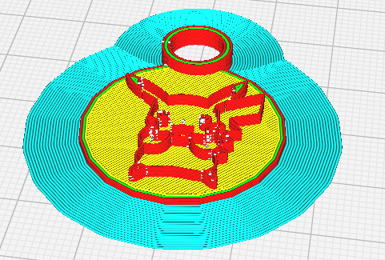

A més, ens informarà del temps d'impressió estimat, així com la quantitat de plàstic necessari. En aquest cas el temps estimat d'impressió és de 9 minuts, i gastarem mig metro de filament, aproximadament.

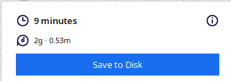

## Falda

La falda ens netejarà l’extrusor al començar

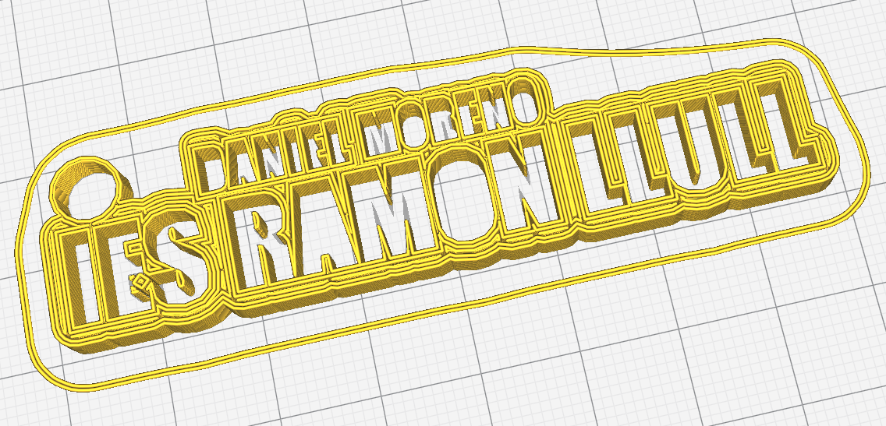

## Opcions de laminat

Les opcions més habituals a seleccionar per imprimir que solem utilitzar per la nostra impressora són:

- 0.2 mm de definició
- Parets: 3 i 1.2 mm (3 parets de 0.4)
- Velocitat d’impressió: 40 mm/s
- Farcit: 20%
- Marcar **generar soporte**

# 7. Imprimir model

## Carregar el model a imprimir

Ens caldrà un arxiu GCODE de la figura que volem imprimir.

Per a això, l'haurem de haver passat de l'ordinador a la targeta SD, i després insertar la tarjeta SD darrere de la pantalla LCD a l'esquerra (costa una mica trobar-lo)


## Imprimir

Després que tot l'ajust estigui bé, anar a  __autohome__

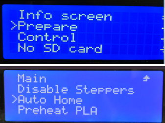

També podem preencalentir el plàstic prèviament sense començar a imprimir res. En aquest cas el llit i l'extrusor s'encalentiran fins assolir les temperatures fixades.


## Imprimir un model des de la tarjeta SD

Trieu el fitxer de la targeta SD per començar a imprimir.Triam el fitxer **gcode** que hem carregat a la tarjeta SD des de l’ordinador

En aquest moment, començaran a escalfar-se l’extrussor i el llit i, en arribar a la temperatura dessitjada, començarà la impressió.

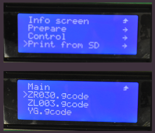

# 8. Problemes

## Problemes: obstrucció

Per tal de retirar material, vam haver de treure la peça i posar la impresora en mode  __preheat ABS__ , el que fa encalentir el heater a 240º.

Si no llevem la ventilació, la part que no està coberta pel heater es refredaria i el plàstic interior obstruit no arribaria a fondre.

Amb un cable elèctric rigid vam aconseguir fer pressió i que sortís per l’altre banda tot el plàstic que hi havia.

## Problemes: termistor

La impressora té dos sensors de temperatura ( __termistors__ ). Aquests varien la seva resistència en funció de la temperatura.


Les dues temperatures que ens interessen són la del heater i la del hot bed.

- Un termistor va aferrat sota el llit calent amb cinta i en mesura la temperatura.
- L’altre va enganxar al heater i també en mesura la temperatura.

Si qualsevol dels termistors detecta una temperatura anormalment alta, l’impressora donarà un error en pantalla per a evitar accidents.

# 9. Components de la impressora i friquisme

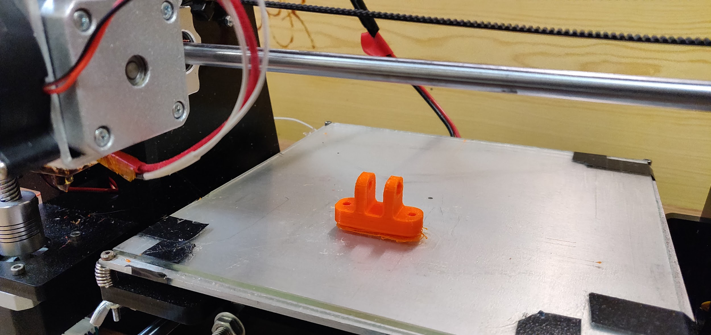

## Extrusor complet amb ventilador lateral

Vista de l’extrusor un cop desmuntat. A ma esquerra el  __ventilador __ que refreda la part del tub on va el filament abans d’entrar al heater. Això es fa per evitar que es fongui la part de filament superior i el filament es pugui empènyer amb més facilitat

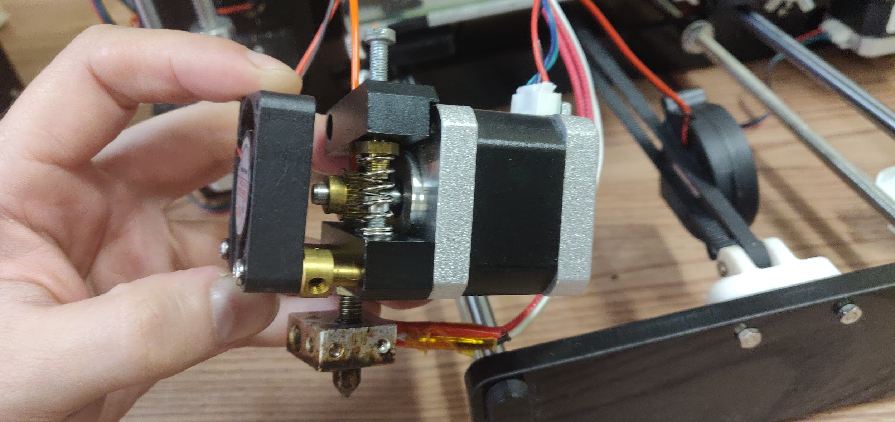

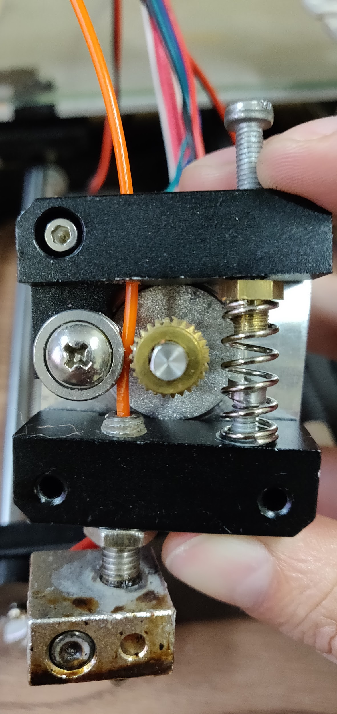

## Vista del mecanisme de extrusió

Aquí es pot veure un cop desmuntat  __l’__  __extrusor__  __ __ (va fixat amb un pern per sota), per on entra el filament, les rodes dentades el fiquen cap a dins.

El mecanisme dret permet amb un pern alliberar la roda dentada per a poder ficar el filament a ma fent pressió

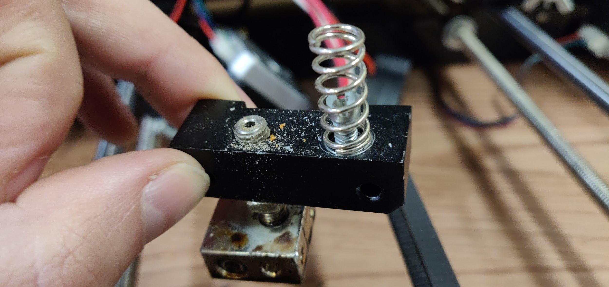

Encalentidor o heater

Boquilla o nozzer

## Encalentidor i boquilla

L’entrada té un interior de tefló, i l’encalentidor encalenteix el tros de filament abans de l’entrada a la  __boquilla extrusora__  (nozzle).

El cable vermell duu corrent per encalentir, i el blanc el termistor que mesura la temperatura.

Rosca per fixar a la base

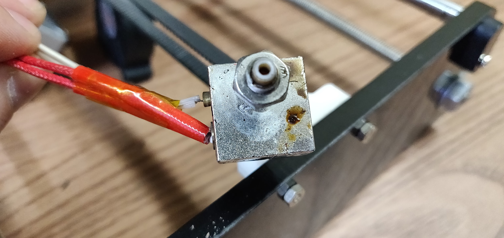

## Entrada de filament

Aquest pern de dalt serveix per alliberar el mecanisme i poder col·locar i extreure el filament.

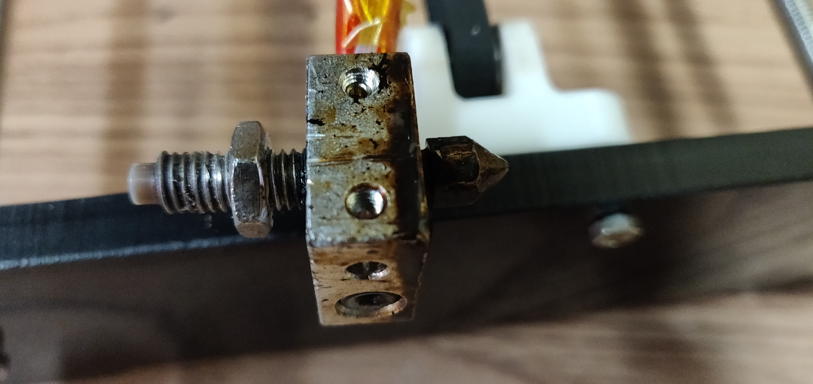

## Boquilla o nozzer

Aquesta peça li dona el diàmetre de sortida necessari al plàstic fus.

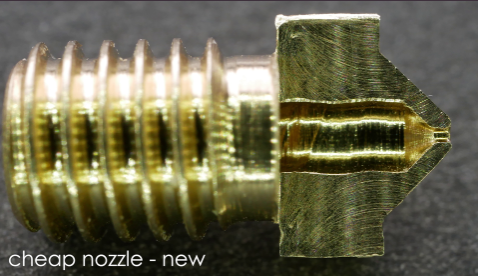

cables de corrent per encalentir

Encalentidor o heater

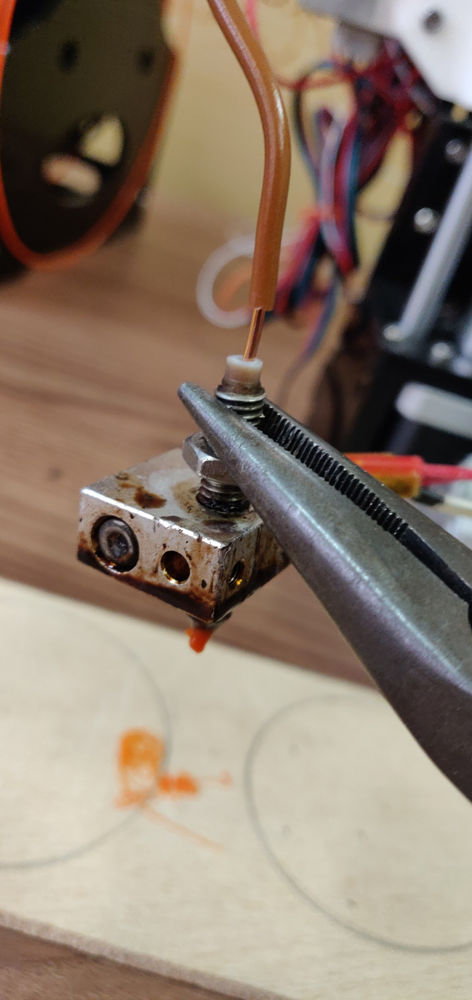