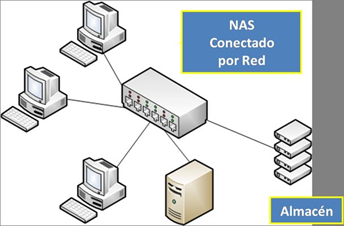
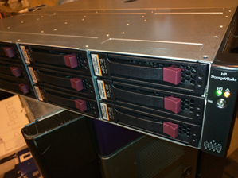

# Almacenamiento en red

Hasta el momento, te hemos mostrado sistemas de memoria auxiliar utilizados por un PC.

## Entornos profesionales

Raro encontrarse que los datos del usuario se almacenan en el propio equipo.

Volúmenes de almacenamiento PCs son considerables

Problemas de seguridad

- PC está sometido a ataques constantes de virus y troyanos
- Al estar conectados a una red eléctrica hace vulnerable el sistema de datos

Algunos trabajadores no tienen un puesto fijo de oficina (portátil)

### Solución

Las empresas recurren al almacenamiento en red. De este modo:

- Los datos de usuario dejan de estar en su propio equipo
- Se centralizan en servidores de ficheros a disposición de toda la red corporativa.

## Tipos de almacenamiento en red

Actualmente, para almacenar la información de un conjunto de usuarios, se recurre a sistemas de almacenamiento en red.

Son servidores de ficheros convenientemente dimensionados en:

- Capacidad (volumen total de datos que almacenan)
- Conectividad (velocidad a la que son capaces de transmitir la información).

Problema del almacenamiento en red

- Acceso a la información
- Estructurar las redes para que se pueda realizar una comunicación eficiente entre las partes.

Existen tres configuraciones posibles:

- DAS, NAS y SAN.

## DAS o almacenamiento conectado directamente

Es un sistema de almacenamiento directamente **conectado a un equipo**

La conexion puede ser PATA, SATA, eSATA, SCSI, etc.

Es el propio equipo el que tiene que gestionar las peticiones de información, al tiempo que las deriva al dispositivo de almacenamiento.

Ventajas:

- Sistema económico y sencillo de instalar.

Problema:

- Ineficiente, al tener que gestionar un equipo todo tráfico desde/hacia la red.

## NAS  o almacenamiento conectado a red

Se trata de un sistema de almacenamiento **directamente conectado** a la red.

Un sistema NAS comparte un conjunto de ficheros con uno o más servidores de la red y el resto de equipos.

La conexión se realiza mediante cable de red

En la red se crean dos tipos de equipos:

* Servidores de aplicaciones
* Servidores de datos.

Ventaja:
Centralizado, todos los datos a disposición de toda la red.
Problema:
A medida que se aumente el número de equipos, la red puede saturarse.

### Problemática NAS

¿Qué sucede cuando aumenta el número de clientes?
Compiten por el ancho de banda con las cantidades relativamente grandes de datos que se mueven entre los servidores y el NAS
El rendimiento se resiente.
¿Cómo resuelve este problema una SAN?
Utilizando una red súper rápida, a menudo óptica, en el "área de almacenamiento“
Aisla servidores y dispositivos de almacenamiento en la SAN
Entrega datos rápidamente, a veces superando al DAS.

## SAN o red de almacenamiento

Se trata de un método para redes de gran tamaño.

Conlleva un coste de implementación es muy elevado.

Se crean 2 redes diferenciadas

- 1 red de los equipos de trabajo
A la que también se conectan los servidores
- 1 red separada de altas prestaciones
Interconecta los almacenes de datos con los servidores y entre si (malla de fibra óptica o similar).

### Ventajas y desventajas

Ventajas:

- Sistema centralizado, independiente, altamente escalable
- Permite separación geográfica (fibra óptica) de los almacenes de datos.
Desventajas:
- Sistema redundante de cableado
- Dispositivos más caros, mantenimiento costoso
- Gran complejidad técnica

### Características necesarias

Información que debe ser consultada o almacenada constantemente
Tiempo de acceso crítico para el buen funcionamiento.
Información guardada como histórico o copia de seguridad.
La fiabilidad es fundamental
Capaces de almacenar grandes cantidades de información

### Servidores de ficheros almacenan la información

En discos duros de altas prestaciones
Configurados en RAID (varios discos duros trabajando en espejo y/o conjuntamente).

