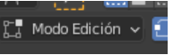
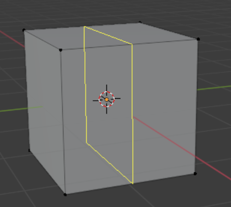
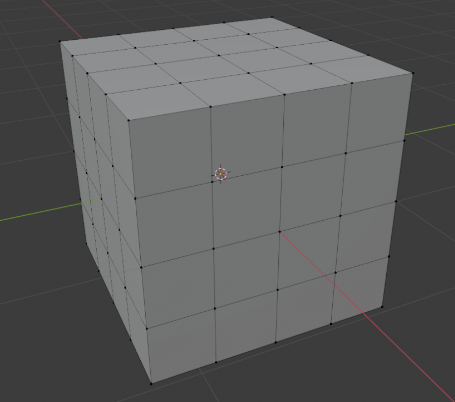
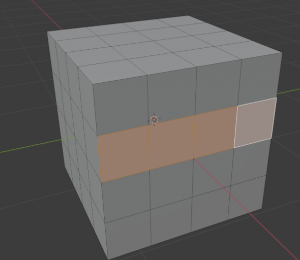
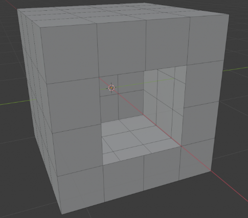
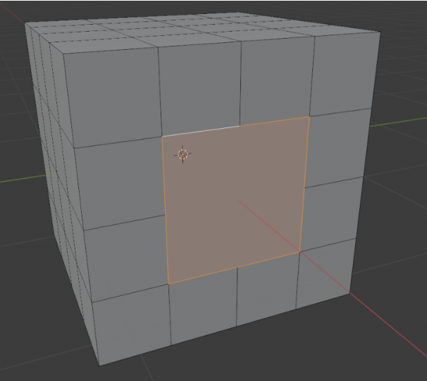

# 1. Modelado

El modelado en diseño 3D es el proceso de creación de una representación tridimensional de un objeto a través de la manipulación de modelos en un software de diseño 3D. Esta técnica se utiliza para crear objetos tridimensionales que se pueden manipular y animar.


## Objetos iniciales

- El proyecto nuevo siempre incluye un objeto **cubo**.
- El cursor 3D (que veremos más adelante) en medio
- A la izquierda la **cámara principal**
- A la derecha la **luz** que viene por defecto.

## Modo objeto y modo edición

Cuando colocas un objeto en Blender, entra en escena en **Modo objeto**. Básicamente hay 2 estados en Blender: Modo de edición y Modo de objeto.

- El modo de edición está diseñado para modificar la forma del objeto seleccionando vértices en el objeto.
- El modo de objeto afecta al objeto como un entero.
- El botón de <kbd>Tab</kbd> cambia entre los dos. También puede ver y cambiar su modo en la parte inferior de la ventana gráfica.

Después de insertar un objeto en tu escena, siempre asegúrate de estar en **Modo de objeto**. De lo contrario, el siguiente objeto que crear se unirá a esa malla

## Seleccionar

- Seleccionar vértice / arista / cara: **1, 2, 3**
- Seleccionar todos los objetos: **A**
- **++ctrl++** apretado y **clic izquierdo** para varios objetos
- Invertir selección: **++ctrl++ + I**
- Para seleccionar con rectángulo **B**, con círculo **C**
- Con **W** cambiamos entre diferentes modos de selección.

## Seleccionar varias caras o filas

Si tenemos un objeco con varias caras:

- <kbd>Mayús</kbd> para ir seleccionando varias caras juntas
- <kbd>++ctrl++</kbd> y clic en una cara para seleccionar toda una fila
- Recuerda que con <kbd>A</kbd> lo seleccionas todo.

## Transformación

Lo siguiente que vamos a ver es cómo modificar las propiedades básicas de los objetos 3d esto como os digo vale para absolutamente cualquier programa de 3d no sólo para Blender y es que los objetos tridimensionales tienen tres características básicas que son:

- La posición
- La rotación
- La escala

Para modificarlas:

- G para la posición
- R para la rotación
- S para escalar (cambiar tamaño)
- E para extriuir
- Inset (insertar una cara dentro de otra): I

Si queremos hacer alguna operación en un plano concreto:

- S y X: Escalar en el eje X
- G y Z: Mover en el eje Z

Podemos indicar también las unidades a mano:

- Si queremos rotar 90 grados en el eje **R X 90**
- Si queremos escalar 10 en el eje Y: **S Y 10**

Colocar el puntero lejos del centro del plano para poder tener más recorrido.

- Borrar objeto seleccionado: X

## Duplicar objeto

-++shift+++ D crea objetos independientes
-<kbd>Alt</kbd>+ D para objetos conectados. Los cambios que hagas en uno afectarán al otro.

## Ejes

- Eje X representado por la línea roja
- Eje Y con la línea verde
- Eje Z representado por una línea azul que no puedes ver.


## Vistas

Vamos a ver el tema de la cámara si en nuestro en un pad le damos al uno tenemos una visión frontal desde el infinito vale

- <kbd>3</kbd> para visión lateral desde la derecha
- <kbd>7</kbd>  para visión desde arriba
- <kbd>9</kbd>  nos lleva a la justo contraria
- Vamos tomar el 8 el cuadro el 2 y el 6 como si fuese mover la vista en un videojuego como las teclas de arriba abajo izquierda derecha
- si le damos al 6 la cámara se ha movido hacia la derecha al 8 y al 2 y por último
- <kbd>5</kbd>  para modo perspectiva ortográfica
- <kbd>0</kbd>  vista desde la cámara y 0 otra vez nos saca
- Si le damos a la coma </kbd>  ,</kbd>  nos centra en la vista

## Cambiar el cursor

- Seleccionando un objeto y pulsando Mayúsculas + S
- Seleccionando **Cursor to selected** o pulsando la tecla 2, luego vuelve añadir una figura y aparecerá en el centro del cursor

## Cortar una figura (Loop cut)

```
Nota: tenemos que estar en el modo edición
```



Podemos crear cortes transversales en nuestra figura.

- Con <kbd>++ctrl++</kbd> + <kbd>R</kbd> entras en el modo de corte transversal
- Mueve el ratón para seleccionar uno u otro
- Antes de hacer Clic izquierdo puedes mover la rueda del ratón para añadir o quitar segmentos
- Confirma con Clic izquierdo y te la la opción de **desplazarlos**, si los quieres donde estaban pulsa **Clic derecho** y se crean los cortes.



## Modo cuchillo

1. Con K entras en el modo cuchillo
2. Aparece una línea que separa las caras por donde dibujes la línea.
3. Si dejas pulsado el ratón sobre la opción de cuchillo puedes seleccionar la herramienta de bisección.
4. También puedes hacerlo pulsando: ++shift+++ Espacio (que muestra las herramientas)
5. A continuación, Mayúsculas + 2.

## Suavizar

En cualquier momento, puedes seleccionar un objeto.

- **Clic derecho** y podemos seleccionar
  - **Shade Smooth** para suavizar
  - **Shade Flat** para volver a ver sus cara


Esto también afecta a la hora de exportarlo.

## Rellenar

- Teniendo un polígono lo podemos rellenar con <kbd>F</kbd>

Si tenemos un agujero:

- En modo arista con 2
- Pulsando<kbd>Alt</kbd>+ CI sobre uno de los vértices del agujero creado
- Se seleccionará automáticamente todos los vértices que estén unidos alrededor del agujero.
- Luego pulsando F, directamente te rellenará el espacio vacío entre la selección con una nueva cara.

## Crear línea entre 2 vértices

Si quisieras crear una nueva línea entre 2 vértices, lo puedes hacer seleccionando los vértices que quieras y pulsando J para crear una nueva arista.

Creando una nueva arista desde 2 vértices y dando lugar a 2 caras.

## Subdividir

Otra opción de gran utilidad puede ser subdividir las caras de un objeto, para ello limpia la escena y crea un cubo, luego entra en modo edición con Tab.

Después activa el modo selección de cara con 3 selecciona todo con L estando encima del objeto, y pulsando Clic derecho sobre subdividir. Hazlo un par de veces para que te siga comentando algunos consejos. Debe quedar algo así.



Para seleccionar varias caras, como ya hemos visto, puedes pulsar sobre una de ellas y luego con Mayúsculas ir seleccionando el resto, pero si quieres seleccionar una fila completa, puedes pulsar sobre una cara y con Control pulsando en la final te seleccionaría todo.



Ahora vamos a ver otra cosa, quita la selección y selecciona solo las 4 caras del medio de la vista frontal, luego con X selecciona Borrar caras para eliminar esas 4 caras y poder ver el interior del cubo.



Ahora una forma fácil de rellenar esa cara es entrando en modo arista con 2 y luego pulsando Alt + CI sobre uno de los vértices del agujero creado, de esta forma te seleccionará automáticamente todos los vértices que estén unidos alrededor del agujero. Luego pulsando F, directamente te rellenará el espacio vacío entre la selección con una nueva cara.



Si quisieras crear una nueva línea entre 2 vértices, lo puedes hacer seleccionando los vértices que quieras y pulsando J para crear una nueva arista.

