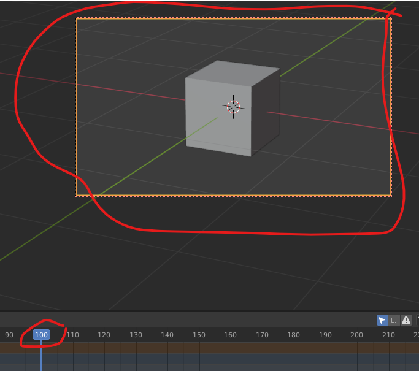
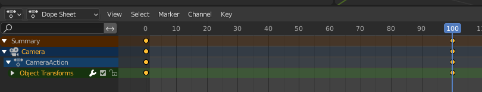

# 3.1 Animación personalizada de cámara

Vamos a hacer que la cámara se mueva alrededor de la escena, mientras que el objeto permanecerá fijo. En este caso, nosotros indicaremos todos los movimientos que va a seguir la cámara.

```
En resumen, lo que haremos será tomar "fotos" de la escena desde diferentes ángulos
en momentos determinados, y Blender calculará los movimientos a realizar entre los dos puntos.
```

## Crear una cámara

Si necesitamos crear una cámara, para ello hacemos <kbd>shift + a</kbd> y elegimos crear cámara.


Por defecto la cármara nueva Blender la colocará en el centro de la escena. Si tenemos algún objeto ahí puede ser que no veáis la cámara porque este lo esté tapando.

## Ver el punto de vista de la cámara

Podemos darle al 0 para irnos a la vista desde la cámara. También podemos seleccionar el icono de cámara arriba a la derecha.


Como veis si intentamos movernos nos salimos de la cámara. También podemos pulsar 0 para salir de la vista.

## Modificar la posición

La cámara la podemos mover como cualquier objeto, por ejemplo haciendo <kbd>g x</kbd> o <kbd>g z</kbd> para moverla en estos ejes.

También podemos colocarla con la tecla <kbd>n</kbd> y variando los parámetros de posición y rotación a mano. Tal como loe hemos hecho, hemos distanciado la cámara 10 metros en el eje y, y la rotación de 90 grados respecto al eje X.


A continuación podéis ver como queda la escena con estos parámetros. Recordad que cada cuadrado mide 1m por lado en Blender, por lo que os podéis hacer una idea de las distancias.


## Mover la cámara con nosotros

En ocasiones es más fácil animar la cámara si hacemos que nos siga a nosotros. Para ello, con la cámara seleccionada y la tecla <kbd>n</kbd> , a continuación seleccionamos view y lo que es camera to view. Ahora cuándo movamos la vista también se mueve nuestra cámara, que nos seguirá.


## Configuración de la cámara

En la configuración de cámara le damos poner que queremos una distancia focal de 120 milímetros (mm)

Vamos a componer nuestra imagen de esta forma vale la animación que quiero que haga la cámara es muy simple simplemente quiero que haga una especie de órbita.


## Insertar fotogramas clave

Los frames son las fotos que componen un video.

- Cuantos más frames en un segundo, más fluida se verá la animacion.
- Si tenemos un framerate de 30 fps y grabamos 120 fps, nuestra animación durará 4 segundos.

**¿Qué es un fotograma clave o keyframe?**

Un keyframe es en realidad una marca que guarda la posición, escala, rotación y opacidad de un objeto en un momento específico de la escena. Si creas más de dos keyframes con una variación de posición, escala, rotación y opacidad entre ellos, verás que automáticamente ocurrirá una animación

Si le damos al 0 nos ponemos en la vista la cámara, y veremos que si nos movemos, la cámara nos sigue.


Lo que vamos a hacer para ello va a ser un aquí al primer fotograma le vamos a dar con nuestra cámara seleccionada aquí le damos a la i y esto nos va a insertar un keyframe un fotograma clave le vamos a localización y rotación


Vamos a avanzar 100 fotograma movemos un poquito la cámara e insertamos otro fotograma localización y rotación



 Si ahora le damos al play ya tendríamos nuestra animación hecha. Veréis que la animación no se detiene en el 100, por lo que la tendremos que parar nosotros.

Analicemos el timeline

Aquí vemos que el único objeto animado ha sido la cámara. De hecho, el cubo sigue en su sitio.



Si ampliamos podemos ver la siguiente información. Tenemos dos **keyframes**

- Uno en el 0. Es la "foto" de nuestra escena en ese momento.
- Otro en el 100. Aquí las posiciones de los objetos habrán cambiado.

En medio, Blender calculará (extrapolará) todos los frames intermedios que conducirán al movimiento entre esas dos posiciones.


