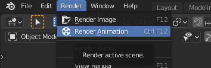

# Renderizado

Renderizar es el proceso mediante el cual se crea un archivo de imagen o película definitivo a partir del diseño que estamos realizando.

El proceso de renderización es importante porque nos permite visualizar el resultado final de nuestro trabajo y asegurarnos de que se vea exactamente como lo queremos. También nos permite generar un archivo de imagen o película que se puede compartir con otros o utilizar para otros fines.

Antes de renderizar es importante elegir los parámetros necesarios como:

- El motor de renderizado
- La resolución y tasa de frames de renderizado
- El lugar en el que se guardará el archivo de video final.

## Motor de renderizado

El renderizado 3D es un proceso computarizado y, por lo tanto, requiere de una gran cantidad de **recursos**. Es importante tener en cuenta esto al seleccionar el software de renderizado adecuado, ya que algunos programas son más exigentes en cuanto a los recursos necesarios que otros.

En general, el renderizado 3D es un proceso largo y complejo. Sin embargo, existen algunas formas de acelerar el proceso de renderizado, como la utilización de un PC con una tarjeta gráfica potente o el uso de un servidor de renderizado en la nube.

## Eligiendo el motor de renderizado

Para renderizar estamos usando el motor de renderizado **eevee** que es el más rápido, aunque también tendríamos el **cicles** que éste es más realista pero también lleva mucho más tiempo de renderizado

## Parámetros de renderizado

Lo que vamos a hacer va a ser irnos a este segundo icono aquí tenemos el tamaño, los fotogramas, fotogramas por segundo, cuánto queremos que dure.

Vamos a configurar los siguientes parámetros

- Resolución FullHD
- Frame inicio y finalización
- Ubicación del archivo guardado
- Formato
- Contenedor
- Códec de video
- Calidad

## Renderizar animación

Por último, vamos a renderizar el vídeo. Aquí es cuando tendremos que esperar más o menos tiempo, en función de la duración del vídeo, calidad y la tasa de frames, entre otros factores.

