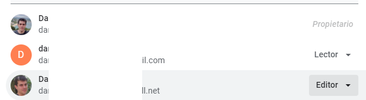
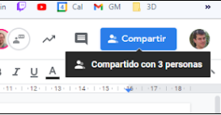

# Permisos en unidades compartidas: colaborador, comentador, lector y administrador

A modo de resumen, en unidades compartidas, de más a menos restrictivo, tenemos los siguientes roles:

El **usuario** lector solo puede ver el contenido de archivos y carpetas, y nada más

El **comentador**, además de ver puede escribir comentarios dentro de los archivos

El **colaborador** puede:

* Crear y editar nuevos archivos y carpetas, y agregar usuarios para que puedan ver ciertos archivos.
* Mover archivos desde su unidad personal a la unidad compartida.
* No puede mover archivos y carpetas de sitio, ni puede borrar archivos, pero sí sacarlos de la papelera.

El gestor de contenido además puede

* Borrar archivos, que se irán a la papelera, pero no destruirlos definitivamente.
* Mover archivos y carpetas dentro de la misma unidad compartida.

Por último, el administrador puede:

* Mover archivos entre varias unidades organizativas
* Agregar nuevos miembros a la unidad organizativa, así como darles diferentes roles.
* Borrar definitivamente archivos de la papelera.

## ¿Qué permisos tiene un documento nuevo cuando lo comparto?

Todo comienza al crear el documento. Si el documento es nuevo, normalmente nadie lo puede ver ni modificar a no ser que lo compartamos primero:

Al pasar el ratón por encima del botón se puede ver con cuántas personas la ha compartido, y si hacéis clic en en el botón azul compartir, puedes compartirlo con más gente para que pueda verlo o colaborar editándolo.

# ¿Cómo cambiamos los permisos de editores, lectores y comentadores en Google Suite (drive, docs, etc.)?

Dando a la rueda dentada (configuración) en esta pantalla arriba del todo, podemos cambiar alguno opciones, que son las siguientes. Desmarcando las casillas, podemos hacer que los lectores no puedan descargar, imprimir o copiar (por defecto si pueden), o que los editores puedan compartir el archivo otra vez, por ejemplo.

## Posible organización

En caso de que tengamos muchas unidades compartidas. Podríamos tener:

* Un **administrador** que podría mover cosas entre diferentes unidades compartidas, y agregar y eliminar gente a las unidades.
* Un gestor de **contenidos** si solo trabaja en esa unidad compartida, o en varias pero no tiene que mover cosas entre ellas. Puede organizar la estructura de carpetas y archivos, y borrar archivos.
* Varios **colaboradores** que solo podrían crear archivos, o moverlos desde su unidad personal.
¿Qué pasa si un usuario deja una unidad compartida?

Los archivos siguen en la unidad, y este usuario sigue siendo el propietario, aunque él no podrá verlos. Para encontrar estos archivos, se puede buscar en la caja «is:unorganized».
