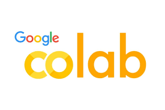
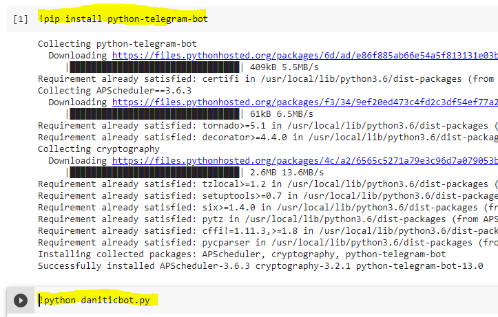
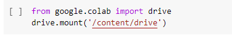
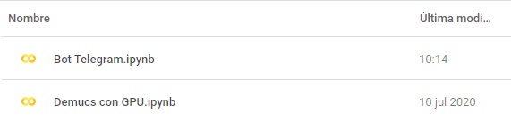

# Google colab

A través de un proyecto de prueba creado en Python, me surgió la necesidad de ejecutarlo en algún servidor. Existían varias alternativas:

1. Ejecutarlo en el ordenador localmente utilizándolo como servidor, lo que requiere tener el ordenador en marcha.
2. Crear una máquina virtual en una nube, configurarla y subir allí el código. Necesitamos una cuenta de Amazon AWS, Google Cloud o similares. Las máquinas son limitadas y el uptime también.
3. La tercera vía: probando Google Colab

## Ejecutando código Python en Google Colab

La tercera alternativa es Google Colaboratory, (también llamado Google Colab hace tiempo que lo vengo probando y me vino bien. Asociado a una cuenta de Google, nos ofrece un entorno para crear configuraciones y ejecutarlas en una máquina de la nube de Google.

Estas configuraciones son parecidas a un script que podríamos crear a mano para ejecutar en un Shell (bash o powershell, p.e.) al iniciar la máquina y que nos instalaría todas las aplicaciones, librerías y dependencias necesarias para arrancar el servicio, previamente a ejecutar los programas que queramos.

## ¿Qué ventajas aporta Google Colab?

Google Colab lo hace más fácil mediante la creación de **cuadernos** (notebooks). Estos cuadernos nos permiten meter comandos de shell, al mismo tiempo que texto explicativo intermedio. Del mismo modo, podemos ejecutar las líneas de comando independientemente y, una vez que lo tengamos todo, se ejecuta sobre una máquina virtual preconfigurada para nosotros.

## Un ejemplo de cuaderno en Google Colab

En este caso hay dos pasos: una instalación del paquete python-telegram-bot, que utilizaré en mi script posterior, y uno que es la ejecución del script. En este instante, el paso 1 ha finalizado y a continuación se hará el 2, siempre que el 1 haya tenido éxito.

La siguiente vez que haga una ejecución completa, la primera instrucción saltará puesto que la librería ya está instalada desde la primera ejecución

Además, podemos acceder mediante una API a nuestra carpeta de Google Drive para cargar archivos o guardarlos (en el caso de resultados).

## ¿Dónde se guarda todo esto?¿Lo puedo compartir?

Estos cuadernos se guardan automáticamente en la plataforma, a través de nuestra cuenta de Google Drive o también en GitHub, y se pueden compartir como cualquier otro archivo.

