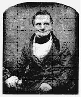
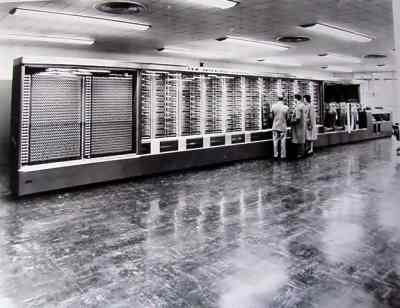
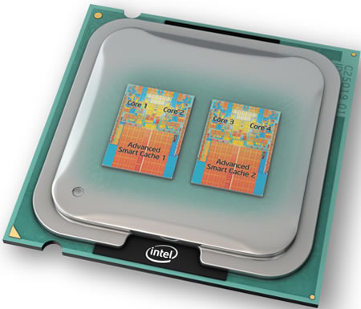

# Historia de los ordenadores

## Evolución histórica

Las computadoras, entendidas como máquinas para procesar datos, no son un invento reciente ni mucho menos, sino que tienen detrás una  _larga historia _ y un proceso evolutivo\.

Grupos de personas, muchas caídas en el anonimato o el olvido, han contribuido aportando algún tipo de avance o mejora\.

El hombre siempre ha buscado disponer de instrumentos al principio, y dispositivos después, capaces de  _efectuar cálculos precisos y rápidos_  _\. _

## Prehistoria

Piedras y dedos

## Ábaco

Antes de 3\.000  A\.C\.

Primer instrumento para facilitar el cálculo: ábaco\.

Puede ser considerado como el origen de las máquinas de calcular\.

A pesar de su antigüedad se sigue usando en algunos países orientales

## Era mecánica (generación 0)

Siglo XVII

* En Europa, hacia el siglo XVII, el creciente interés por nuevas ciencias como la astronomía y la navegación impulsó el desarrollo de lo que se denominaron las calculadoras mecánicas\.
* __1614: John Napier __
  * Inventó las tablas logarítmicas que permitían efectuar complejas multiplicaciones como simples sumas\.
* __1642: Blaise Pascal __
  * Crea máquina mecánica capaz de sumar y restar
  * Sistema de ruedas dentadas
  * La llamó  _Pascalina_ \.
* __1671: Leibnitz __
  * Le agregó la posibilidad de multiplicar y dividir\.

Pascalina

Pascalina

## Máquina analítica de Babbage

* Fue ya en el siglo XIX cuando se dio un nuevo empuje evolutivo
* _Charles Babbage _
  * Diseñó la primera computadora de uso general, llamada “Máquina Diferencial” y posteriormente una segunda llamada  __Máquina Analítica__  \(1834\)
* _Lady Ada Byron _
  * Se interesó por los descubrimientos de Babbage
  * Le ayudó e hizo una serio de aportaciones que la llevaron a ser considerada la primera mujer programadora\.

Máquina analítica de Babbage

La máquina analítica recibía los datos con los que se iba a trabajar por medio de  _tarjetas perforadas_ \.

La máquina ejecutaba las instrucciones que  indicaban que hacer con los datos proporcionados, para obtener los resultados deseados\.

## Evolución histórica

Las generaciones

* El sistema  _binario_ , basado en ceros y unos, es el que daba soporte al ordenador\.
* Se hacían necesarios dispositivos electrónicos que permitiesen  _almacenar_  esa información\.
* Dispositivos biestables\. Su evolución electrónica de los mismos fue determinante en los siguientes pasos que se dieron\.
* Avances en el mundo de la electrónica impulsados por la segunda  _guerra mundial_
* A partir de los años 40
  * La historia de los ordenadores se clasifica por distintas etapas llamadas  _generaciones_
  * Están caracterizadas por los diferentes componentes que dan soporte a los biestables\.

Las generaciones

## 1ª generación \(1940\-1956\)

* _Definición_
  * Primeros grandes ordenadores basados en arquitectura  __Von Neumann__
  * Considerados instrumento _ _ armamentístico _ _ durante la  __2ª Guerra Mundial__
  * Destacan máquinas como la  __ENIAC__  o la EDVAC
* _Características principales_
  * Tecnología basada en  __válvulas__  _ _  __de vacío __ \(sustituyó a los interruptores electromecánicos\)
  * Empleo de computadoras con  __fines militares__  _ _  __y__  _ _  __científicos__  _\._
  * Máquinas muy  __grandes y pesadas__ , muy lentas en sus procesos \(días\)
  * Aún así podían llegar a efectuar unos 5\.000 cálculos por segundo\.

1ª generación \(1940\-1956\)

Después de casi cien años de  _Babbage_ , en 1944, se construyó en la  _Universidad de Harvard _ la computadora  _Mark I_

Diseño fue dirigido por  _Howard H\. _  _Aiken_  _\. _

_Características_

15 m de largo y 2,5 m de alto

5 toneladas

800 Km de cables _ _

* En 1947,  _John Mauchly _ y  _John _  _Eckerz_
  * _Universidad de Pennsylvania_
  * _Electronic _  _Numerical_  _ _  _Integrator_  _ And _  _Calculator_
  * Primera computadora digital electrónica de la historia\.
* __Características__
  * 140m2, 30 toneladas, poseía mas de 18,000 tubos de vacío, consumía 200 KW
  * Capaz de efectuar aproximadamente 5\.000 operaciones aritméticas en un segundo\.

_Novedades_

Datos que se representan en forma  __digital__

Interruptores que son  __electrónicos__ , no mecánicos

Memoria separada del procesamiento

Uso de reglas de números lógicos y  __binarios__ \.

_Dos problemas importantes_

Tasa de fallo de tubos de vacío era muy alta

Instrucciones debían ser alimentadas  __manualmente__  mediante el  __interruptores y cables de conexión__  en los paneles de control llamados tableros\.

### John Von Neumann (1940)

Propuso una forma de superar esta dificultad\.

Concepto de **programa almacenado**

Almacenar tanto instrucciones como datos en la memoria de la computadora\.

## EDVAC (1949)

Los principios de Von Neumann estimularon el desarrollo de la primera computadora de programa almacenado en los EEUU, la  _EDVAC_

Electronic Discrete Variable Automatic Computer

Instrucciones almacenadas disminuyeron el número de operaciones manuales necesarias \.

Este desarrollo marcó el comienzo de la era moderna de la informática y la sociedad de la información\.

## 2ª Generación (1956-1963)

Esta etapa coincide con la aparición del  __transistor__  \(1956\)

Las funciones del transistor son similares a las de las válvulas de vacío

Conllevan ahorro significativo en  __tamaño y consumo\.__

* Tecnología basada en  __transistores__
  * Más pequeñas y menor consumo
* Computadoras con  __fines comerciales __ \(IBM 7090\)
* Empleo de los primeros  __periféricos__ \.
* Aparece el concepto de  __supercomputadora__
  * Ordenador con capacidades de cálculo muy superiores a las comunes según la época\.
* Aparecen los primeros  __lenguajes de programación __
* Aparecen los sistemas de  __procesamiento por lotes__
  * Ejecución de un programa sin el control o supervisión directa del usuario

* Las supercomputadoras
  * Fueron introducidas en la  __década de los sesenta __
  * Término supercomputador o superordenador está en constante cambio
  * Los superordenadores de hoy serán ordenadores ordinarios del mañana
* Los superordenadores actuales se usan para  __cálculos intensivos__
  * Problemas que involucran física cuántica
  * Predicción del clima, investigación de cambio climático,
  * Modelado de moléculas, simulaciones físicas tal como la simulación de aviones o automóviles en el viento
  * Simulación de la detonación de armas nucleares e investigación en la fusión nuclear\.

## 3ª generación (1964-1970)

Se caracteriza por la aparición de los  __circuitos integrados\. __

Integrar en un solo chip todos los transistores y circuitos analógicos que realizan las operaciones básicas de un ordenador\.

Este descubrimiento produjo grandes cambios en cuanto al tamaño de las computadoras, en velocidad, compatibilidad, etc\.

* _Escala de integración _
  * Pequeña \( __SSI__ \), \(10\-100 transistores\)
  * Media \( __MSI__ \), \(>100 transistores en cada chip\)
* _Soportes de almacenamiento e interacción_
  * Discos flexibles magnéticos \(IBM\)
  * Monitor
* _Nuevos tipos de ordenador_
  * Miniordenador
  * Computadora multiusuario de prestaciones intermedias
  * Estación de trabajo
* _Lenguajes de programación de propósito general_
  * C, Pascal, Basic, etc\.

### System/360

_Lanzamiento System/360_

A mediados de los 60 IBM lanzó el  __System/360__

Permitía  __intercambiar los programas y periféricos __ entre los distintos equipos componentes de la arquitectura

_Curiosidad_

Desarrollo muy costoso

Prácticamente llevó a la quiebra a IBM

Debido al éxito al lanzarse al mercado se resarcieron de todos los gastos y se convirtieron en líderes\.

La empresa fue investigada por monopolio

## 4ª generación \(1971\-1981\)

Popularización del microordenador y del  __ordenador personal \(PC\)__

_Aparece el microprocesador _

### Microprocesador

Permite integrar más circuitos en una sola pastilla. Reduce el espacio y el consumo.

Ordenador asequible el ordenador a cualquier persona\.

Tecnología de  _LSI_  \(hasta 10\.000 transistores\)

Proliferan los  _lenguajes de programación_ \.

  * Commodore 64 y 128
  * ZX Spectrum o Amstrad CPC\.

## 5ª generación \(1982\-1991\)

_Evolución del microprocesador_

Reduciendo su tamaño

Permitiendo muchas más operaciones y funcionalidades\.

_Características_

Tecnología  __VLSI__  \(de 10\.000 a 100\.000 transistores\)\.

Evolución muy rápida de la tecnología \( __Ley de Moore__ \)

Desarrollo y expansión de la  __tecnología__  _ _  __multimedia__  _\._

En esta etapa la compañía Apple inventó la arquitectura abierta, que permitirá añadir, modernizar y cambiar sus componentes y la  __interfaz__  _ _  __gráfica__  _ _  __de__  _ _  __usuario__  _ _ o GUI

Los  __ordenadores__  bajaron sus precios, se hicieron  __accesibles__  a muchas más personas y se empezaron a utilizar en cada vez más diversos ámbitos\.

### Ley de Moore

  * Ley empírica, basada en la observación
  * Formulada por el cofundador de  _Intel_ , Gordon E\. Moore en 1965
  * Expresa que aproximadamente cada  _18 meses_  _ _ se  _duplica el número de transistores_  _ _ en un circuito integrado\.
  * Desde hace unas décadas se aplica sobre ordenadores personales
  * Su cumplimiento se ha podido constatar hasta hoy día\.

## 6ª generación \(1992\-actualidad\)

_Tecnologías superiores de integración _

__ULSI__  \(Ultra Large Scale Integration\) 100\.000 \- 1\.000\.000 de transistores

__GLSI__  \(Giga\) > 1\.000\.000 de transistores\.

_Claves_

Ordenadores basados en  _múltiples microprocesadores_

Se ha extendido la  _conectividad_  de las computadoras mediante el empleo de  _redes_

Cada vez crece más el uso de aplicaciones soportadas por la propia red como Internet\.

## Resumen de generaciones

| Características |                 1.a generación                  |       2.a generación       |                  3.a generación                   |      4.a generación      |          5.a generación          |
| :-------------: | :---------------------------------------------: | :------------------------: | :-----------------------------------------------: | :----------------------: | :------------------------------: |
|   Tecnología    |              Válvulas electrónicas              |        Transistores        |           Circuito integrado (SSI-MMI)            | Circuito integrado (LSI) |    Circuito integrado (VLSI)     |
|    Máquinas     |                     IBM 701                     |          CDC 6600          |                 PDP-8 PDP-11                 | Fujitsu M382, Cray X-MP  |          Alpha, Pentium          |
| Tipo de memoria | Tubos de Williams, tambores y cintas magnéticas |     Núcleos de ferrita     | Memorias en circuitos integrados y memorias caché |    Memorias virtuales    | Memorias caché de varios niveles |
|    Lenguajes    |                     Máquina                     | Fortram, Cobol, Algol, PL1 |                   Basic, Pascal                   |        Alto nivel        |       Lenguaje natural, C        |
|    Producto     |                   Computador                    |    Computador comercial    |                  Minicomputador                   |     Microcomputador      |         Multiprocesador          |
