# Componentes internosMemoria RAM

## Memoria

* _Memoria _
  * Dispositivo capaz de:
    * Almacenar información \(guardar\)
    * Suministrar información \(leer\)
* _Operaciones básicas de memoria_
  * __Lectura__ : el dispositivo de memoria suministra información previamente almacenada
  * __Escritura__ : el dispositivo de memoria almacena una información en un lugar disponible

## Jerarquía de la memoria de un ordenador

* _Dentro del ordenador_
  * Distintas memorias para distintas funciones
    * Desde las más pequeñas y rápidas
    * Hasta las más lentas y de mayor capacidad
  * Se organizan en  __niveles__
* _Niveles_
  * __Registros__  de la CPU
  * Memoria  __caché__  \(L1, L2 y L3\)
  * Memoria  __principal__  \(RAM\)
  * Memoria  __secundarla__  \(HDD\)
  * Memoria  __auxiliar__  \(lápices USB, discos en red\)
* Este conjunto de niveles se denomina  __Jerarquía de Memoria__

Características principales

* _Estáticas o SRAM \(_  _Static_  _ RAM\)_
  * Tipo de memoria RAM alternativa a la DRAM
  * No necesita refrescarse\.
  * Debido al alto coste de fabricación de la SRAM y a su alta velocidad, suele utilizarse como  __memoria caché__ \.

Características principales

* _Dinámicas o DRAM \(Dynamic RAM\)_
  * Memoria construida mediante condensadores\.
    * Cuando un condensador está cargado se dice que almacena un BIT a uno\.
    * Si está descargado, el valor del BIT es cero\.
  * Para mantener las celdillas cargadas
    * Este tipo de memoria  _necesita refrescarse _ cada cierto tiempo
    * __Refrescar:__   _Recargar nuevamente con energía los condensadores _ que tienen almacenado un uno para evitar que la información se pierda
  * La memoria DRAM es
    * _Más lenta _ que la memoria SRAM
    * Mucho más barata de fabricar que la SRAM
    * Se utiliza em la  __memoria principal__

Características principales

* _Síncronas o asíncronas_
  * __Asíncronas__ : no utilizan ningún reloj que marque la cadencia para que el dato sea leído o escrito\.  Equipos de comunicaciones, automoción
  * __Síncronas__ : requieren de un reloj que marque las pautas de lectura o escritura de los datos\.  Informática moderna
* Memoria RAM es  __SD__ RAM:  __S__ íncrona y  __D__ inámica
* La memoria caché es SRAM: E __S__ tática

Características principales

* _Volatilidad_
  * Memoria volátil
  * Memoria no volátil
* _Tipo de acceso a los datos_
  * Secuencial
  * Aleatorio
* _Material de fabricación_
  * Memorias magnéticas
  * Memorias de semiconductores
  * Memorias ópticas
  * Memorias mixtas

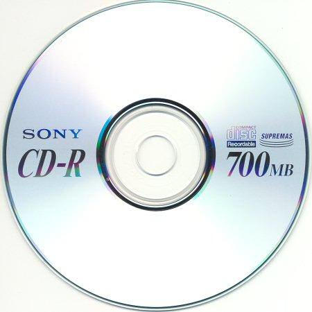

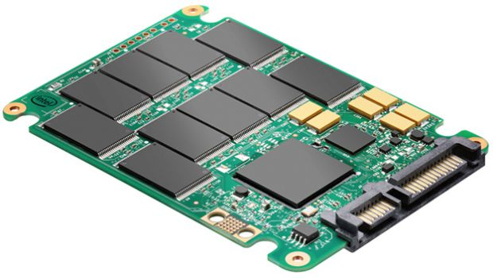

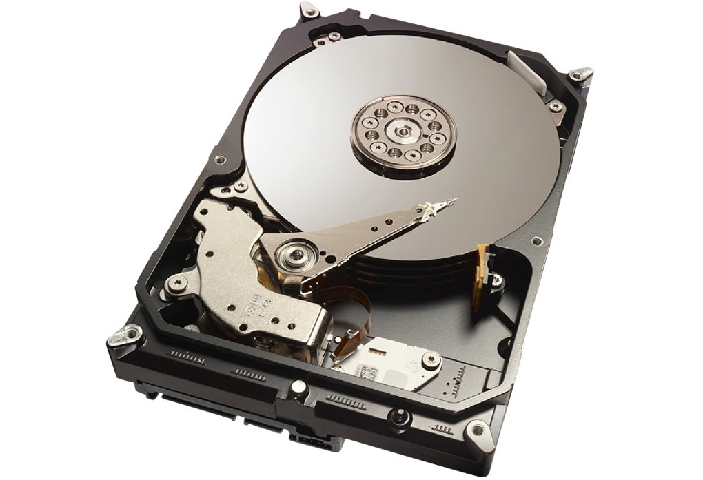

## Memoria del ordenador

Tipos de memoria de semiconductores

Tipos de memoria

## Memoria RAM

_Formato de memoria RAM_

Chips de memoria \(circuitos integrados\) soldados a una placa, llamada  _módulo de memoria_ \.

Cada chip está compuesto de  __celdas de memoria, __ donde se almacenan los bits\.

Chips de memoria

Muesca de posicionamiento

Pines de conexión al slot placa base

_La memoria RAM _

Memoria de acceso  __aleatorio__

Tambíén llamada  __memoria principal__

__Función:__  Almacena temporalmente datos e instrucciones mientras la CPU los procesa

__R__  __ápida__  __ lectura/escritura__ : 10\-20 GB/s \(rápida\)

__Volátil__ : pierde sus datos al apagar el ordenador\.

__Tamaño:__  gigabytes \(4,8,16,32,64 GB\)

Se guarda en  _módulos de memoria_ , que son instalados en  _ranuras de memoria _ de la placa base

## La memoria RAM

¿Dónde la podemos encontrar?

_Dónde la podemos encontrar_

Los equipos tienen memoria  __RAM__  en:

El  _procesador_  \(memoria caché, registros\)

En los  _lectores ópticos _ \(buffer o caché\)

En las  _tarjetas gráficas _ \(memoria de vídeo o gráfica\)

_A qué llamamos RAM_

Cuando hablamos de memoria RAM, estamos hablando principalmente de la  __memoria que se inserta en la placa base\.__

## Memoria RAM

Carga de archivos y programas

* _Al cargar el SO, ejecutar un programa o abrir un archivo:_
  * El archivo o el programa están en el HD, DVD, etc\.
  * Se cargan del HD a la RAM \(se copian\)
  * CPU lee la información de la RAM
* De este modo, se aceleran las tareas

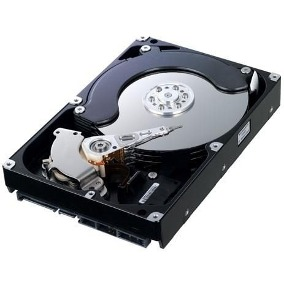

Carga de archivos y programas

* _¿Por qué el PC trabaja así?_
  * Trabajar directamente en el disco \(CPU leyendo/escribiendo en disco\) es sumamente lento\.
* __En lugar de eso:__
  * El programa o los archivos se cargan a la RAM
  * Modificaciones de los datos, cálculos y búsquedas, se hacen  _en la RAM _
  * El resultado se graba en la unidad de almacenamiento\.

Sistema operativo

Cada sistema operativo, juego o aplicación, necesita un mínimo de memoria para poder cargarse y ejecutarse correctamente:

__Windows 2000 y Windows XP y Vista: __ > 256MB\.

__Windows 7 y 8 __ > de 1 GB\.

__Windows 10: __ 1GB \(versión 32 bit\) y 2 GB \(versión de 64 bit\)

## Parámetros más importantes de la memoria

##

## Parámetros memoria RAM

Velocidad y ancho de banda

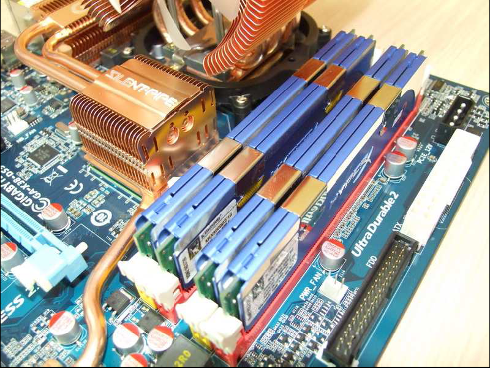

* _Frecuencia de trabajo_
* Mide la  _cantidad de operaciones que realiza la memoria en cada segundo_
  * Se mide en megahercios \( __MHz__ \)
  * 800 MHz = realizar 800 millones de lecturas y escrituras en un segundo\.
  * Cuanta más alta es, mayor es la tasa de transferencia \(MB/s\) entre la memoria y la CPU
* Ejemplo:  _2\.133 MHz_

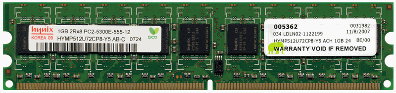

__Memoria DDR2\-600 / PC2\-5300__

Frecuencia de 600 MHz = realiza 600 Millones de operaciones por segundo

Velocidad y ancho de banda

* _Velocidad de transferencia de datos_
* Máxima  _cantidad de información _ que puede transferir entre la memoria y el procesador por segundo
* Depende de:
  * __Frecuencia__ : cuantas operaciones se realizan por segundo
  * __Ancho de bus__ : cuantos bytes se transmiten por operación
  * __Tipo de memoria__ : DDR, DDR2, DDR3, etc\.
* Se expresa en MB/s o GB/s
* __Ejemplo: __  _17\.000 MB/s_

__Memoria DDR2\-600 / PC2\-5300__

Frecuencia de 600 MHz = realiza 600 Millones de operaciones por segundo

Transmite 5\.300 MB por segundo entre RAM y CPU

## Memoria RAM

Latencia CAS o CL

* _Latencia_
* Tiempo que transcurre desde que se piden los datos hasta que son enviados a los pines de salida del módulo\.
* Cuanto menor sea, más rápida será la respuesta de la memoria\.
* A veces se abrevia como  __CL __ \(Cas Latency\)  __o CAS\.__
* __Ejemplo: __
  * _CL14_ : 14 ciclos de reloj
  * _10 ns_ : tiempo de respuesta

__Memoria DDR2\-600 / PC2\-5300__

Frecuencia de 600 MHz = realiza 600 Millones de operaciones por segundo

Transmite 5\.300 MB por segundo entre RAM y CPU

Tiene una latencia de 6,7 ns

* _ECC_
* Memorias RAM pueden sufrir  __fallos__  \(bits pueden cambiar de valor\)
* Todas las memorias RAM experimentan errores
  * Fluctuaciones de energía
  * Interferencias
  * Componentes defectuosos
* _¿Qué es el ECC?_
* Mecanismo de detección y corrección de errores
* Memorias ECC gracias a la paridad pueden detectar y corregir algunos de estos fallos\.
* Se suelen encontrar en  __servidores__ , pero no en PC domésticos

KVR13S9S8/4 \- 4 GB \(1333 MHz, DDR3,  _Non\-ECC_ , CL9, SODIMM 204\-pin, 1\.5 V\)

KVR16E11/8 \- 8 GB \(1600 MHz DDR3  ECC  CL11 DIMM 240\-pin\)

Buffered y registered

* Los  _buffers_  y los  _registros_  contienen datos y amplifican una señal
* justo antes de que los datos se escriban en el módulo\.
* Algunos DIMM usan búferes, algunos utilizan registros y otros no usan ninguno\.
  * Si un DIMM usa búferes, se llama  __buffered__  __ DIMM__
  * Si usa registros, se llama  __registered__  __ DIMM__
  * Si un módulo de memoria no admite registros o búferes, se lo denomina  __unbuffered__  __ DIMM\. __
  * __Full\-__  __buffered__  __ DIMM \(FB\-DIMM\):__  utiliza una técnica de almacenamiento en búfer avanzada que hace posible que los servidores admitan una gran cantidad de módulos DIMM\.
* Muescas en los módulos DIMM
  * Ubicadas para identificar las tecnologías que admite el módulo\.
  * Posición también evita que el tipo incorrecto de módulo se use en una placa base\.

Características y efectos en el rendimiento

* __Cantidad de memoria:__
  * Cuanta más memoria hay, más rápido funciona sistema\.
  * Tener en cuenta máximo soportado por la placa base y requisitos del sistema operativo
* __Tecnología de memoria:__
  * DDR3 es más rápido que DDR2\. DDR2 > DDR > SDRAM\.
  * Memorias buffered o registered pueden mejorar el rendimiento\.
* __Velocidad de la memoria \(MHz, PC o ns\)__
  * Utilizar la más rápida compatible con la placa base\.
  * Si instala módulos de diferentes velocidades, el sistema funcionará  _a la velocidad más lenta o podría volverse inestable\. _
* __ECC o non\-ECC: __  _Non\-ECC_  más rápido y menos costoso, no tan fiable\.
* __Clasificación CL:__  Cuanto más bajo, mejor
* __Multicanal__
  * DIMM de diferente capacidad o velocidad pueden funcionar en  _canales individuales_
  * Utilizar canales dobles o triples si la placa es compatible con la función\.
  * Instalar parejas o tríos de módulos DIMM del  _mismo fabricante y características _ en cada grupo de ranuras de canales \(Kits\)

## Tipos de módulos según su formato físico

## Memoria RAM

* _¿Por qué estandarizar?_
* Necesidad de poder  __intercambiar__  los módulos
* Utilizar módulos de distintos  __fabricantes__
* __Creación estándares JEDEC__
* _Est_  _ándares_
  * SIP
  * SIPP
  * RIMM: Módulo propietario \(RAMBUS\)
  * SIMM
  * DIMM
  * SO\-DIMM: Portátiles
  * FB\-DIMM: Servidores

Módulos físicos \(línea temporal\)

## Módulos obsoletos

_Single In\-line _  _Memory_  _ Module_

Conectores \(pins\) por ambos lados interconnectados

_SIMM de 30 contactos_

__Longitud__ : 8,5 cm

Se deben instalar 4 módulos a la vez

__Capacidades:__  4Mb, 8Mb y 16Mb

Diferentes velocidades de acceso

_SIMM de 72 contactos_

__Longitud:__  10,5 cm

Se deben instalar 2 módulos a la vez

Bus de 32 bits\.

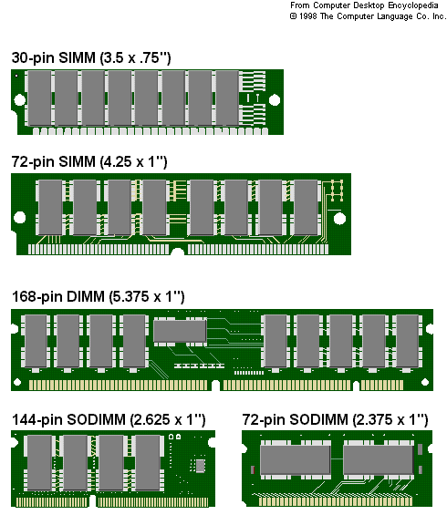

## Módulos actuales

* _DIMM _  _\(Dual In\-line _  _Memory_  _ Module\)_
* Tiene pines a lado y lado del borde de inserción
* Transfieren 64 bits de datos en cada ciclo de reloj
* No es necesario instalarlos módulos por parejas\.
* El más utilizado para la memoria SDR y DDR SDRAM
* Versiones para portátiles:  __SO\-DIMM y Micro\-DIMM__
* _SO\-DIMM \(Small _  _Outline_  _ DIMM\) _
* Versión compacta del módulo DIMM convencional\.
* Se utiliza en portátiles\.
  * SO\-DIMM de 200 contactos: DDR
  * SO\-DIMM de 200 contactos : DDR2
  * SO\-DIMM de 204 contactos: DDR3

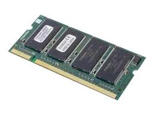

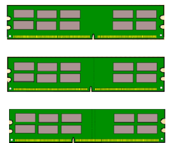

* _RIMM \(_  _Rambus_  _ In\-line _  _Memory_  _ Module\)_
  * Módulos de 184 pines y dos muescas
  * Trabaja con chips de memoria Rambus \(apareció con P4\)
  * Altas frecuencias de trabajo —> requieren disipadores de calor \(placa metálica que recubre los chips del módulo\)
  * Todos los zócalos de un banco deben estar ocupados y si no, habrá que instalar un módulo de continuidad para cerrar el canal

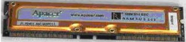

## Tipos de RAM

* _SDRAM \(_  _Synchronous_  _ DRAM\) o SDR_
  * Tiene 2 muescas en el módulo
  * Se sincroniza con el reloj del sistema para leer y escribir
  * Frecuencias  __100 MHz y 133 MHz __ \(PC100/PC133 SDRAM\)
  * En cada hercio \(Hz\) se envían  __64 bits \(8 Bytes\)__
* __Tasa de transferencia:__
  * PC100: 8 bytes/Hz x 100 MHz =  _800 MB/s_
  * PC133: 8 bytes/Hz x 133 MHz =  _1\.066 MB/s_

_DDR2_

Tasa transferencia = Velocidad efectiva x  8

Tasa transferencia = \(velocidad reloj x 2\) x 8\)

__Doble tasa de transferencia __ de datos

Se transmiten dos datos por cada ciclo de reloj

Consigue duplicar velocidad de operación \(hasta 200/266 MHz\)

__Módulos: __ DIMM con 184 pines

__Multicanal__ : Soporta dual channel

_DDR2_

Tasa transferencia = Velocidad efectiva x  8

Tasa transferencia = \(velocidad reloj x 4\) x 8\)

Funciona a más velocidad que la DDR

Necesita menos voltaje,  __reduce consumo de energía__  y  calor

Latencias son más altas que en las DDR\.

__Módulos:__  DIMM con 240 pines

__Capacidad:__  hasta 2 GB por módulo

__Multicanal__ : Soporta dual channel

_DDR3_

Tasa transferencia = Velocidad efectiva x  8

Tasa transferencia = \(velocidad reloj x 8\) x 8\)

Mayor tasa de transferencia de datos

Menor consumo debido a su tecnología de fabricación

Latencias son más altas que en las DDR2\.

__Módulos: __ DIMM con 240 pines

__Capacidad:__  hasta 16 GB por módulo

__Multicanal__ : Soporta dual y triple channel

__Nota__ : Los módulos de memoria DDR, DDR2 y DDR3 no son compatibles entre sí\. Físicamente es imposible por la posición de las muesca que evita su inserción\.

Funciona a más velocidad que la DDR

Necesita menos voltaje,  __reduce consumo de energía__  y  calor

Latencias son más altas que en las DDR\.

__Módulos:__  DIMM con 288 pines

__Capacidad:__  hasta 64 GB por módulo

* _GDDR_
* Son  __chips de memoria insertados __
  * En algunas tarjetas gráficas
  * En placas base donde la tarjeta gráfica está integrada\.
* Memorias muy rápidas
* Controladas por el procesador de la tarjeta gráfica\.
* Se los conoce como RAM DDR para gráficos\.
* Consolas de videojuegos como la Xbox 360 o la Playstation 3 utilizan este tipo de memoria RAM\.

## Parámetros memoria RAM

* Las memorias DDR, DDR2 y DDR3 se suelen denominar de dos formas:
* __Según frecuencia \(__  __Mhz__  __\): __ DDR3\-1600, DDR3\-1333, DDR3\-1066…
* __Según tasa transferencia \(MBps\): __ PC3\-12800, PC3\-10600, PC3\-8500…
* _¿Cómo pasar de uno a otro?_
* En las memorias DDR, DDR2 y DDR3 el ancho de banda de los módulos se calcula  __multiplicando por 8 __ la velocidad del bus\.
  * DDR\-400 = PC\-3200
  * DDR3\- __1600__  = PC3\- __12800__ \.

## Memoria DDR3

## Memoria RAM

## Dual / triple / quad channel

##

## Memoria RAM

* Los canales tienen que ver con  _cuántas ranuras _ DIMM puede controlar el controlador  _de memoria a la vez_ \.
* Los primeros DIMM solo usaban un solo canal, lo que significa que el controlador de memoria solo puede acceder a un DIMM a la vez\.
* Para mejorar el rendimiento general de la memoria:
  * __Dual __  __channels__  __ __ permiten que el controlador de memoria se comunique con  _dos módulos DIMM al mismo tiempo_ , duplicando de forma efectiva la velocidad de acceso a la memoria\.
  * Una placa base que admite  __triple channel __ puede acceder a tres módulos DIMM al mismo tiempo\. Los DIMM DDR, DDR2 y DDR3 pueden usar canales duales\. Los DIMM DDR3 también pueden usar canales triples\.
* Para que dos canales o canales triples funcionen, la placa base y el DIMM deben ser compatibles con la tecnología\.

Dual / Triple / Quad channel

* _Permite a la CPU trabajar _
  * Con 2/3 canales de memoria simultáneamente
  * Utilizando 2 o 3 módulos de idénticas características\.
* _Consecuencias_
  * Ancho de banda se multiplica
  * Mejoras de rendimiento \(ej: GPU integrada\)
* _Tipos_
  * __Dual channel: __ entornos domésticos
  * __Tri channel y __  __quad__  __ channel: __ Se usan con Core i7 y algunos Xeon \(servidores\)

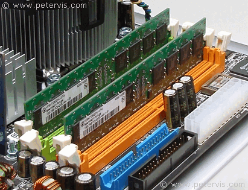

## Combinación de memorias RAM

Múltiples canales

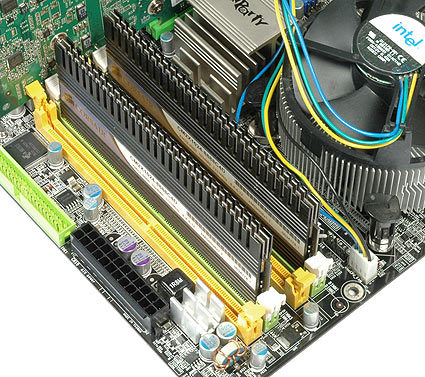

* __Para poder utilizar configuración dual/triple/__  __quad__  __ channel__
  * La placa base lo tiene que soportar
  * El procesador lo tiene que soportar \(controlador de memoria\)
  * Se tienen que insertar en las ranuras correctas
  * Mismo tipo y capacidad de memoria
* __Kits de memoria__
  * Aseguran que funcionarán adecuadamente
  * No son obligatorios para utilizar esta tecnología
  * Nos garantizan que han sido probados

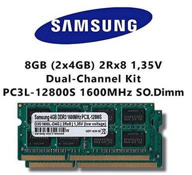

## Combinación de módulos

* _Dual _  _channel_
* Desarrollada en 1993 \(era Pentium\)
* Tecnología permite incrementar el rendimiento
* Accediendo  __simultáneamente__  a 2 módulos RAM
* Transferencias de 64x2 =  __128 bits__
* Para lograr dicho efecto
  * __Chipset__  tiene que tener implementado un segundo controlador de memoria en el puente norte
  * __2 módulos de memoria __ de misma capacidad, velocidad y tipo
  * Colocados en  __2 zócalos de igual color__

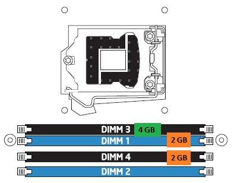

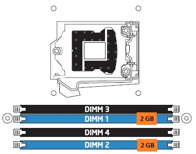

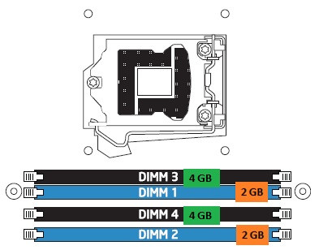

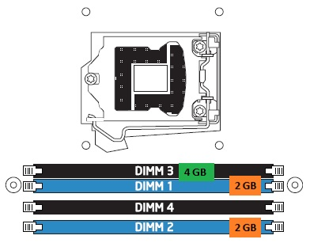

* _Tri _  _Channel_
* Tecnología que nos permite acceder simultáneamente a 3 módulos de memoria\.
* Transferencias de 3x64 =  __192 bits__
* Para lograr dicho efecto
  * 3 módulos de memoria de la misma capacidad, velocidad y tipo
  * Colocados en 3 ranuras de igual color

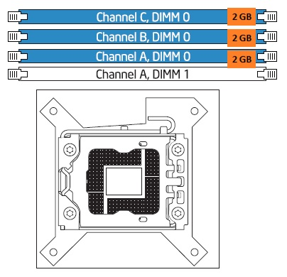

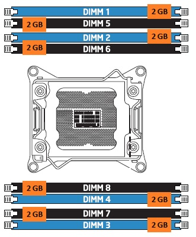

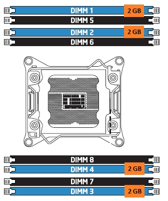

* Este modo da como resultado la operación dual y de un solo canal en toda la memoria DRAM
* La operación es la siguiente:
  * 2 GB \(DIMM 1\) \+ 2 GB \(de DIMM2\)
    * Funcionan conjuntamente en modo de doble canal\.
  * 2 GB \(DIMM2\) restante funciona en modo monocanal\.

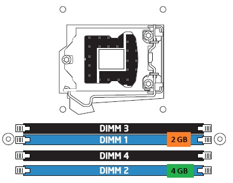

## Multicanal

Ejemplo configuraciones

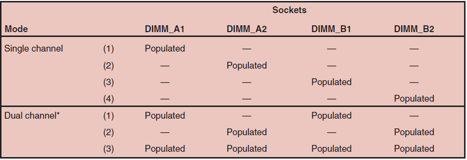

