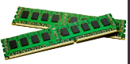
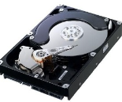
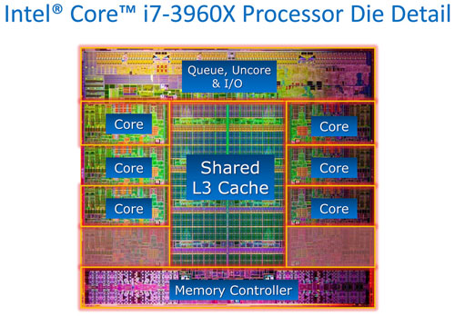
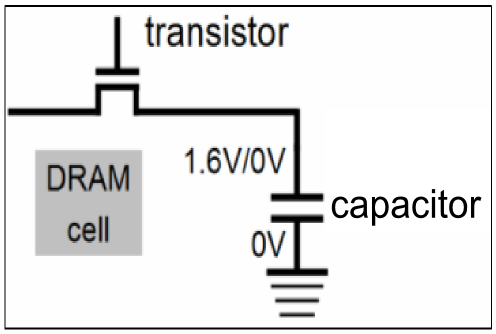
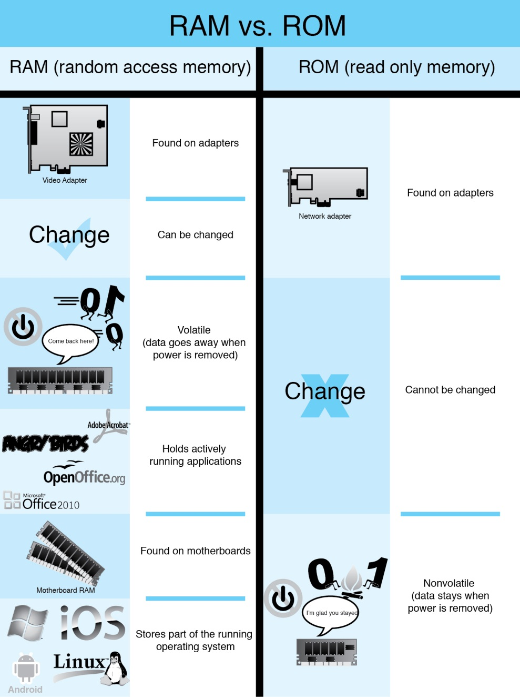
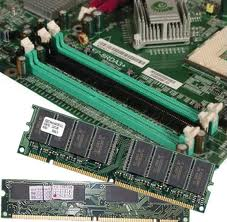
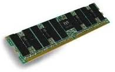
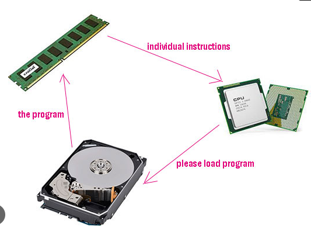
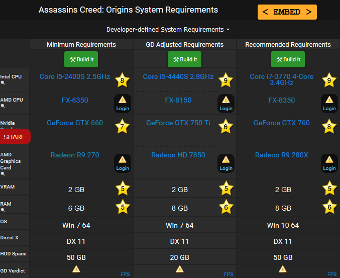

# Componentes internosMemoria RAM

## Memoria

* _Memoria _
  * Dispositivo capaz de:
    * Almacenar información \(guardar\)
    * Suministrar información \(leer\)

## Operaciones básicas de memoria

  * __Lectura__ : el dispositivo de memoria suministra información previamente almacenada
  * __Escritura__ : el dispositivo de memoria almacena una información en un lugar disponible

## Jerarquía de la memoria de un ordenador

La jerarquía de memoria de un ordenador es una forma de **organización** que se utiliza para maximizar el rendimiento al procesar datos, permitiéndonos acceder a los datos de forma más rápida y eficiente. Esta **jerarquía** está compuesta por diversas memorias, desde las más pequeñas y rápidas, como los registros de la CPU, hasta las más lentas y de mayor capacidad, como los discos duros.

Estos **niveles** de memoria se organizan entre sí para crear una jerarquía y permitir el acceso a los datos de forma eficiente.  Esta jerarquía de memoria proporciona una forma de organización que nos permite acceder a los datos de una manera óptima y eficiente.

## Niveles

Niveles de memoria:

Los **registros** de la CPU son memoria local para la CPU, ubicados directamente dentro del procesador. Estos registros se usan para almacenar instrucciones y operaciones a corto plazo.

La memoria **caché** (L1, L2 y L3) son almacenamientos a corto plazo entre la memoria RAM y los registros de la CPU. Estas memorias caché aceleran el acceso a la información para la CPU, por lo que los procesos se ejecutan mucho más rápido.

La memoria **principal**, también conocida como RAM, es la memoria en la que se almacenan los datos y programas que se utilizan actualmente. Esta memoria se borra cuando la computadora se apaga.

La memoria **secundaria**, como los discos HDD, se usa para almacenar archivos y datos a largo plazo. Esta memoria es permanente, por lo que los datos se mantienen aunque la computadora se apague.

Por último, la **memoria auxiliar** como los lápices USB se usa para almacenar datos a corto plazo que se pueden transportar fácilmente de un lugar a otro.

Es importante destacar la importancia de la jerarquía de memoria. Estos niveles funcionan en conjunto para permitir que la computadora acceda a los datos de manera **eficiente**.

Por ejemplo, cuando se ejecuta una aplicación, los datos se almacenan primero en la memoria RAM, luego en la memoria caché para una mayor velocidad de acceso, y luego en los registros de la CPU para su procesamiento. Esto permite una mejor y más rápida ejecución de los procesos.

## Memorias estáticas o SRAM \(_  _Static_  _ RAM\)

  * Tipo de memoria RAM alternativa a la DRAM
  * No necesita refrescarse\.
  * Debido al alto coste de fabricación de la SRAM y a su alta velocidad, suele utilizarse como  __memoria caché__ \.

## Dinámicas o DRAM \(Dynamic RAM\)_

  * Memoria construida mediante condensadores\.
    * Cuando un condensador está cargado se dice que almacena un BIT a uno\.
    * Si está descargado, el valor del BIT es cero\.
  * Para mantener las celdillas cargadas
    * Este tipo de memoria  _necesita refrescarse _ cada cierto tiempo
    * __Refrescar:__   _Recargar nuevamente con energía los condensadores _ que tienen almacenado un uno para evitar que la información se pierda
  * La memoria DRAM es
    * _Más lenta _ que la memoria SRAM
    * Mucho más barata de fabricar que la SRAM
    * Se utiliza em la  __memoria principal__

## Memorias síncronas o asíncronas

  * __Asíncronas__ : no utilizan ningún reloj que marque la cadencia para que el dato sea leído o escrito\.  Equipos de comunicaciones, automoción
  * __Síncronas__ : requieren de un reloj que marque las pautas de lectura o escritura de los datos\.  Informática moderna
* Memoria RAM es  __SD__ RAM:  __S__ íncrona y  __D__ inámica
* La memoria caché es SRAM: E __S__ tática

* _Volatilidad_
  * Memoria volátil
  * Memoria no volátil
* _Tipo de acceso a los datos_
  * Secuencial
  * Aleatorio
* _Material de fabricación_
  * Memorias magnéticas
  * Memorias de semiconductores
  * Memorias ópticas
  * Memorias mixtas

## Memoria del ordenador

Tipos de memoria de semiconductores

Tipos de memor

## Formato de memoria RAM

 La memoria RAM se compone de **chips** de memoria soldados a una placa, llamada **módulo** de memoria. Cada chip contiene celdas de memoria, donde se almacenan los bits.

Estos chips tienen una muesca para posicionarlos en el módulo, así como unos pines de conexión para poder conectarlo a la **placa base** de la computadora. Estos módulos de memoria se pueden insertar y extraer de la computadora para aumentar la memoria RAM.

## La memoria RAM

Memoria de acceso  __aleatorio__

Tambíén llamada  __memoria principal__

__Función:__  Almacena temporalmente datos e instrucciones mientras la CPU los procesa

__R__  __ápida__  __ lectura/escritura__ : 10\-20 GB/s \(rápida\)

__Volátil__ : pierde sus datos al apagar el ordenador\.

__Tamaño:__  gigabytes \(4,8,16,32,64 GB\)

Se guarda en  _módulos de memoria_ , que son instalados en  _ranuras de memoria _ de la placa base

## La memoria RAM

¿Dónde la podemos encontrar?

_Dónde la podemos encontrar_

Los equipos tienen memoria  __RAM__  en:

El  _procesador_  \(memoria caché, registros\)

En los  _lectores ópticos _ \(buffer o caché\)

En las  _tarjetas gráficas _ \(memoria de vídeo o gráfica\)

_A qué llamamos RAM_

Cuando hablamos de memoria RAM, estamos hablando principalmente de la  __memoria que se inserta en la placa base\.__

## Carga de archivos y programas

Cuando un usuario ejecuta un programa o abre un archivo, el proceso de carga de archivos o programas es vital para el correcto funcionamiento del sistema. Esto se debe a que los archivos y programas están almacenados en unidades externas como el disco duro, un DVD, una memoria USB, etc. Por lo tanto, para que el sistema los utilice, primero deben ser **cargados en la memoria RAM**.

Una vez que la información ha sido cargada en la RAM, la CPU puede leerla de forma más **eficiente** y **rápida** que si leyera directamente desde el disco. Esto acelera las tareas y reduce el tiempo de respuesta del sistema. Además, almacenar información en la RAM permite que los programas ejecuten instrucciones más rápidamente, ya que la RAM es mucho más rápida que cualquier unidad de almacenamiento externa.

Por lo tanto, la carga de archivos y programas desde una unidad externa a la RAM es un proceso esencial para el correcto funcionamiento de cualquier sistema informático. Esto permite que el sistema se ejecute más rápido, mejore el rendimiento, y optimice el tiempo de respuesta.

## Requisitos de memoria

Los sistemas operativos modernos tienen requerimientos de memoria cada vez mayores para poder ejecutar aplicaciones avanzadas y juegos con gráficos de alto nivel. A medida que nuevas versiones de sistemas operativos y aplicaciones se desarrollan, la cantidad de memoria requerida también aumenta.

Además de la memoria RAM, los sistemas operativos también necesitan un cierto espacio en el disco duro para almacenar los archivos y datos necesarios para su funcionamiento. Esto depende del sistema operativo que se esté usando. Por ejemplo, Windows XP y Vista requieren al menos 5 GB de espacio en disco, mientras que Windows 7, 8 y 10 requieren al menos 16 GB.

Es importante tener en cuenta que la memoria RAM y el espacio de almacenamiento necesarios para un sistema operativo dependen también del uso previsto para el mismo. Por ejemplo, un usuario que desee usar aplicaciones avanzadas y juegos de alto nivel requerirá una cantidad mayor de memoria RAM y espacio de almacenamiento.

