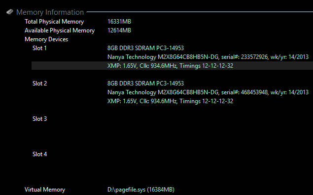

# Benchmark memoria

Desde algún programa de benchmark o desde Windows, podemos obtener más información acerca de los módulos de memoria RAM instalados en nuestro dispositivo.

- En este caso, podemos ver que la placa base tiene cuatro slots o ranuras en los que insertar módulos de memoria.
- Solo dos de ellos están ocupados, el slot 1 y el 2. Por tanto, podríamos insertar hasta dos módulos más.
- Cada uno de los módulos tiene una capacidad de 8 GB, por lo que disponemos de 16 GB de RAM en total, o lo que es lo mismo: 16331 MB.
- De estos, parte de la memoria RAM está ya ocupada por el sistema operativo, por, lo que nos quedan disponibles 12614 MB.
- La tecnología de los dos módulos es **DDR3**, un tipo de memoria **SDRAM**.

La **memoria virtual** es un espacio de disco duro reservado que se utiliza a modo de memoria RAM.  **Pagefile.sys** es un archivo en el sistema de Windows que sirve como una ubicación para la memoria virtual y la memoria intercambiable. La memoria virtual se usa para permitir que los programas funcionen con más memoria de la que el sistema físico tiene disponible. Esto permite que los programas utilicen memoria temporalmente mientras están en ejecución. La memoria intercambiable se usa para almacenar contenido de la memoria RAM cuando ésta se encuentra llena. Esto ayuda a acelerar el rendimiento del sistema, almacenando contenido en el disco duro en lugar de tener que recrearlo cada vez que se necesita. El tamaño del archivo pagefile.sys se ajusta automáticamente según las necesidades de memoria del sistema, pero los usuarios pueden cambiar el tamaño para mejorar el rendimiento.

