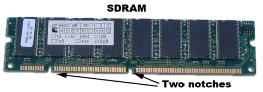
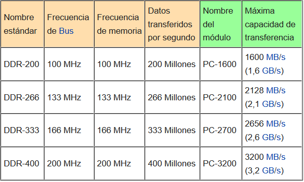
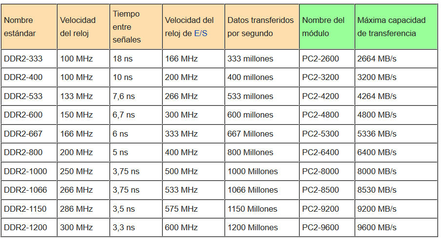
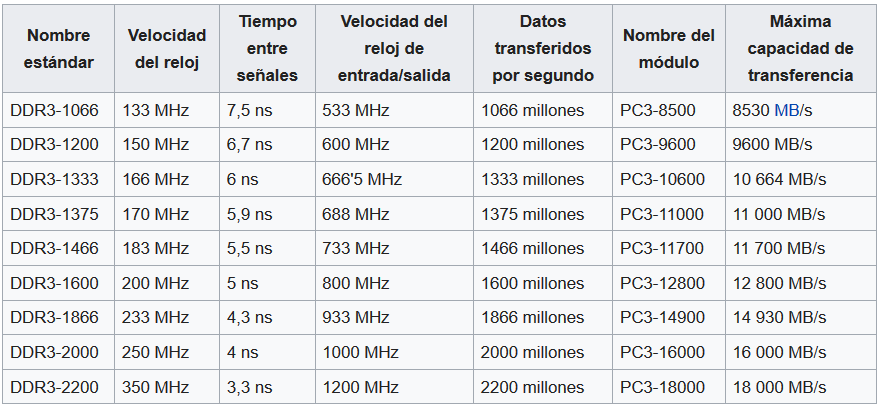
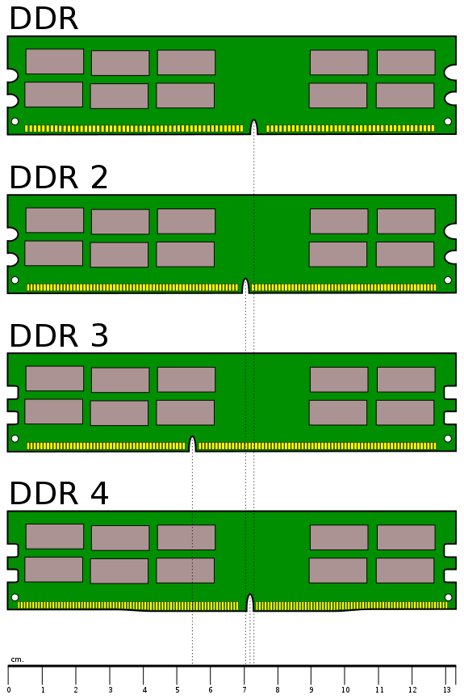
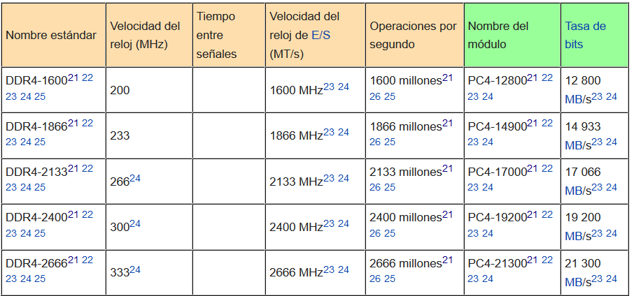
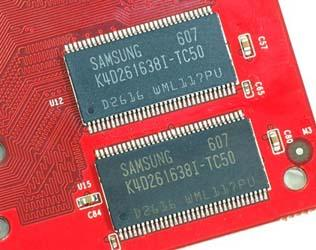
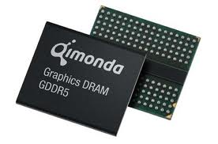

# SDR y DDR

* _SDRAM \(_  _Synchronous_  _ DRAM\) o SDR_
  * Tiene 2 muescas en el módulo
  * Se sincroniza con el reloj del sistema para leer y escribir
  * Frecuencias  __100 MHz y 133 MHz __ \(PC100/PC133 SDRAM\)
  * En cada hercio \(Hz\) se envían  __64 bits \(8 Bytes\)__
* __Tasa de transferencia:__
  * PC100: 8 bytes/Hz x 100 MHz =  _800 MB/s_
  * PC133: 8 bytes/Hz x 133 MHz =  _1\.066 MB/s_

_DDR2_

Tasa transferencia = Velocidad efectiva x  8

Tasa transferencia = \(velocidad reloj x 2\) x 8\)

__Doble tasa de transferencia __ de datos

Se transmiten dos datos por cada ciclo de reloj

Consigue duplicar velocidad de operación \(hasta 200/266 MHz\)

__Módulos: __ DIMM con 184 pines

__Multicanal__ : Soporta dual channel

_DDR2_

Tasa transferencia = Velocidad efectiva x  8

Tasa transferencia = \(velocidad reloj x 4\) x 8\)

Funciona a más velocidad que la DDR

Necesita menos voltaje,  __reduce consumo de energía__  y  calor

Latencias son más altas que en las DDR\.

__Módulos:__  DIMM con 240 pines

__Capacidad:__  hasta 2 GB por módulo

__Multicanal__ : Soporta dual channel

_DDR3_

Tasa transferencia = Velocidad efectiva x  8

Tasa transferencia = \(velocidad reloj x 8\) x 8\)

Mayor tasa de transferencia de datos

Menor consumo debido a su tecnología de fabricación

Latencias son más altas que en las DDR2\.

__Módulos: __ DIMM con 240 pines

__Capacidad:__  hasta 16 GB por módulo

__Multicanal__ : Soporta dual y triple channel

__Nota__ : Los módulos de memoria DDR, DDR2 y DDR3 no son compatibles entre sí\. Físicamente es imposible por la posición de las muesca que evita su inserción\.

Funciona a más velocidad que la DDR

Necesita menos voltaje,  __reduce consumo de energía__  y  calor

Latencias son más altas que en las DDR\.

__Módulos:__  DIMM con 288 pines

__Capacidad:__  hasta 64 GB por módulo

* _GDDR_
* Son  __chips de memoria insertados __
  * En algunas tarjetas gráficas
  * En placas base donde la tarjeta gráfica está integrada\.
* Memorias muy rápidas
* Controladas por el procesador de la tarjeta gráfica\.
* Se los conoce como RAM DDR para gráficos\.
* Consolas de videojuegos como la Xbox 360 o la Playstation 3 utilizan este tipo de memoria RAM\.

## Parámetros memoria RAM

* Las memorias DDR, DDR2 y DDR3 se suelen denominar de dos formas:
* __Según frecuencia \(__  __Mhz__  __\): __ DDR3\-1600, DDR3\-1333, DDR3\-1066…
* __Según tasa transferencia \(MBps\): __ PC3\-12800, PC3\-10600, PC3\-8500…
* _¿Cómo pasar de uno a otro?_
* En las memorias DDR, DDR2 y DDR3 el ancho de banda de los módulos se calcula  __multiplicando por 8 __ la velocidad del bus\.
  * DDR\-400 = PC\-3200
  * DDR3\- __1600__  = PC3\- __12800__ \.