## Factores de forma

Primero de los formatos ajustado al tamaño de un folio\.

Como casi todo en los inicios de la informática fue definido por IBM a principios de los años 80\.

Es un formato que contaba con un único conector externo \(para el teclado\)\.

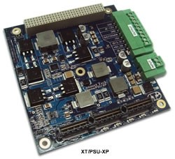

Factores AT y BabyAT

_AT_

Advanced Technology \(años 80\) fue el sucesor de IBM para el formato XT, siendo este el formato más grande de todos.

_BabyAT_

Enorme tamaño provoco la creación de la variación BabyAT

Reducía costes, mantenía la compatibilidad con cajas AT

Impedía miniaturizar más\. Era preciso un nuevo estándar\.

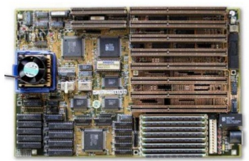

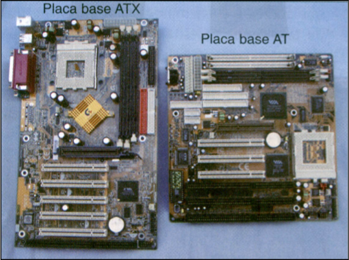

## ATX, Mini\-ATX y Micro\-ATX

### Placas ATX

* Fueron introducidas por Intel en  _1995_
* Son actualmente las más populares, ya que ofrecen mayores ventajas:
  * Mejor disposición de sus componentes
  * Mejor colocación de la CPU y de la memoria, lejos de las tarjetas de expansión y cerca del ventilador de la fuente de alimentación para recibir aire fresco procedente de este\.
  * Los conectores de la fuente de alimentación tienen una sola pieza y un único conector, que además no se pueden conectar incorrectamente\.
  * Los conectores para los dispositivos IDE y las disqueteras se sitúan más cerca, reduciendo la longitud de los cables\.

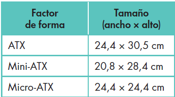

### Placas Mini\-ATX y Micro\-ATX

* __Mini\-ATX __
  * Versión reducida de ATX que
  * Mantiene la misma disposición de sus elementos\.
* __Micro\-ATX __
  * Publicado por Intel en 1997
  * Reducción para el tamaño de las placas base\.
* Estas dos placas son compatibles con ATX, de forma que podemos sustituir una placa ATX por una de estas sin problemas de ubicación o fijación\.

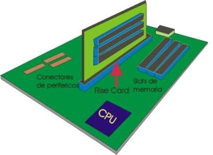

### LPX

Slots para las tarjetas de expansión no se encuentran sobre la placa base

Se conectar en un conector en el que están pinchadas llamado  __rise__  __ __  __card__

### LNX

Similar al LPX

Ideado para facilitar la retirada y la sustitución de la placa base sin herramientas

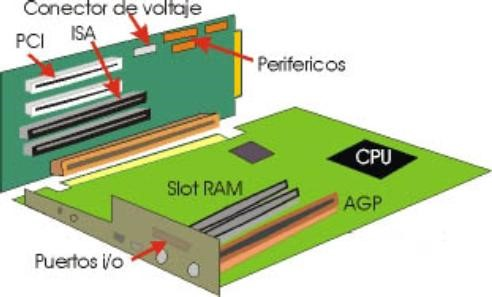

El principal problema de estos formatos es su reducida capacidad de expansión y la dificultad de refrigerar adecuadamente microprocesadores potentes\.

### LPX o Low Profile eXtension

Forma de arquitectura de placa base de computadora introducida por Intel en 1995. Esta arquitectura de placa base está diseñada para ofrecer mayor espacio para los componentes de la placa base al reducir el tamaño y el perfil de los componentes y los conectores.

Esto permite a los fabricantes de computadoras diseñar placas base más pequeñas, más delgadas y más completas, lo que a su vez permite que los dispositivos sean más portátiles. LPX también permite una mejor disipación de calor, lo que hace que los sistemas sean más estables y confiables.

### Formato NLX

El formato NLX fue introducido por **Intel** en **1997** y se diseñó para proporcionar una mejor accesibilidad y mantenimiento.

**Problemas**

Los problemas que comparten ambos formatos son la reducida capacidad de expansión y la dificultad de refrigerar adecuadamente microprocesadores potentes.

Esto plantea retos significativos para los usuarios que desean aprovechar al máximo el potencial de sus equipos.

## BTX

**BTX** fue introducido por Intel a finales de 2004 con el propósito de intentar solventar los problemas de refrigeración de los procesadores, pero tuvo poca aceptación por parte de los fabricantes de placas base y de los usuarios.

_Características_

Los componentes se colocan de forma diferente que en las ATX, con el fin de mejorar el flujo de aire\.

Necesidad de este formato: altos niveles de calor que llegan a alcanzar las cajas y placas base ATX

CPU actuales y las tarjetas gráficas consumen cada vez más

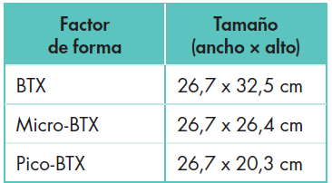

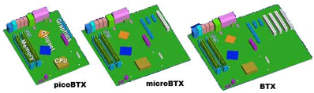

__CPU:__

Justo delante del ventilador de toma de aire

Provoca que todo el resto de la caja se caliente más al recibir el calor del micro\.

__Tarjeta gráfica:__

se colocará de forma que aproveche mejor el flujo de aire\.

Este formato no ha triunfado mucho, debido a las restricciones de espacio, que limitan las posibilidades de elección de la refrigeración para el microprocesador\.

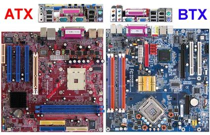

## ATX vs BTX

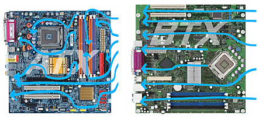

Aquí podemos ver las diferencias entre las cajas ATX y BTX.

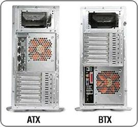

## ITX

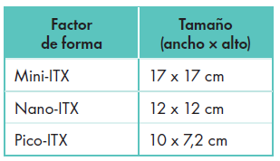

Diseñadas por  __VIA Technologies__

Son las placas más pequeñas que existen en el mercado actual\.

Compatibles con el estándar ATX, por lo que permiten la conexión de componentes diseñados para cualquier otro ordenador

Refrigeración suele ser mediante dispositivos  __pasivos__ \.

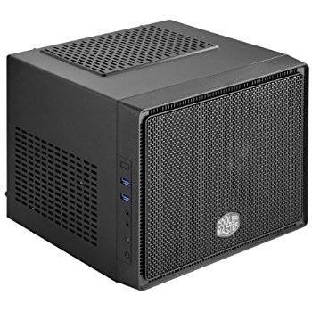

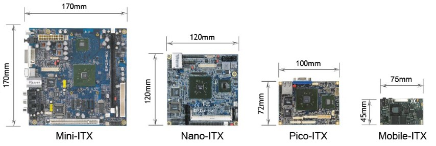

## Placa base

Comparativa de tamaños

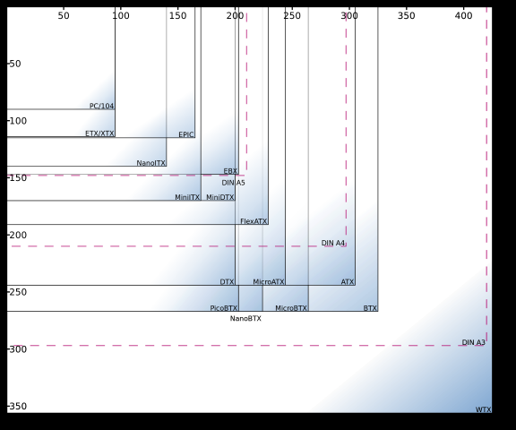

La placa base: factor de forma

## Otras placas

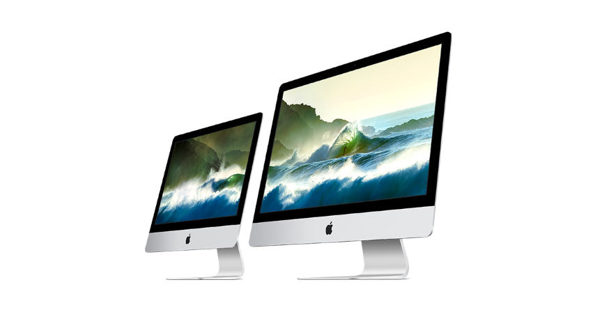

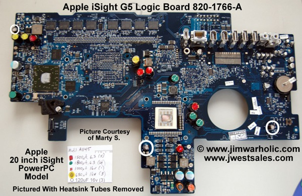

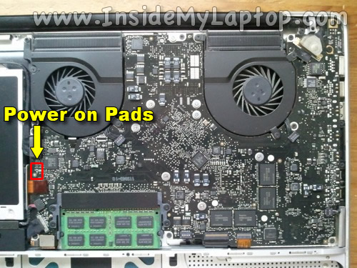

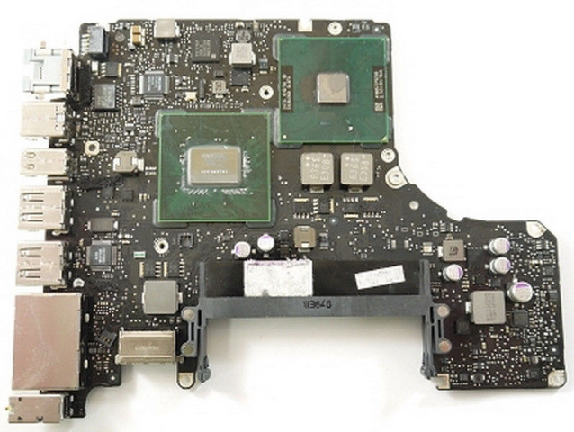

La placa base: factor de forma

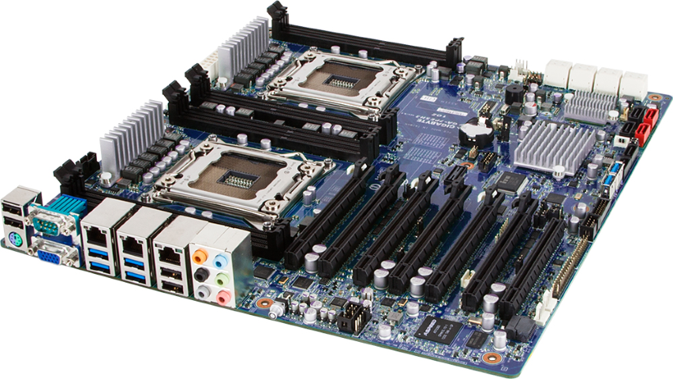

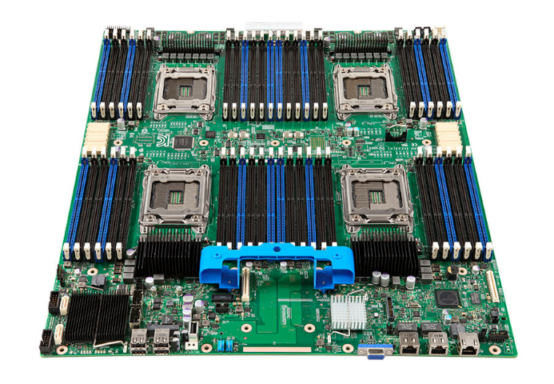

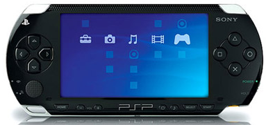

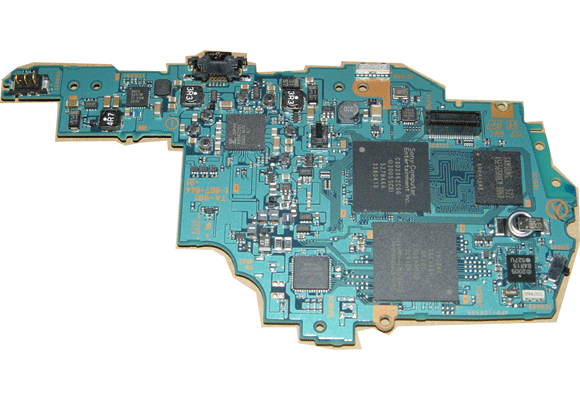

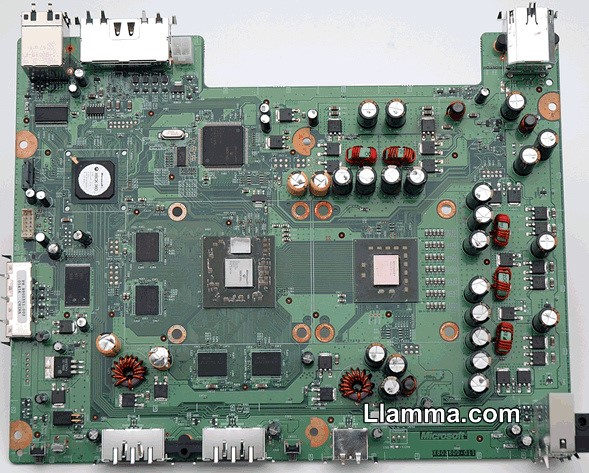

