# MICROPROCESADORES

UNIDAD CENTRAL DE PROCESOS\)

Un poco de historia

## ¿QUE ES EL MICROPROCESADOR?

  Un microprocesador es el     _cerebro_     del ordenador.

  Es un chip, un conjunto de circuitos electrónicos altamente integrado, fabricado en un trozo de silicio.  En su interior existen millones de elementos llamados transistores, ordenados de manera que forman puertas lógicas para poder así, hacer operaciones de toda clase.

  L    os microprocesadores van sobre un elemento llamado socket o zócalo, que se conecta a la placa base.

  La función de los microprocesadores es la de ejecutar e interpretar las instrucciones     de los ordenadores    .

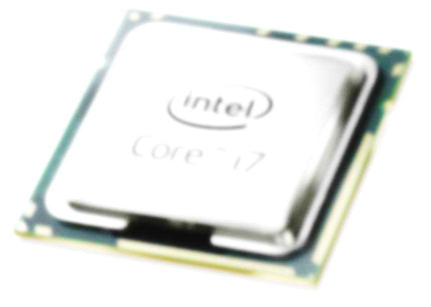

 La velocidad de un microprocesador se mide en mega hertzios \(MHz\) o giga hertzios \(1 GHz = 1.000 MHz\). Debido a la extrema dificultad de fabricar componentes electrónicos que funcionen a las inmensas velocidades de MHz habituales hoy en día, todos los microprocesadores modernos tienen 2 velocidades:

VELOCIDAD INTERNA:

 La velocidad a la que funciona el microprocesador internamente \(1.8, 2.1, 2.3... GHz\).

VELOCIDAD EXTERNA O DEL BUS:

 La velocidad a la que se comunican el micro y la placa base, típicamente a 1033, 2066…     MHz.

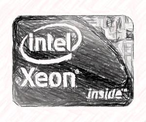

2. PARTES BÁSICAS DE UN MICROPROCESADOR

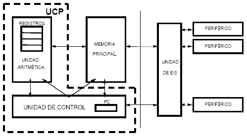

2.1    UC \(Unidad de Control\)   :

Organiza el funcionamiento de la CPU, decidiendo

qué se hace \(y quién\) en cada momento.

2.2    ALU \(Unidad Aritmético\-Lógica\)    _ _   :

Realiza las operaciones que convierten los datos de

entrada en resultados.

2.3   El Coprocesador Matemático   :

o, más correctamente, la FPU \(Unidad de coma Flotante\). Parte del microprocesador especializada cálculos matemáticos complejos.

### 2.4. Registros:

Posiciones de memoria interna que almacenan temporal y momentáneamente los datos que pasan por la CPU, estados, direcciones…  mientras  se necesitan.

### 2.5. La Memoria Cache

Una memoria intermedia ultrarrápida que sirve al microprocesador para tener a mano ciertos datos que previsiblemente serán utilizados en las siguientes operaciones sin tener que acudir a la memoria RAM, reduciendo el tiempo de espera.

Es lo que se conoce como caché de primer nivel; es decir, la que está más cerca del microprocesador, tanto que está encapsulada junto a él, también llamada caché interna.

## 2. PARTES BÁSICAS DE UN MICROPROCESADOR

Bus de Direcciones:

Transporta las direcciones de los datos manejados por la CPU

Bus de Datos Externos:

Transporta hacia y desde el exterior de la PCU \(cache L2, chipset, RAM…\).  También se le denomina bus frontal o bus del sistema.

Bus de Datos Internos:

Transporta los datos dentro de la CPU, es decir entre registros, cache L1, etc.

Marca la frecuencia del funcionamiento del microprocesador y los distintos buses del sistema.

3. PARTES ELEMENTALES  DE UN MICROPROCESADOR

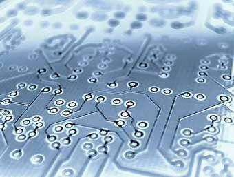

ESQUEMA DE LOS MICROPROCESADORES

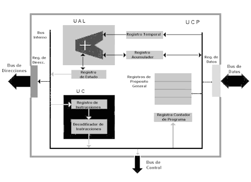

ESQUEMA DE LA UNIDAD ARITMÉTICO – LÓGICA \(UAL\)

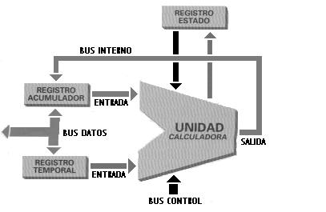

ESQUEMA DE LA UNIDAD ARITMÉTICO – LÓGICA \(UAL\)

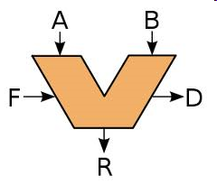

* _Componentes de la ALU_
  * Registros de entrada \(A, B\):
    * Almacenan los operandos \(datos de entrada\).
  * Circuito operacional:
    * Componentes electrónicos que realizan las operaciones.
  * Registro acumulador \(R\):
    * Almacena el resultado de las operaciones.
  * Registros de estado \(D\):
    * “Flags” que recogen cómo termina la operación.
      * Cero, negativo, acarreo, desbordamiento, paridad, etc...
  * Selector de operaciones \(F\):
    * Microinstrucciones procedentes de la Unidad de Control.

ESQUEMA DE LA UNIDAD DE CONTROL  \(UC\)

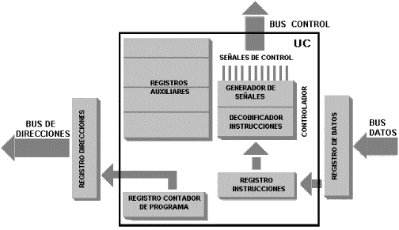

UNIDAD DE CONTROL  \(UC\)

* _Componentes de la UC_
  * Contador de programa
    * Contiene la dirección de memoria de la siguiente instrucción.
  * Registro de instrucciones
    * Contiene la instrucción que se está ejecutando.
  * Decodificador
    * Interpreta la instrucción en curso, para poder ejecutarla.
  * Reloj
    * Genera impulsos eléctricos que sincronizan y marcan la velocidad a la que trabaja la CPU.
  * Secuenciador
    * Genera las microinstrucciones para la ejecución paso a paso de la instrucción interpretada por el decodificador.

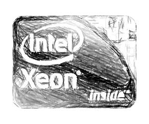

UNIDAD DE CONTROL  \(UC\)

  *  _Interpreta_    las instrucciones almacenadas en la memoria y    _genera_    las    _señales de control_    necesarias para ejecutarlas.
  * Activa o desactiva los componentes del microprocesador en función de:
    * La    _instrucción_    que se esté ejecutando.
    * La    _fase_    de dicha instrucción que se esté ejecutando.
  * Existen dos tipos de unidades de control:
    * Cableadas \(máquinas sencillas\).
    * Microprogramadas   \(máquinas complejas\).

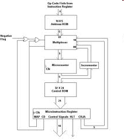

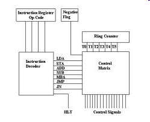

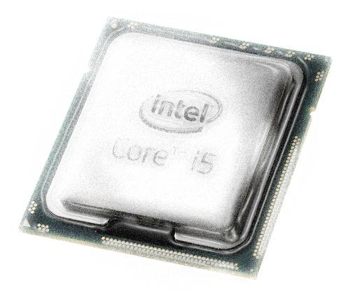

EJECUCIÓN DE UNA INSTRUCCIÓN

  * Se recibe la instrucción desde la UC.
  * Se comprueba el estado de la ALU.
  * Se cargan los operandos.
  * Se realiza la operación.
  * Se guarda el resultado en el acumulador.
  * Se guarda el estado de la ALU al final.

  * Búsqueda de la instrucción \( fetch \).
  * Decodificación de la instrucción \( decode \) y carga de operandos \( load \).
  * Ejecución de las operaciones \( execute \).
  * Escritura de resultados \( store \).

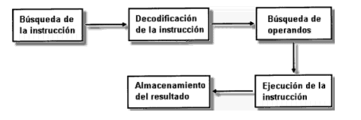

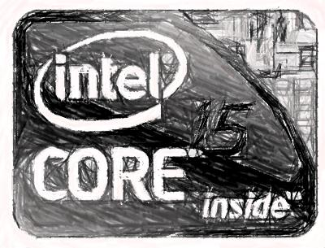

4. TIPOS DE DISEÑO DE LOS MICROPROCESADORES

Computación con una colección de instrucciones reducida\): se basan en la idea de que la mayoría de las instrucciones para realizar procesos en el computador son relativamente simples por lo que se minimiza el número de instrucciones y su complejidad a la hora de diseñar la CPU. Estos procesadores se suelen emplear en aplicaciones industriales y profesionales por su gran rendimiento y fiabilidad. Compañías    Compaq  , Motorola y   PowerPC

Computación con una colección de instrucciones compleja\): al contrario, tienen una gran cantidad de instrucciones y por tanto son muy rápidos procesando código complejo. Se trata de extender el conjunto de instrucciones de la CPU para que trabaje más eficientemente con tratamiento de imágenes y aplicaciones en 3D. Compañías   Cirix   y AMD

\-Ejecutar más instrucciones por ciclo.

\-Ejecutar las instrucciones en orden distinto del original para que las interdependencias entre operaciones sucesivas no afecten al rendimiento del procesador.

\-Contribuir a acelerar el rendimiento global del sistema, además de la velocidad de la

CPU.

## 5. DISEÑO DE LOS MICROPROCESADORES – Aumento de prestaciones

INEFICIENCIA =>   La mayoría de los componentes estaban ociosos más del 90% del tiempo

 Replicación de componentes internos de la CPU.

 Conexiones pensadas para permitir el trabajo en paralelo de TODOS ellos.

\-La   _arquitectura_   del ordenador ha aportado más al rendimiento que la miniaturización.

\-La   _refrigeración_   se ha convertido en algo crucial.

5. DISEÑO DE LOS MICROPROCESADORES – Aumento de prestaciones

PIPELINE \(SEGMENTACIÓN\)

Se divide cada instrucción en varias fases.

Cada componente de la CPU puede estar ocupado por una fase distinta de una instrucción distinta.

  Se pretende usar todos los componentes de la CPU, el 100% del tiempo.

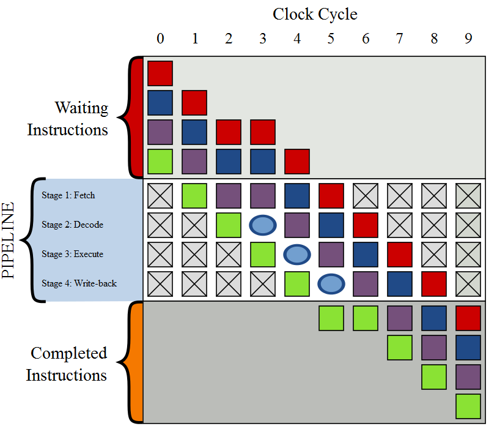

5. DISEÑO DE LOS MICROPROCESADORES – Aumento de prestaciones

HYPER\-THREADING \(HT   Technology  \)

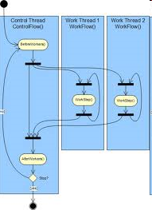

  * Se simula, de cara a los programas, como si el PC tuviera dos CPU’s, en lugar de una solo.
  * Lo inventó Intel y mejora el rendimiento un 30%.
  * Permite procesar en paralelo, sobre una misma CPU, la ejecución de varios programas “multihilo”.
  * Invisible para el SO y los programas. Solo se requiere “multiprocesamiento simétrico” \(SMP\).

5. DISEÑO DE LOS MICROPROCESADORES – Aumento de prestaciones

HYPER\-  Transport   \(HT\) o   Lightning   Data   Transport   \(LDT\)

  * Tecnología de comunicación bidireccional que ofrece gran ancho de banda.
  * Comunicación entre chips de un circuito integrado.
  * Sustituto del FSB .
  * Pretende reducir número de buses y facilitar multiprocesamiento.
  * Proporciona conexiones auto\-negociadas.
  * Utiliza líneas de 32 bits.
  * Usado por AMD en procesadores y chipsets.

5. DISEÑO DE LOS MICROPROCESADORES – Aumento de prestaciones

Intel   QuickPath     Inteconnect   \(QPI\)

  * Desarrollado por Intel para competir con HyperTransport.
  * Reemplaza FSB en procesadores \(p.ej, Core i7\) y chipsets \(X58\).

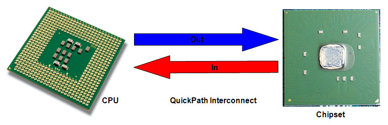

## 6. EVOLUCIÓN DE LOS MICROPROCESADORES

 1. Microprocesadores de Intel más antiguos:

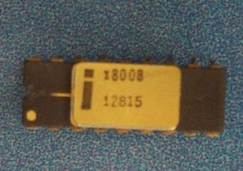

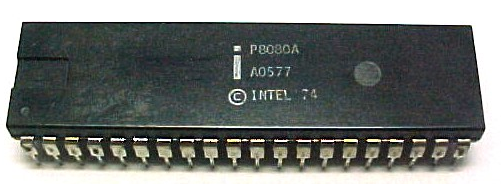

 1972: Intel 8008

 1974: Intel 8080

 1971: Intel 4004

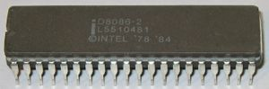

 1978: Intel 8086

 1979: Intel 8088

 2. Microprocesadores antiguos de otros fabricantes:

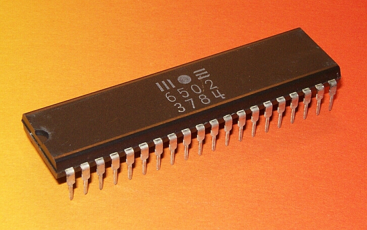

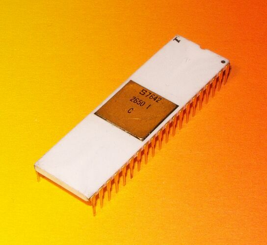

 1975:     Signetics     2650

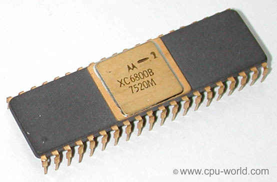

 1975: Motorola 6800

 1978: Motorola 68000

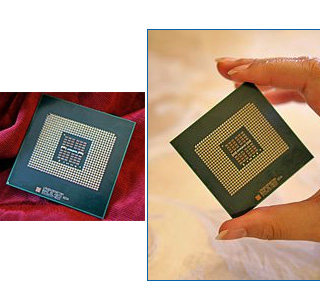

 3. Siguiente generación de Intel:

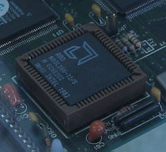

 1982: Intel 80286

 1989: Intel 80486

 1985: Intel 80386

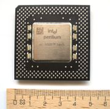

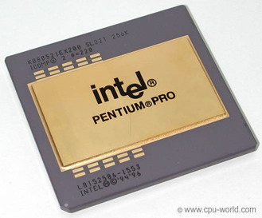

1997: Intel Pentium II

 1993: Intel Pentium

1995: Intel Pentium Pro

 4. Un nuevo competidor en el mercado, AMD:

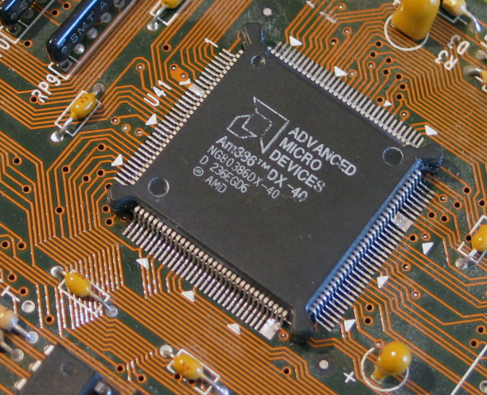

5. Microprocesadores modernos \- 1999

VELOCIDAD DEL CPU DESDE 266\-550 MHZ

CACHE L1 DE 64 KB

2.2. A 2.4 VOLTIOS

TIENE 9.3 MILLONES DE TRANSISTORES

SOCKET 7 O SÚPER SOCKET 7 .

Intel Pentium III

Velocidad de bus a 266   MHz.

Cache L1 128 KB

Cache L2 512 KB

Socket de 370   pins  .

5. Microprocesadores modernos \- 2000

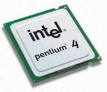

ANCHO DE BANDA 2.1 GB/SEG.

CACHE L1 128 KB, 64KB DATOS Y

 64KB INSTRUCCIONES.

CACHE L2 256 KB

BUS FRONTAL DE 266 MHZ

SOCKET 462 PINS.

BUS DE 400 MHZ

ANCHO DE BANDA DE 3.2 GB/SEG

SOCKET 432 PNS.

CACHE L1 DE 8 KB

CACHE L2 DE 512 KB ,

5. Microprocesadores modernos \- 2003

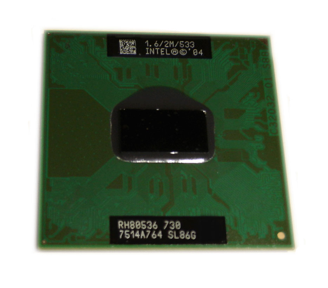

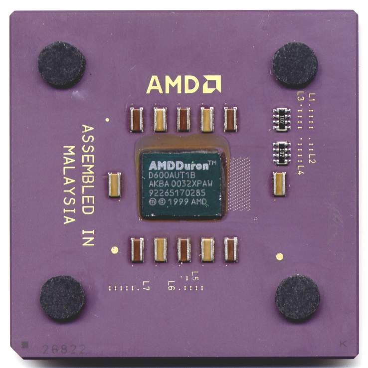

CPU   900 MHz

Velocidad   de FSB 400 MT/s

CPU   800 MHz

Velocidad   de Bus 200 MHZ

Cache L1 128KB

Cache L2 64 KB

Socket 370 pins.

5. Microprocesadores modernos \- 2005

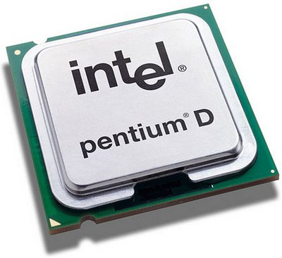

2 CPUs \(Pentium 4\) a   2,66\-3,6 GHz

Velocidad   de FSB 533\-800 MHz

Variantes   con   HyperThreading

CPU   1,0\-3,2 GHz

Velocidad     HyperTransport     800\-1000 MT/s

5. Microprocesadores modernos \- 2006

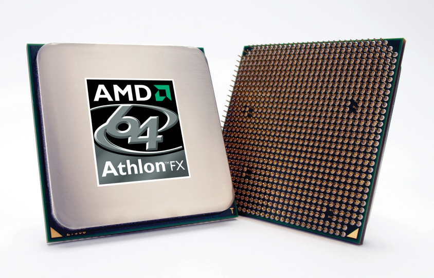

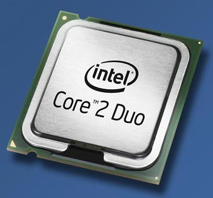

AMD   Athlon   64 FX

Intel Core 2 Duo

2 CPUs a 1  ,8\-3,3 GHz

Velocidad   de FSB 533\-1600 MT/s

64 bits

CPU   2,4\-3,0 GHz

Bus de   sistema   a 2 GHz

64 bits

5. Microprocesadores modernos \- 2007

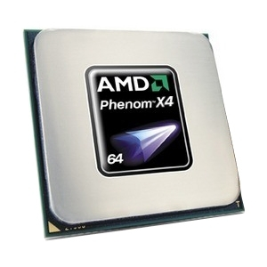

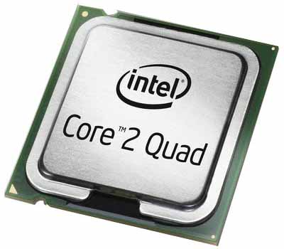

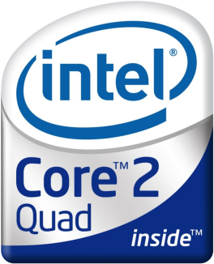

Intel Core 2 Quad

4 CPUs a 2  ,3\-3,0 GHz

Velocidad   de FSB 1066\-1333 MT/s

4 CPUs   2,4\-2,6 GHz

Bus de   sistema   a 2 GHz

5. Los microprocesadores más modernos de Intel

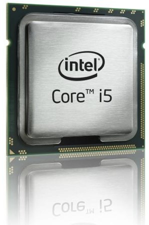

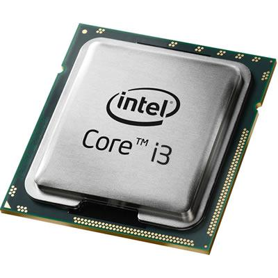

   2 ó 4 núcleos

 Hasta 3,60 GHz con Turbo   Boost

   HyperThreading

 Velocidad bus DMI de 2,5 GT/s

   2 ó 4 núcleos

   HyperThreading

 GPU integrada

   4 núcleos

 Velocidad de CPU: 2,66 GHz a 3,33 GHz

 Velocidad QPI: 4,8\-6,4 GT/s

- 1971:  Intel 4004  \(primer microprocesador comercial\)
- 1972:  Intel 8008
- 1974:  Intel 8080
- 1975: Signetics 2650, MOS 6502,  Motorola 6800
- 1976:  Zilog   Z80
- 1978:  Intel 8086 ,  Motorola 68000
- 1979:  Intel 8088
- 1982:  Intel 80286
- 1985:  Intel 80386 ,  AMD Am386
- 1987:  Motorola 68030
- 1989:  Intel 80486 , AMD Am486

- 1993:  Intel Pentium ,  AMD K5
- 1995: Intel Pentium Pro
- 1997:  Intel Pentium II ,  AMD K6
- 1999:  Intel Pentium III
- 2000:  Intel Pentium 4 ,  AMD   Athlon   XP

2003: PowerPC G5, Intel Pentium M

2005: Intel Extreme Edition con  hyper\-threading ,  Intel   Core              Duo ,  AMD   Athlon   64 ,  AMD   Athlon   64 X2 ,

2006:  Intel   Core   2   Duo , Intel Core 2 Extreme, AMD Athlon FX

2007:  Intel   Core   2   Quad ,  AMD   Quad     Core , AMD Quad FX

2008\-…:  Intel   Core   i3,   Intel   Core   i5, Intel   Core   i7,                 AMD Athlon II, AMD Phenom II, AMD Turion II,…

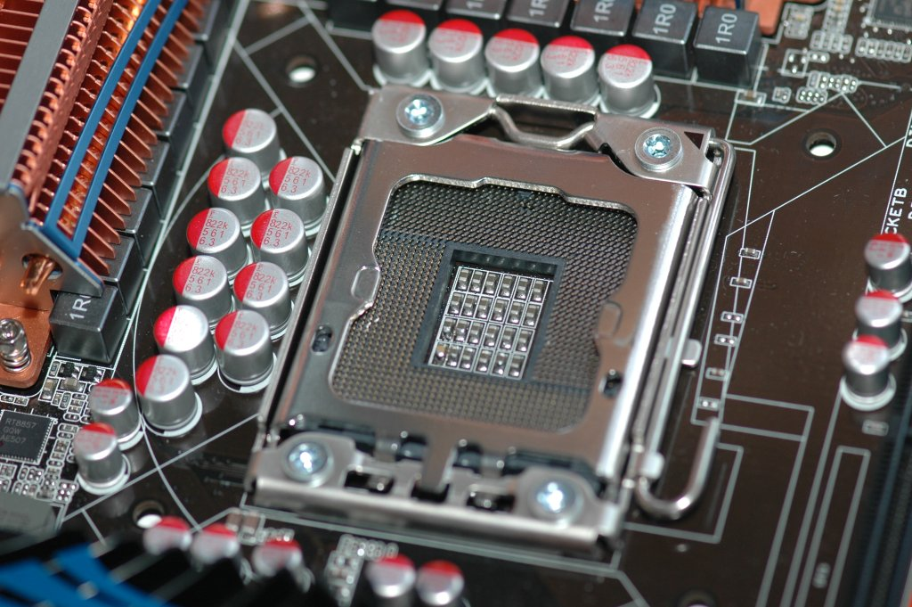

## 7.CARACTERÍSTICAS TÉCNICAS DE ALGUNOS MICROS

Pentium   Classic  :

Está optimizado para aplicaciones de 16 bits.  Dispone de 8Kb de caché de instrucciones \+ 8Kb de caché de datos.  Utiliza el zócalo de tipo 5 \(socket 5\) o el de los MMX \(tipo 7\). También es conocido por su nombre clave P54C.  Está formado por 3,3 millones de transistores

| Especificaciones de la gama Pentium |            |            |         |       |               |        |
| :---------------------------------: | :--------: | :--------: | :-----: | :---: | :-----------: | :----: |
|             Procesador              | Frecuencia | Tecnología | Voltaje |  Bus  | Multiplicador | Socket |
|                 P60                 |   60Mhz.   |   0,8 µ    |   5v    | 60Mhz |       -       |   4    |
|                 P66                 |   66Mhz    |   0,8 µ    |   5v    | 66Mhz |       -       |   4    |
|                 P75                 |   75Mhz    |   0,6 µ    |  3,52v  | 50Mhz |      1,5      | 5 / 7  |
|                 P90                 |   90Mhz    |   0,6 µ    |  3,52v  | 60Mhz |      1,5      | 5 / 7  |
|                P100                 |   100Mhz   |   0,6 µ    |  3,52v  | 66Mhz |      1,5      | 5 / 7  |
|                P120                 |   120Mhz   |   0,35 µ   |  3,52v  | 60Mhz |       2       | 5 / 7  |
|                P133                 |   133Mhz   |   0,35 µ   |  3,52v  | 66Mhz |       2       | 5 / 7  |
|                P150                 |   150Mhz   |   0,35 µ   |  3,52v  | 60Mhz |      2,5      |   7    |
|                P166                 |   166Mhz   |   0,35 µ   |  3,52v  | 66Mhz |      2,5      |   7    |
|                P200                 |   200Mhz   |   0,35 µ   |  3,52v  | 66Mhz |       3       |   7    |

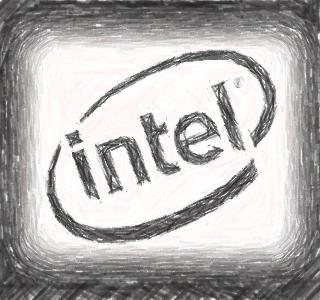

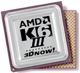

La memoria de segundo nivel trabaja a la misma velocidad que la CPU.  Utilizan el zócalo super7 a 100   Mhz.  64 KB   de caché L1 \(32 para datos y 32 para instrucciones\)  256 KB   de caché L2.  Fabricados con 21,3 millones de transistores y tecnología de 0,25 micras.  Soporte para AGP.

| Especificaciones de la gama K6-III |        |               |              |        |         |              |                  |
| :--------------------------------: | :----: | :-----------: | :----------: | :----: | :-----: | :----------: | :--------------: |
|             Procesador             | Freq.  | Voltaje Core | Voltaje I/O |  Bus   | Multip. | Temp.Máxima | Potencia Máxima |
|             K6-III/400             | 400Mhz |      2,4      |     3,3      | 100Mhz |   2,5   |     65º      |      26,8 W      |
|             K6-III/450             | 450Mhz |      2,4      |     3,3      | 100Mhz |    3    |     65º      |     29,50 W      |

