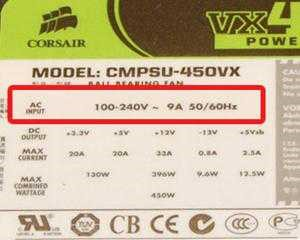
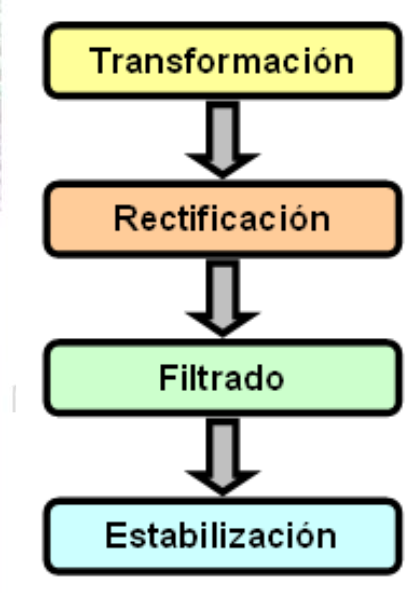
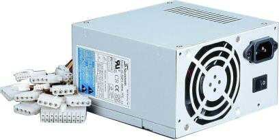
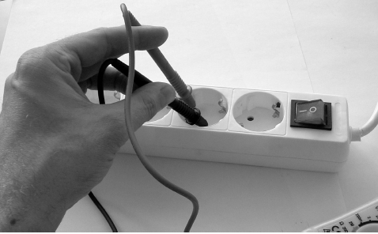
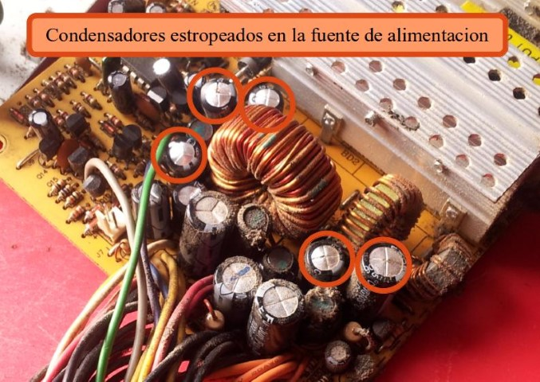

# Fuente de alimentación

## Medida de parámetros eléctricos

Una fuente de alimentación es un circuito que convierte la tensión alterna de la red industrial en tensión prácticamente continua\.

__Información de la etiqueta de una fuente de alimentación__

- Tensión de entrada \(AC INPUT\)
- Tensión de salida \(DC OUTPUT\)
- Capacidad de carga \(MAX CURRENT\)
- Potencia máxima combinada \(MAX COMBINED WATTAGE\)

## Bloques de una fuente de alimentación

Las fuentes que se utilizan en la actualidad son las  __fuentes ATX__ \.

Las nuevas fuentes de alimentación vienen equipadas con  __ventiladores__  cada vez más silenciosos\.

Son ventiladores mayores que evacúan el mismo aire pero dando menos vueltas\.

## Características de una fuente de alimentación

- __Eficiencia__ \. Más de un 80% está bien\.
- __Nivel de ruido__ \. Cuanto menor sea el nivel de ruido mejor será la fuente\.
- __Conectores SATA__ \. Cuantos más conectores SATA traiga la fuente mejor\. De esa forma no habrá que utilizar adaptadores\.
- __Single fan, Dual Fan__ \.\.\. Número de ventiladores que tiene la fuente de alimentación\.

Voltajes suministrados por una fuente de alimentación

No confundir un conector 24\+4 con uno 20\+4\.

El conector extra de 4 pines de 12 voltios es para alimentar al micro mientras que esos 4 pines extra son para reforzar voltajes que suelen utilizar algunos componentes\.

## Medidas de tensión de fuente de alimentación

_Comprobación de la toma de corriente_

Para comprobar la tensión de alimentación de la fuente, se debe medir el voltaje en alterna (AC) con unas **puntas de prueba**. El resultado debería ser aproximadamente de 220V. Para evitar una posible sobrecarga, se recomienda conectar la fuente a un **ladrón o regleta**, insertando primero una punta y luego la otra, y el mismo procedimiento para desconectar.

## Fallos en la fuente de alimentación

* _Fallos comunes_
* __A__  __\) __  __La fuente deja de funcionar__
  * El ordenador no enciende y cuando se prueba la fuente de forma aislada no da signos de vida\.
* __B\) La fuente deja de suministrar tensiones correctas__
  * Este fallo es mucho más difícil de localizar\.
  * Puede dañar los componentes del equipo \(memoria, placa, micro, disco duro\.\.\.\)\.
  * Se puede testear el funcionamiento correcto por software \(Everest, Hardinfo\.\.\.\) o mejor por hardware \(tester de fuentes de alimentación o multímetro\)\.

Fallos en la fuente de alimentación

* _Origen de los fallos más habituales_
* __La sobretensión__
* Provoca una rotura de la fuente de alimentación \(en algunos casos simplemente se funde el fusible de seguridad\)\.
* En otras ocasiones la avería puede ser más grave llegando a dañar componentes del equipo\.
* __Exceso de temperatura\.__
* El exceso de temperatura puede deberse:
  * Al mal funcionamiento del ventilador
  * Obstáculos en la entrada y salida de aire de la fuente
  * Acumulación de suciedad y polvo\.

_Recomendación a la hora de manipular la fuente_

Los  __condensadores__  de una fuente de alimentación almacenan energía incluso después de estar apagada\.

No intentes tocarlos salvo que la fuente lleve mucho tiempo apagada

