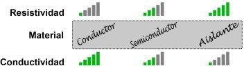
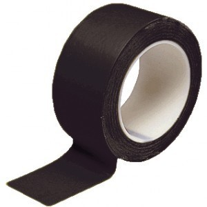

# Materiales aislantes y materiales conductores

_Aislantes_

Impiden el desplazamiento de electrones en su interior y por tanto la corriente eléctrica\.

El material aislante más utilizado es el plástico\.

_Conductores_

Permiten un paso de electrones en su interior cuando en un extremo y otro hay una diferencia de potencial \(tensión eléctrica\)\.

Los metales son materiales muy conductores\.

__Conducción vs resistividad__

Un material con poca resistividad es buen conductor de la electricidad

Un material con mucha resistividad es mal conductor de la electricidad

