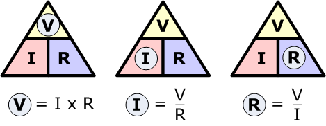
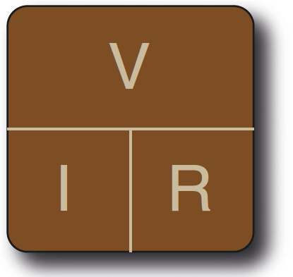
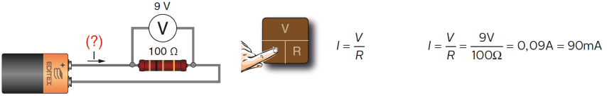
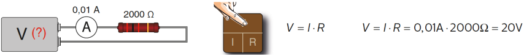
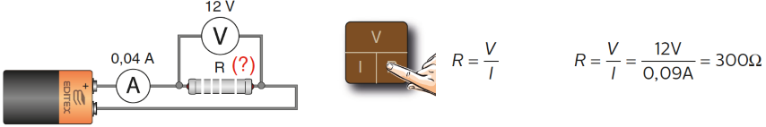

# Ley de ohm

* _¿Cómo se relacionan la intensidad, la tensión y la resistencia?_
* La ley de Ohm es la ley de la electrodinámica que relaciona las magnitudes de la electricidad \(intensidad, tensión y resistencia\) básicas de cualquier circuito eléctrico
* Fue postulada por el físico y matemático alemán  __Georg __  __Simon__  __ Ohm\. __
* La Intensidad que circula por un circuito es:
  * Proporcional a la tensión que aplicamos en él
  * Inversamente proporcional a la resistencia que opone a dicha corriente\.

