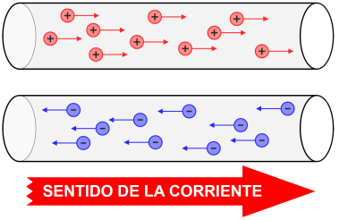

# Magnitudes eléctricas

Cuando dos cuerpos tienen distinto número de electrones se dice que entre ellos hay diferencia de potencial:  __tensión eléctrica __ o  __voltaje__ \.

Cuando se conectan ambos cuerpos se trata de compensar la diferencia de potencial y se produce un movimiento de cargas de un cuerpo a otro: la  __corriente eléctrica\.__

Al representar la corriente eléctrica por convenio se asigna el signo contrario al desplazamiento de los electrones\.

## ¿Cómo medimos la electricidad?

* Magnitud es todo aquello que se puede medir y cuantificar\.
* Las principales magnitudes eléctricas con las que podemos medir la electricidad son:
  * Voltaje o tensión
  * Intensidad
  * Resistencia
  * Potencia
  * Energía

## Voltaje \(V\)

  * La diferencia de potencial se llama también  _voltaje_  o  _tensión_ \.
  * La unidad es el voltio y otras unidades habituales son el milivoltio o el kilovoltio
  * Se representa con la  letra V\.
  * El voltaje se puede medir con un aparato llamado voltímetro\.

## Intensidad \(I\)

Al conjunto de electrones en movimiento por un circuito eléctrico cerrado se le llama Intensidad o flujo de electrones\.

Esta magnitud dependerá de la tensión o voltaje que se aplique al circuito y de la resistencia que algún dispositivo del circuito ofrezca al paso de estos electrones\.

La intensidad de la corriente eléctrica se designa con la letra \(I\)

Su unidad de medida en el Sistema Internacional \(SI\) es el ampere \(llamado también "amperio"\), que se identifica con la letra \(A\)\.

Magnitudes eléctricas

## Resistencia \(R\)

La resistencia es la dificultad u oposición  que presenta un material al paso de la  corriente eléctrica\.

La unidad es el Ohmio y se representa por  la letra omega mayúscula Ω \.

La resistencia se puede medir mediante un aparato llamado ohmímetro u óhmetro\.

* Los valores tipo con los que vamos a trabajar con los componentes informáticos en relación a los parámetros eléctricos, vienen dados por los tipos de medida que se suelen realizar al tratar con sistemas informáticos, teniendo:
* _Continuidad o la medida de resistencia_
* Vamos a tener una idea de lo conductor o aislante que puede ser un material, o de si un conductor tiene algún defecto o daño que va a impedir circular la corriente\.
* Si usamos la continuidad tendremos dos valores tipo:
  * conductor con fallos o sin fallos
  * Material conductor o aislante\.
* Si usamos la resistencia tendremos como valores tipo:
  * 0 Ω  conductor sin fallos
  * Infinitos Ω material aislante o fallo en el conductor
  * Cualquier otro valor nos indicará la oposición al paso de los electrones\.

## Múltiplos y submúltiplos

* Las  __unidades básicas __ pueden ser demasiado grandes o demasiado pequeñas
* Por ejemplo
  * En dispositivos de estado sólido podemos encontrar intensidades menores a 0,0000001 A \(1 uA\)
  * En una planta de reducción de aluminio se pueden utilizar 110\.000 A \(110 KA\)
* _¿Cómo manejamos unidades muy grandes o muy pequeñas?_
* Para evitar números muy grandes se utilizan  __múltiplos__
* Para muy pequeños,  __submúltiplos__ \.
* Utilizaremos los prefijos necesarios en cada situación

## Tensión en alterna y en contínua

_Tensión en alterna_

Este tipo de magnitud es provocada por las compañías eléctricas para dar el suministro eléctrico a particulares y empresas\.

El valor tipo a manejar de tensión en alterna en España serán entre 220 y 240 voltios y 50 Hercios

* _Tensión en continua_
* Habitual en los circuitos electrónicos\. Todas las tensiones que alimentan los componentes que integran un sistema informático son continuas\.
* El valor es el que tenemos después de la fuente de alimentación, y a la entrada de todos los componentes informáticos y son
  * __12 V __ para alimentar a los motores
  * __5 V __ para alimentar al hardware de transferencia de datos
  * __3,3 V __ para la electrónica de procesadores o memorias, y para disco duro SATA\.
  * También  __\-12 V, \-5 V __ para la electrónica de la placa base\.

_Intensidad en alterna_

Este tipo de magnitud es provocada por cada equipo que utiliza la red eléctrica

Marca la cantidad de energía de un dispositivo conectado al suministro eléctrico, en alterna\.

El valor tipo a manejar de intensidad en alterna vendrá dado por el consumo o condiciones de trabajo y éste estará entre 1A y 4A\.

* _Intensidad en continua_
* Provocada por circuitos electrónicos o compontes informáticos, y marca la cantidad de energía de un dispositivo conectado a una fuente de continua, como es la fuente de alimentación\.
* Valores típicos proporcionados por una fuente de alimentación:
  * Entre 10 A y 16 A del circuito de 12 V
  * Aproximadamente 30 A del circuito de 3,3 V y 5 V
  * De 1 A del circuito de \-12 V, y 2 A otros circuitos de control\.