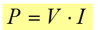
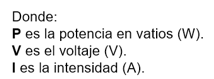
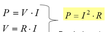
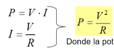
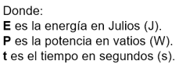
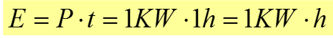

# Potencia y energía

_Potencia_

La potencia es la energía consumida en un momento puntual\. Se mide en vatios \(W\)

Los equipos electrónicos consumen X vatios a la hora\.

_Energía_

Es lo que se consume cuando tenemos un receptor conectado durante un tiempo\.

La energía se suele expresar en kilovatios hora o Kw · h

1 kilovatio hora es la energía consumida por un equipo de 1\.000 vatios conectado durante una hora\.

