# 4. Unidades de estado sólido

Las unidades de estado sólido (SSD) son un tipo de unidad de almacenamiento de datos que utiliza memoria flash para almacenar y acceder a los datos. Estas unidades no tienen partes móviles, por lo que son más rápidas, más fiables y producen menos calor que los discos duros tradicionales.

Debido a su diseño, las SSD tienen una mayor durabilidad y un tiempo de arranque más rápido, lo que las hace ideales para dispositivos portátiles como computadoras portátiles, tabletas y teléfonos inteligentes. Además, las SSD ofrecen una mejor resistencia a los golpes, lo que las hace ideales para dispositivos expuestos a ambientes hostiles.

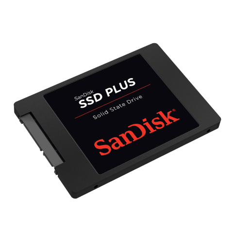

## Comparativa de tecnologías

Discos duros VS unidades de estado sólido \(SSD\)

## Unidades de estado sólido SATA

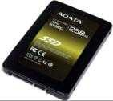

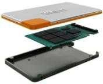

## Comparativa

Velocidad de arranque

En este video podemos ver las diferencias entre el arranque de un sistema operativo en un disco duro y en un disco SSD\. Podemos comprobar que el arranque es mucho más rápido puesto que la velocidad de lectura es más rápida en los discos SSD\.

Soporte de almacenamiento de datos que se está utilizando cada vez más porque ofrece grandes ventajas respecto a los discos duros\.

_[https://www\.youtube\.com/watch?v=4f4saFpRlvU](https://www.youtube.com/watch?v=4f4saFpRlvU)_

## Unidades de estado sólido SATA

## Discos SSD

Discos en diferentes equipos

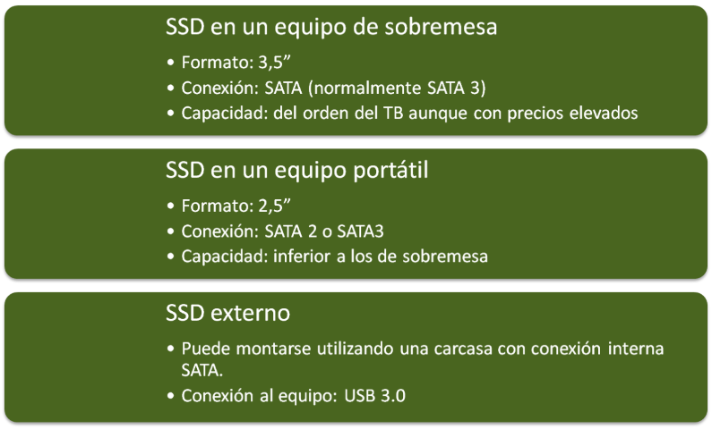

## Discos SSDSSD vs HDD

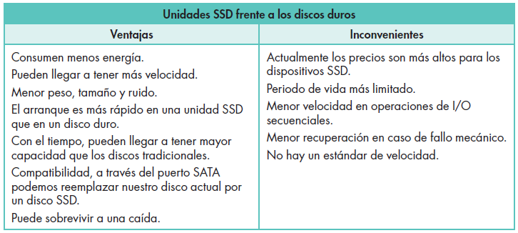

## Unidades de estado sólido

Adaptadores sobremesa

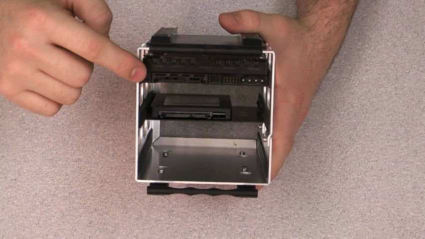

En PCs puede ser necesario un adaptador para colocarlo en una ranura para disco duro tradicional

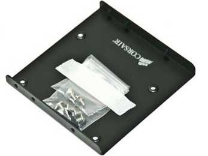

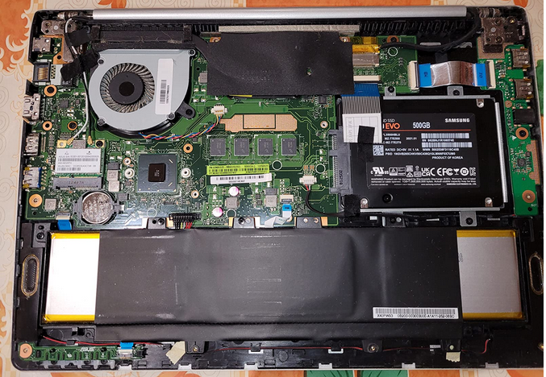

En portátiles suelen coincidir con el tamaño de los discos antiguos, y se colocan en su lugar\.

Es bastante habitual cambiar el disco duro antiguo por uno SSD para mejorar su rendimiento y alargar la vida útil

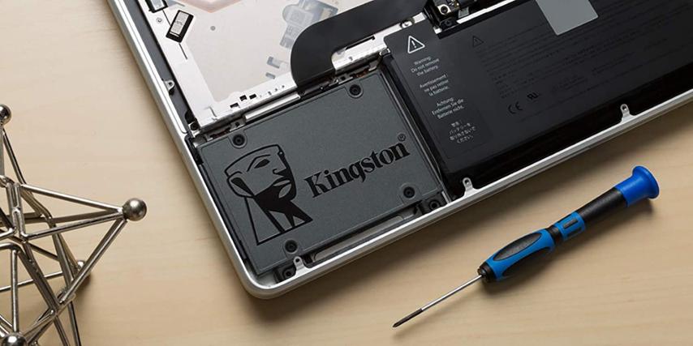

## Unidades de estado sólido NVMe

Las unidades de estado sólido (SSD) NVMe son un tipo de almacenamiento de estado sólido diseñado específicamente para aprovechar el potencial de las conexiones de alto rendimiento NVMe. Estas unidades se conectan **directamente al puerto PCIe** de una computadora, lo que significa que no hay que pasar por el procesamiento adicional de un controlador SATA, lo que permite un rendimiento mucho mejor.

Estas unidades ofrecen un **mayor rendimiento, mayor durabilidad y menor consumo** de energía que los discos duros tradicionales y unidades de estado sólido SATA. Al ofrecer un rendimiento más alto, estas unidades permiten una mejor experiencia de usuario para tareas como edición de video, juegos y renderizado.

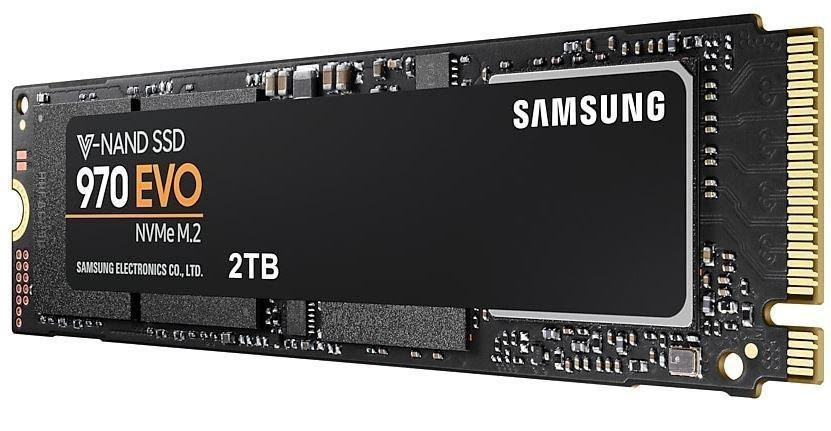

## Discos SSD NVMe

__Se conectan directamente a la placa__  sin necesidad de cables, a través de una ranura especial llamada M2\.

Las placas base  __tienen que estar preparadas__  y equipadas con una ranura especial para poder utilizar este tipo de memorias\.

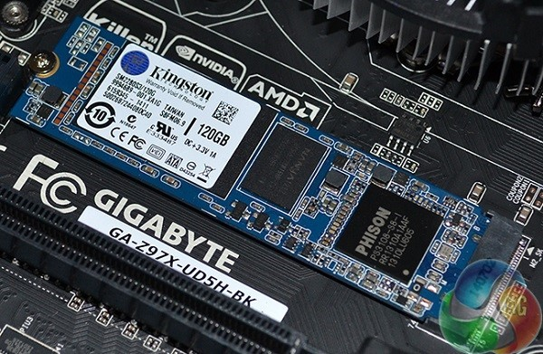

### Diferencias con las unidades SATA

Se pueden alcanzar  __velocidades de lectura y escritura__  superiores a la conexión mediante interfaz SATA\.

Esto reduce tiempos de carga y copia de archivos\.

Se trata de un nuevo formato  __más compacto__  que los discos SSD\.

Por el contrario, son  __más caras __ que unidades con la misma capacidad SATA\.

### Diferencia de velocidades

_Son más rápidas_

Llegan a alcanzar 5 veces más velocidad de transferencia que las unidades de estado sólido SATA\.

Esto es porque están conectadas por PCIe directamente a la placa\.

_Diferencias de velocidad con otros discos_

Estas unidades llegan a dar velocidades de lectura hasta  __2\.500 Mbps \(2,5 Gbps\)__

Unidad SSD SATA: hasta  __500 Mb/s __

Disco duro:  __100 Mb/s__

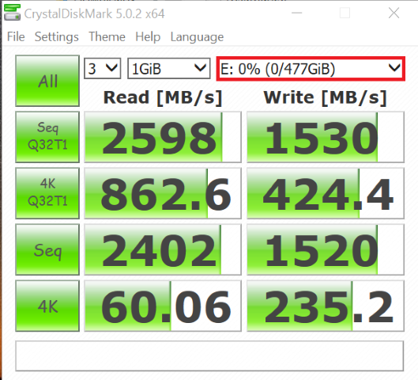

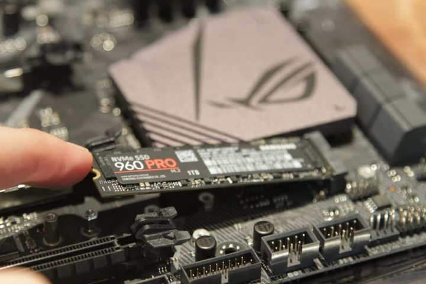

_¿Cómo lo instalo?_

La placa base tiene que tener un puerto especial para este tipo de almacenamientos

Se sujetan a la placa generalmente con un tornillo\.

_Portátiles y tablets_

Es el tipo de disco que tienen equipados  __tablets y portátiles ultraligeros__ , como el MacBook air, por ejemplo\.

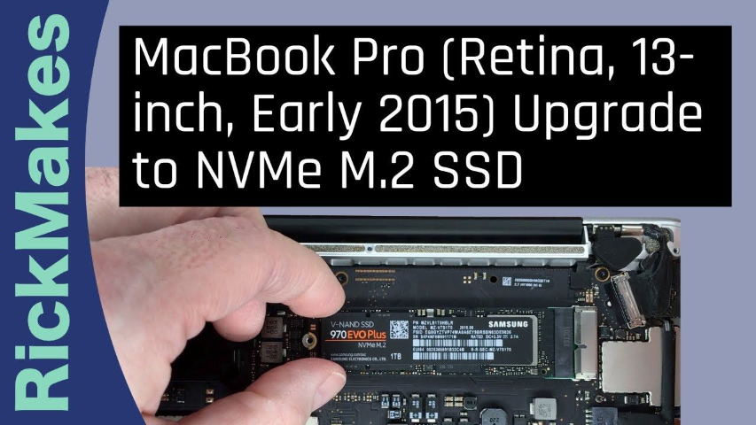

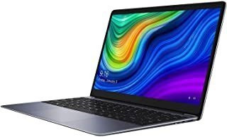

_[https://www\.youtube\.com/watch?v=j\_XmxniqyKI](https://www.youtube.com/watch?v=j_XmxniqyKI)_

## Otros discos SSD

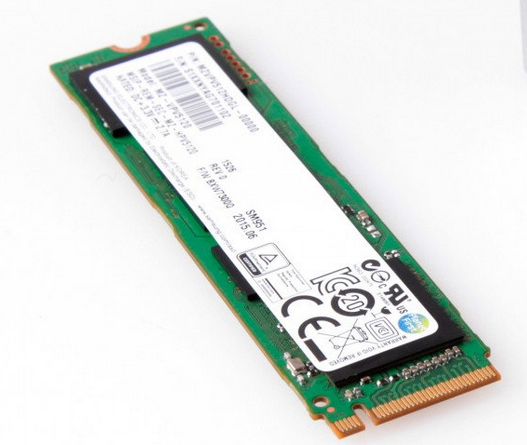

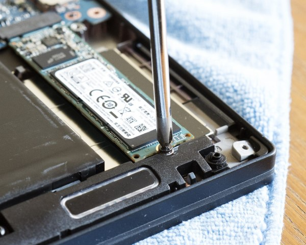

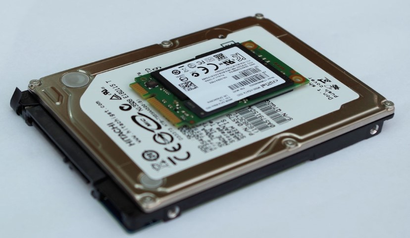

## Unidades de estado sólido SATA

Estructura interna

__Conectores__

Conector SATA datos

Conector SATA corriente

__Circuitos integrados__

Controlador \(procesador\)

Buffer o caché

Chips de memoria

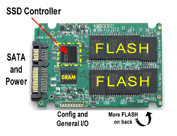

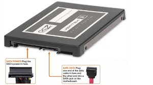

## Discos híbridos

## Discos SSD

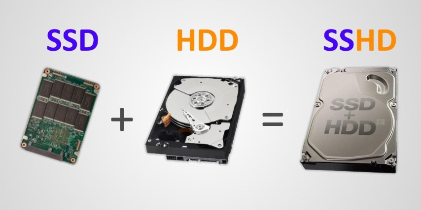

__Combinan dos tecnologías__

Los  _platos_  giratorios de un disco duro clásico

Pequeña de  _memoria flash _ del tipo NAND

__Ventajas__

Memoria flash hace las veces de  _caché_

Mejora velocidad de transferencia y búsqueda

Mejor consumo energético de estas unidades \(ideal para equipos portátiles\)

__Alarga la vida útil de la unidad__

Al utilizar la memoria flash, el disco puede permanecer durante mucho tiempo detenido

El motor que hace girar los platos arranca y se detiene en forma permanente, aspecto que resta vida útil a la unidad\.

Las ventajas se aprovechan al máximo en los sistemas operativos que las soportan

Los discos híbridos son el paso intermedio a las unidades de estado sólido\.

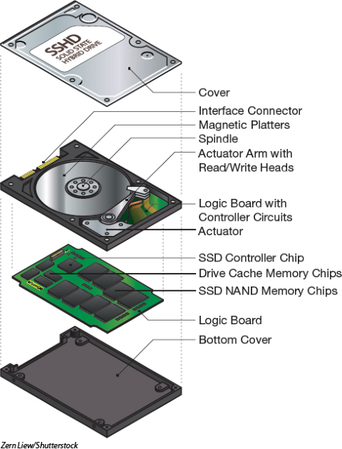

## Otros

Discos duros con helio

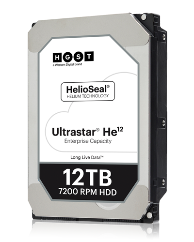

* Unidades mecánicas que, en vez de contener aire filtrado  _contienen helio_
* Genera menos turbulencias y menos calor por la fricción
* Permite aumentar la velocidad de giro de los platos \( _hasta 20\.000 RPM_ \)
* _Temperatura_  más baja no pone en riesgo datos ni la unidad
* __Ventajas__
* Menor consumo, menor ruido generado, más ligeras, mayor vida útil y mayor capacidad\.
* Se logró superar la barrera de las unidades convencionales \(4 TB\)
* Se puede llegar a  _6 TB _ de capacidad \(se pueden apilar hasta siete platos\)
* Los discos duros mecánicos necesitan un gas en su interior
  * Para disipar el calor generado
  * Para hacer levitar las cabezas a corta distancia sobre la superficie de los platos \(efecto Bernoulli\)

Discos duros con helio

## ¿Qué dispositivo elegir?

HDD vs SSHD vs SSD

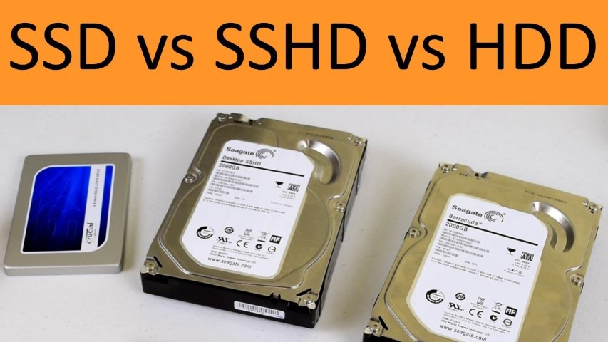

