# 5. Dispositivos ópticos

## Discos compactos

_Características generales_

Las unidades CD\-ROM \(compact disk ROM\) son capaces de leer la información contenida en unos discos compactos o compact disc, idénticos en aspecto físico a los CD de música\.

Estas unidades permiten leer la información del disco, pero no pueden modificarla\.

Formadas por un láser y el mecanismo de control asociado\.

El disco CD\-ROM o compact disc, es un plato de plástico, con una fina capa de aluminio y otra capa de plástico para su protección\.

Permiten almacenar en un disco hasta  __654 MB__

Un disco normal de música puede contener hasta  __74__  minutos de grabación

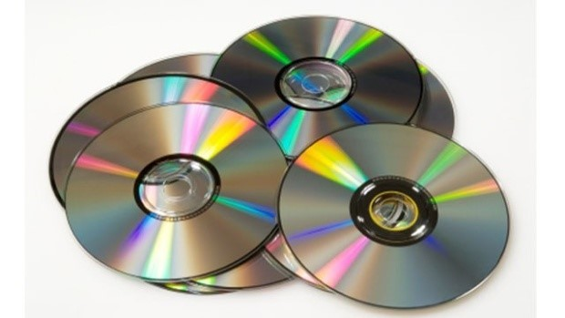

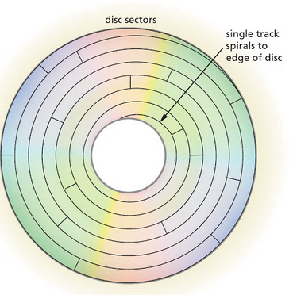

_Funcionamiento_

La forma de almacenar información difiere de los discos duros\.

Datos en una sola pista en  __espiral__ , de 6 km

Sectores de 2\.352 bytes unos detrás de otros

Velocidad de rotación debe variar de forma continua cuando la cabeza de lectura se desplaza desde la periferia hacia el centro\.

__Velocidad de giro: __ 400 rpm en el exterior del disco y 1\.000 rpm en el interior\.

Cada disco contiene 270\.000 sectores, lo que da una capacidad total de 605,62 MB\.

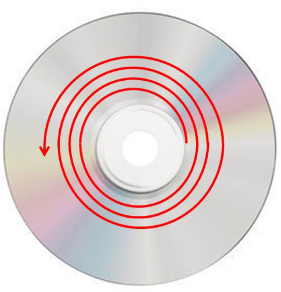

## Lectores y grabadores de discos

Componentes de un lector

Un lector permite leer información en un CD, DVD o BluRay

Grabador permite leer y escribir

Su conexión al equipo es similar a los discos duros

_Componentes_

Cabezal móvil

Lente láser

Eje de fijación del soporte

Carros

Motor

Bandeja de soporte

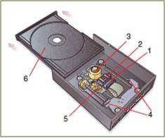

Lectores de sobremesa y portátil

## Lector / Grabador CD

Conectores de audio

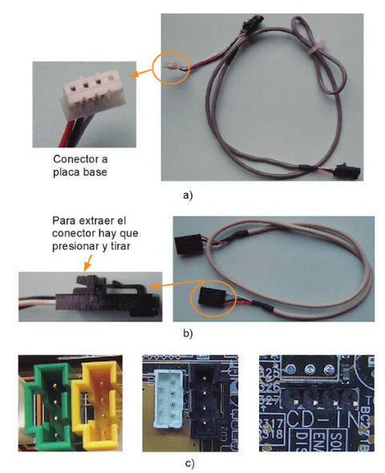

## Disco compacto

Proceso de fabricación

Utiliza un  __disco maestro __ en el que se graban empleando un láser de alta potencia

Este disco es utilizado para estampar la imagen en el policarbonato del CD\.

_A continuación:_

Se aplica una  __cubierta de aluminio__ , que caracteriza su habitual aspecto brillante y que sirve para reflejar la luz láser del cabezal de lectura\.

Se aplica una fina  __capa protectora de laca __ transparente\.

Se  __serigrafia__  encima la etiqueta

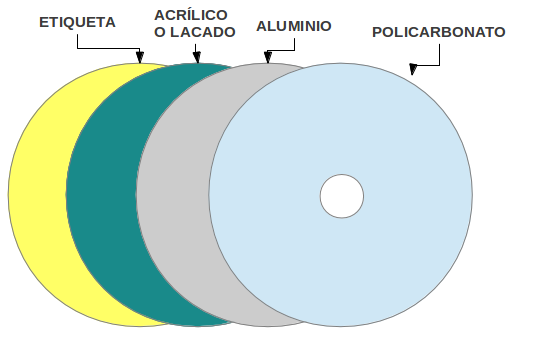

Almacenamiento de la información

* La cabeza de la unidad envía un haz de luz desde la parte inferior del disco
* La luz se  __refleja__  en la capa de aluminio\.
* La cantidad de luz reflejada depende de la superficie sobre la que incide:
  * __Pit \(hoyo\): __ la luz se disipa y la intensidad reflejada es mucho menor que cuando incide sobre un llano\.
  * __Land__  __ \(llano\)__  funcionan como espejos, reflejando casi toda la luz que reciben\.
* La secuencia de  __pits__  y  __lands__  __ __ representa una secuencia binaria

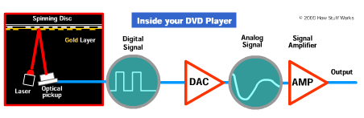

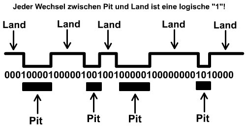

Almacenamiento de la información

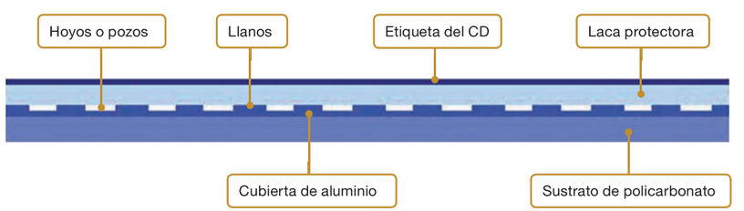

## Discos ópticos

Compact disc \(tecnología\)

Compact disc \(tecnología\)

## Lector / Grabador CD

Grabación de discos

* _Detalles a tener en cuenta el grabadoras de CD\-ROM, DVD o _  _blu\-ray_  _ \(I\)_
* __Copia de CD a CD directa __  __\(__  __on\-the\-fly__  __\)__
  * CD/ROM o DVD son dispositivos más lentos
  * Fijarse si los discos admiten la  __velocidad__  de grabación de la regrabadora\.
  * Asegurarse que el lector de CD\-ROM, DVD o blu\-ray es capaz de proporcionar datos de audio digital con suficiente velocidad\.
* __Si no se puede hacer la grabación directa __
  * Hacer una copia en el disco duro
  * Luego copiarla en el CD o DVD de la regrabadora\.

* Un  __archivo ISO __ es lo que se conoce como "una imagen" o copia exacta del sistema de archivos y contenido de un CD o DVD\.
* Estos archivos se utilizan con múltiples propósitos
  * Al copiar de CD a CD pasando por el disco duro
  * Emular CD en máquinas virtuales
  * Clonar discos
* __Montar una imagen \(ISO\)__
* Los archivos ISO pueden ser montados en unidades de CD o DVD virtuales
* Es equivalente a tener un disco compacto y colocarlo en una lectora física\.
* Para esto existen programas que permiten crear dichas unidades con relativa facilidad y otros para crear nuestros propios archivos\.

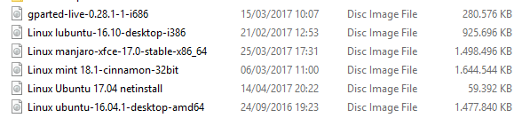

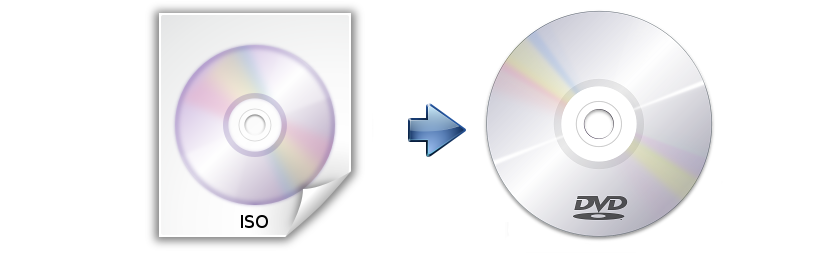

Grabación de discos

_Detalles a tener en cuenta el grabadoras de CD\-ROM, DVD o _  _blu\-ray_  _ \(II\)_

Es conveniente comprobar que hay suficientes recursos del sistema\.

Los protectores de pantalla y los sistemas de ahorro de energía deben estar desactivados Cuanto menor sea la velocidad de copia, mejor será el resultado\.

__Software de grabación__

El software se encarga, entre otras cosas, de controlar la potencia del láser para grabar \(o quemar\) los discos, tanto grabables como regrabables\.

__El software para grabar CD o DVD es diverso\.__

_Entorno _  _Windows:_ NERO Burning, Easy\-CD Creator, Grabador de Windows

_Entorno Linux:_  tenemos Brasero y K3b\.

_MAC OSX:_  Burn para

## DVD

__¿Por qué contienen más datos que un CD?__

Tamaño de los hoyos son menores que en los CD

Las pistas están más próximas

Un DVD puede tener 2 capas

Un DVD puede tener 2 caras

DVD utiliza un método más eficaz de detección y corrección de errores

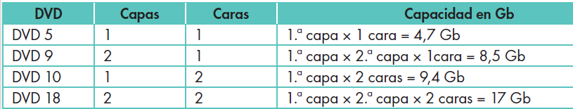

Lectura de CD y DVD

Una unidad DVD\-ROM puede estar dotada con  _dos láseres _

Cada uno tiene diferente longitud de onda

Garantiza así la compatibilidad hacia atrás con los CD\-ROM y CD\-R/RW\.

Unidad DVD puede leer los formatos estándar habituales de CD

Las unidades antiguas puede que no sean compatibles

No tienen porqué poderse leer todos los formatos

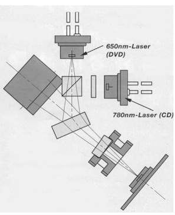

## Lector / Grabador DVD

## Tipos de DVD

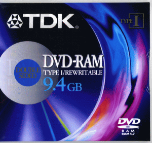

## Blu-ray

* Tecnología láser  __azul\-violeta__  \(405 nm\)
* Soporte alta definición \(1920x1080p@24FPS\)
* Soporta compresión MPEG2,MPEG4 y VC1
* Velocidad transferencia:  __54 MB/s__
* __Tipos__
  * BD\-ROM \(Lectura\)
  * BD\-R \(Grabable\)
  * BD\-RE \(Regrabable\)
* __Compatibilidad__
  * Reproductores / Grabadores compatibles con CD y DVD

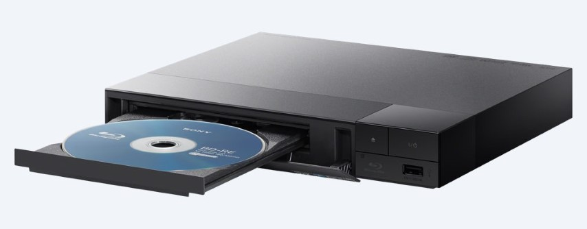

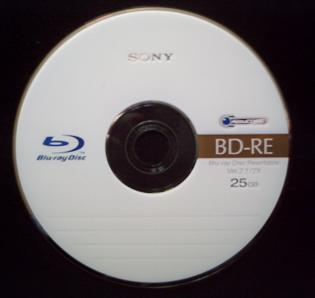

Formato de disco óptico

Vídeo HD y datos

Modelo  _1 capa: 25 GB_

Modelo  _2 capas: 50 GB_

Actualmente: tecnología multicapa \(hasta 400 GB\)

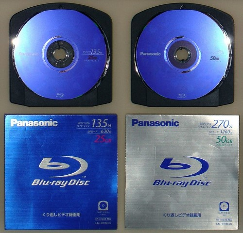

|      Disc type      |                ROM, RE or R                |                     |   ROM    |        |   RE   |          R          |          |
| :-----------------: | :----------------------------------------: | :-----------------: | :------: | :----: | :----: | :-----------------: | :------: |
|        Layer        |                     SL                     |         DL          |    DL    |   TL   |   TL   |         TL          |    QL    |
|      Capacity       |                   25 GB                    |        50 GB        |  66 GB   | 100 GB | 100 GB | 100 GB 200 GB (DSD) |  128 GB  |
|   Capacity/layer    |                  25.0 GB                   |                     | 33.4 GB  |        |        |                     | 32.0 GB  |
| Minimum-Mark length |                  0.149 pm                  |                     | 0.112 pm |        |        |                     | 0.117 pm |
|     Track Pitch     |                  0.32 pm                   |                     |          |        |        |                     |          |
|     Modulation      |                    17PP                    |                     |          |        |        |                     |          |
|         ECC         |                LDC with BIS                |                     |          |        |        |                     |          |
|  Sector/Block size  |                 2 KB/64 KB                 |                     |          |        |        |                     |          |
|     Track path      |                                            | Opposite track path |          |        |        |                     |          |  |
|    Writing speed    | RE: 1x, 2x R:1x, 2x, 4x(opt), 6x(opt) |                     |    -     |        |   2x   |       2x, 4x        |          |

Televisión de alta definición \(Capacidad\)

Almacenamiento datos / Backup

Desarrollo de videojuegos \(PlayStation 3\)

Estudios de cine/TV

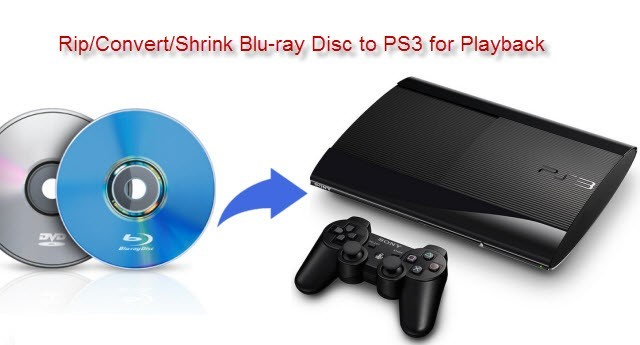

* El  __"Mini Blu\-ray Disc" __ \("Mini\-BD" o "Mini Blu\-ray"\) es una variante compacta de 8 cm de diámetro del disco Blu\-ray
* Puede almacenar
  * __7\.8 GB __ de datos en capa única
  * __15\.6 GB __ en un disco de doble capa\.
* Similar en concepto a MiniDVD y MiniCD\.
* Versiones grabables \(BD\-R\) y regrabables \(BD\-RE\) de Mini Blu\-ray Disc
* Utilización en videocámaras compactas y otros dispositivos de grabación

## HD-DVD

_Características_

High Density Digital Versatile Disc

Formato de almacenamiento óptico

Desarrollado como un estándar para el DVD de alta definición por Toshiba, Microsoft y NEC, así como por varias productoras de cine que

Podía almacenar hasta  __30 GB__ \.

Acabó por sucumbir y casi desaparecer ante su inmediato competidor, el Blu\-Ray Disc o BD o Rayo Azul \(diseñado por Sony\) por convertirse en el estándar sucesor del DVD\.

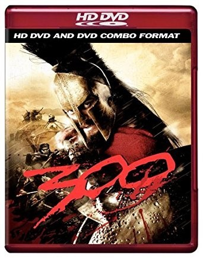

## Velocidades de lectura y grabación de discos

## Velocidades de lectura / grabación

Velocidad en compact disc

* La velocidad de transferencia depende
  * Del propio soporte óptico \(especialmente en la tasa de grabación\)
  * De los dispositivos encargados de su manejo\.
* Se expresan como  __multiplicadores__
  * 1x, 2x, 4x, etc\.
* Originalmente reproducción del sonido obligaba a velocidad de 150 KB/S
* Los dispositivos posteriores permiten velocidades mayores
* Expresan su velocidad como un múltiplo de la velocidad mínima:
* __Antiguos__ : 2x transfieren información a 300 KB/s
* __Actuales__ : 48x equivalen a 7 MB/s

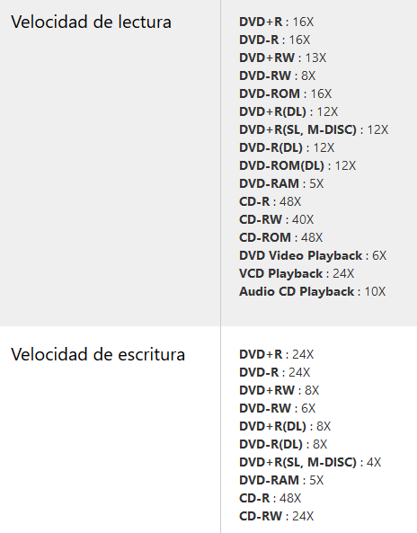

Velocidad en DVD y BluRay

* Con la aparición del DVD y posteriormente del BluRay, la costumbre de usar multiplicadores para referirse a la velocidad
  * __DVD__  1x representa 1\.350KB/s
  * __BluRay__  1x representa 4,5MB/s
* __Regrabadoras__  __ de DVD __
  * Capaces de leer y grabar tanto CDs como DVDs
  * Existen modelos capaces de operar también con BluRay
  * Presenta distintas velocidades de lectura/escritura según el tipo de soporte óptico que opere\.
* Vel de lectura >> Vel escritura >> Vel reescritura

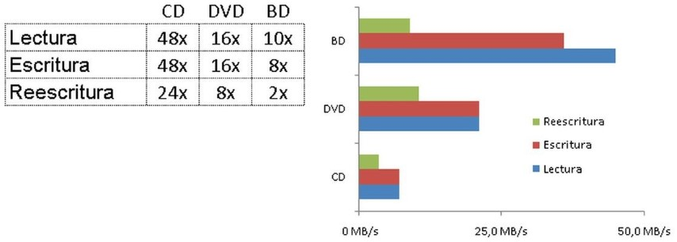

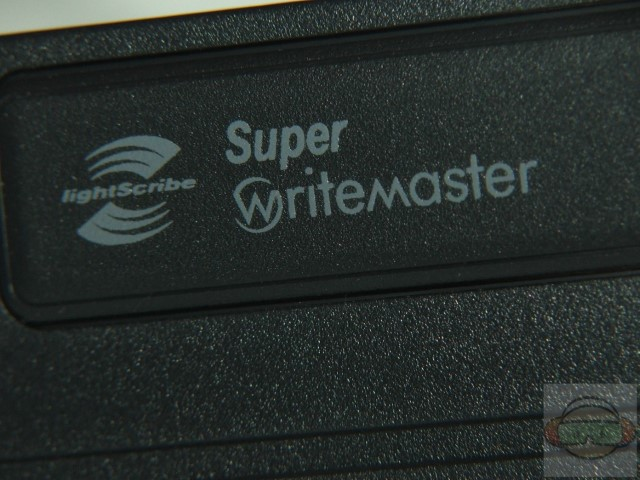

## Otras tecnologías

Sistema de impresión del reverso del soporte óptico

Sustituye la pegatina o serigrafía de los discos

Permite  __dibujar__  con el propio láser del equipo la  __carátula__  del CD

El soporte óptico \(DVD\) y el grabador tienen que ser compatibles

_Funcionamiento_

Los soportes  __lightscribe__  contienen una caratula  __fotosensible__

Es grabada por el láser del grabador sucesivas veces hasta conseguir la tonalidad deseada\.

__Ventajas__ : Sencillo, permite resultados profesionales\.

__Desventajas__ : proceso de grabado es lento, y el contraste no suele ser muy bueno\. Sólo permite grabados en escala de grises\.

## Comparativa CD, DVD, BluRay

## Discos ópticos

CD vs DVD vs Blu\-ray

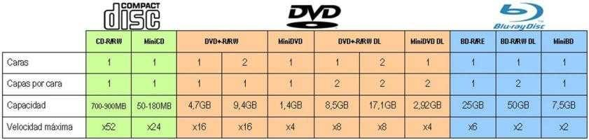

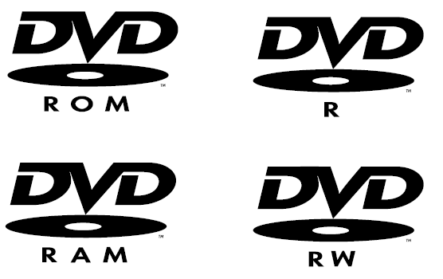

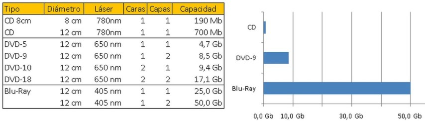

