# 6. Interfaces

## Discos duros

Las  __interfaces__  del disco duro necesitan un conjunto de reglas para operar entre ellos y con la placa base

Es el mecanismo de conexión entre el disco duro y el PC\.

_Las reglas especifican _

El número de cabezales en la unidad

A qué comandos responde la unidad

Los  __cables__  utilizados con la unidad

La cantidad de  __dispositivos__  admitidos

La cantidad de bits de datos transferidos a la vez \( __velocidad__ \)

_Las principales interfaces son_

PATA/IDE y SATA \(sobremesa y portátiles\)

SATA y SCSI \(servidores\)

USB, FireWire o eSATA \(discos externos\)

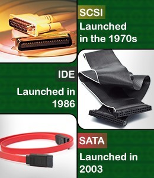

## Tipos de interfaces

* Más conocidos como  _IDE_  __ __ \(Integrated Device Electronics\)
* Los más utilizados hasta hace poco\.
* Conexión disco duro al sistema:
  * Cable plano de 40 pines \(al conector IDE de la placa base\)
  * Uno o dos conectores o canales IDE \(placa\)
* _Conectores primari_  _o y secundario_
* Cuando la placa base cuenta con dos conectores IDE
  * Conector IDE primario \(unidad de arranque\)
  * Conector IDE secundario
* Máximo 2 dispositivos IDE por interfaz
  * 2 discos duros, 1 disco duro y 1 unidad de DVD o CD, etc\.

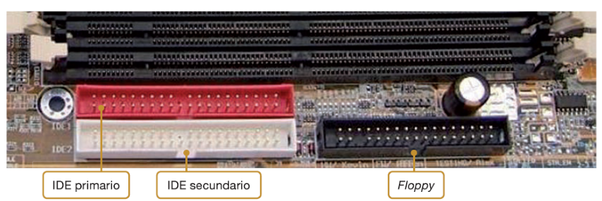

Ancho de banda limitado a  __133 MB/s__

Comprobación de redundancia cíclica \(CRC\) para datos

Soporte de 2 dispositivos por cable

Pequeño interruptor o puente para la selección de la unidad:  __jumper__

__Inconvenientes__

Los cables engorrosos e inhiben el flujo de aire

Enfriamiento más difícil y costoso\.

Los conectores son difíciles de insertar y quitar\.

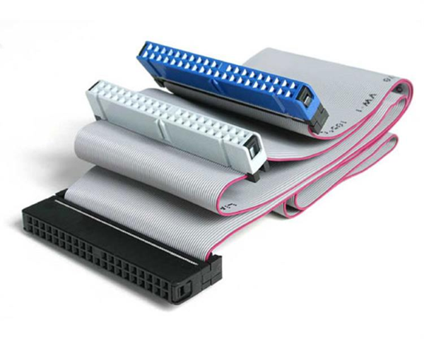

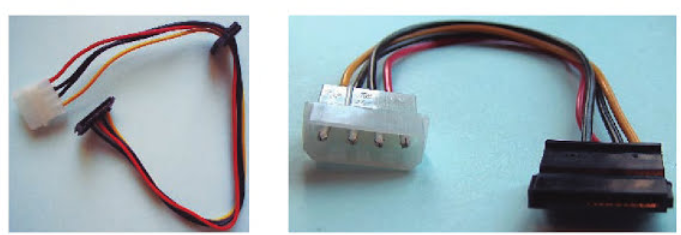

## Discos IDE

Configuración maestro / esclavo

* Cada interfaz o conector IDE soporta  _dos dispositivos _
* Para poder diferenciar los dispositivos que están conectados al mismo IDE
  * Uno se identificará como maestro \( _master_ \)
  * Otro se identificará como esclavo \( _slave_ \)
* No puede haber dos maestros o dos esclavos sobre el mismo cable\.
* Los dispositivos IDE usan  _jumpers_  \(o puentes\) para la identificación maestro/esclavo\.
* Suelen estar situados en la parte del disco donde se halla el conector IDE
* La posición de los jumpers se suele encontrar en una  _pegatina_

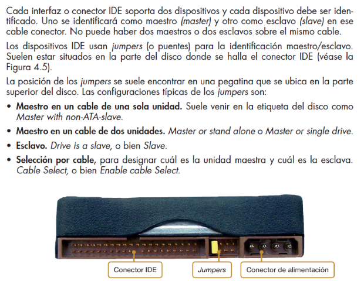

Configuración maestro / esclavo

__Diferencia entre maestro y esclavo__

En la secuencia de inicio del sistema, se arranca primero la unidad maestra y posteriormente la esclava\.

El sistema asigna antes una letra a la unidad configurada como maestra, y seguidamente hace lo mismo con la unidad configurada como esclava\.

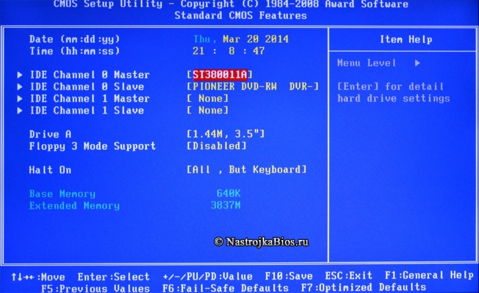

Configuración maestro / esclavo

Configuración maestro / esclavo

_Configuraciones de jumpers_

__Maestro en un cable de una sola unidad\. __ Suele venir en la etiqueta del disco como Master with non\-ATA\-slave\.

__Maestro en un cable de dos unidades__ \. Master or stand alone o Master or single drive\.

__Esclavo__ \. Drive is a slave, o bien Slave\.

__Selección por cable__ , para designar cuál es la unidad maestra y cuál es la esclava\. Cable Select, o bien Enable cable Select\.

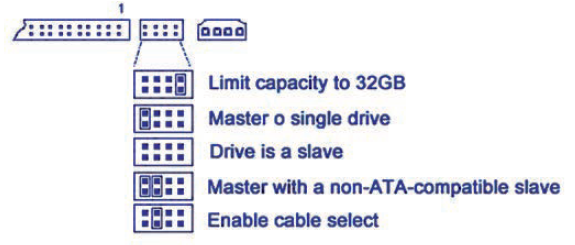

Configuración maestro / esclavo

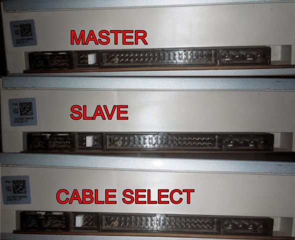

Configuración maestro / esclavo

Cable plano, de 80 conductores con conectores de 40 pines, con una muesca impide que se conecten mal

Etiqueta indica tipo de conector: maestro, esclavo o sistema

Para suministrar energía al disco hace falta un conector Molex que parte de la fuente de alimentación

_Cable con 3 conectores_

1 se conectará al conector IDE de la placa base

Los otros 2 conectores, al dispositivo maestro y al esclavo

_Identificación de los conectores_

Conector placa base \(azul, verde…\)

Conector dispositivo maestro \(negro\)

Conector dispositivo esclavo \(gris\)

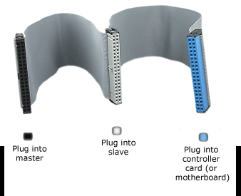

## SATA

## Tipos de interfaces

La tecnología Serial ATA \(SATA\) fue introducida en  _2001 _ como nuevo estándar para conectar discos duros\.

_Velocidades de transferencia_

__SATA I o SATA 1,5 Gb/s:__  11\.500 Mb/s – 150 MB/s

__SATA II o SATA 3 Gb/s: __ 3000 Mb/s – 300 MB/s

__SATA III o SATA 6 Gb/s: __ 6000 Mb/s  \- 600 MB/s

_Conectores y jumpers_  __ __

Los conectores SATA diferentes a los IDE

Jumpers para configurar un disco de una velocidad a otra inferior

Conectores SATA

* Conector de  _datos_  \(10 mm, 7 hilos\)
  * Máximo 1 m de longitud
  * 1 cable de datos por disco
  * No es necesario maestro/esclavo
  * Configuración de arranque desde BIOS
* Conector  _eléctrico_
  * Más plano, 15 conectores

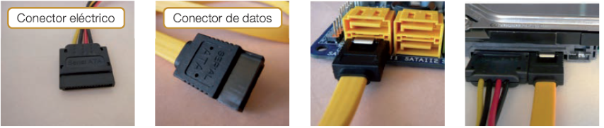

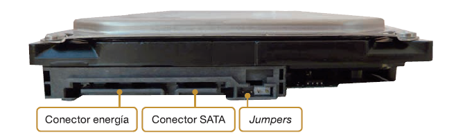

_Beneficios de la tecnología SATA_

Permite fácil integración, debido a la  __mejora del cableado__ \.

Mejora la  __velocidad__  y el ancho de banda\.

Mayor  __flexibilidad__  con respecto a la configuración del sistema\.

La configuración de los dispositivos es mucho más sencilla, no es necesario configurar ningún  __jumper__ \.

Mejora el  __flujo de aire __ en el sistema\.

* _Small _  _Computer_  _ System Interface_
* __Principales características__
  * Más caros
  * Más rápidos \(Tasa transferencia casi constante\)
  * Menor uso de procesador
* __Utilización__
  * Servidores \(ambientes profesionales\)
  * Ambientes profesionales \(rendimiento y fiabilidad\)
* Soporta más dispositivos y tipos que IDE
* No suele estar integrada en la placa base
  * Tarjeta adaptadora \- expansión

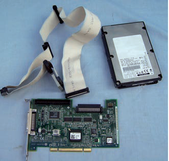

* Estándares utilizados en el controlador SCSI:
* _SCSI Parallel_
* __SCSI\-1__  que trabaja a 5MB/s
* __SCSI\-2__
  * Incluye FastSCSI, WideSCSI y FastWideSCSI
  * Hasta 20MB/s
  * Permiten conectar a 16 dispositivos\.
* __Ultra SCSI__ , Ultra 2 SCSI, Ultra 3 SCSI, Ultra 4 SCSI, Ultra 5 SCSI
  * Entre 20MB/s a 640MB/s\.
* _SCSI Serial_
* Dispositivos son más sencillos
* Se pueden conseguir mayores tasas de utilización\.

* _SCSI _  _Fibre_  _ Channel: _
* Interconexión de periféricos de almacenamiento externo y servidores y entre éstos
* Utilizando fibra óptica
* Alcanza 10Gb/s
  * __Multimodo__ : 300 m
  * __Monomodo__ : 10 Km
* __iSCSI__
  * Encapsulamiento y transporte de comandos SCSI a través de redIP
* _SAS \(Serial _  _Attached_  _ SCSI\): _
* Velocidades que oscilan entre 1,5 y 3 Gb/s
* Admite conexión de cientos de dispositivos por cadena
* Soporta compatibilidad con dispositivos SATA

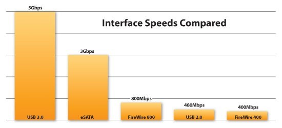

Interfaces externas

* Una de las utilidades de los discos duros dada su capacidad y su bajo coste es utilizarlos de manera portátil conectándolos al PC\.
* Las principales interfaces son las siguientes:
* _USB_
  * Es el más difundido, todos los equipos cuentan con este tipo de puertos\.
  * Tiene un rendimiento aceptable
* _Firewire_
  * Más rápido que USB pero menos frecuente\.
  * Similar al USB pero mucho más rápida y menos extendida\.
* _Serial ATA externo \(eSATA\)_
  * Los dos interfaces anteriores no son nativos, este sí \(mayor velocidad\)
  * El disco funcionará a la mayor velocidad posible\.
  * Cable eSATA debe de ser menos de 2 metros y 1 si se utiliza un bracket\.

Interfaces externas

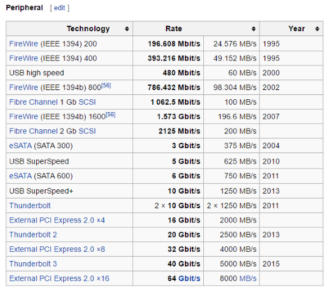

## Información disco en BIOS

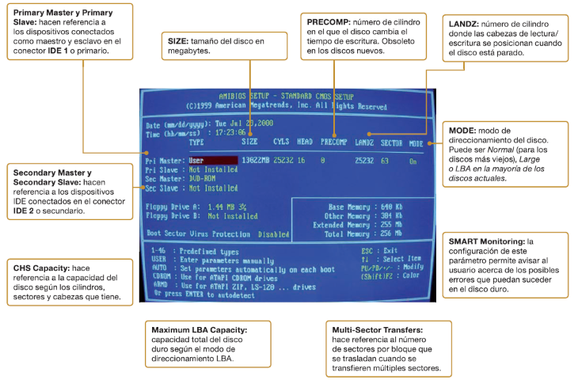

## Discos e interfaces

Comparativa de velocidades

|        Disco        |         SATA         | VELOCIDAD REAL |
| :-----------------: | :------------------: | :------------: |
| Mecánico (150 MB/s) |  SATA I (150 MB/s)   |    150 MB/s    |
| Mecánico (150 MB/s) |  SATA II (300 MB/s)  |    150 MB/s    |
| Mecánico (150 MB/s) | SATA III (600 MB/s)  |    150 MB/s    |
|                     |                      |                |
|    Disco externo    |         USB          | VELOCIDAD REAL |
| Mecánico (150 MB/s) |    1.1 (1.5 MB/s)    |    1.5 MB/s    |
| Mecánico (150 MB/s) |    2.0 (60 MB/s)     |    60 MB/s     |
| Mecánico (150 MB/s) |    3.0 (625 MB/s)    |    150 MB/s    |
|                     |                      |                |
|      Disco SSD      |         SATA         | VELOCIDAD REAL |
| SSD SATA (550 MB/s) |  SATA I (150 MB/s)   |    150 MB/s    |
| SSD SATA (550 MB/s) |  SATA II (300 MB/s)  |    300 MB/s    |
| SSD SATA (550 MB/s) | SATA III (600 MB/s)  |    600 MB/s    |
|       SSD M.2       | M.2 PCIe (2000 MB/s) |   2000 MB/s    |

