# Precauciones y advertencias de seguridad en el montaje de equipos microinformáticos.

## Seguridad en las operaciones de montaje, sustitución y conexión de componentes y periféricos microinformáticos.

## Precauciones sobre la energía eléctrica

* Principalmente no se debe nunca manipular los componentes con el ordenador encendido,
* Asegurarse de que el ordenador está apagado\.
  * Desconectar el cable de alimentación al equipo
  * Interruptor de la fuente de alimentación ponerlo en OFF, si lo tiene\.

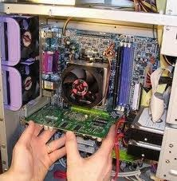

Utilizar siempre enchufes con toma de tierra\. Evitar enchufes que no tengan toma de tierra\.

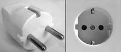

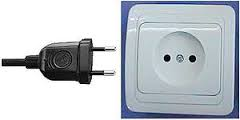

Seguridad en las operaciones de montaje, sustitución y conexión de componentes y periféricos microinformáticos

## Precauciones sobre sistemas de refrigeración líquida

Todas las empresas de componentes hacen pruebas de productos antes de su distribución, no obstante para evitar problemas que se pudieran producir en la distribución

Se recomienda hacer una  __prueba de estanqueidad __ fuera del chasis o caja del equipo informático antes de montarla dentro del mismo\.

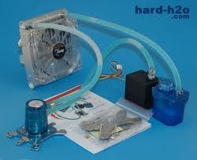

Seguridad en las operaciones de montaje, sustitución y conexión de componentes y periféricos microinformáticos

## Precauciones sobre los componentes

Seguridad en las operaciones de montaje, sustitución y conexión de componentes y periféricos microinformáticos

## Microprocesador

No poner a funcionar el equipo con el microprocesador montado  __sin el disipador __ del microprocesador\.

Cuando se  __cambie el disipador __ hay que quitar y limpiar la pasta térmica anterior y volver a aplicar pasta nueva en el microprocesador antes de montar otra vez el disipador\.

Nunca manipular el microprocesador por los  __pines o patillas\.__

Nunca instalar un disipador en un microprocesador  __sin pasta térmica\.__

Normalmente los disipadores de los microprocesadores tienen ya un material con  __pasta térmica preaplicado__ , si se decide utilizar otro tipo de material consultar si es apropiado utilizarlo o no en ese microprocesador\.

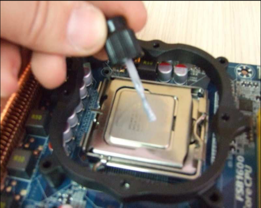

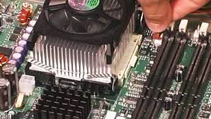

Seguridad en las operaciones de montaje, sustitución y conexión de componentes y periféricos microinformáticos

## Fuente de alimentación

* No desenchufar el cable de tensión cuando el equipo esta funcionando\.
  * Puede ocurrir que dañes la fuente y los demás componentes\.
  * Recuerda que un equipo  __suspendido__  o en  __standby__  está funcionando\.
* No ubicar el equipo o la fuente de alimentación en un lugar con alta temperatura o humedad\.
* Las fuentes de alimentación tienen altos voltajes en su interior \(incluso después de desconectadas\)
  * Se aconseja mucho cuidado en su manipulación  y saber perfectamente su funcionamiento\.

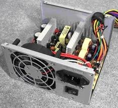

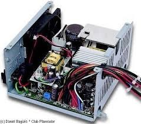

Seguridad en las operaciones de montaje, sustitución y conexión de componentes y periféricos microinformáticos

## Placa base

* Cuando compramos una placa base viene protegida en su parte interior por un material que impide que se deterioren los contactos situados en esa cara y envuelta en una bolsa antiestática\. Para ello hay que seguir las siguientes pautas:
  * No agarres la placa por los componentes, siempre  __cogerla por los bordes\.__
  * __No saques la placa de la bolsa __ hasta que tengas que montarla, mientras menos la manejas mejor\.
  * No pongas la placa  __encima de la bolsa __ puesto que puede haberse almacenado la carga electrostática en la zona externa\.
  * __No apiles las placas __ una encima de  otra pues se pueden dañar\. Colócalas encima de algún material aislante\.
  * No toques los  __componentes__  con la mano\.

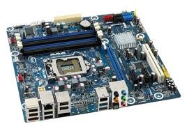

Seguridad en las operaciones de montaje, sustitución y conexión de componentes y periféricos microinformáticos

## Memoria

Sigue los mismos consejos que con la placa base\. Al igual que la placa base, evita manejar en exceso los módulos de memoria dado que es uno de los componentes más sensibles del equipo\. La energía estática  es uno de los peores enemigos de las memorias\.

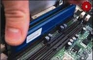

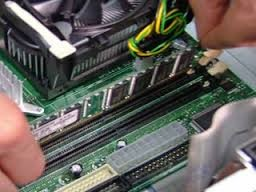

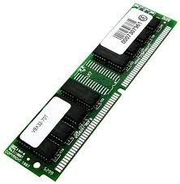

Seguridad en las operaciones de montaje, sustitución y conexión de componentes y periféricos microinformáticos

## Discos duros

Maneja los discos a temperatura ambiente\.

La placa con circuitería electrónica es muy sensible a la energía estática por lo tanto maneja el disco por los bordes o cantos\.

Su uso debe ser preferentemente en posición horizontal\.

No tocar nunca la circuitería electrónica del disco\.

No manipules el disco conectado a la corriente\.

No golpees, ni manejes el disco de forma brusca pues las cabezas pueden dañar el plato\.

No exponer los discos a fuentes magnéticas pues dañan la información que contienen\.

No abrir nunca el disco bajo ningún concepto\.

No utilizar tornillos muy largos cuando se fijen en la caja\.

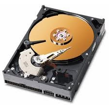

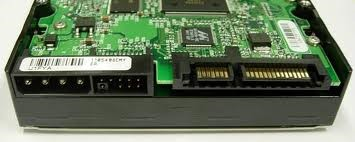

Seguridad en las operaciones de montaje, sustitución y conexión de componentes y periféricos microinformáticos

## Precauciones generales

__No forzar __ nunca los componentes\. No hagas fuerza a la hora de atornillar, fijar una memoria, insertar la placa en su zócalo, poner y quitar un conector, etc\.

__Evitar__  el contacto de los  __líquidos__  con el equipo\. En caso de que se derrame cualquier líquido sobre algún componente electrónico dejarlo secar algunos días en ambiente lo más seco posible\. Los líquidos provocan cortocircuitos\.

__Evitar__  la acumulación de  __polvo__  en el interior de los equipos\. Para eliminarlo hay que utilizar un pincel suave, un aspirador pequeño o un spray limpiador específico para eliminar polvo de componentes electrónicos\.

Y sobre todo aplicar el  __sentido común__ \.

