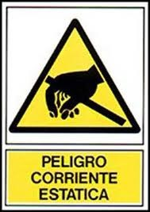
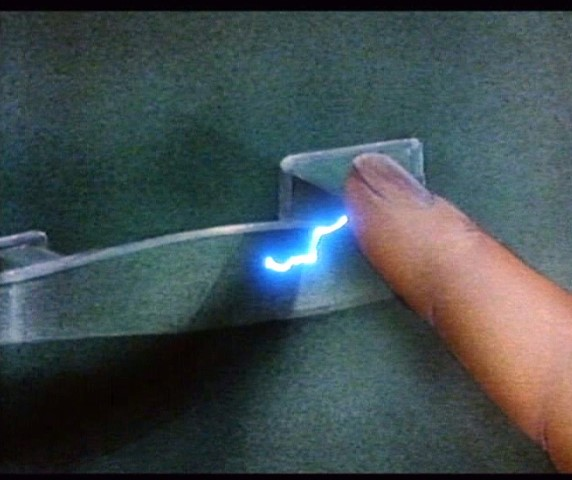
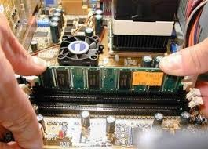
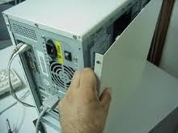
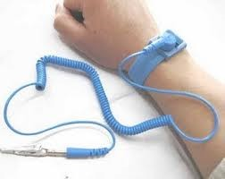
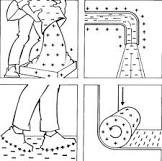

# Normas para la protección contra descargas electroestáticas

## Seguridad en las operaciones de montaje, sustitución y conexión de componentes y periféricos microinformáticos.

## La energía estática

* La energía estática puede hacer que se  __dañen los componentes __ electrónicos\.
* La electricidad estática puede producir descargas de  __4000 voltios ó más__ , que hacen que se estropee un componente electrónico\.
* Muchas de estas descarga que se producen  __no son visibles __ al ojo humano\.

## Acciones que evitan problemas con la energía estática:

Tocar un  __grifo__  \(las tuberías cuando son metálicas hacen de toma de tierra\)\.

Tocar continuamente la parte metálica de la  __carcasa__  del ordenador para descargarse\.

Utilizar una  __pulsera__  con toma de tierra y utilizarla correctamente\.

Utilizar unos  __guantes antiestáticos__ \.

Utilizar un  __spray antiestático__ \. Rociar un trapo con el spray y frotar el monitor, caja y teclado\.

## Acciones que pueden provocar problemas con la energía estática:

Trabajar en  __moquetas__  que no sean antiestáticas\.

Utilizar zapatos con  __suela de goma__ \.

Utilizar  __pulseras__  conductoras \(metálicas\)\.

Coger los componentes por zonas que no son los  __cantos__ \.

__No descargarse estáticamente __ antes y mientras se está trabajando\.

