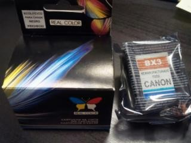
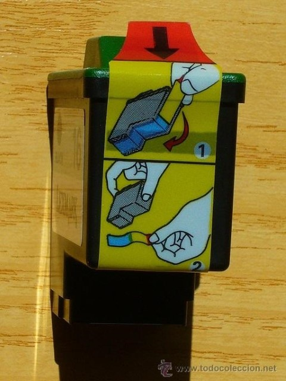
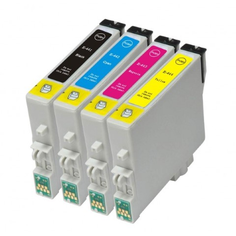
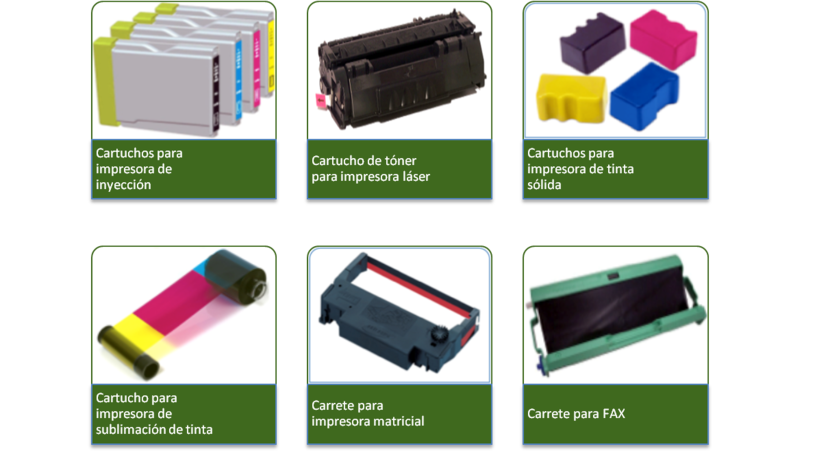
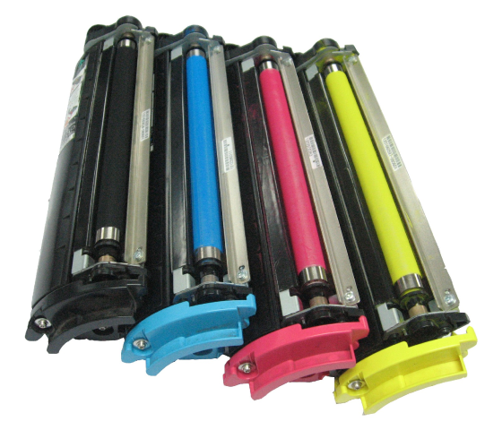
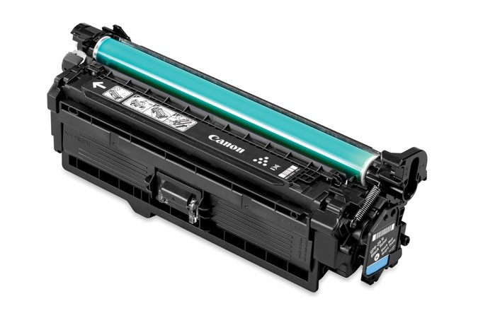
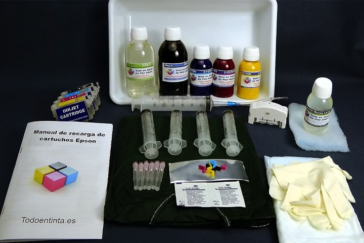

## Cartuchos y tóner

##

## Conservación de cartuchos y tóners

* _Cartuchos y carretes_
  * Los cartuchos se venden  __precintados__  y envasados  __al vacío__ \.
  * La bolsa que resguarda al cartucho
    * Protege de la  __humedad__  y del  __calor__
    * Evita que la tinta de su interior se deteriore o se seque
  * El cartucho solo debe  __desprecintarse y sacarse __ de su bolsa cuando vaya a ser utilizado\.
* ¿No vas a utilizar la impresora en un tiempo?
  * Quitar los cartuchos de la impresora
  * Colocarlos en un lugar fresco y seco, lejos de la luz
  * Evitaremos que la tinta se acabará secando y obstruirá los inyectores\.
* ¿Cuándo y como cambio los cartuchos?
  * No esperar a que el cartucho se esté acabando
  * Cuanta menos tinta quede, se seca con más facilidad
  * Cartuchos con circuitería, descargarse de electricidad estática antes

## Cartuchos y tóners

__Contenedores del producto de impresión__

## Conservación de tóner

* _Tóner_
  * El depósito suele suministrarse con el mecanismo del  __rodillo__ \.
  * Al tratarse de un armazón más consistente está más protegido,
* Precauciones
  * Parte del polvo de tóner salga del depósito si se agita verticalmente\.
  * El polvo de tóner  __no tiene ningún peligro __ en contacto con la piel y puede lavarse con agua y jabón
  * Si cayese en la  __ropa__  bastaría con cepillarla\.
  * No limpiar con aspiradores \(polvo es demasiado fino y traspasaría los filtros, esparciéndose\.
  * Utilizar un paño húmedo o papel secante\.
* Nunca desarmes el cartucho, y menos aún cuando esté colocado en la impresora o tenga tinta\.

## Reciclaje de cartuchos y tóner

* __Reciclaje de consumibles de impresión__
  * En cuanto a los cartuchos y carretes, aunque sean de uso único,  __se pueden reciclar__ \.
  * Hay empresas que se dedican a recoger todo tipo de cartuchos\.
* Tiendas de informática
  * Es muy normal que recojan los cartuchos y hagan un descuento en la compra del nuevo
* Reciclado
  * Se venden posteriormente a los fabricantes o a otras empresas
  * Los  __rellenan__  y los venden de nuevo, reutilizando el mismo contenedor\.
  * Cartuchos reciclados son  __más baratos __ y ofrecen prácticamente las mismas garantías
* Reutilización
  * Otra opción alternativa es reutilizarlo\.
  * __kits de recarga __ de cartuchos \(tanto de tinta como de tóner\) para rellenar de forma manual
  * En algunos modelos de cartucho
    * El proceso de reciclaje es complejo
    * Puede exigir resetear su circuito\.

* Reciclaje consumibles
  * Estados Unidos \- 65 %
  * España – 10%
* Composición cartucho de tóner
    * 40% de plástico
    * Metal
    * Pequeñas cantidades de papel o caucho\.
  * Pueden tardar en degradarse más de 1\.000 años\.
* La tinta
  * Contiene elementos muy  __tóxicos__ \.
  * Tirar al contenedor verde estos cartuchos provoca contaminación
  * Los residuos de tinta y polvo quedan expuestos al medio ambiente contaminando el aire y el agua\.
* El precio
  * La tinta sale más cara que el petróleo\. En algunos cartuchos caben como mucho 5 mililitros, y por su precio puede calcular que un litro tinta “nueva" tendría un coste entre 2\.000 y 3\.000 euros\.

## Sustitución de cartuchos y carretes

* __Sustitución de cartuchos y carretes__
  * A ser posible utilizar guantes \(manchas de tinta\)
  * Sustituir cuando lo indique la impresora
  * Siempre avisa antes de que se acabe por completo y también se aprecia en la baja calidad de las impresiones\.
  * El manual de usuario de cada impresora indica el procedimiento de reemplazo del cartucho o carrete\. Consiste en colocar el cabezal en la zona de recambio y sacar el cartucho vacio para colocar el lleno\.
  * Para sustituir el cartucho de tinta es necesario que la impresora esté conectada a la corriente\.
  * En caso contrario no habría manera de colocar el cabezal en la zona de recambio\. La forma de hacerlo es variable: puede ser por la pulsación combinada de botones en la impresora, por la pulsación durante unos segundos de un botón, automáticamente al levantar la tapa, etc\. El manual de la impresora debe explicar el proceso\.
  * Lo que nunca debe hacerse es forzar el carro para desplazar los cartuchos a la zona de recambio\.

* _Impresoras láser_
  * Cartucho de tóner es más voluminoso y no va colocado en ningún cabezal\.
  * Abrir la tapa, sacar el cartucho vacío y meter el cartucho nuevo\.
  * No es necesario que la impresora esté conectada a la corriente\.
  * Un mismo cartucho puede servir para diferentes modelos de impresora \(manual\)
* __Referencia__
  * Cada cartucho lleva una  __referencia__ , de forma que se le distingue del resto,
  * no solo por el modelo sino también por el color;
  * Para una misma impresora podemos tener varios modelos
    * El negro, el amarillo, el cian\. etc\.
    * Cada uno con su referencia\.
* Cartuchos genéricos
  * No son específicos de una marca
  * Son compatibles con diferentes modelos de varias marcas\.
  * En las especificaciones aparece una lista de las referencias con las que son compatibles\.
  * Antes de reemplazar un cartucho o carrete por otro habrá que acondicionar su receptáculo
  * Limpiándolo por si hubiera residuos que pudieran afectar a la correcta instalación o funcionamiento\.