# Conectores de audio

Se utiliza principalmente para la transmisión de señal de  __audio analógica__

Se suele utilizar para conectar micrófonos, auriculares y otros sistemas similares

Posee un único pin central, que se divide en dos o más secciones mediante aros aislantes\.

Existen  __diferentes tipos __ de jack según su diámetro y sus anillos

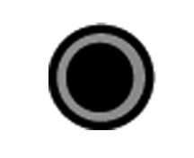

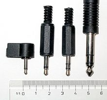

* Tipos de conectores Jack según diámetro
  * __Conector Jack original \(6,5 mm\)__
    * Instrumentos musicales
    * Dispositivos de audio profesional
  * _Conector Jack \(3,5 mm\)_
    * Modelo más utilizado en informática
    * También se utiliza en otras áreas tecnológicas
    * Tiene dos versiones \(mono y estéreo\)
  * __Mini Jack \(2,5 mm\)__
    * Se utiliza en pequeños dispositivos
    * Solo capaz de transmitir señal de audio mono

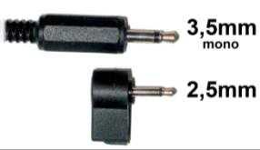

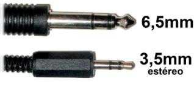

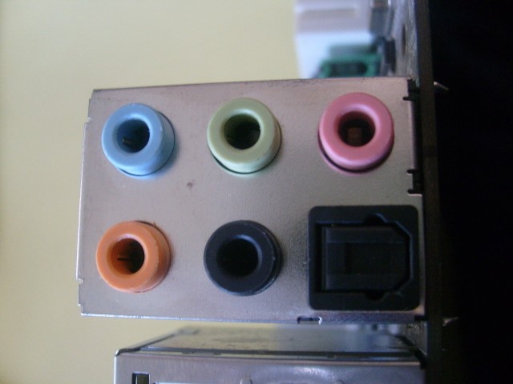

* Tipos de conectores Jack según su construcción
  * __TS: __ Tip\-sleeve o punta\-funda\. Se utiliza en audio mono\.
  * __TRS: __ Tip\-ring\-sleeve o punta\-anillo\-funda\. Se utiliza en estéreo\.
  * __TRRS: __ Tip\-ring\-ring\-sleeve o punta\-anillo\-anillo\-cuerpo\. Utilizado en dispositivos en los que los auriculares incluyen micrófono

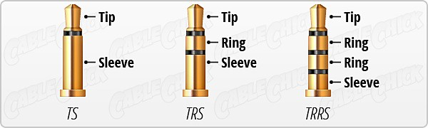

Conectores jack: códigos de colores

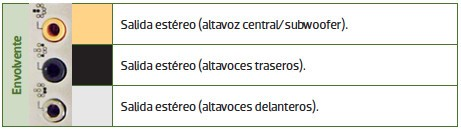

Conectores RCA Audio

El formato RCA también se utiliza para señal de audio, tanto  _analógica como digital_ \.

Se diferencian mediante un  _código de colores _ en función del tipo de señal\.

Se utiliza en sistemas estéreo, así como sistemas de sonido envolvente\.

Adaptador jack a RCA

## MIDI

MIDI significa  _Musical _  _Instrument_  _ Digital Interface_ \. Se utiliza para conectar dispositivos MIDI

Es un estándar para  _generar, transmitir y guardar composiciones musicales_ \.

Permite que los instrumentos “hablen” entre ellos\. Un piano, batería u otro instrumento,  _genera información acerca de cómo se ha generado una acción_

- Qué tecla se ha pulsado
- Cuando se ha pulsado
- Cómo de fuerte o rápido
- Por cuanto tiempo se ha mantenido presionada

* El conector utilizado es del tipo DIN de 5 pines
* Es un tipo de comunicación que  _solo funciona en un sentido_ \. Se diferencia entre
  * Quien envía la señal \( __maestro__ \)
  * Quien la recibe \( __esclavo__ \)\.
* Un dispositivo MIDI,  _3 tipos de puertos_ :
  * __MIDI __  __Out__  __: __ Salida de mensajes
  * __MIDI In: __ Entrada de mensajes\.
  * __MIDI __  __Thru__  __: __ Pasar copia de los mensajes que llegan a MIDI In
* Se pueden conectar varios equipos MIDI en cascada\.
* El estándar General MIDI permite 128 sonidos y efectos de todo tipo

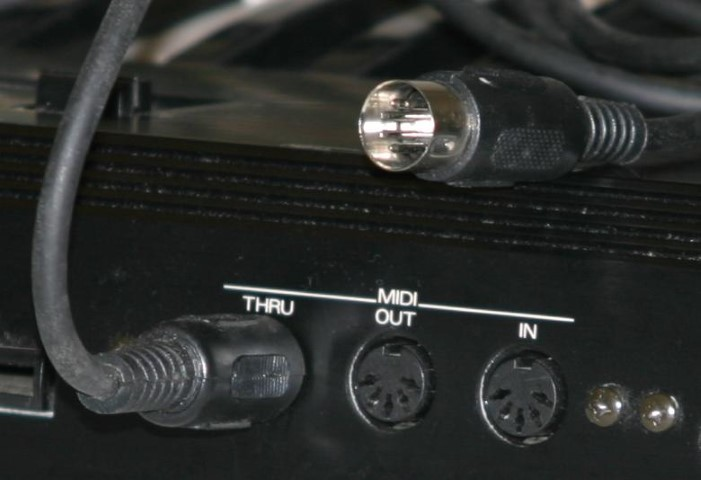

Utilizado para  __audio profesional__ \. Módulos de sonido de estudio, micrófonos, y aparatos de alta gama\.

Permite tiradas de cable hasta 350 metros\.

Transmite audio estéreo y codificado en Dolby Digital y DTS

No admite sonido en alta definición

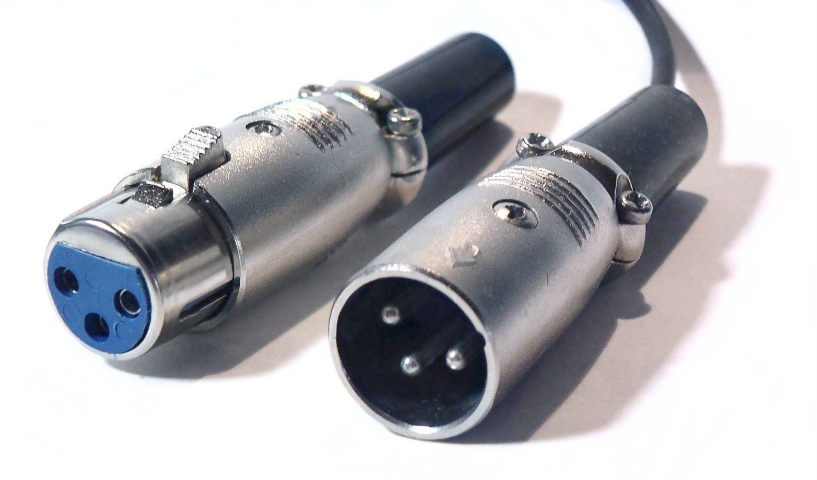

* De Sony/Philips Digital Interface Format\.
* Se trata de un tipo de conexión de audio digital para distancias cortas\.
* La señal completa se transmite a través de un único cable en lugar de varios\.
* Se utiliza principalmente para interconectar equipos  _home _  _theatre_  _ _ y otros sistemas digitales de  _alta fidelidad _ \(Hi\-Fi\)
* Se puede transmitir sobre
  * _Cable coaxial _ \(señal eléctrica\) mediante conectores RCA
  * _Cable de fibra óptica _ \(señal óptica\) mediante conectores  _TOSlink_
* Soporta audio  _estéreo_ , y sonido codificado en  _Dolby Digital, _ pero no soporta audio en alta definición\.

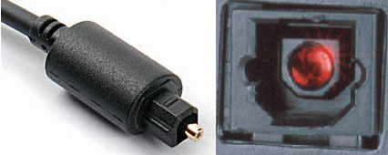

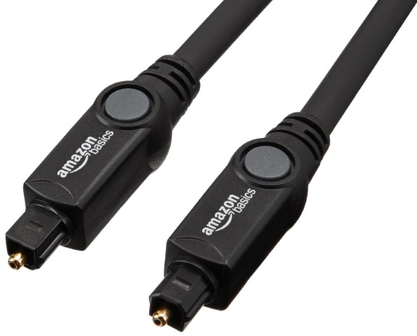

* Conexión de audio S/PDIF creada por Toshiba, que emplea una  __señal óptica__
* Funciona transmitiendo pulsos de luz a través de un cable de fibra óptica que transmite la información  __digital__ \.
* Un led es el que se encarga de generar pulsos de luz para transmitir la señal digital, que es captada en el otro extremo\.
* Las señales ópticas son:
  * Inmune a interferencias electromagnéticas y de RF
  * Se pueden producir cortes de señal si se presiona o se dobla el cable\.
* La longitud máxima del cable es de aproximadamente 10 metros

