## Tema 2: La placa baseBIOS

## BIOS

Acceso a la BIOS

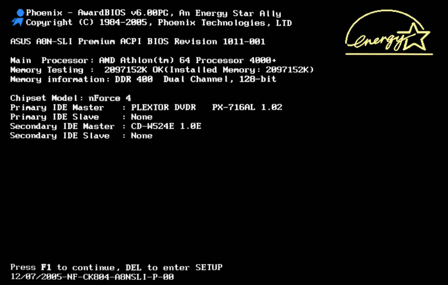

_Al arrancar el PC_

Memoria no contiene aún ningún tipo de software

BIOS asume las funciones de control en el PC\.

La CPU acudirá a una dirección estándar para encontrar la ubicación de la BIOS

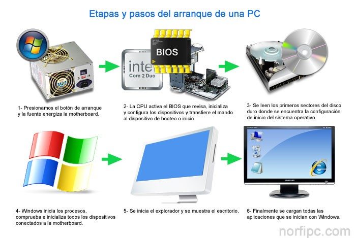

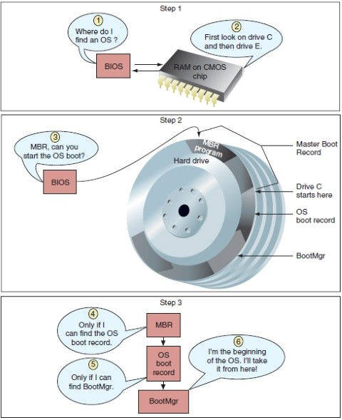

El BIOS \(“Basic Input Output System”\) es la interfaz que actúa entre el  __hardware__  y el  __sistema operativo __ implementado a bajo nivel\.

_Se encarga de:_

__Comprobar el Hardware __ instalado en el sistema\.

__Ejecutar un test inicial __ de arranque \(POST\)

Inicializar circuitos, manipular periféricos y dispositivos\.

__Cargar el sistema de arranque __ \(permite iniciar S\.O\.\)

_Resumen_

Permite que el ordenador arranque correctamente

Sin la BIOS no podría funcionar nuestro PC

No podría comunicarse el Hardware con el Software de Sistema\.

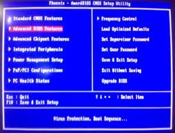

  * __Entrada básica: __ Maneja el teclado proporciona
  * __Salida básica: __ Pitidos normalizados por el altavoz \(fallos\)

* _Configuración_
* Para poder cambiar estos valores y ajustarlos
* Entrar en el  __SETUP__
  * Programa encargado  de configurar la máquina
* Accederemos pulsando  __SUPR, F1, ESC,__  en el proceso de arranque\.

__En estas pantallas es posible ajustar:__

Velocidad  de acceso a la memoria RAM

Multiplicador  de la CPU

Habilitar, deshabilitar o configurar los componentes  integrados en la placa

Gestión de energía

Comprobar valores de temperatura, voltajes, etc\.

* Se encuentra en un chip  __EEPROM __ \(no se borra al apagar\)
  * Chip de memoria tipo Flash ROM
  * Solo es utilizado para lectura
  * Puede ser reescrito mediante software\.

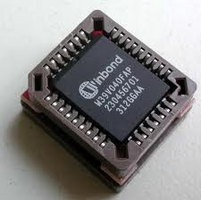

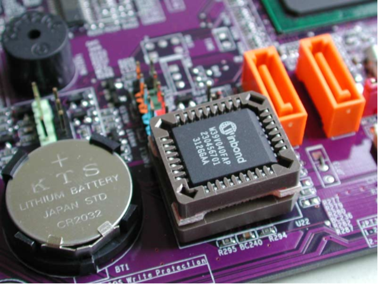

## CMOS

##

## BIOS

* _Imaginad que _
  * Cambiamos el disco duro
  * Añadimos más RAM o un lector de DVD\.\.\.
* _¿Qué ocurre al arrancar el ordenador?_
  * Durante el arranque la BIOS detecta un nuevo disco duro, procede a configurarlo para poder ser utilizado y por último guarda esos parámetros de configuración en otro chip llamado CMOS\.
* _¿Qué ocurriría si no se guardaran esos parámetros?_
  * Cada vez que arrancamos el ordenador habría que volver a configurarlo\.

_¿Qué es CMOS?_

__C__ omplementary  __M__ etal\- __O__ xide\- __S__ emiconductor

Es un tipo de tecnología para la fabricación de circuitos integrados

Con CMOS nos referimos a un  __chip__  de la placa base

_¿Qué contiene el chip CMOS?_

Datos de  __configuración__  necesarios para el arranque del ordenador\.

Fecha y la hora del ordenador

_¿Dónde está?_

En la placa base BIOS y CMOS son chips distintos

CMOS es memoria volátil: Necesita estar continuamente alimentada para no perder los datos que contiene

Se necesita una  __batería o pila__ \.

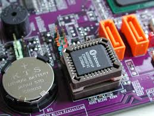

* _Funcionamiento de la batería_
* Suministra energía eléctrica a la CMOS
* Se  __carga__  de corriente cuando el equipo se encuentra encendido\.
* Si la pila deja de funcionar, la CMOS se borra
* Cada vez que se encienda el ordenador habrá que configurar la hora, fecha, número de discos duros que tenemos, secuencia de arranque, etc\.
* _Borrar la configuración CMOS_
* Cuando se desea  __voluntariamente__  borrar la CMOS
  * Utilizar el reseteador de la placa base \(CMOS\-Reset\-Jumper\)\.
  * Quitar la pila durante unos segundos con el ordenador apagado\.

* _BIOS_
  * __Programas__
  * No volátil \(permanece igual después del apagado\)
  * Se puede cambiar al "flashear“
  * Normalmente 64 K de programas \(aunque Flash ROM es mucho más grande\)
  * A menudo un chip separado

* _CMOS_
  * __Datos de configuración__
  * Volátil \(mantenido con batería\)
  * Cambiado a través de la configuración de CMOS
  * Normalmente 128 K de datos
  * A menudo en Southbridge

## BIOS MODERNAS

##

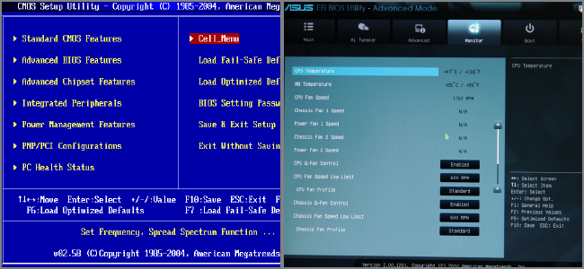

## BIOS

El PC, a lo largo de los años ha sido  __modernizándose y adaptándose  __ a las nuevas tecnologías

# EFI

El Extensible Firmware Interface (EFI) es una interfaz de firmware desarrollada por Intel en 1998 como respuesta a las limitaciones del BIOS. Esta interfaz se diseñó para superar los límites del BIOS, ya que solo puede funcionar en modo de 16 bits y direccionar solo 1MB de memoria. El objetivo de EFI era mejorar la seguridad, la arquitectura y las capacidades de administración de los sistemas informáticos, y también permitir el apoyo de nuevas tecnologías, como procesadores de 32 y 64 bits.

EFI es una interfaz de firmware de alto nivel que incorpora una configuración de arranque completa basada en una interfaz de usuario gráfica. Esto significa que no solo se puede usar para seleccionar un sistema operativo, sino también para configurar parámetros de configuración de  hardware. Esto es particularmente útil para los administradores de sistemas que deben monitorear y configurar el hardware de un sistema.

Además de la configuración de hardware, EFI también admite implementaciones de seguridad de alto nivel, como el cifrado de datos, la protección de contraseñas y el Control de Acceso Basado en Funciones. Esto significa que EFI puede brindar una mayor seguridad a los sistemas informáticos.

En resumen, el Extensible Firmware Interface (EFI) es una interfaz de firmware desarrollada por Intel para mejorar la seguridad, la arquitectura y las capacidades de administración de los sistemas informáticos. Esta interfaz cuenta con una configuración de arranque completa basada en una interfaz de usuario gráfica y admite implementaciones de seguridad de alto nivel.

## UEFI

La UEFI (Interfaz de Firmware Extensible Unificada) es el sucesor de la BIOS tradicional, ofreciendo una interfaz más intuitiva. Esta interfaz amplía las funcionalidades, dando un mayor control sobre la placa base, además de mejorar la seguridad.

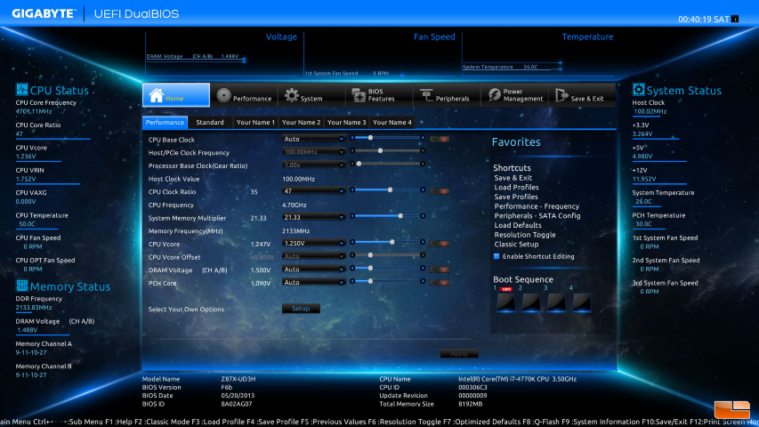

En contraste con el entorno BIOS original, puedes usar el ratón y hacer algunas de las siguientes cosas:

- conectarte a Internet
- ejecutar aplicaciones
- ejecutar un virus, escanear
- tener un entorno GUI, ejecutar utilidades
- realizar una copia de seguridad o una restauración.

## Dual BIOS

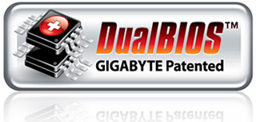

* Se caracteriza por incorporar  _2 unidades físicas \(dos chips\) de BIOS ROMS_  integradas en la placa
  * Un chip actúa como la BIOS “ __Principal__ ” o bien, la BIOS que tu sistema utiliza en el proceso de arranque\.
  * El segundo chip actúa como la BIOS “ __Backup__ ”, configurad con los parámetros de fábrica\.
* Si la BIOS “Principal” falla o deja de funcionar
  * La unidad “Backup”, de manera automática, se copia en la BIOS “Principal”
  * Permite arrancar de nuevo el ordenador con la configuración de fábrica\.

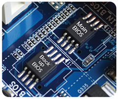

## ACTUALIZACIÓN DE BIOS

Actualizar o flashear la BIOS

_Se pueden dar las siguientes situaciones:_

Falla la BIOS, por configuración inadecuada o mal funcionamiento

Es necesario actualizar para ampliar funcionalidad o soportar nuevos dispositivos

_Flashear o actualizar BIOS_

Restaurar “manualmente” \(flashear\) o actualizar la BIOS a una versión posterior\.

Sustituir el  __programa__  almacenado en el chip de la BIOS \(firmware\)

Razones para flashear la BIOS

* The flash BIOS can be upgraded
* This process is “flashing the BIOS”
* A computer may need a BIOS upgrade for a variety of reasons:
  * To provide support for new or upgraded hardware such as a processor or a faster USB port
  * To provide support for a higher\-capacity hard drive
  * For increased virus protection
  * For optional password protection
  * To solve problems with the current version
  * To provide a security patch
  * To reduce the time a computer takes to boot

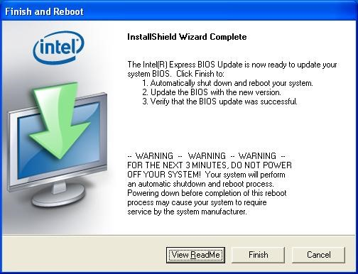

* _¿Qué es necesario?_
* Podrás conseguir las actualizaciones y los detalles de instalación
  * En la web del fabricante de la placa base
  * En páginas  especializadas\.
* Habitualmente, dicha actualización consiste en 2 ficheros:
  * Uno que contiene los datos del nuevo BIOS
  * Otro que constituye el programa encargado de grabarlos en la memoria Flash ROM\.
* Antiguamente con disquete de arranque\.
* Actualmente permiten actualizar desde Windows o pendrive

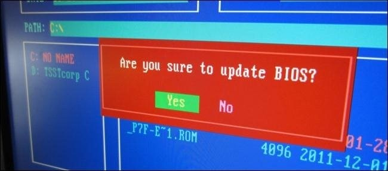

* _Precauciones_
* Para efectuar estos cambios seguir de manera escrupulosa las indicaciones del fabricante\.
* Asegurarse de que el suministro eléctrico no fallará durante el proceso de actualización
  * Podría dañar la placa definitivamente
  * Obligaría a tener que extraer el chip del BIOS y sustituirlo por otro con el BIOS correcto\.

## Simuladores de la BIOS

El primero de ellos es de una BIOS similar a la de un ordenador de sobremesa y la segunda se asemeja más a la de un portátil\.

[BIOS Award](http://appro.mit.jyu.fi/tools/biossimu/simu.html)

[BIOS Phoenix](http://www.grs-software.de/sims/bios/phoenix/pages/index.php)

