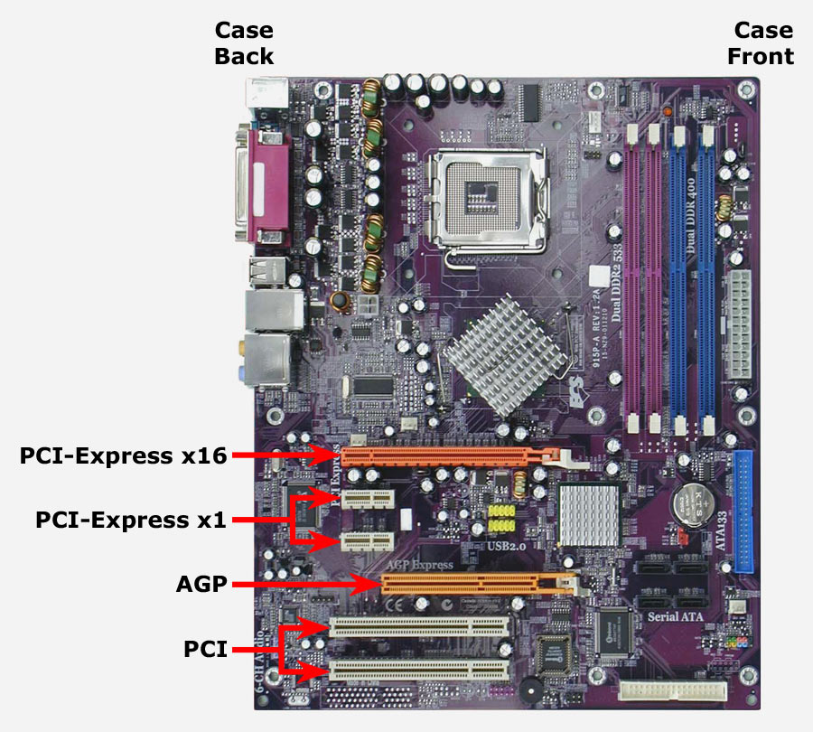

# Tarjeta gráfica

Las **tarjetas de expansión** permiten ampliar las características y prestaciones de que dispone el equipo base, consiguiendo llevar a cabo funciones que son inviables si no se conectan dichas tarjetas\.

Están diseñadas para muy diversas aplicaciones, siendo la más utilizada  __la tarjeta gráfica__ , aunque tenemos otras\.

* Se llama  _tarjeta gráfica, tarjeta de vídeo o tarjeta controladora de vídeo_ ,
  * Encargada de controlar la información que se muestra en la  __pantalla del monitor\. __
  * Sirve de intermediaria entre el procesador y el monitor
* __Motivos para instalar una tarjeta gráfica__
  * La placa base no la incorpora\.
  * Se ha estropeado la que incorpora la placa base\.
  * Se desean mejorar las prestaciones de la que incorpora la placa base\.
* La tarjeta gráfica se conecta a una ranura de expansión del ordenador
  * PCI, AGP y actualmente es PCI Express

## Ranuras de expansión

Cada tarjeta de video actual se conecta a la ranura  __PCIe __ en una placa base\.

La mayoría de placas base tienen incorporado el adaptador de pantalla \( __gráficos integrados\) __ básica, pero no tan potente como las tarjetas gráficas externas\.

__4K__ : 3840 x 2160  __5K__ : 5120x 2880Para monitores de computadora, la resolución Ultra HD mencionada aquí se aplica como 4K\.

Hollywood: Iniciativas Cinematográficas Digitales \(DCI\) definen 4K como __ 4096 x 2160__ \.

## El procesador de gráficos

El procesador de gráficos es el dispositivo encargado de manejar el trabajo pesado de tomar los comandos de la CPU y traducirlos en coordenadas e información de color que el monitor entiende y muestra.
Esto se conoce como Unidad de Procesamiento de Gráficos (**GPU**).

La discusión de la tarjeta de video entre los técnicos siempre se enfoca en el procesador de gráficos que utiliza, así como en la cantidad de RAM a bordo.

## Nomenclatura de tarjetas gráficas

* Una tarjeta de video típica podría llamarse:
* _ XFX Radeon HD7970 de 3 GB y 384 bits GDDR5 PCI Express 3\.0 _
  * XFX es el  _fabricante_  de la tarjeta de video
  * Radeon HD7970 es el  _procesador de gráficos_
  * La GDDR5 de 3 GB y 384 bits describe la  _RAM de video dedicada _ y la conexión entre la RAM de video y el procesador de gráficos
  * PCI Express 3\.0 describe la  _ranura de expansión _ de la placa base que requiere la tarjeta\.

## AMD vs Nvidia

## Fabricantes de procesadores gráficos

* Solo 3 compañías producen la gran mayoría de los procesadores gráficos que se encuentran en las tarjetas de video:
  * NVIDIA
  * AMD
  * Intel\.

## FABRICANTES DE TARJETAS GRÁFICAS

Los fabricantes de tarjetas gráficas NVIDIA y AMD venden procesadores gráficos a fabricantes de terceros. Estos terceros fabrican, diseñan y venden cientos de tarjetas de video diferentes bajo sus propias marcas.

## Memoria de video

* _RAM de video _
  * Versión específica de memoria para tarjetas gráficas
  * Ofrecen mejoras sustanciales en velocidades de video en comparación a la RAM del PC
    * RAM PC solo puede leer o escribir en un momento determinado
    * RAM de video: esta última puede leer y escribir datos al mismo tiempo\.
  * La mayoría de las tarjetas de video:  __GDDR5__
  * __DDR3 RAM__  es la memoria más popular en las tarjetas de gama baja sin juegos\.

La capacidad de RAM de video de las tarjetas de video avanzadas es importante. Esto se debe a que acceder a los datos almacenados en la RAM de la tarjeta de video es mucho más rápido que acceder a los datos de la RAM de la computadora.

Por lo tanto, una tarjeta de video con mayor cantidad de RAM permite a los desarrolladores de juegos optimizar sus juegos y almacenar más datos esenciales en la RAM de video local.

En la actualidad, la cantidad mínima de RAM de video es de 2 GB, mientras que la cantidad máxima es de 12 GB.

## Software y drivers

* __Configuración de software: dos pasos__
* Instalar los controladores para la tarjeta de video\.
* Configurar ajustes con programa específico o panel de control
* __Controladores o drivers__
  * Todo hardware necesita un controlador para funcionar\.
  * Opciones de instalación:
    * El controlador ya está integrado en Windows
    * Utilizar los medios de instalación que vienen con la tarjeta de video
* __Actualizaciones__
* Fabricantes constantemente  __actualizan__  sus controladores\.
* Cada pocos meses una actualización\. Para actualizar:
  * Sitio web del fabricante
  * Sino, otros medios de instalación\.
  * Evitar usar el controlador de Windows incorporado \(anticuado\)

## Tarjeta grafica

Factores a tener en cuenta

* __Tamaño__
  * Las tarjetas actuales de gama alta, tienen un tamaño grande
  * Garantizar que nuestra torre pueda albergar dicha gráfica, respecto al tamaño que pueda ocupar
  * Refrigeración de la misma, pues son componentes que disipan mucho calor\.
* __Tipo de conexión__
  * Me estoy refiriendo al tipo de bus a usar con nuestra placa base\.
  * Hoy en día las gráficas usan buses tipo PCIe 2\.0 o PCIe 3\.0
* __Fuente de alimentación__
  * Verificar que nuestra fuente de alimentación actual
  * Capaz de soportar necesidades de energía que va a precisar nuestro equipo con la nueva gráfica\.
* __Conectores de salida__
  * Nos interesará tener en cuenta el tipo de conectores de salida \(VGA, HDMI, DVI o DP\)
  * Cantidad de conectores por si queremos usar varias pantallas\.

## Mejores tarjetas gráficas

Una comparativa muy habitual entre tarjetas gráficas a través del benchmark es la cantidad de frames por segundo que son capaces de generar a una determinada resolución.

A mayor resolución y opciones gráficas, menos FPS se generarán. Aquí podemos ver algunas de las mejores gráficas en 2022.

