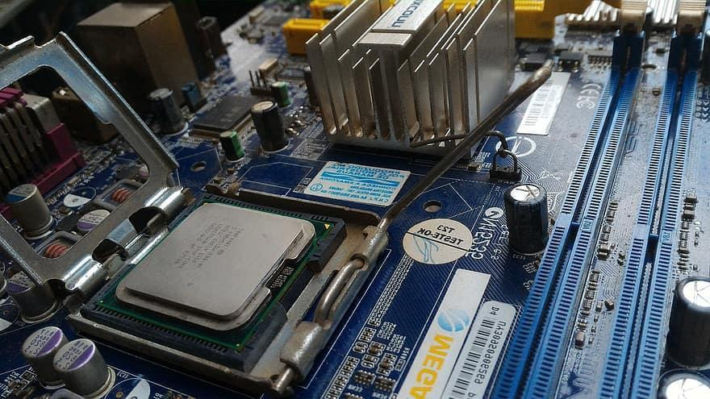

# Elegir un equipo

## ¿Cómo elegir qué dispositivo necesito?

El equipo que elijamos lo definen los componentes internos que lo componen. En función de cuáles sean estos y sus características, el equipo será más o menos potente y más adecuado para unos u otros usos.

El tipo de ordenador que necesitamos es aquel que se adecua más al uso que le vamos a dar. Para ello, es necesario plantear qué tareas son las que queremos llevar a cabo con el ordenador, y esto dependerá de la persona y del uso que ésta le dé.

Las tareas pueden ser, entre otras:

- Hacer trabajos
- Editar video
- Jugar a juegos
- Mirar vídeos
- Edición fotográfica
- CAD
- Programación de aplicaciones
- Escuchar música

Cada una de estas aplicaciones tiene diferentes requisitos como:

- Espacio para guardar cosas (disco duro)
- Capacidad de ejecutar al mismo tiempo muchos programas o tareas (Memoria RAM)
- Si queremos editar vídeo o jugar a videojuegos necesitaremos una buena tarjeta gráfica
- Procesador
- Pantalla

## ¿Qué software necesito?

El software nos va a permitir comunicarnos con el hardware para pedirle que haga ciertas cosas. Cada programa o sistema operativo, para poder hacer las diferentes funciones que necesitemos, necesitará unos requisitos. Es decir, unos valores mínimos de ciertos componentes que harán que el software funcione correctamente.

## Requisitos mínimos y recomendados

Algunos productos incluyen requisitos de sistema mínimos y recomendados. Un videojuego, por ejemplo, puede funcionar con el mínimo de CPU y GPU requeridos, pero funcionará mejor con el hardware recomendado. Un procesador y una tarjeta gráfica más potentes pueden producir gráficos mejorados y velocidades de cuadro más rápidas (FPS).

Algunos requisitos del sistema no son flexibles, como los sistemas operativos y el espacio en disco necesarios para la instalación del software.

Otros, como los requisitos de CPU, GPU y RAM pueden variar significativamente entre los requisitos mínimos y recomendados.

Al comprar o actualizar un programa de software, a menudo es aconsejable asegurarse de que su sistema cumpla con los requisitos recomendados para garantizar una buena experiencia de usuario.

https://www.systemrequirementslab.com/cyri

## Ejemplo

Por ejemplo, veamos qué requisitos tienen algunos de los programas que queremos utilizar:

<table id="table1">
<tr>
<td></td>
<td>Windows 10</td>
<td>Fornite</td>
<td>Adobe Premiere</td>
</tr>
<tr>
<td>Memoria RAM</td>
<td>2 GB</td>
<td>8 GB</td>
<td>16 GB para HD 32 GB para 4K o superiores</td>
</tr>
<tr>
<td>Espacio en disco</td>
<td>16 GB</td>
<td>20 GB</td>
<td>8 GB</td>
</tr>
<tr>
<td>Tarjeta de vídeo</td>
<td>Básica</td>
<td>GTX 660 (2 GB)</td>
<td>GPU con 4 GB de VRAM</td>
</tr>
</table>

Si solo queremos un uso básico con Windows 10 y algunos programas sencillos, nos bastará un equipo con 2 GB de RAM de vídeo, y no necesitaremos una tarjeta gráfica dedicada.

Si además queremos jugar a Fornite, necesitaremos un mínimo de 8 GB de RAM de vídeo y una tarjeta gráfica dedicada de al menos 4 GB.

En caso de editar vídeo de alta calidad con algún programa como Premiere, sería recomendable una RAM mínima de 16 GB.