# Tipos de equipos

Existen muchos tipos de equipos informáticos diferentes. Según el uso que le queramos dar, tendremos que escoger entre un tipo y otro, por lo que es importante saber diferenciarlos y conocer sus ventajas e inconvenientes.

## Ordenadores de sobremesa o PC

Los primeros ordenadores eran muy caros y grandes y las familias no podían permitirse tener uno en su casa. Con el paso del tiempo, los ordenadores personales, de sobremesa o PC se vuelven más asequibles. A esto se suma el hecho de que se pueden personalizar, y cambiar gran parte de sus componentes para mejorar su rendimiento o añadir nuevas funciones. 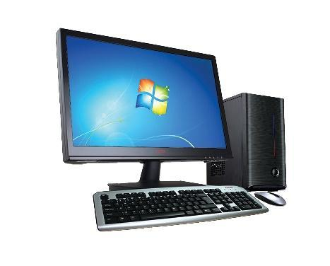

Estos ordenadores de sobremesa pueden ser montados por piezas, comprándolas y ensamblándolas entre ellas, o bien comprar el ordenador montado de fábrica.

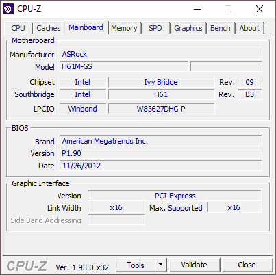

## Portátiles1

Con el paso del tiempo, los componentes se vuelven cada vez más pequeños y el tamaño se reduce, dando lugar a ordenadores portátiles. Nos permiten llevarlos con nosotros y utilizarlos dónde queramos, en función de la batería.

## Netbooks

Características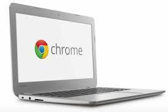

Suelen ser de tamaño muy reducido y fácil de guardar y transportar.

Las capacidades de potencia y almacenamiento, así como los dispositivos periféricos que se le pueden conectar son reducidas.

Son más baratos que un portátil tradicional

Para trabajos sencillos como ofimática o navegación web puede ser una buena solución.

Los más habituales hoy en día son los Chromebooks

## Tablets

Las tablets suponen una evolución de los ordenadores portátiles. En este caso tenemos pantallas táctiles, por lo que no necesitamos ningún teclado, aunque se le puede añadir.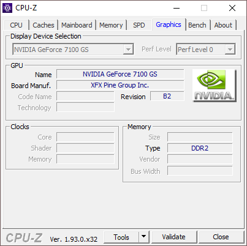

Tienen una pantalla superior a la de los teléfonos móviles, por lo que permiten trabajar más cómodamente, así como ser utilizados para ver video y jugar, principalmente. Son ligeros y con suficiente autonomía

Algunas de las tablets más utilizadas son los IPad, fabricados por Apple. Utilizan el sistema operativos iOS actualmente, el mismo utilizado en los iPhone.

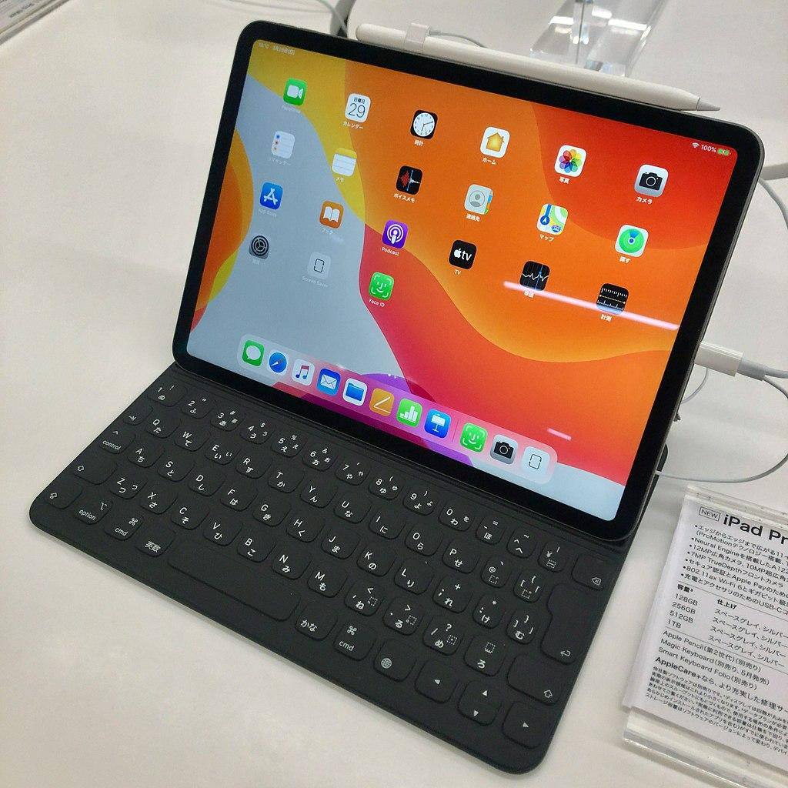

Microsoft también tiene su propia gama de tablets, Surface. Actualmente la tendencia es la de sustituir algunos portátiles por tablets y añadirles un teclado, en muchas ocasiones integrado en una funda.

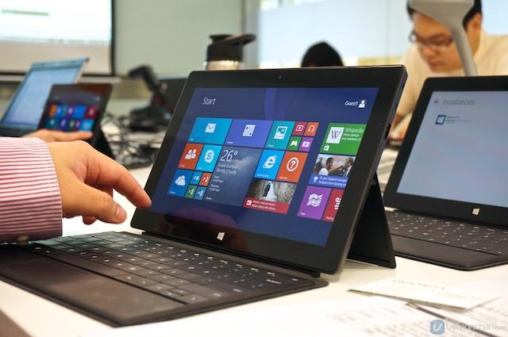

## E-readers y Kindle

Amazon, que originalmente era una tienda online de libros, crea el Kindle, uno de los libros electrónicos o e-readers más populares. Los usuarios pueden descargar versiones digitales de sus libros preferidos llamados e-books y visualizarlos en el dispositivo en cualquier lugar.

Uno de los más populares es el Kindle de Amazon.

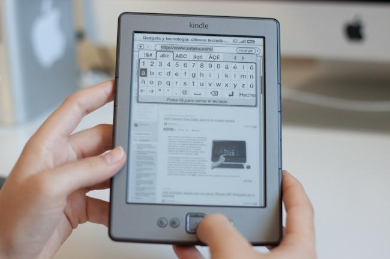

## SMARTPHONES

Se trata de teléfonos que tienen un sistema operativo móvil como Android, iOS, etc. permiten instalar aplicaciones independientes o apps.  Estos programas se diseñan específicamente para estos sistemas operativos, y únicamente funcionan en el sistema operativo para el que ha sido diseñado. Todas las apps se instalan desde tiendas virtuales o stores, tales como la Play store o la App store.

También tienen procesadores potentes, abundante memoria RAM. Disponen también de componentes adicionales integrados como cámaras, Leds, Wi-fi, pantalla táctil, GPS, etc.

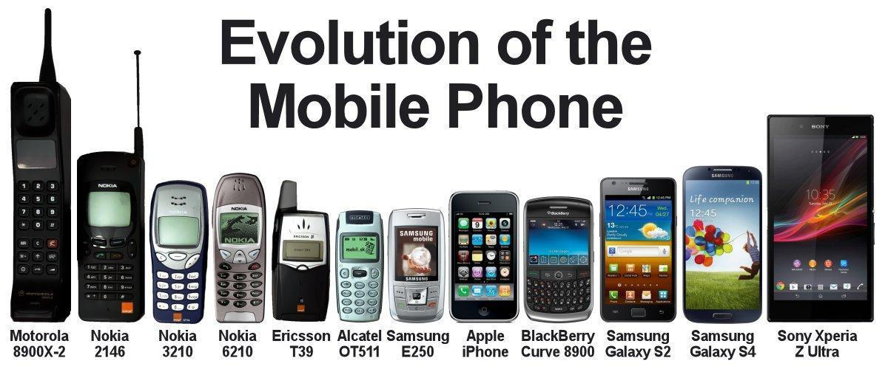

Como podéis ver, la evolución hizo que los móviles cada vez fueran más pequeños y ligeros, pero con la mejora de las pantallas se hicieron cada vez más grandes.La mayoría de smartphones son de dos tipos: Android o iPhones.

Los primeros suelen ser más baratos y cada marca fabrica el suyo, incluyendo como sistema operativo una versión de Android.

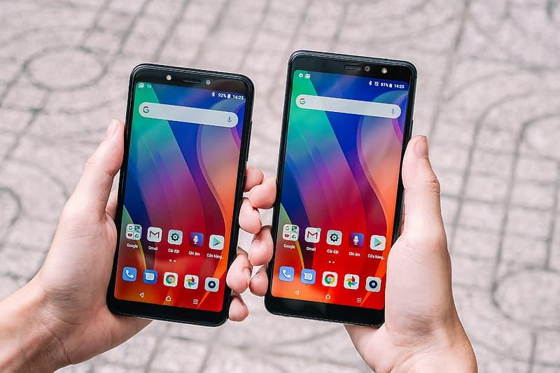

Los smartphones de la marca Apple son los iPhones, y en general tienen mejores características y gama alta.

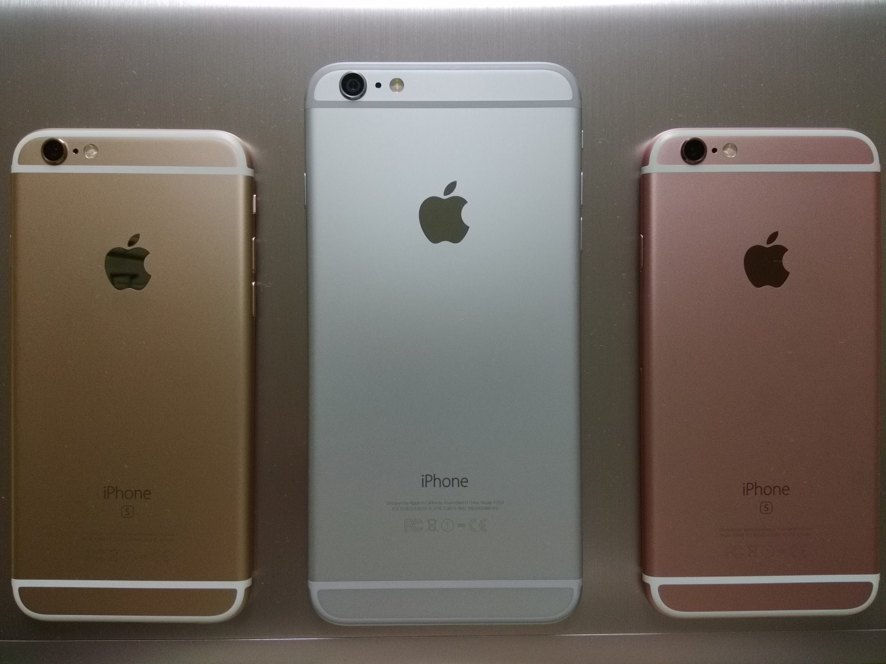

## SMART TVS

Con el paso del tiempo, las televisiones se convierten también en pequeños ordenadores, con su sistema operativo, y nos permiten muchas más aplicaciones que simplemente ver la tele.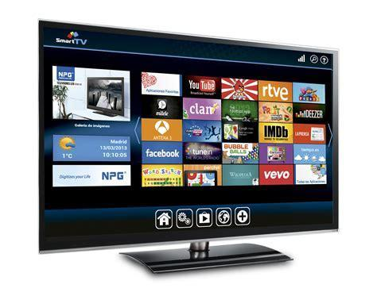

Otra característica importante es que nos permiten también instalar aplicaciones, de un modo similar al smartphone, y gracias a ellas podemos, entre otras cosas, ver contenido de plataformas de Streaming como Netflix, HBO, etc.

## Chromecast

Los dispositivos del tipo Chromecast nos permiten dotar a las televisiones las funcionalidades de una smartwatch. Se conectan por HDMI, y se sintonizan como una consola a través de uno de los puertos HDMI. Desde un móvil Android podemos controlar el contenido que le enviamos, utilizándolo como si de un mando a distancia se tratara.

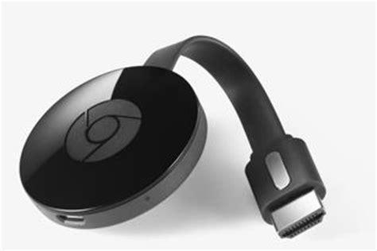

## Pulsómetros y relojes deportivos

Los relojes deportivos incorporan seguimiento GPS y utilizan poca batería, para cronometrar actividades deportivas y, posteriormente, poderlas traspasar a alguna app o web y llevar un seguimiento de nuestra actividad física.

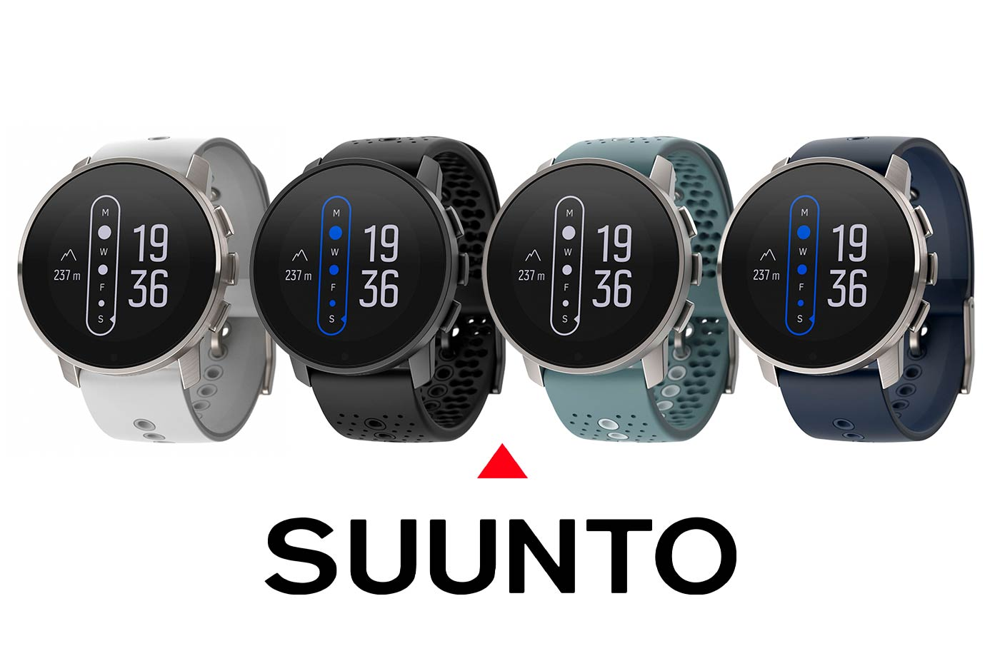

## Smartwatch

Un reloj inteligente, en términos generales, es un dispositivo multipropósito, generalmente usado en la muñeca, que ejecuta aplicaciones informáticas. Con un reloj inteligente, un usuario podría tener acceso a noticias, clima, deportes, música, llamada, correo electrónico y más.

Un reloj inteligente es que aprovecha una tecnología inalámbrica para comunicarse con un smartphone. Los relojes inteligentes están diseñados para conectarse en red e integrarse con otros dispositivos personales a través de la tecnología Wi-Fi y Bluetooth.

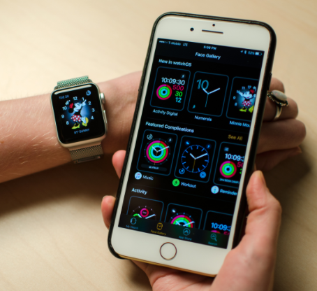

Algunos están diseñados solo para Android, mientras que otros funcionan con Android y iPhone. Todos ofrecen una amplia variedad de funciones, donde algunos solo le alertarán cuando llegue un nuevo mensaje de texto o correo electrónico, y otros le permitirán leerlos.

Los smartwatch fabricados por Apple se conocen como iWatch, y existen varias generaciones.

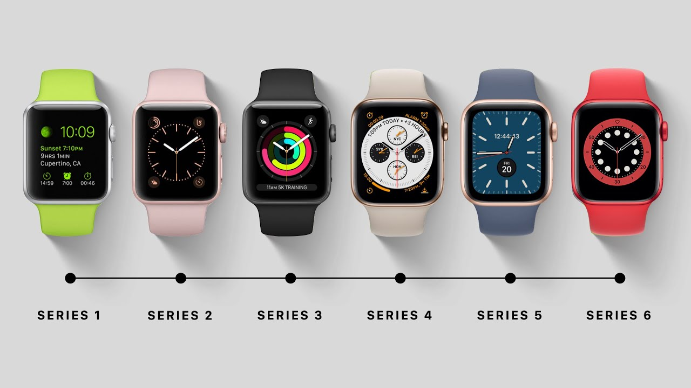

Algunos relojes inteligentes ofrecen funciones de redes sociales y algunos ofrecen funciones de calendario. Pero esto depende del fabricante y del modelo.

Los relojes inteligentes también pueden usar lecturas biométricas para identificar a los usuarios, reforzando la seguridad de los dispositivos móviles.

Videos:

- Apple Watch Series 5 unboxing -nunca DUERME-
- Apple Watch Series 5: Review en españolAPPLE WATCH SERIES 6, APPLE WATCH SE: Todo sobre los NUEVOS SMARTWATCHES de Apple

## VR Headsets

Los VR headset son dispositivos electrónicos en forma de casco o gafas que cuentan con un visor a través del cual es posible visualizar entornos virtuales en tres dimensiones. Este visor, normalmente integra una pantalla en el que se reproducen imágenes generadas por ordenador y con las que se consigue crear una sensación de total inmersión.

Algunos de los modelos actuales son las Oculus Quest 2, la Valve Index o las Oculus Rift.

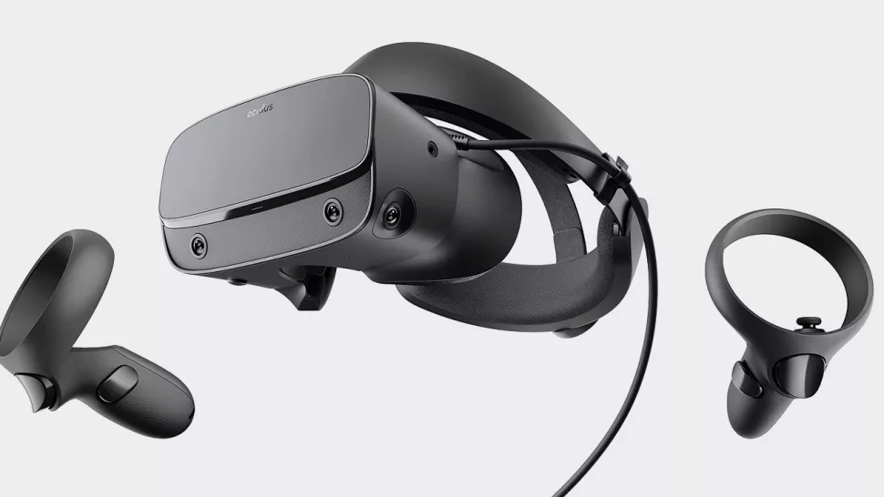

## Action cams (GoPro, keymission) y drones

Las Action Cam permiten su uso en condiciones difíciles e incluso extremas. Estas cámaras, que sirven tanto para grabar como para hacer fotos, son muy ligeras. La mayoría de ellas son impermeables, resistentes a bajas temperaturas y golpes, entre otras cosas.

Pueden fijarse con distintos kits para permitir poder hacer fotos y grabaciones sin necesidad de emplear las manos. Su versatilidad ha sido lo que las ha convertido en unas cámaras muy populares.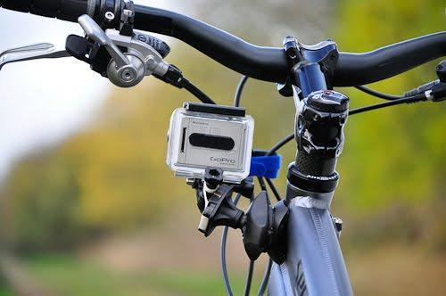

## Consolas

Las videoconsolas nos permiten jugar a videojuegos solos o online, así como compartir información con otros jugadores, ver multimedia, etc.

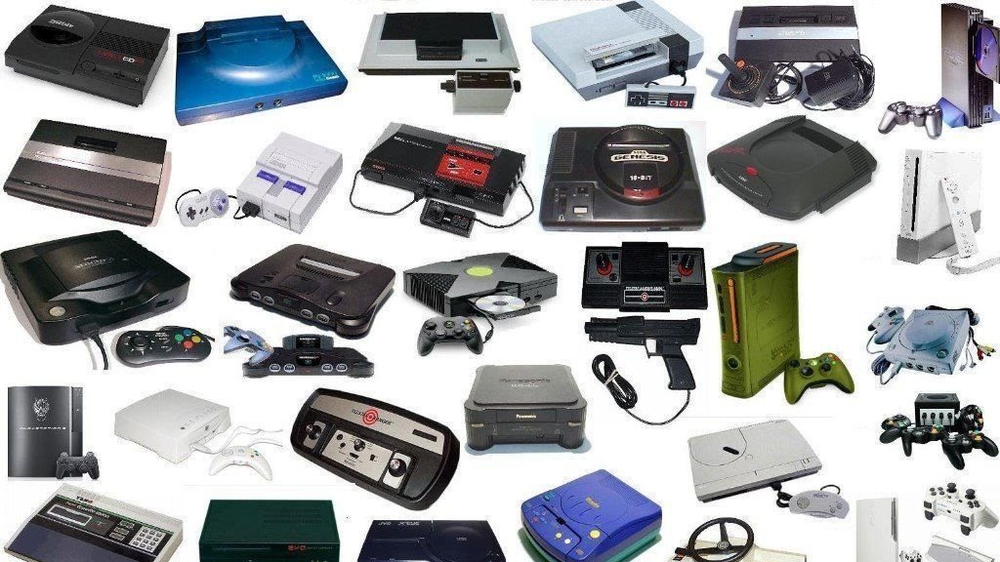

### Consolas actuales

Las consolas actuales nos permiten jugar a juegos en formato físico como otros comprados a través de su tienda online desde la propia consola. Así mismo, podemos jugar online con otros usuarios y guardar nuestras partidas en la nube.

Las más recientes son:

Playstation 5 (Sony) y la Xbox series X (Microsoft) en sobremesa

Nintendo switch en portátiles

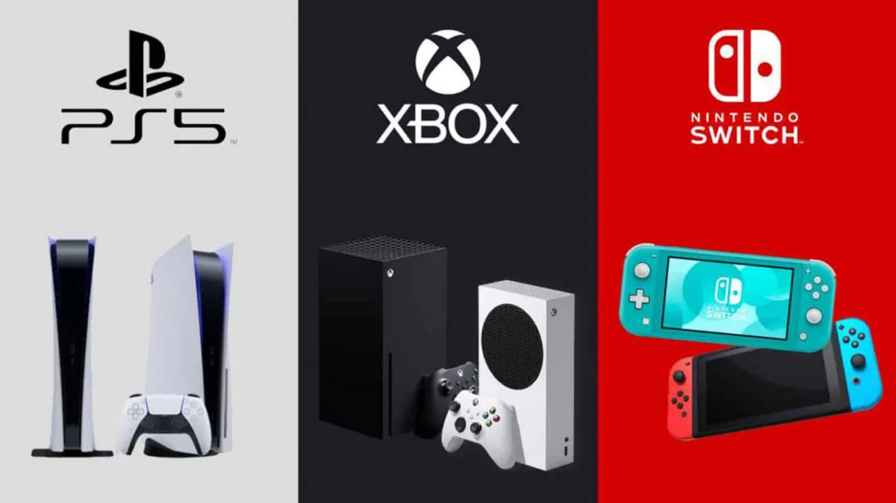

### Servicios de suscripción

También se ofrecen servicios de suscripción como Playstation Plus o Game Pass, que dan acceso a jugar a ciertos juegos gratuitamente que cada mes se amplían.

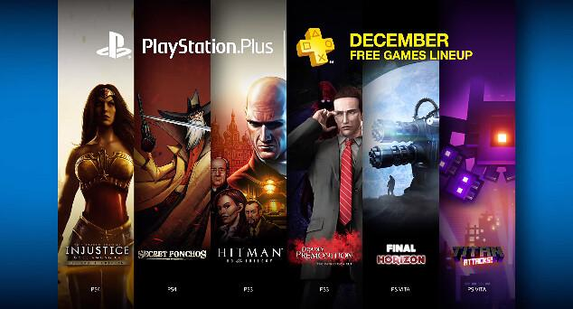

## Plataforma PC

Los usuarios de ordenador también pueden jugar a juegos, siempre que sus características lo permitan y estos juegos estén disponibles para dicha plataforma.

También existen plataformas como Steam o Epic que nos permiten comprar y tener organizada dentro de ellas nuestra colección de juegos, así como las partidas, asociadas a una cuenta.

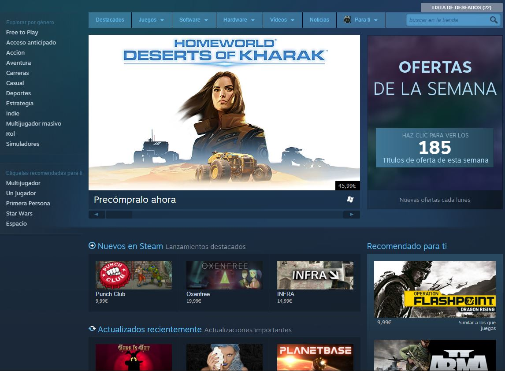