__MICROPROCESADORES__

__\(UNIDAD CENTRAL DE PROCESOS\)__

__Un poco de historia__

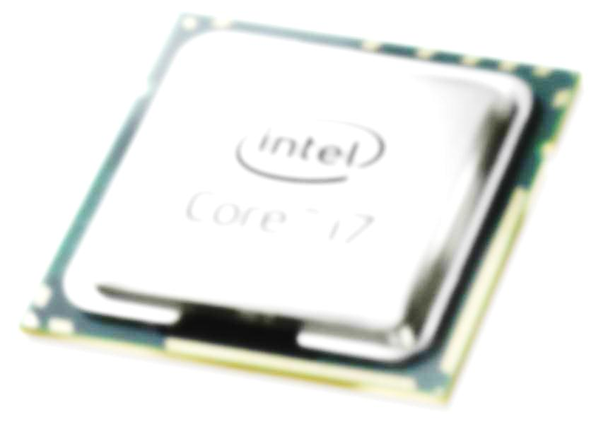

__¿QUE ES EL MICROPROCESADOR?__

 __ Un microprocesador es el __    _cerebro_    __ del ordenador\. __ 

 __ Es un chip\, un conjunto de circuitos electrónicos altamente integrado\, fabricado en un trozo de silicio\.  En su interior existen millones de elementos llamados transistores\, ordenados de manera que forman puertas lógicas para poder así\, hacer operaciones de toda clase\. __ 

 __ L__    __os microprocesadores van sobre un elemento llamado socket o zócalo\, que se conecta a la placa base\. __ 

 __ La función de los microprocesadores es la de ejecutar e interpretar las instrucciones__    __ de los ordenadores__    __\. __ 

__¿QUE ES EL MICROPROCESADOR?__

 __La velocidad de un microprocesador se mide en mega hertzios \(MHz\) o giga hertzios \(1 GHz = 1\.000 MHz\)\. Debido a la extrema dificultad de fabricar componentes electrónicos que funcionen a las inmensas velocidades de MHz habituales hoy en día\, todos los microprocesadores modernos tienen 2 velocidades:__ 

__VELOCIDAD INTERNA: __

 __La velocidad a la que funciona el microprocesador internamente \(1\.8\, 2\.1\, 2\.3\.\.\. GHz\)\.__   __ __

__VELOCIDAD EXTERNA O DEL BUS: __

 __La velocidad a la que se comunican el micro y la placa base\, típicamente a 1033\, 2066… __    __MHz\.__    __ __ 

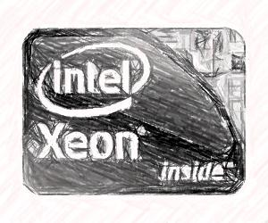

__2\. PARTES BÁSICAS DE UN MICROPROCESADOR__

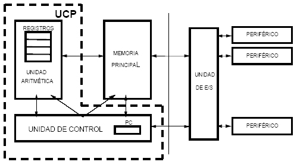

__2\.1 __   __UC \(Unidad de Control\)__   __:__

__Organiza el funcionamiento de la CPU\, decidiendo __

__qué se hace \(y quién\) en cada momento\.__

__2\.2 __   __ALU \(Unidad Aritmético\-Lógica\)__    _ _   __:__

__Realiza las operaciones que convierten los datos de __

__entrada en resultados\.__

__2\.3 __  __El Coprocesador Matemático __  __:__

__o\, más correctamente\, la FPU \(Unidad de coma Flotante\)\. Parte del microprocesador especializada cálculos matemáticos complejos\.__

__2\.4  Registros:__  __ __

__Posiciones de memoria interna que almacenan temporal y momentáneamente los datos que pasan por la CPU\, estados\, direcciones…  mientras  se necesitan\.__

__2\.5 __  __La Memoria Cache __  __:__  __ __

__Una memoria intermedia ultrarrápida que sirve al microprocesador para tener a mano ciertos datos que previsiblemente serán utilizados en las siguientes operaciones sin tener que acudir a la memoria RAM\, reduciendo el tiempo de espera\.__  __Es lo que se conoce como caché de primer nivel; es decir\, la que está más cerca del microprocesador\, tanto que está encapsulada junto a él\, también llamada caché interna\.__  __ __

__2\. PARTES BÁSICAS DE UN MICROPROCESADOR__

__Bus de Direcciones: __

__Transporta las direcciones de los datos manejados por la CPU__

__Bus de Datos Externos: __

__Transporta hacia y desde el exterior de la PCU \(cache L2\, chipset\, RAM…\)\.__  __También se le denomina bus frontal o bus del sistema\. __

__Bus de Datos Internos: __

__Transporta los datos dentro de la CPU\, es decir entre registros\, cache L1\, etc\. __

__Marca la frecuencia del funcionamiento del microprocesador y los distintos buses del sistema\. __

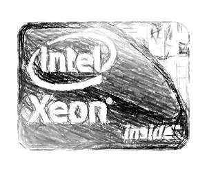

__3\. PARTES ELEMENTALES  DE UN MICROPROCESADOR__

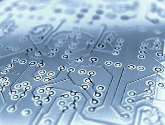

__ESQUEMA DE LOS MICROPROCESADORES__

__ESQUEMA DE LA UNIDAD ARITMÉTICO – LÓGICA \(UAL\)__

__ESQUEMA DE LA UNIDAD ARITMÉTICO – LÓGICA \(UAL\)__

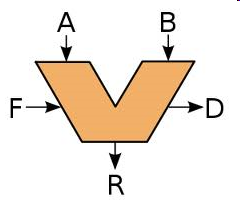

* _Componentes de la ALU_
  * Registros de entrada \(A\, B\):
    * Almacenan los operandos \(datos de entrada\)\.
  * Circuito operacional:
    * Componentes electrónicos que realizan las operaciones\.
  * Registro acumulador \(R\):
    * Almacena el resultado de las operaciones\.
  * Registros de estado \(D\):
    * “Flags” que recogen cómo termina la operación\.
      * Cero\, negativo\, acarreo\, desbordamiento\, paridad\, etc\.\.\.
  * Selector de operaciones \(F\):
    * Microinstrucciones procedentes de la Unidad de Control\.

__ESQUEMA DE LA UNIDAD DE CONTROL  \(UC\)__

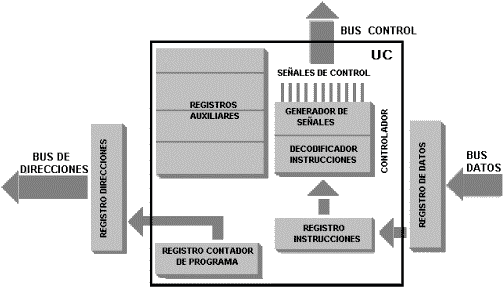

__UNIDAD DE CONTROL  \(UC\)__

* _Componentes de la UC_
  * Contador de programa
    * Contiene la dirección de memoria de la siguiente instrucción\.
  * Registro de instrucciones
    * Contiene la instrucción que se está ejecutando\.
  * Decodificador
    * Interpreta la instrucción en curso\, para poder ejecutarla\.
  * Reloj
    * Genera impulsos eléctricos que sincronizan y marcan la velocidad a la que trabaja la CPU\.
  * Secuenciador
    * Genera las microinstrucciones para la ejecución paso a paso de la instrucción interpretada por el decodificador\.

__UNIDAD DE CONTROL  \(UC\)__

  *  _Interpreta_    las instrucciones almacenadas en la memoria y    _genera_    las    _señales de control_    necesarias para ejecutarlas\.
  * Activa o desactiva los componentes del microprocesador en función de:
    * La    _instrucción_    que se esté ejecutando\.
    * La    _fase_    de dicha instrucción que se esté ejecutando\.
  * Existen dos tipos de unidades de control:
    * Cableadas \(máquinas sencillas\)\.
    * Microprogramadas   \(máquinas complejas\)\.

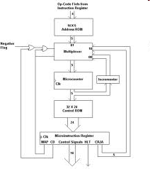

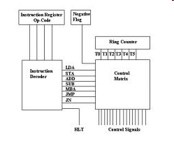

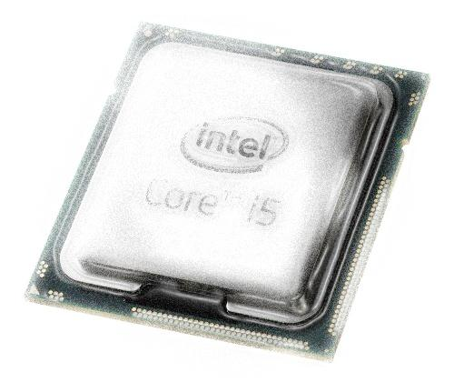

__EJECUCIÓN DE UNA INSTRUCCIÓN__

  * Se recibe la instrucción desde la UC\.
  * Se comprueba el estado de la ALU\.
  * Se cargan los operandos\.
  * Se realiza la operación\.
  * Se guarda el resultado en el acumulador\.
  * Se guarda el estado de la ALU al final\.

  * Búsqueda de la instrucción \( __fetch__ \)\.
  * Decodificación de la instrucción \( __decode__ \) y carga de operandos \( __load__ \)\.
  * Ejecución de las operaciones \( __execute__ \)\.
  * Escritura de resultados \( __store__ \)\.

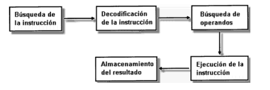

__4\. TIPOS DE DISEÑO DE LOS MICROPROCESADORES__

__\(Computación con una colección de instrucciones reducida\): se basan en la idea de que la mayoría de las instrucciones para realizar procesos en el computador son relativamente simples por lo que se minimiza el número de instrucciones y su complejidad a la hora de diseñar la CPU\. Estos procesadores se suelen emplear en aplicaciones industriales y profesionales por su gran rendimiento y fiabilidad\. Compañías  __  __Compaq__  __\, Motorola y __  __PowerPC__  __ __

__\(Computación con una colección de instrucciones compleja\): al contrario\, tienen una gran cantidad de instrucciones y por tanto son muy rápidos procesando código complejo\. Se trata de extender el conjunto de instrucciones de la CPU para que trabaje más eficientemente con tratamiento de imágenes y aplicaciones en 3D\. Compañías __  __Cirix__  __ y AMD __

__\-Ejecutar más instrucciones por ciclo\.__

__\-Ejecutar las instrucciones en orden distinto del original para que las interdependencias entre operaciones sucesivas no afecten al rendimiento del procesador\.__

__\-Contribuir a acelerar el rendimiento global del sistema\, además de la velocidad de la__

__CPU\.__

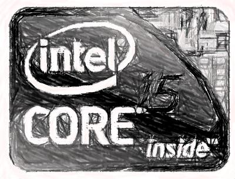

__5\. DISEÑO DE LOS MICROPROCESADORES – Aumento de prestaciones__

__INEFICIENCIA => __  __La mayoría de los componentes estaban ociosos más del 90% del tiempo __

__ Replicación de componentes internos de la CPU\.__

__ Conexiones pensadas para permitir el trabajo en paralelo de TODOS ellos\.__

__\-La __  _arquitectura_  __ del ordenador ha aportado más al rendimiento que la miniaturización\.__

__\-La __  _refrigeración_  __ se ha convertido en algo crucial\.__

__5\. DISEÑO DE LOS MICROPROCESADORES – Aumento de prestaciones__

__PIPELINE \(SEGMENTACIÓN\)__

Se divide cada instrucción en varias fases\.

Cada componente de la CPU puede estar ocupado por una fase distinta de una instrucción distinta\.

__ __ Se pretende usar todos los componentes de la CPU\, el 100% del tiempo\.

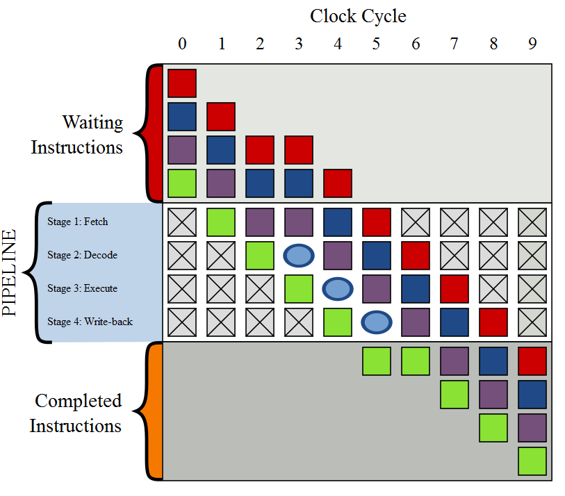

__5\. DISEÑO DE LOS MICROPROCESADORES – Aumento de prestaciones__

__HYPER\-THREADING \(HT __  __Technology__  __\)__

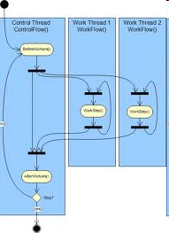

  * Se simula\, de cara a los programas\, como si el PC tuviera dos CPU’s\, en lugar de una solo\.
  * Lo inventó Intel y mejora el rendimiento un 30%\.
  * Permite procesar en paralelo\, sobre una misma CPU\, la ejecución de varios programas “multihilo”\.
  * Invisible para el SO y los programas\. Solo se requiere “multiprocesamiento simétrico” \(SMP\)\.

__5\. DISEÑO DE LOS MICROPROCESADORES – Aumento de prestaciones__

__HYPER\-__  __Transport__  __ \(HT\) o __  __Lightning__  __ Data __  __Transport__  __ \(LDT\)__

  * Tecnología de comunicación bidireccional que ofrece gran ancho de banda\.
  * Comunicación entre chips de un circuito integrado\.
  * __Sustituto del FSB__ \.
  * Pretende reducir número de buses y facilitar multiprocesamiento\.
  * Proporciona conexiones auto\-negociadas\.
  * Utiliza líneas de 32 bits\.
  * Usado por AMD en procesadores y chipsets\.

__5\. DISEÑO DE LOS MICROPROCESADORES – Aumento de prestaciones__

__Intel __  __QuickPath__  __ __  __Inteconnect__  __ \(QPI\)__

  * Desarrollado por Intel para competir con HyperTransport\.
  * Reemplaza FSB en procesadores \(p\.ej\, Core i7\) y chipsets \(X58\)\.

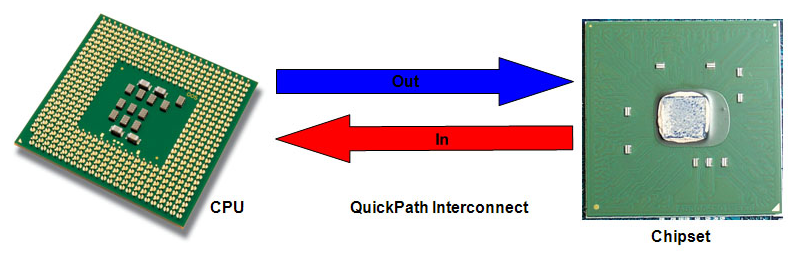

__6\. EVOLUCIÓN DE LOS MICROPROCESADORES__

 __1\. Microprocesadores de Intel más antiguos:__ 

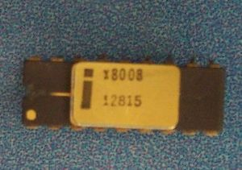

 __1972: Intel 8008__ 

 __1974: Intel 8080__ 

 __1971: Intel 4004__ 

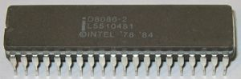

 __1978: Intel 8086__ 

 __1979: Intel 8088__ 

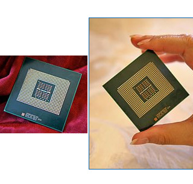

 __2\. Microprocesadores antiguos de otros fabricantes:__ 

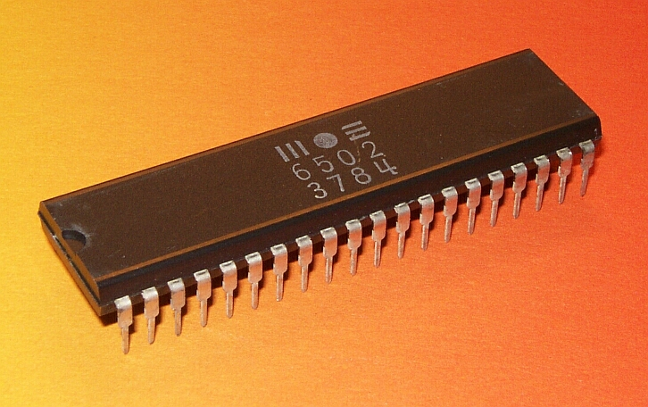

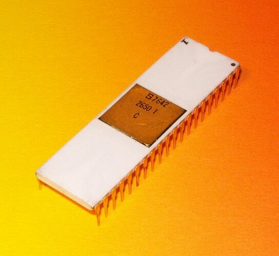

 __1975: __    __Signetics__    __ 2650__ 

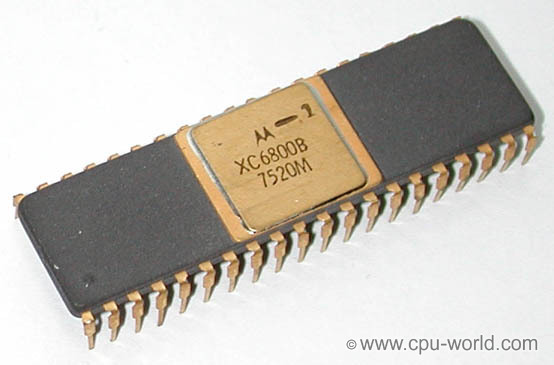

 __1975: Motorola 6800__ 

 __1978: Motorola 68000__ 

 __3\. Siguiente generación de Intel:__ 

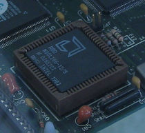

 __1982: Intel 80286 __ 

 __1989: Intel 80486__ 

 __1985: Intel 80386__ 

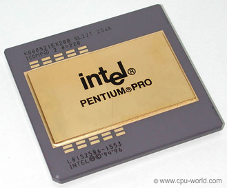

__1997: Intel Pentium II __

 __1993: Intel Pentium__ 

__1995: Intel Pentium Pro __

 __4\. Un nuevo competidor en el mercado\, AMD:__ 

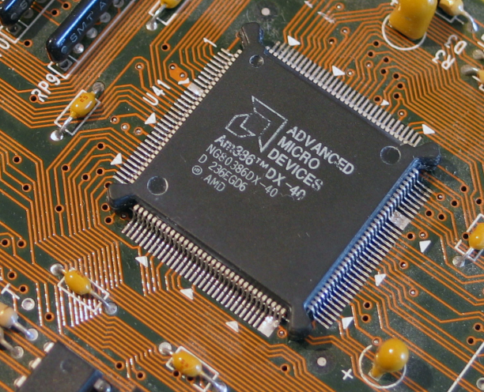

__5\. Microprocesadores modernos \- 1999__

__VELOCIDAD DEL CPU DESDE 266\-550 MHZ__

__CACHE L1 DE 64 KB__

__2\.2\. A 2\.4 VOLTIOS__

__TIENE 9\.3 MILLONES DE TRANSISTORES__

__SOCKET 7 O SÚPER SOCKET 7 \.__

__Intel Pentium III__

__Velocidad de bus a 266 __  __MHz\.__  __ __

__Cache L1 128 KB__

__Cache L2 512 KB__

__Socket de 370 __  __pins__  __\.__

__5\. Microprocesadores modernos \- 2000__

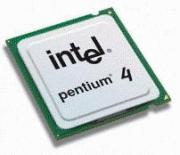

__ANCHO DE BANDA 2\.1 GB/SEG\.__

__CACHE L1 128 KB\, 64KB DATOS Y__

__ 64KB INSTRUCCIONES\.__

__CACHE L2 256 KB__

__BUS FRONTAL DE 266 MHZ__

__SOCKET 462 PINS\.__

__BUS DE 400 MHZ__

__ANCHO DE BANDA DE 3\.2 GB/SEG__

__SOCKET 432 PNS\.__

__CACHE L1 DE 8 KB__

__CACHE L2 DE 512 KB \,__

__5\. Microprocesadores modernos \- 2003__

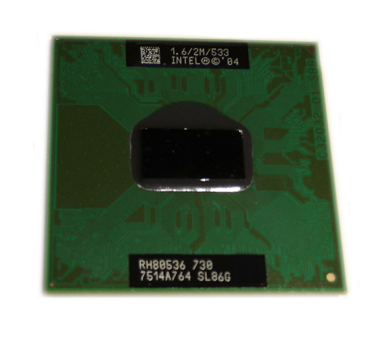

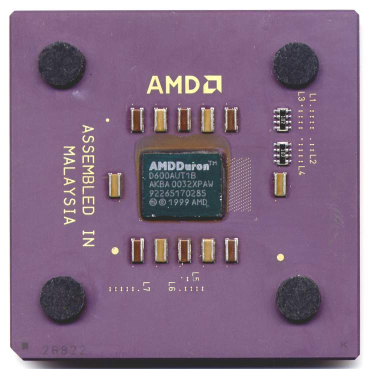

__CPU __  __900 MHz __

__Velocidad__  __ de FSB 400 MT/s__

__CPU __  __800 MHz __

__Velocidad__  __ de Bus 200 MHZ__

__Cache L1 128KB__

__Cache L2 64 KB__

__Socket 370 pins\.__

__5\. Microprocesadores modernos \- 2005__

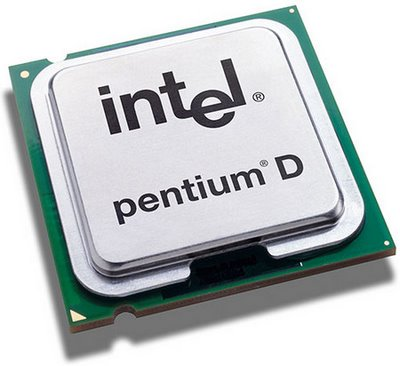

__2 CPUs \(Pentium 4\) a __  __2\,66\-3\,6 GHz __

__Velocidad__  __ de FSB 533\-800 MHz__

__Variantes__  __ con __  __HyperThreading__

__CPU __  __1\,0\-3\,2 GHz __

__Velocidad__  __ __  __HyperTransport__  __   800\-1000 MT/s__

__5\. Microprocesadores modernos \- 2006__

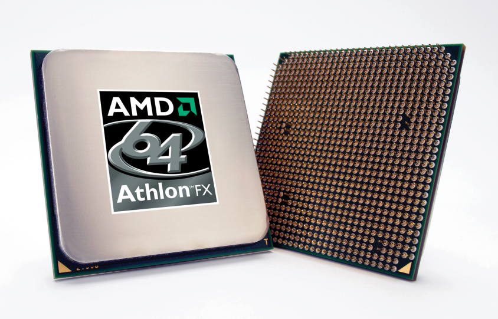

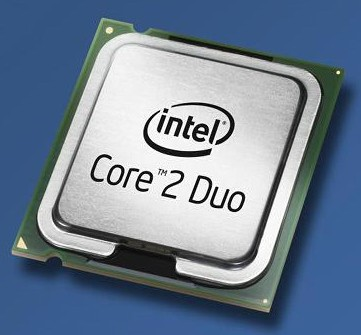

__AMD __  __Athlon__  __ 64 FX__

__Intel Core 2 Duo__

__2 CPUs a 1__  __\,8\-3\,3 GHz __

__Velocidad__  __ de FSB 533\-1600 MT/s__

__64 bits__

__CPU __  __2\,4\-3\,0 GHz __

__Bus de __  __sistema__  __ a 2 GHz__

__64 bits__

__5\. Microprocesadores modernos \- 2007__

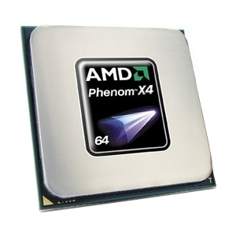

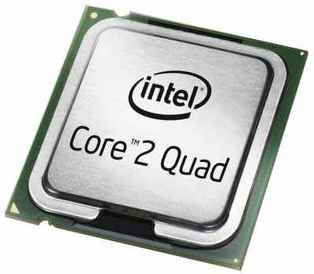

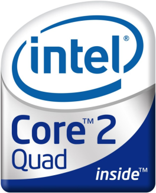

__Intel Core 2 Quad__

__4 CPUs a 2__  __\,3\-3\,0 GHz __

__Velocidad__  __ de FSB 1066\-1333 MT/s__

__4 CPUs __  __2\,4\-2\,6 GHz __

__Bus de __  __sistema__  __ a 2 GHz__

__5\. Los microprocesadores más modernos de Intel__

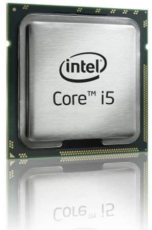

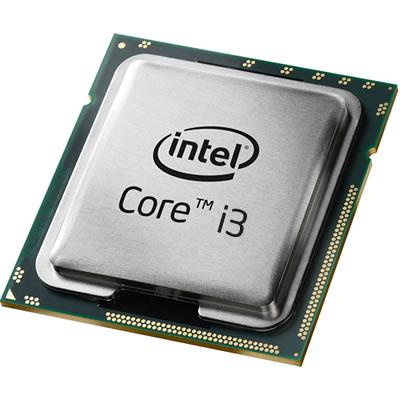

__ __  __2 ó 4 núcleos__

__ Hasta 3\,60 GHz con Turbo __  __Boost__

__ __  __HyperThreading__

__ Velocidad bus DMI de 2\,5 GT/s__

__ __  __2 ó 4 núcleos__

__ __  __HyperThreading__

__ GPU integrada__

__ __  __4 núcleos__

__ Velocidad de CPU: 2\,66 GHz a 3\,33 GHz__

__ Velocidad QPI: 4\,8\-6\,4 GT/s __

1971:  __Intel 4004__  \(primer microprocesador comercial\)

1972:  __Intel 8008__

1974:  __Intel 8080__

1975: Signetics 2650\, MOS 6502\,  __Motorola 6800__

1976:  __Zilog__  __ Z80__

1978:  __Intel 8086__ \,  __Motorola 68000__

1979:  __Intel 8088__

1982:  __Intel 80286__

1985:  __Intel 80386__ \,  __AMD Am386__

1987:  __Motorola 68030__

1989:  __Intel 80486__ \, AMD Am486

1993:  __Intel Pentium__ \,  __AMD K5__

1995: Intel Pentium Pro

1997:  __Intel Pentium II__ \,  __AMD K6__

1999:  __Intel Pentium III__

2000:  __Intel Pentium 4__ \,  __AMD __  __Athlon__  __ XP__

2003: PowerPC G5\, Intel Pentium M

2005: Intel Extreme Edition con  __hyper\-threading__ \,  __Intel __  __Core__  __          __  __Duo__ \,  __AMD __  __Athlon__  __ 64__ \,  __AMD __  __Athlon__  __ 64 X2__ \,

2006:  __Intel __  __Core__  __ 2 __  __Duo__ \, Intel Core 2 Extreme\, AMD Athlon FX

2007:  __Intel __  __Core__  __ 2 __  __Quad__ \,  __AMD __  __Quad__  __ __  __Core__ \, AMD Quad FX

2008\-…:  __Intel __  __Core__  __ i3\, __  __Intel __  __Core__  __ i5\, Intel __  __Core__  __ i7\, __  __             __ AMD Athlon II\, AMD Phenom II\, AMD Turion II\,…

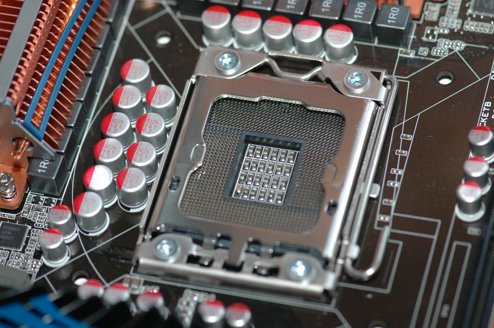

__7\.CARACTERÍSTICAS TÉCNICAS DE ALGUNOS MICROS__

__Pentium __  __Classic__  __:__

__Está optimizado para aplicaciones de 16 bits\.__  __Dispone de 8Kb de caché de instrucciones \+ 8Kb de caché de datos\.__  __Utiliza el zócalo de tipo 5 \(socket 5\) o el de los MMX \(tipo 7\)\. También es conocido por su nombre clave P54C\.__  __Está formado por 3\,3 millones de transistores__

| Especificaciones de la gama Pentium |  |  |  |  |  |  |
| :-: | :-: | :-: | :-: | :-: | :-: | :-: |
| Procesador | Frecuencia | Tecnología | Voltaje | Bus | Multiplicador | Socket |
| P60 | 60Mhz. | 0,8 µ | 5v | 60Mhz | - | 4 |
| P66 | 66Mhz | 0,8 µ | 5v | 66Mhz | - | 4 |
| P75 | 75Mhz | 0,6 µ | 3,52v | 50Mhz | 1,5 | 5 / 7 |
| P90 | 90Mhz | 0,6 µ | 3,52v | 60Mhz | 1,5 | 5 / 7 |
| P100 | 100Mhz | 0,6 µ | 3,52v | 66Mhz | 1,5 | 5 / 7 |
| P120 | 120Mhz | 0,35 µ | 3,52v | 60Mhz | 2 | 5 / 7 |
| P133 | 133Mhz | 0,35 µ | 3,52v | 66Mhz | 2 | 5 / 7 |
| P150 | 150Mhz | 0,35 µ | 3,52v | 60Mhz | 2,5 | 7 |
| P166 | 166Mhz | 0,35 µ | 3,52v | 66Mhz | 2,5 | 7 |
| P200 | 200Mhz | 0,35 µ | 3,52v | 66Mhz | 3 | 7 |

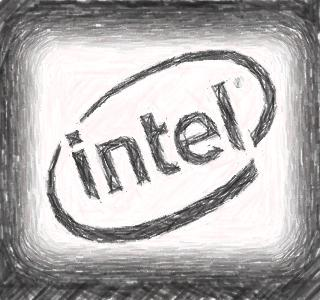

__7\.CARACTERÍSTICAS TÉCNICAS DE ALGUNOS MICROS__

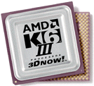

__La memoria de segundo nivel trabaja a la misma velocidad que la CPU\.__  __Utilizan el zócalo super7 a 100 __  __Mhz\.__  __64 KB __  __de caché L1 \(32 para datos y 32 para instrucciones\)__  __256 KB __  __de caché L2\.__  __Fabricados con 21\,3 millones de transistores y tecnología de 0\,25 micras\.__  __Soporte para AGP\.__

| Especificaciones de la gama K6-III |  |  |  |  |  |  |  |
| :-: | :-: | :-: | :-: | :-: | :-: | :-: | :-: |
| Procesador | Freq. | Voltaje Core | Voltaje I/O | Bus | Multip. | Temp.Máxima | Potencia Máxima |
| K6-III/400 | 400Mhz | 2,4 | 3,3 | 100Mhz | 2,5 | 65º | 26,8 W |
| K6-III/450 | 450Mhz | 2,4 | 3,3 | 100Mhz | 3 | 65º | 29,50 W |

