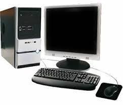
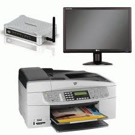

## Problemas con los dispositivos

Técnicas de montaje, sustitución y conexión de componentes y periféricos microinformáticos

## Introducción

Windows 7 es cada vez más efectivo a la hora de utilizar los dispositivos instalados, ya sean periféricos o tarjetas de expansión\. Además de una gran base de datos de controladores, el sistema operativo cuenta con diversas herramientas para solucionar los problemas de los dispositivos\.

Técnicas  de montaje, sustitución y conexión de componentes y periféricos microinformáticos

## Nuevo dispositivo, nuevo controlador

Cuando se adquiere un ordenador completo en una tienda, no suele haber problemas de compatibilidad con los dispositivos, especialmente cuando se vende con el sistema operativo preinstalado\. Incluso si se adquiere, además del ordenador, otros periféricos no preinstalados, como impresoras, webcam o escáneres, el vendedor suministra discos que contienen los programas de instalación de los dispositivos\.

Técnicas  de montaje, sustitución y conexión de componentes y periféricos microinformáticos

Sin embargo, si se añade nuevos dispositivos, o se sustituyen otros, como por ejemplo una nueva tarjeta de video aceleradora 3D, sí que es posible encontrarse con problemas de compatibilidad con los dispositivos y será necesario disponer del controlador adecuado que solucione el problema y funcione correctamente el dispositivo\.

Técnicas  de montaje, sustitución y conexión de componentes y periféricos microinformáticos

## Controladores en Windows 7

Windows 7 ha tratado de mantener, con una base de datos actualizada, tener el controlador adecuado al dispositivo instalado\.

Así que ha incluido en la instalación del sistema operativo miles de controladores para los dispositivos más comunes\.

Pero también es posible que el problema no sea del controlador, pudiendo ser cuestión de una mala conexión, o incluso de un defecto de funcionamiento en el dispositivos\.

Para resolver problemas con los dispositivos, Windows 7 ofrece diversas herramientas\.

Técnicas  de montaje, sustitución y conexión de componentes y periféricos microinformáticos

## Dispositivos e impresoras

Para la mayoría de dispositivos externos, como impresoras, cámaras fotográficas digitales, escáneres, faxes, equipos multifunción, etc\. Windows centraliza su gestión desde el  __Panel de control\.__

Dentro de la categoría  __Hardware y sonido __ se encuentra la sección  __Dispositivos e Impresoras__ , donde aparecerán todos aquellos dispositivos que se encuentran conectados\.

Dependiendo del dispositivo, Windows 7 mostrará más o menos información, incluyendo enlaces a la página web del fabricante, pero siempre se mostrará información sobre el estado del dispositivo\.

Si el dispositivo está conectado pero en la pantalla de  __Dispositivos e impresoras __ se muestra como desconectado, es señal de que existe un problema\.

Técnicas  de montaje, sustitución y conexión de componentes y periféricos microinformáticos

Técnicas  de montaje, sustitución y conexión de componentes y periféricos microinformáticos

## Solucionador de problemas

En el caso de tener problemas con un dispositivo, o simplemente, tener la sospecha de ello, es recomendable acudir al  __Solucionador de problemas__ \.

Puede accederse fácilmente abriendo el  __Panel de control__  y realizando una búsqueda en la casilla correspondiente\.

Una vez aparezca la pantalla de  __Solución de problemas __ se debe hacer clic en  __Configurar dispositivo__ , dentro de la sección  __Hardware y sonido__ \. Esta herramienta está automatizada e intentará realizar una búsqueda, primero para identificar problemas con los dispositivos y finalmente presentará al usuario las opciones disponibles, desde activar dispositivos  a buscar nuevos controladores\.

Técnicas  de montaje, sustitución y conexión de componentes y periféricos microinformáticos

## Panel de control

Técnicas  de montaje, sustitución y conexión de componentes y periféricos microinformáticos

## Solucionar problemas con el equipo

Técnicas  de montaje, sustitución y conexión de componentes y periféricos microinformáticos

## Solucionador de problemas

Una vez se inicie el  _Solucionador de problemas_ , este buscará los posibles problemas asociados  a los diferentes dispositivos\. Esto incluye tanto periféricos, impresoras o escáneres, dispositivos internos como tarjetas de expansión WIFI, Bluetooth, etc\.

Durante el análisis es posible que se muestren mensajes  que indican que se está “ __instalando software de controlador de dispositivos__ ” y una confirmación para que el usuario permita a la herramienta  seguir con el proceso, para ello, es necesario tener habilitado la opción de  __Windows Update\.__

Técnicas  de montaje, sustitución y conexión de componentes y periféricos microinformáticos

## Búsqueda y actualización de controlador

Técnicas  de montaje, sustitución y conexión de componentes y periféricos microinformáticos

## Windows Update Deshabilitado

Técnicas  de montaje, sustitución y conexión de componentes y periféricos microinformáticos

## Solucionador de problemas

Una vez acabado el proceso, el  __Solucionador de problemas__  mostrará un informe final\. Este incluye una descripción de los problemas encontrados y si se han conseguido solucionar\.  Si el problema no se ha solucionado, se le ofrecerá explorar otras opciones, como buscar en ayuda y soporte técnico, dirigirse a una comunidad de Windows online para hacer consultas o recuperar un estado anterior del sistema\.

Técnicas  de montaje, sustitución y conexión de componentes y periféricos microinformáticos

## La visión general

* El clásico Administrador de dispositivos también ofrece una visión rápida del estado de los dispositivos del sistema\. Se puede acceder a esta pantalla haciendo clic derecho en el icono de  __Equipo__  desde cualquier ventana del Explorador de Windows\. En el menú contextual  se debe escoger la opción  __propiedades__ , y en esta,  __Administrador de dispositivos__ \. Se mostrará una visión de todos los componentes del equipo, agrupados según su tipología \(adaptadores de pantalla, de red, dispositivo de imagen, de interfaz de usuario, etc\.\)\.
* Si alguno de estos componentes tiene un problema, su grupo se verá expandido y en el icono del dispositivo pueden aparecer distintos símbolos:
  * Símbolo flecha hacia abajo  Desactivado
  * Símbolo de exclamación  Problema con el dispositivo\.
  * Símbolo interrogante  Sin identificación del dispositivo

Técnicas  de montaje, sustitución y conexión de componentes y periféricos microinformáticos

## Administrador de dispositivos

En la ventana del  _administrador de dispositivo _ de Windows 7 se podrá observar todos los dispositivos que están correctamente instalados y sin problemas y los que tienen problemas, por falta de controlador o están deshabilitados\.

Técnicas  de montaje, sustitución y conexión de componentes y periféricos microinformáticos

## Fin de la unidad

Técnicas  de montaje, sustitución y conexión de componentes y periféricos microinformáticos

